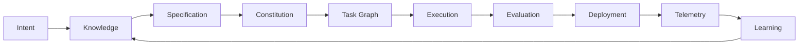

# Product Protocol

**An open specification for AI-native software engineering.**

Product Protocol (PP) defines how autonomous AI engineering systems
represent, manage, and execute software products: how product intent is
compiled into executable software via structured specifications,
constitutions, task graphs, worker contracts, and continuous evaluation
loops. It defines the contract between **product design** and
**autonomous execution**.

> **Status: Draft (protocol version 0.1).** This is the initial public
> draft. Everything may change. Feedback and implementations welcome —
> see [CONTRIBUTING](CONTRIBUTING.md).

## Why

Autonomous engineering systems are being built on private, incompatible
conventions. The definition of *your product* — its requirements, rules,
history, and knowledge — should not be trapped in any vendor's format.
Product Protocol is implementation-agnostic and vendor-neutral: it
specifies interfaces and contracts, not tools. Like OpenAPI for APIs or
OCI for containers, it aims to make autonomous engineering systems
**interoperable, auditable, and portable**.

## The Loop



Humans express intent conversationally and approve Goals, Specifications,
Constitutions, and architectural Decisions. Agents do everything else —
planning, execution, evaluation, deployment, observation — producing
Evidence at every step. The product's structured memory (the **Product
Brain**) closes the loop.

## The Specifications

| PP | Title | Defines |
| --- | --- | --- |
| [PP-0001](pp/PP-0001-vision.md) | Vision and Scope | What the protocol is and is not |
| [PP-0002](pp/PP-0002-core-concepts.md) | Core Concepts | Object envelope, identity, versioning, Git binding |
| [PP-0003](pp/PP-0003-product-brain.md) | Product Brain | Structured product knowledge and memory |
| [PP-0004](pp/PP-0004-product-specification.md) | Product Specification | Goals, capabilities, features, stories, requirements |
| [PP-0005](pp/PP-0005-product-constitution.md) | Product Constitution | Immutable, continuously evaluated product rules |
| [PP-0006](pp/PP-0006-task-graph.md) | Task Graph | Planning, decomposition, dependencies, scheduling |
| [PP-0007](pp/PP-0007-worker-protocol.md) | Worker Protocol | The execution contract for agents and humans |
| [PP-0008](pp/PP-0008-evaluation.md) | Evaluation System | Golden tests, quality gates, evidence, scores |
| [PP-0009](pp/PP-0009-knowledge-protocol.md) | Knowledge Protocol | Ingestion, retrieval, validation, versioning |
| [PP-0010](pp/PP-0010-runtime.md) | Runtime | The end-to-end autonomous engineering lifecycle |

Start with [VISION](VISION.md), then PP-0001 and PP-0002.

## Repository Map

```
pp/          Numbered specification documents (the standard itself)
schemas/     JSON Schemas for every object kind (normative)
reference/   Glossary, terminology, object model, design principles
examples/    Complete example products (informative): ecommerce, saas, mobile, api
docs/        Architecture, concept guides, tutorials, decisions, diagrams
diagrams/    Editable diagram sources
assets/      Logo and icons
```

## A Taste

Everything in PP is a plain YAML object with a common envelope, stored in
a Git-native tree (`.product/`):

```yaml
pp: "0.1"
kind: Task
metadata:
  id: task-guest-checkout-api
  version: 1.0.0
spec:
  intent: Implement the guest checkout API endpoint per story acceptance criteria.
  tracesTo: { ref: { kind: Story, id: story-guest-checkout } }
  dependsOn:
    - { ref: { kind: Task, id: task-cart-model } }
  completion:
    evaluations:
      - { ref: { kind: GoldenTest, id: golden-checkout-happy-path } }
```

## Conformance

Implementations claim one or more conformance classes — `PP/Core`,
`PP/Brain`, `PP/Spec`, `PP/Constitution`, `PP/Planner`, `PP/Worker`,
`PP/Evaluator`, `PP/Runtime` — defined in
[reference/terminology.md](reference/terminology.md). Adopt one document
format or the whole loop; there is no all-or-nothing cliff.

## Contributing

The protocol is developed in the open, RFC-style. Read
[CONTRIBUTING](CONTRIBUTING.md), [GOVERNANCE](GOVERNANCE.md), and the
[PP process](pp/README.md). Specification text distinguishes **normative**
requirements (BCP 14 MUST/SHOULD/MAY) from **informative** guidance
throughout.

## License

[Apache 2.0](LICENSE). Specification text and schemas may be implemented
freely by anyone.
