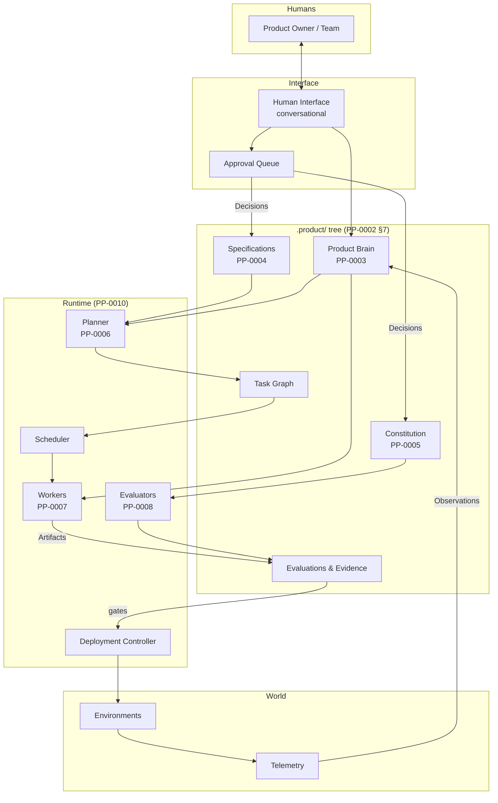

# Reference Architecture

*(Informative. The normative contracts live in the PP documents cited
throughout.)*

This section describes one coherent way to assemble a conformant
Product Protocol system. It is a *reference*, not a requirement: any
architecture that satisfies the normative contracts is conformant
(PP-0001-RQ-002).

- [Components and Data Flow](./components.md)
- [Actors and Trust Boundaries](./actors-and-trust.md)
- [Storage and Synchronization](./storage-and-sync.md)

## The system at a glance

The store is the only shared state; every component reads and writes PP
objects there. Components communicate *through the objects* — a Planner
does not call a Worker; it writes `ready` Tasks that Workers claim. This
makes every component independently replaceable (conformance classes,
[terminology §4](../../reference/terminology.md#4-conformance-classes))
and every interaction auditable.
