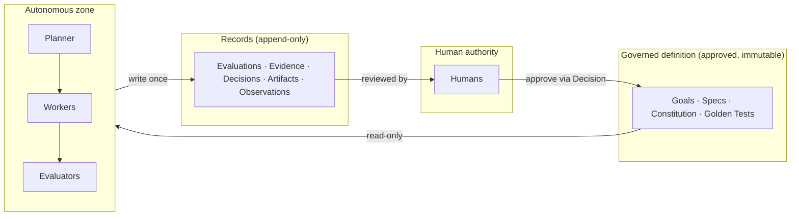

# Actors and Trust Boundaries

*(Informative; the normative rules cited are in PP-0002, PP-0007,
PP-0008, PP-0010.)*

Product Protocol's security model is small and structural. It does not
try to make agents trustworthy; it arranges the system so that trust is
not required where it cannot be verified.

## The four authorities

| Authority | Held by | Mechanism |
| --- | --- | --- |
| **Intent & rules** — what to build, what must always hold | Humans | Governed-object approval: `proposed → approved` requires a human `Decision` (PP-0002 RQ-008/010) |
| **Execution** — producing work | Workers | Claim protocol; single owner per task; constitution-bound (PP-0007) |
| **Judgment** — deciding whether work is acceptable | Evaluators | Independence rule: never judge your own work (PP-0008 §5); append-only evidence |
| **Memory** — what the product knows | Brain governance | Provenance required; confidence promotion rules (PP-0009); contradictions trigger review |

Keeping the four in separate hands is the design: a Worker that could
approve its own Evaluation, or a Planner that could amend the
Constitution, collapses the model.

## Trust boundaries

- **T1 → T2 is read-only.** Agents consume approved objects at exact
  versions; they may draft *new versions* but never mutate approved ones
  (PP-0002 RQ-009).
- **T2 → T3 is write-once.** Everything agents produce is on the record
  and stays there (PP-0002 RQ-011).
- **T3 → T0 closes the loop.** Humans audit records, not agent
  internals.

## Threats this structure addresses

- **Self-approval / goal drift.** No agent path to `approved`; golden
  tests are governed too, so "make the test pass by changing the test"
  requires a human.
- **Evidence tampering.** Append-only records in a version-controlled
  tree make edits visible; signing (roadmap) makes them cryptographically
  evident.
- **Prompt injection via product data.** Objects are data, never
  instructions; `x-` extension content and prose fields must not be
  executed as directives (PP-0002 Security Considerations). Context
  assembly preserves provenance so a Worker can weigh source trust.
- **Capability escalation.** Workers declare capabilities and constraint
  envelopes; tasks declare required capabilities; the match is checked at
  claim time (PP-0006 §7).

## What the protocol does not solve

Sandboxing of worker execution, credential management, network policy,
and model alignment are implementation responsibilities. The protocol
gives them a shape to attach to (constraints on `Worker`, environment
classifications on `Deployment`) but does not replace them.
