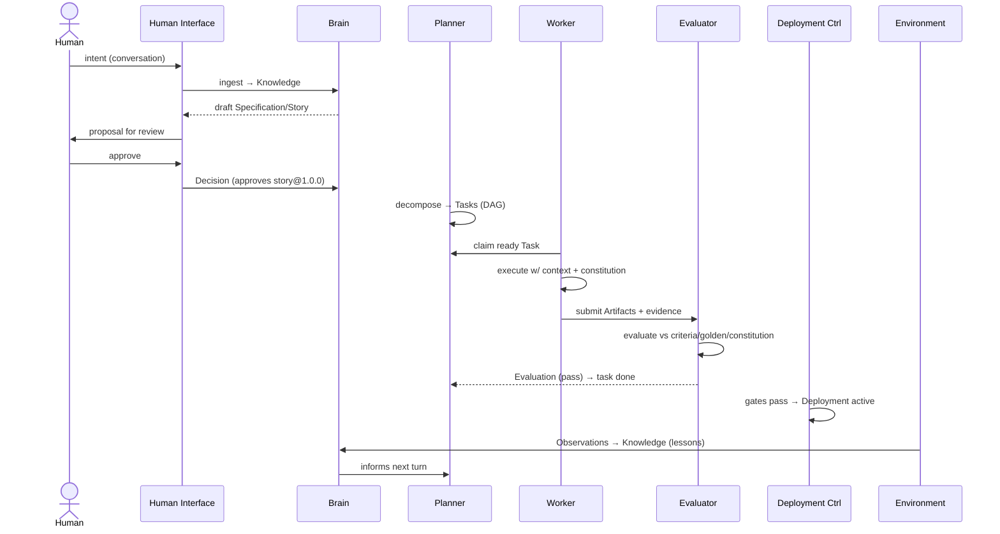

# Components and Data Flow

*(Informative)*

A conformant system decomposes naturally into the components below. Each
maps to a conformance class, so any of them can be an independent
product from a different vendor.

## Human Interface

Conversation-first surface (chat, voice, documents) where humans express
intent and exercise authority (PP-0010 §7). Responsibilities:

- Feed raw intent to Brain **ingestion** (PP-0009) with provenance.
- Present drafted governed objects for review; record approvals as
  `Decision` objects; never let an agent path bypass the queue.
- Answer "why" questions by traversing the knowledge graph.

## Product Brain

The Product's structured memory (PP-0003): `Knowledge` and `Decision`
objects plus their graph. Serves two consumers: humans asking questions,
and the retrieval operation (PP-0009 §retrieval) that assembles bounded,
provenance-preserving context for Workers and Planners.

## Planner

Consumes approved `Story`/`Issue` objects and the Brain; emits and
maintains the Task Graph (PP-0006): decomposition, dependencies,
priorities, replanning on rejection or new Observations. Stateless with
respect to work: all planning state lives in `Task` objects.

## Scheduler and Workers

The scheduler is the readiness/allocation logic of PP-0006 §6–7 (often
part of the planner or runtime): it surfaces `ready` tasks in priority
order to capability-matched Workers. Workers (PP-0007) claim tasks,
receive assembled context, execute under the Constitution, and submit
`Artifact` records plus self-assessment. Workers may be agents, humans,
or hybrids — the contract is identical.

## Evaluators

Independent judges (PP-0008). They compile criteria from acceptance
criteria, Constitution articles, NFR budgets, and Golden Tests; produce
append-only `Evaluation` records with `Evidence`; and enforce the
independence rule (no self-evaluation). Quality gates aggregate
evaluations into go/no-go predicates for task acceptance and deployment
promotion.

## Deployment Controller

Executes gated releases (PP-0010 §6): checks blocking gates and
constitution articles for the target environment, records the
`Deployment`, tracks its lifecycle (`requested → … → active`), and
triggers rollback on failure. The mechanics of shipping bits are
implementation territory; the protocol owns the record and the gates.

## Telemetry Ingest

Translates whatever monitoring stack exists into `Observation` records
(PP-0010 §6.3) and routes significant ones to Issue triage and Brain
ingestion — closing the loop.

## Data flow of one loop turn

