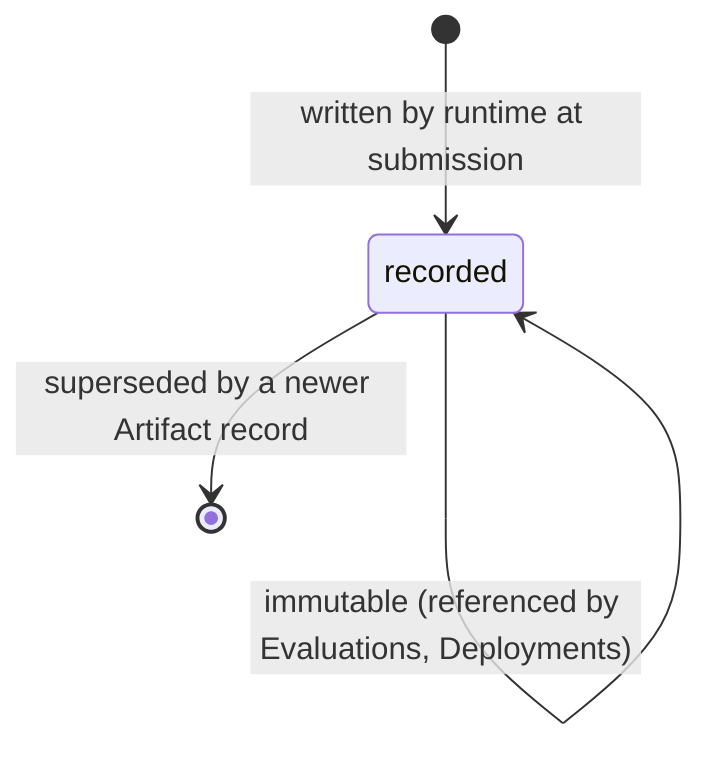

# Artifact

An Artifact is a content-addressed, immutable output of a Task: a code
changeset, document, image, binary, report, prototype, or dataset
([glossary](../../reference/glossary.md)).

## Definition

An Artifact is the record that binds one output to the Task that produced it
and makes the payload verifiable: `spec.digest` is computed over the payload
bytes, and consumers verify against it before trusting or deploying the
payload ([PP-0007 §6](../../pp/PP-0007-worker-protocol.md#6-the-artifact-kind)).
Artifacts are the *only* currency of submission: Evaluators judge Artifacts,
Deployments ship Artifacts, and Evidence points at Artifacts. Work not
captured in an Artifact does not exist for evaluation purposes
([PP-0007 §5.3](../../pp/PP-0007-worker-protocol.md#53-artifact-discipline)).

An Artifact is a record *about* an output, not necessarily the output itself:
large binary payloads live outside the Product tree, referenced by `uri` and
pinned by digest, while the Artifact record stays in-tree
([PP-0002 §7](../../pp/PP-0002-core-concepts.md#7-git-storage-binding)). And it
is not a mutable working file — once written, it is never edited; a new
version of the work is a new Artifact.

## Responsibilities

- Bind an output to the [Task](./task.md) that produced it (`spec.producedBy`).
- Make the payload verifiable by content digest.
- Locate the payload: in-tree `path` or external `uri` — a `changeset`
  should be identified immutably (e.g. commit digest), not by branch name.

## Lifecycle

Artifacts are **append-only records**
([PP-0002 §6.3](../../pp/PP-0002-core-concepts.md#63-records)): created once at
submission, never modified or deleted. Corrections are new Artifacts that
supersede old ones by reference. There is no state machine to drive — the
diagram below only depicts that permanence.



## Inputs / Outputs

| Direction | What | Source / consumer |
| --- | --- | --- |
| In | Produced by a [Worker](./worker.md) executing a claimed Task | [PP-0007 §5–§7](../../pp/PP-0007-worker-protocol.md#5-execution-obligations) |
| Out | Judged by [Evaluations](./evaluation.md) | [PP-0008](../../pp/PP-0008-evaluation.md) |
| Out | Released by [Deployments](./deployment.md) | [PP-0010 §6](../../pp/PP-0010-runtime.md#6-deployment) |
| Out | Cited by Evidence items (`evidence[].artifact`) | [PP-0008 §8](../../pp/PP-0008-evaluation.md#8-evidence-model) |

## Relationships

- `spec.producedBy` → the [Task](./task.md) that produced it — a required
  reference ([object model §3](../../reference/object-model.md#3-relationships)).
- Referenced by [Evaluation](./evaluation.md) as a subject and as Evidence.
- Referenced by [Deployment](./deployment.md) `spec.artifacts` — the set of
  outputs being released.
- A submission passing a Task to evaluation must contain at least one
  Artifact ([PP-0007 §7](../../pp/PP-0007-worker-protocol.md#7-submission-and-completion)).
- The types a Worker may produce are bounded by both the Worker's
  `allowedArtifactTypes` and the Task's `spec.completion.artifacts`.

## Example

```yaml
pp: "0.1"
kind: Artifact
metadata:
  id: artifact-guest-checkout-changeset
  name: Guest checkout API changeset
  version: 1.0.0
  createdAt: 2026-07-03T15:20:00Z
spec:
  type: changeset
  digest: sha256:7f83b1657ff1fc53b92dc18148a1d65dfc2d4b1fa3d677284addd200126d9069
  uri: https://git.example.com/aurora/books/commit/9fceb02d0ae598e95dc970b74767f19372d61af8
  path: services/checkout
  summary: >
    Adds POST /checkout/guest with cart validation, payment-intent
    handling, and unit tests; no schema migrations.
  producedBy: { ref: { kind: Task, id: task-guest-checkout-api } }
  producedAt: 2026-07-03T15:20:00Z
  size: 18432
  mediaType: text/x-diff
```

## Where it's defined

- Specification: [PP-0007 §6 — The Artifact Kind](../../pp/PP-0007-worker-protocol.md#6-the-artifact-kind)
- Schema: [`schemas/worker/artifact.schema.json`](../../schemas/worker/artifact.schema.json)
- Glossary: [Artifact](../../reference/glossary.md)
