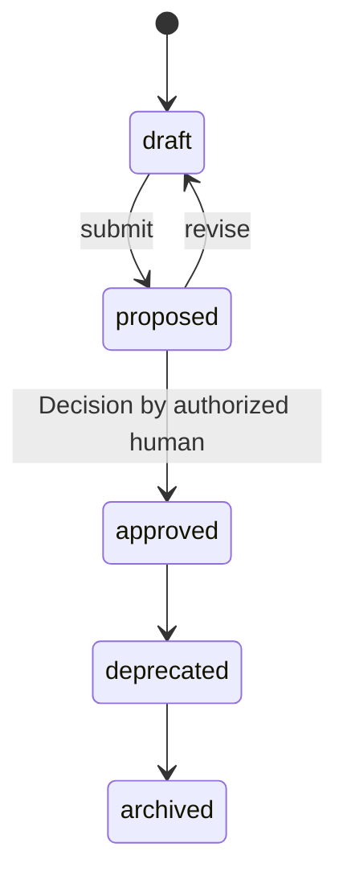

# Capability

A durable ability the Product offers (e.g. "accept payments"), serving
one or more Goals and containing Features
([glossary](../../reference/glossary.md)).

## Definition

A `Capability` describes something the Product *is able to do*, stated
durably rather than release by release: "accept payments", "recommend
books". It is the stable middle layer of the intent hierarchy — Goals
change targets and Features come and go, but Capabilities persist
across releases
([PP-0004 §4](../../pp/PP-0004-product-specification.md#4-the-capability-kind)).
Every Capability justifies its existence by the [Goals](./goal.md) it
serves: `spec.serves` has to name at least one Goal.

A Capability is not an epic, a team, or a module. It carries no
requirements or acceptance criteria of its own — the precise meaning
of a Capability comes from the [Specifications](./specification.md)
that take it in scope, and the concrete functionality from the
[Features](./feature.md) that attach to it.

## Responsibilities

- Group Features into a coherent, long-lived ability.
- Justify its existence by the Goals it serves (`spec.serves`).
- Provide the unit at which Specifications most naturally take scope
  ([PP-0004 §4.2](../../pp/PP-0004-product-specification.md#42-responsibilities)).

## Lifecycle

`Capability` is a governed object following the governed state machine
exactly ([PP-0002 §6.2](../../pp/PP-0002-core-concepts.md#62-governed-objects),
[PP-0004 §1.2](../../pp/PP-0004-product-specification.md#12-governance)):
human approval recorded as a [Decision](./decision.md), immutability
once approved, and change only through a new version re-entering
`draft`. Its `serves` refs must resolve, and approving a Capability
before its Goals are approved is discouraged
([PP-0004 §4.3](../../pp/PP-0004-product-specification.md#43-lifecycle),
[§8.2](../../pp/PP-0004-product-specification.md#82-traceability)).



## Inputs / Outputs

| Direction | What | From / To |
| --- | --- | --- |
| In | Approved Goals to serve | [Goals](./goal.md) |
| In | Human intent; definitions of the ability | Human Interface; [Specifications](./specification.md) |
| Out | The parent that Features attach to | [Features](./feature.md) via `spec.capability` |
| Out | Scope entries for definition documents | [Specifications](./specification.md) via `spec.scope` |

## Relationships

- Serves one or more [Goals](./goal.md) via `spec.serves`
  ([PP-0004-RQ-008](../../pp/PP-0004-product-specification.md#normative-requirements)).
- Parent of [Features](./feature.md), which point at it via
  `spec.capability`; parents do not enumerate children — the upward
  Ref is the single authoritative edge
  ([PP-0004 §1.1](../../pp/PP-0004-product-specification.md#11-hierarchy)).
- Specified in depth by [Specifications](./specification.md) whose
  `spec.scope` includes it.
- Sits on the traceability chain Story → Feature → Capability → Goal
  that every approved Story must complete
  ([PP-0004 §8.2](../../pp/PP-0004-product-specification.md#82-traceability)).

## Example

`.product/specification/cap-payments.yaml`:

```yaml
pp: "0.1"
kind: Capability
metadata:
  id: cap-payments
  name: Accept payments
  version: 1.1.0
  lifecycle: approved
  createdAt: 2026-05-02T10:00:00Z
  updatedAt: 2026-06-10T14:30:00Z
  owners:
    - { type: human, id: dana@example.com, name: Dana Ito }
spec:
  description: >
    Take payment for a cart: cards and major wallets, with tax and
    receipt handling, for signed-in and guest purchasers.
  serves:
    - ref: { kind: Goal, id: goal-checkout-conversion }
```

## Where it's defined

- Specification: [PP-0004 §4 — The Capability Kind](../../pp/PP-0004-product-specification.md#4-the-capability-kind)
- Schema: [`schemas/specification/capability.schema.json`](../../schemas/specification/capability.schema.json)
- Glossary: [Capability](../../reference/glossary.md)
