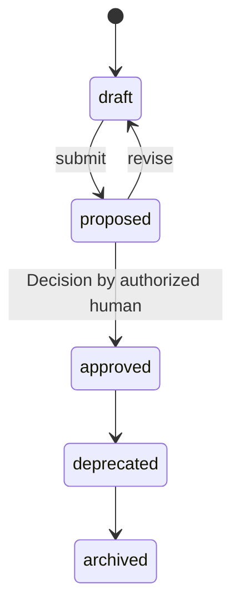

# Constitution

A versioned set of Articles: rules that hold for the entire Product at
all times, continuously evaluated, changeable only by human-approved
amendment ([glossary](../../reference/glossary.md)).

## Definition

A `Constitution` is the Product's standing law. Where a
[Specification](./specification.md) is scoped to particular
Capabilities and Features, a Constitution is total: its Articles apply
to every Task, every Artifact, every Deployment, and the running
system, at all times
([PP-0005 §1](../../pp/PP-0005-product-constitution.md#1-overview-and-role)).
Each Article is one rule with a stable id, a category (security,
performance, accessibility, compliance, architecture,
coding_standards, ux, reliability), normative text, and an enforcement
binding that says whether a violation blocks (`blocking`) or is merely
recorded (`advisory`), and *when* it is checked: on task submission,
before deployment, on a recurring schedule, or on relevant
observations
([PP-0005 §4](../../pp/PP-0005-product-constitution.md#4-the-constitution-article-model)).

A Constitution is not a style guide or a set of suggestions — Articles
outrank every Specification, Story, acceptance criterion, and Task
instruction, and content of those objects cannot override an Article
([PP-0005 §7](../../pp/PP-0005-product-constitution.md#7-conflicts-and-precedence)).
The only ways around an Article are a bounded, Decision-approved
exception or a human-approved amendment.

## Responsibilities

- Hold the rules that outrank every Specification, Story, and Task
  instruction.
- Bind each rule to concrete enforcement points and, where available,
  executable checks.
- Record sanctioned exceptions explicitly, with expiry, rather than
  letting them accumulate as folklore
  ([PP-0005 §2.2](../../pp/PP-0005-product-constitution.md#22-responsibilities)).

## Lifecycle

`Constitution` is a governed object
([PP-0002 §6.2](../../pp/PP-0002-core-concepts.md#62-governed-objects)).
Only Articles of an *approved* version are in force; a `draft` or
`proposed` Constitution binds nothing, and a `deprecated` one ceases
to bind once a successor is approved. Change happens only by
amendment: a new version drafted (by anyone, human or agent), proposed
with its diff, and approved only by a human, recorded as a
[Decision](./decision.md)
([PP-0005 §6](../../pp/PP-0005-product-constitution.md#6-the-amendment-process)).
Article ids are never reused for a different rule.



## Inputs / Outputs

| Direction | What | From / To |
| --- | --- | --- |
| In | Human policy intent; regulatory obligations | Humans |
| In | Hard lessons distilled into standing rules | [Issues](./issue.md), incident [Observations](./observation.md) |
| Out | Evaluation demands at each enforcement point | [Evaluators](./evaluator.md) ([PP-0008](../../pp/PP-0008-evaluation.md)) |
| Out | Compliance/violation records; blocked transitions | [Evaluations](./evaluation.md); Task acceptance and [Deployments](./deployment.md) |
| Out | Issues opened on every violation | [Issues](./issue.md) ([PP-0005 §5.3](../../pp/PP-0005-product-constitution.md#53-violation-handling)) |

## Relationships

- Activated by the [Product](./product.md) via `spec.constitutions`;
  all active Constitutions bind simultaneously.
- Operationalizes Articles through [GoldenTests](./golden-test.md),
  [QualityGates](./quality-gate.md), and
  [Evaluators](./evaluator.md) via
  `articles[].enforcement.evaluations`.
- Exceptions carry an `approvedBy` ref to a [Decision](./decision.md);
  for blocking Articles, only an active, Decision-approved exception
  suppresses enforcement
  ([PP-0005 §4.2](../../pp/PP-0005-product-constitution.md#42-exceptions)).
- Violations produce failing [Evaluations](./evaluation.md) and open
  [Issues](./issue.md).
- Approved by a [Decision](./decision.md) at each version.

## Example

`.product/constitution/aurora-constitution.yaml` (two Articles shown):

```yaml
pp: "0.1"
kind: Constitution
metadata:
  id: aurora-constitution
  name: Aurora Books Constitution
  version: 2.1.0
  lifecycle: approved
  createdAt: 2026-05-01T09:00:00Z
  updatedAt: 2026-06-20T10:00:00Z
  owners:
    - { type: human, id: dana@example.com, name: Dana Ito }
spec:
  preamble: >
    Aurora Books is trusted with readers' money, addresses, and reading
    habits. These Articles hold for every change, every deployment, and
    the running product, at all times.
  articles:
    - id: SEC-1
      category: security
      rule: >
        Secrets, credentials, and API keys MUST NOT appear in source
        code, configuration files under version control, or logs.
      rationale: >
        Incident 2026-03: a payment-provider key committed to a branch
        reached a public fork.
      enforcement:
        mode: blocking
        evaluatedOn: [task_submission, deployment]
        evaluations:
          - ref: { kind: QualityGate, id: gate-secret-scan }
    - id: PERF-1
      category: performance
      rule: >
        The 95th-percentile server response time of any user-facing
        endpoint MUST remain at or below 300 ms in production.
      enforcement:
        mode: blocking
        evaluatedOn: [deployment, observation]
        monitor: >
          p95 latency per endpoint from production telemetry, 1-hour
          window; violation when above 300 ms for two consecutive
          windows.
```

(The BCP 14 capitals inside `rule` fields are the example product's
own Article prose — Article rules are written with those keywords so
their force is unambiguous,
[PP-0005 §4](../../pp/PP-0005-product-constitution.md#4-the-constitution-article-model).)

## Where it's defined

- Specification: [PP-0005 — Product Constitution](../../pp/PP-0005-product-constitution.md)
- Schema: [`schemas/constitution/constitution.schema.json`](../../schemas/constitution/constitution.schema.json)
- Glossary: [Constitution](../../reference/glossary.md), [Constitution Article](../../reference/glossary.md)
