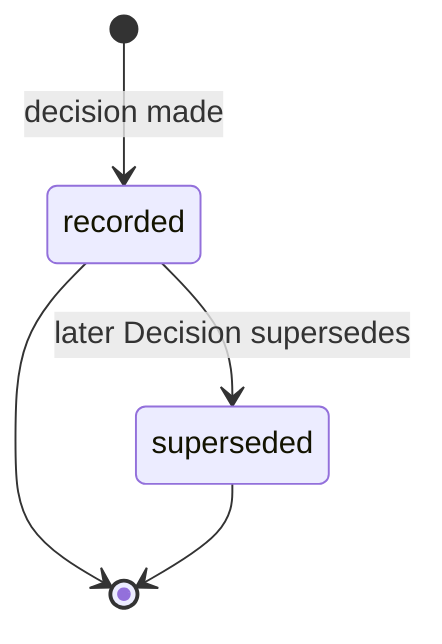

# Decision

An immutable record of a choice: context, options considered, outcome,
authority, and affected objects
([glossary](../../reference/glossary.md)).

## Definition

A `Decision` records a choice durably: the situation and forces at
decision time, the options weighed, what was decided, who decided it,
when, and which objects the choice affects
([PP-0003 §7](../../pp/PP-0003-product-brain.md#7-the-decision-kind)).
Decisions are the Brain's answer to "why is it this way?" — the other
half of memory alongside what is known. Two named profiles share the
one kind: **Architecture Decision Records** (ADRs), typically with
`spec.options` and `spec.consequences` populated, and **Approval
Decisions**, which carry `spec.approves` pointing at the exact
governed object version being approved
([PP-0002 §6.2](../../pp/PP-0002-core-concepts.md#62-governed-objects)).

A Decision is not a changeable status field and not a discussion
thread. It is an append-only record: created once, never modified or
deleted. A Decision that no longer stands is not edited — it is
superseded by a newer Decision whose `spec.supersedes` names it
([PP-0003 §7.2](../../pp/PP-0003-product-brain.md#72-lifecycle)).

## Responsibilities

- Durably record choice, context, and authority.
- Gate governed-object approval: the `proposed → approved` transition
  of every governed object is recorded as a Decision with human
  authority ([PP-0002-RQ-008](../../pp/PP-0002-core-concepts.md#normative-requirements)).
- Anchor `canonical` confidence: promotion of
  [Knowledge](./knowledge.md) to `canonical` (and demotion from it)
  requires a human Decision
  ([PP-0003 §4](../../pp/PP-0003-product-brain.md#4-trust-the-confidence-ladder)).
- Authorize Constitution exceptions via `approvedBy` refs
  ([PP-0005 §4.2](../../pp/PP-0005-product-constitution.md#42-exceptions)).

## Lifecycle

Decisions are append-only records
([PP-0002 §6.3](../../pp/PP-0002-core-concepts.md#63-records)). The
superseded state is derived from a later Decision's `supersedes` ref,
never written back onto the old record. A committed Decision file in
the Git binding is never rewritten; corrections are new files
([PP-0003 §6](../../pp/PP-0003-product-brain.md#6-brain-storage-layout-git-binding)).



## Inputs / Outputs

| Direction | What | From / To |
| --- | --- | --- |
| In | A choice made by an actor with authority over it | Humans (always, for approval and architecture Decisions); agents for choices within their authority |
| Out | Approval of governed object versions | [Goal](./goal.md), [Capability](./capability.md), [Specification](./specification.md), [Feature](./feature.md), [Story](./story.md), [Constitution](./constitution.md), [GoldenTest](./golden-test.md) |
| Out | Provenance for Knowledge (`type: decision`) | [Knowledge](./knowledge.md) |
| Out | Graph edges to traverse; audit trail via Git history | Knowledge Graph consumers, auditors |

## Relationships

- Affects one or more objects of any kind via `spec.affects` (at least
  one entry, every ref resolving —
  [PP-0003-RQ-015](../../pp/PP-0003-product-brain.md#normative-requirements)).
- May approve exactly one governed object version via `spec.approves`,
  with `ref.version` present and exact
  ([PP-0003 §7.4](../../pp/PP-0003-product-brain.md#74-decision-fields)).
- May supersede one earlier Decision via `spec.supersedes`.
- Lives in the [ProductBrain](./product-brain.md), under
  `.product/brain/decisions/`.
- Cited as provenance by [Knowledge](./knowledge.md); referenced by
  [Constitution](./constitution.md) exceptions.

## Example

An architecture Decision (ADR profile) superseding an earlier one
(`.product/brain/decisions/dec-2026-06-24-search-engine.yaml`):

```yaml
pp: "0.1"
kind: Decision
metadata:
  id: dec-2026-06-24-search-engine
  name: Use PostgreSQL full-text search instead of a dedicated engine
  version: 1.0.0
  createdAt: 2026-06-24T11:20:00Z
spec:
  context: >
    Catalog search latency targets are modest (p95 < 300ms over ~40k
    titles). The earlier decision to adopt a dedicated search cluster
    predates the operational-cost knowledge gathered in June.
  options:
    - option: Dedicated search engine cluster
      rationale: Best relevance tooling; highest operational cost.
    - option: PostgreSQL full-text search
      rationale: Meets latency targets at current scale; zero new infra.
  outcome: >
    Use PostgreSQL full-text search; revisit if the catalog exceeds
    500k titles or relevance Evaluations regress.
  authority: { type: human, id: dana@example.com, name: Dana Ito }
  decidedAt: 2026-06-24T11:15:00Z
  affects:
    - ref: { kind: Capability, id: cap-catalog-search }
    - ref: { kind: Knowledge, id: know-search-operational-cost }
  supersedes: { ref: { kind: Decision, id: dec-2026-05-20-search-engine } }
  consequences: >
    Relevance tuning options are limited; accepted until scale demands
    otherwise. Removes one production dependency.
```

An approval Decision differs mainly in carrying `spec.approves` with
an exact version — see the example in
[PP-0003 Examples](../../pp/PP-0003-product-brain.md#examples-informative).

## Where it's defined

- Specification: [PP-0003 §7 — The Decision Kind](../../pp/PP-0003-product-brain.md#7-the-decision-kind);
  approval role: [PP-0002 §6.2](../../pp/PP-0002-core-concepts.md#62-governed-objects)
- Schema: [`schemas/knowledge/decision.schema.json`](../../schemas/knowledge/decision.schema.json)
- Glossary: [Decision](../../reference/glossary.md), [Approval](../../reference/glossary.md)
