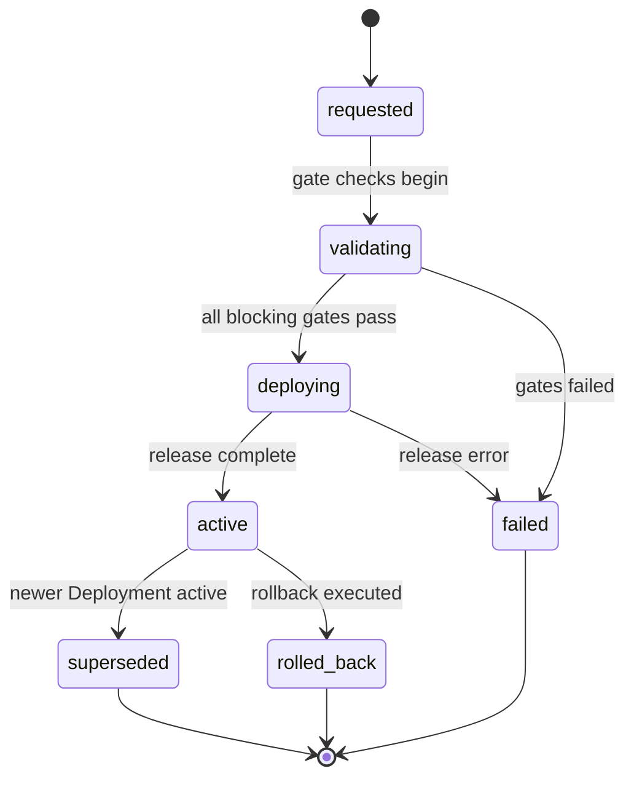

# Deployment

A Deployment is the act and record of releasing Artifacts into an Environment,
gated by Evaluations ([glossary](../../reference/glossary.md)).

## Definition

A Deployment captures the *act* of release — what was released, where, when,
by whose request, gated by what — not the mechanics of moving bits
([PP-0010 §6](../../pp/PP-0010-runtime.md#6-deployment)). Its `spec` is written
once at request time and never changes; only its `status` evolves as the
release progresses. Apart from that status evolution, Deployments behave as
append-only records — a new release is a new Deployment, and a rollback's
compensating release is likewise a new Deployment.

A Deployment is *not* a pipeline definition or an environment. Environments
are declared on the Product (`Product.spec.environments`,
[PP-0010 §6.1](../../pp/PP-0010-runtime.md#61-environments)), and a Deployment
must name one of them — releasing into an undeclared environment is invalid.
Promotion into a `production`-classified environment must pass every blocking
[QualityGate](./quality-gate.md) with trigger `deployment_promotion` and every
blocking [Constitution](./constitution.md) article that evaluates on
deployment, with the gate-check Evaluations recorded in
`status.evaluations`.

## Responsibilities

- Bind the released [Artifacts](./artifact.md) to a declared environment.
- Carry the gate outcomes that authorized the release.
- Track the release's runtime state through the state machine below.

## Lifecycle

`status.state` follows the runtime lifecycle of
[PP-0010 §6](../../pp/PP-0010-runtime.md#6-deployment), without skipping
states. At most one Deployment per environment should be `active` at a time;
when a new one becomes `active`, the runtime moves the previous one to
`superseded`. A rollback is recorded as `rolled_back` with a `status.reason`.



## Inputs / Outputs

| Direction | What | Source / consumer |
| --- | --- | --- |
| In | Accepted [Artifacts](./artifact.md) | [PP-0007 §6](../../pp/PP-0007-worker-protocol.md#6-the-artifact-kind) |
| In | The declared target environment | `Product.spec.environments` ([PP-0002 §9](../../pp/PP-0002-core-concepts.md#9-the-product-kind)) |
| In | Applicable [QualityGates](./quality-gate.md) | [PP-0008 §9](../../pp/PP-0008-evaluation.md#9-quality-gates) |
| Out | The Deployment record with gate-check [Evaluations](./evaluation.md) in `status.evaluations` | auditors, the runtime |
| Out | [Observations](./observation.md) from the running release | the learning loop ([PP-0010 §8.2](../../pp/PP-0010-runtime.md#82-the-learning-loop)) |

## Relationships

- `spec.artifacts` → the [Artifact](./artifact.md) records being released;
  consumers verify payloads against their digests before deploying.
- `spec.gates` → the [QualityGates](./quality-gate.md) evaluated for this
  deployment; `status.evaluations` → the [Evaluations](./evaluation.md) that
  checked them.
- [Observations](./observation.md) reference the Deployment via `relatesTo`;
  a failed production Evaluation raises an [Issue](./issue.md)
  ([PP-0010 §6.4](../../pp/PP-0010-runtime.md#64-issue-triage-lifecycle)).
- Constrained by [Constitution](./constitution.md) articles whose enforcement
  evaluates on deployment.
- May itself be the subject of an [Evaluation](./evaluation.md)
  ([PP-0008 §2.1](../../pp/PP-0008-evaluation.md#21-subjects)).

## Example

```yaml
pp: "0.1"
kind: Deployment
metadata:
  id: deploy-2026-07-03-prod-042
  name: Production release 42 — cart refactor + guest checkout polish
  version: 1.0.0
  createdAt: 2026-07-03T15:00:00Z
spec:
  environment: production
  artifacts:
    - ref: { kind: Artifact, id: art-cart-refactor-7f3a, version: 1.0.0 }
    - ref: { kind: Artifact, id: art-checkout-polish-91c2, version: 1.0.0 }
  gates:
    - ref: { kind: QualityGate, id: gate-production-promotion }
  strategy: canary
  requestedBy: { type: agent, id: release-manager-agent, name: Release Manager }
  requestedAt: 2026-07-03T15:00:00Z
status:
  state: active
  evaluations:
    - ref: { kind: Evaluation, id: evrun-2026-07-03-checkout-014 }
    - ref: { kind: Evaluation, id: evrun-2026-07-03-perf-009 }
  startedAt: 2026-07-03T15:04:00Z
  completedAt: 2026-07-03T15:31:00Z
```

## Where it's defined

- Specification: [PP-0010 §6 — Deployment](../../pp/PP-0010-runtime.md#6-deployment)
  (environments [§6.1](../../pp/PP-0010-runtime.md#61-environments), fields
  [§6.2](../../pp/PP-0010-runtime.md#62-deployment-record-fields))
- Schema: [`schemas/deployment/deployment.schema.json`](../../schemas/deployment/deployment.schema.json)
- Glossary: [Deployment](../../reference/glossary.md), [Environment](../../reference/glossary.md)
