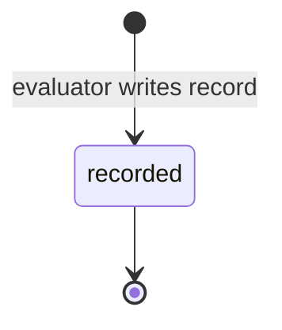

# Evaluation

An Evaluation is the recorded outcome of judging a subject against criteria:
score, verdict, Evidence, and traceability — append-only
([glossary](../../reference/glossary.md)).

## Definition

An Evaluation is **testimony, not a status flag**: the immutable record of one
judgment — what was judged, against what, by whom, when, with what outcome,
and on what evidence — in a form a later auditor can replay without access to
the original run ([PP-0008 §4](../../pp/PP-0008-evaluation.md#4-the-evaluation-kind)).
The protocol's design invariant is that nothing is done without evidence: no
Task is accepted and no Deployment is promoted except on the basis of
Evaluation records carrying inspectable Evidence.

An Evaluation is *not* an opinion: it must carry at least one Evidence item —
durable, locatable or verifiable material (logs, screenshots, test reports,
traces, measurements, diffs, transcripts) that justifies its verdict
([PP-0008 §8](../../pp/PP-0008-evaluation.md#8-evidence-model)). Nor is it a
mutable checkbox: re-evaluating the same subject creates a *new* record with a
new id; a newer `fail` is never erased by an older `pass`
([PP-0008 §11](../../pp/PP-0008-evaluation.md#11-traceability-and-re-evaluation)).

## Responsibilities

- Identify its subject — an Artifact, Task, Deployment, Product, or Worker —
  and classify itself into exactly one of the nine categories
  ([PP-0008 §2–§3](../../pp/PP-0008-evaluation.md#2-evaluation-model)).
- Declare the criteria judged, each in reviewable prose, with `source` refs
  back to the originating GoldenTest, Story, Constitution, or QualityGate.
- Render a verdict — `pass`, `fail`, `error`, or `inconclusive`; only `pass`
  is positive, and `error`/`inconclusive` never satisfy a gate
  ([PP-0008 §7.1](../../pp/PP-0008-evaluation.md#71-verdicts)).
- Attach Evidence: each item locatable or verifiable via at least one of
  `uri`, `path`, `digest`, or `artifact`
  ([PP-0008 §8](../../pp/PP-0008-evaluation.md#8-evidence-model)).
- Name the Evaluator that produced it and when.

## Lifecycle

Evaluations are **append-only records**
([PP-0002 §6.3](../../pp/PP-0002-core-concepts.md#63-records)); they have no
state machine beyond creation. Once written, an Evaluation is never modified
or deleted; a correction or re-run is a new record which may reference the one
it supersedes via an annotation or `x-` field.



## Inputs / Outputs

| Direction | What | Source / consumer |
| --- | --- | --- |
| In | The subject object at an exact version/digest | [Artifact](./artifact.md), [Task](./task.md), [Deployment](./deployment.md), Product, or [Worker](./worker.md) |
| In | Criteria sources | acceptance criteria, [Constitution](./constitution.md) articles, NFR budgets, [GoldenTests](./golden-test.md) ([PP-0008 §2.2](../../pp/PP-0008-evaluation.md#22-criteria-sources)) |
| In | The [Evaluator](./evaluator.md)'s declared configuration | [PP-0008 §5](../../pp/PP-0008-evaluation.md#5-the-evaluator-kind) |
| Out | Gate determinations | [QualityGates](./quality-gate.md) ([PP-0008 §9.2](../../pp/PP-0008-evaluation.md#92-gate-semantics)) |
| Out | References from the gated object's status | `Task` acceptance, `Deployment.status.evaluations` |

## Relationships

- `spec.subject` → the judged object; gate currency requires the exact
  version (or Artifact digest) being transitioned.
- `spec.evaluator` → the [Evaluator](./evaluator.md) — never the producer of
  the work, per the independence rule.
- `spec.criteria[].source` → [GoldenTest](./golden-test.md),
  [Story](./story.md), [Constitution](./constitution.md), or
  [QualityGate](./quality-gate.md).
- Consumed by [QualityGates](./quality-gate.md) and by runtime phase
  transitions; a failed production Evaluation raises an [Issue](./issue.md)
  ([PP-0010 §6.4](../../pp/PP-0010-runtime.md#64-issue-triage-lifecycle)).

## Example

```yaml
pp: "0.1"
kind: Evaluation
metadata:
  id: evrun-2026-07-03-checkout-014
  name: Regression run — guest checkout after cart refactor
  version: 1.0.0
  createdAt: 2026-07-03T14:12:00Z
spec:
  subject:
    ref: { kind: Artifact, id: art-cart-refactor-7f3a, version: 1.0.0 }
  category: regression
  criteria:
    - source:
        ref: { kind: GoldenTest, id: golden-guest-checkout, version: 1.0.0 }
      description: Guest checkout completes without an account (golden).
  verdict: pass
  score: 0.95
  dimensions:
    - { name: correctness, score: 1.0, weight: 0.7 }
    - { name: latency, score: 0.83, weight: 0.3 }
  evidence:
    - type: test_report
      description: Harness report for the golden scenario.
      path: evaluation/runs/evidence/evrun-2026-07-03-checkout-014/report.json
      digest: sha256:9f86d081884c7d659a2feaa0c55ad015a3bf4f1b2b0b822cd15d6c15b0f00a08
    - type: measurement
      description: Checkout p95 latency 812 ms against a 1000 ms budget.
      uri: https://metrics.example.com/runs/evrun-014/latency
  evaluator:
    ref: { kind: Evaluator, id: eval-checkout-agent }
  evaluatedAt: 2026-07-03T14:11:42Z
```

## Where it's defined

- Specification: [PP-0008 §4 — The Evaluation Kind](../../pp/PP-0008-evaluation.md#4-the-evaluation-kind)
  (Evidence model in [§8](../../pp/PP-0008-evaluation.md#8-evidence-model))
- Schema: [`schemas/evaluation/evaluation.schema.json`](../../schemas/evaluation/evaluation.schema.json)
- Glossary: [Evaluation](../../reference/glossary.md), [Evidence](../../reference/glossary.md)
