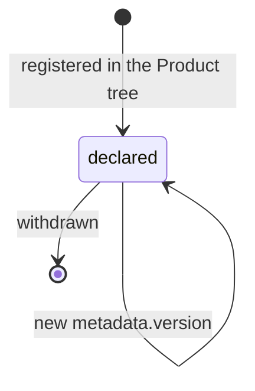

# Evaluator

An Evaluator is the actor that judges work against criteria and Constitutions;
it may be automated, agentic, or human ([glossary](../../reference/glossary.md)).

## Definition

An Evaluator is an **actor declaration**
([object model §6](../../reference/object-model.md#6-actors-vs-records)): it
states who may judge what, and how. Evaluators hold no work state — every
outcome they produce lives on an append-only [Evaluation](./evaluation.md)
record. An Evaluator declares the evaluation categories it is competent to
judge and may not record Evaluations outside them
([PP-0008 §5.1](../../pp/PP-0008-evaluation.md#51-fields)).

An Evaluator is *not* a rubber stamp for the producing agent. The
**independence rule**
([PP-0008 §5.2](../../pp/PP-0008-evaluation.md#52-independence)) exists to
prevent self-judgment: an Evaluator never evaluates work produced by itself —
in particular, when the same underlying actor is registered both as a
[Worker](./worker.md) and as an Evaluator, it never evaluates Tasks it claimed
or Artifacts it produced. An `agentic` Evaluator should also run on a
different agent or model configuration from the Worker it judges, and a
`human` Evaluator should not be the author of the work where staffing permits.
The runtime enforces independence at scheduling time
([PP-0010 §5](../../pp/PP-0010-runtime.md#5-orchestration-of-planning-execution-and-evaluation)).

## Responsibilities

- Execute evaluations within its declared categories
  ([PP-0008 §3](../../pp/PP-0008-evaluation.md#3-evaluation-categories)).
- Collect and attach Evidence to every judgment
  ([PP-0008 §8](../../pp/PP-0008-evaluation.md#8-evidence-model)).
- Render a verdict (`pass`, `fail`, `error`, `inconclusive`) and, optionally,
  a score ([PP-0008 §7](../../pp/PP-0008-evaluation.md#7-scoring-model)).
- Never judge its own work (independence, above).

## Lifecycle

Evaluators are declarations, not governed objects. They are versioned per
[PP-0002 §6.1](../../pp/PP-0002-core-concepts.md#61-object-versioning) and may
be withdrawn by removal; superseded versions should be retained in Git history
([PP-0008 §5](../../pp/PP-0008-evaluation.md#5-the-evaluator-kind)).



## Inputs / Outputs

| Direction | What | Source / consumer |
| --- | --- | --- |
| In | Subjects to judge: Artifacts, Tasks, Deployments, Products, Workers | assigned by the runtime ([PP-0010 §5](../../pp/PP-0010-runtime.md#5-orchestration-of-planning-execution-and-evaluation)) or [QualityGate](./quality-gate.md) triggers |
| In | Criteria: acceptance criteria, Constitution articles, NFR budgets, [GoldenTests](./golden-test.md) | [PP-0008 §2.2](../../pp/PP-0008-evaluation.md#22-criteria-sources) |
| Out | [Evaluation](./evaluation.md) records with Evidence | consumed by QualityGates and lifecycle transitions |

## Relationships

- Referenced by `Evaluation.spec.evaluator` on every record it produces.
- Judges [Artifacts](./artifact.md) and drives the [Task](./task.md)
  transitions `evaluating → done` and `evaluating → rejected` — transitions
  that a [Worker](./worker.md) can never make for its own work
  ([PP-0007 §5.2](../../pp/PP-0007-worker-protocol.md#52-boundaries)).
- Executes [GoldenTests](./golden-test.md) and the checks behind
  [QualityGates](./quality-gate.md).
- Audits the [Constitution](./constitution.md) via the `constitution_audit`
  category; audits other agents via `agent_evaluation`.
- Scheduled by the runtime, which verifies independence before assignment.

## Example

```yaml
pp: "0.1"
kind: Evaluator
metadata:
  id: eval-checkout-agent
  name: Checkout Evaluation Agent
  version: 1.0.0
  createdAt: 2026-06-20T09:00:00Z
spec:
  description: >
    Agentic evaluator that exercises checkout flows in a browser,
    compares outcomes against golden tests, and audits acceptance
    criteria. Runs on a different model configuration from all
    registered Workers.
  type: agentic
  categories:
    - regression
    - acceptance
    - business_validation
```

## Where it's defined

- Specification: [PP-0008 §5 — The Evaluator Kind](../../pp/PP-0008-evaluation.md#5-the-evaluator-kind)
  (independence rule in [§5.2](../../pp/PP-0008-evaluation.md#52-independence))
- Schema: [`schemas/evaluation/evaluator.schema.json`](../../schemas/evaluation/evaluator.schema.json)
- Glossary: [Evaluator](../../reference/glossary.md)
