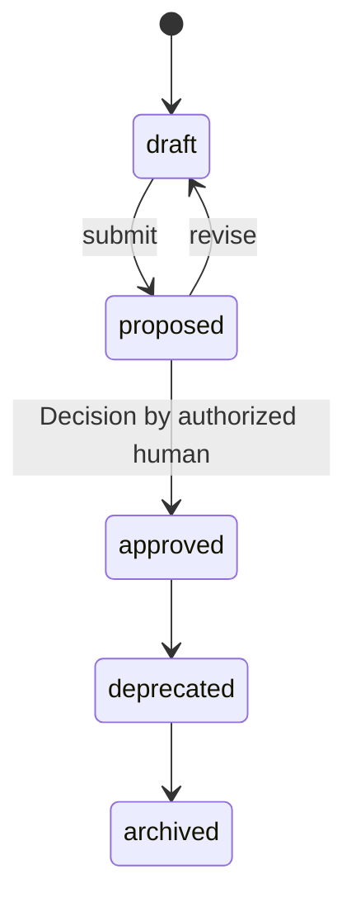

# Feature

A coherent unit of user-facing functionality within a Capability,
decomposed into Stories ([glossary](../../reference/glossary.md)).

## Definition

A `Feature` is the granularity at which humans usually discuss,
prioritize, and release functionality — "guest checkout" within
"accept payments". It attaches to exactly one
[Capability](./capability.md) via `spec.capability` and decomposes
into [Stories](./story.md)
([PP-0004 §5](../../pp/PP-0004-product-specification.md#5-the-feature-kind)).

A Feature is not a requirements document and not a testable unit. Its
precise behavior comes from [Specifications](./specification.md) whose
scope covers it; its testable slices are its Stories, each with
acceptance criteria. A Feature object itself carries only a
description, its upward Capability edge, optional persona ids drawn
from a covering Specification, and free-form notes.

## Responsibilities

- Bound a releasable, discussable unit of functionality.
- Attach to exactly one Capability (`spec.capability`).
- Name the personas it serves, by persona id from a Specification
  whose scope covers it
  ([PP-0004 §5.2](../../pp/PP-0004-product-specification.md#52-responsibilities)).

## Lifecycle

`Feature` is a governed object following the governed state machine
exactly ([PP-0002 §6.2](../../pp/PP-0002-core-concepts.md#62-governed-objects),
[PP-0004 §1.2](../../pp/PP-0004-product-specification.md#12-governance)).
A Feature should not be approved before its Capability is approved —
approval proceeds top-down
([PP-0004 §5.3](../../pp/PP-0004-product-specification.md#53-lifecycle),
[§8.2](../../pp/PP-0004-product-specification.md#82-traceability)).
Approved versions are immutable; amendments enter at `draft` as a new
version and take effect only on human approval.



## Inputs / Outputs

| Direction | What | From / To |
| --- | --- | --- |
| In | Its parent Capability | [Capability](./capability.md) |
| In | Definitions and personas covering it | [Specifications](./specification.md) via `spec.scope` |
| Out | The parent that Stories attach to | [Stories](./story.md) via `spec.feature` |
| Out | A `tracesTo` target for work | [Tasks](./task.md) ([PP-0006](../../pp/PP-0006-task-graph.md)) |

## Relationships

- Belongs to exactly one [Capability](./capability.md) via
  `spec.capability`
  ([PP-0004-RQ-009](../../pp/PP-0004-product-specification.md#normative-requirements)).
- Sliced into [Stories](./story.md), which point at it via
  `spec.feature`; the child-to-parent Ref is the single authoritative
  edge — parents never enumerate children
  ([PP-0004 §1.1](../../pp/PP-0004-product-specification.md#11-hierarchy)).
- Covered by [Specifications](./specification.md) whose `spec.scope`
  includes it or its Capability.
- Traced to directly by [Tasks](./task.md) via `spec.tracesTo` when
  work is not planned from a Story
  ([object model §3](../../reference/object-model.md#3-relationships)).
- Protected by [GoldenTests](./golden-test.md) via their `spec.appliesTo`.

## Example

`.product/specification/feat-guest-checkout.yaml`:

```yaml
pp: "0.1"
kind: Feature
metadata:
  id: feat-guest-checkout
  name: Guest checkout
  version: 1.0.0
  lifecycle: approved
  createdAt: 2026-05-20T11:00:00Z
  updatedAt: 2026-06-10T14:30:00Z
  owners:
    - { type: human, id: dana@example.com, name: Dana Ito }
spec:
  description: >
    Complete a purchase without creating an account: email, shipping,
    payment, order confirmation, and an optional post-purchase upgrade
    to a full account.
  capability: { ref: { kind: Capability, id: cap-payments } }
  personas:
    - guest-shopper
  notes: >
    Post-purchase account upgrade is in scope; social sign-in during
    checkout is explicitly out of scope for v1.
```

## Where it's defined

- Specification: [PP-0004 §5 — The Feature Kind](../../pp/PP-0004-product-specification.md#5-the-feature-kind)
- Schema: [`schemas/specification/feature.schema.json`](../../schemas/specification/feature.schema.json)
- Glossary: [Feature](../../reference/glossary.md)
