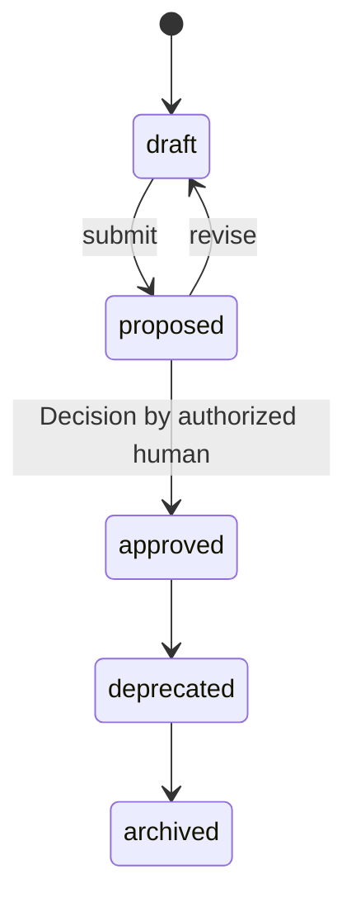

# Goal

A measurable business or user outcome with a metric and a target,
owned by humans ([glossary](../../reference/glossary.md)).

## Definition

A `Goal` states an outcome the Product pursues — in language a human
sponsor recognizes — together with exactly one primary metric, a
target value, and a direction (`increase`, `decrease`, `maintain`).
Goals sit at the top of the intent hierarchy: they answer *why*
everything below them exists, and everything below them justifies
itself by pointing upward at a Goal
([PP-0004 §3](../../pp/PP-0004-product-specification.md#3-the-goal-kind)).

A Goal is not a feature request, a roadmap item, or a KPI dashboard.
It does not say what to build — that is what
[Capabilities](./capability.md), [Features](./feature.md), and
[Stories](./story.md) are for. It fixes the measure by which building
anything is later judged: [Observations](./observation.md) from the
running system are compared against `spec.metric.target`, closing the
learning loop ([PP-0010](../../pp/PP-0010-runtime.md)).

## Responsibilities

- State the outcome in one or two sentences (`spec.statement`).
- Fix the primary metric: name, target, direction, and optionally a
  baseline, unit, and description
  ([PP-0004 §3.6](../../pp/PP-0004-product-specification.md#36-fields)).
- Anchor prioritization: Planners and humans rank work by the Goals it
  serves.
- Give the learning loop something concrete to evaluate the running
  Product against.

## Lifecycle

`Goal` is a governed object: it carries `metadata.lifecycle` and
follows the governed state machine exactly
([PP-0002 §6.2](../../pp/PP-0002-core-concepts.md#62-governed-objects),
[PP-0004 §1.2](../../pp/PP-0004-product-specification.md#12-governance)).
Only a human may approve it, the approval is recorded as a
[Decision](./decision.md), and an approved version is immutable —
changing it means a new version starting again at `draft`. Approval is
expected to proceed top-down: a Goal should be approved before the
Capabilities serving it
([PP-0004 §8.2](../../pp/PP-0004-product-specification.md#82-traceability)).



## Inputs / Outputs

| Direction | What | From / To |
| --- | --- | --- |
| In | Human intent (conversation, documents) | Human Interface ([PP-0010](../../pp/PP-0010-runtime.md)) |
| In | Baseline measurements | [Observations](./observation.md) establishing `spec.metric.baseline` |
| Out | The target that Capabilities cite via `serves` | [Capabilities](./capability.md) |
| Out | The metric the learning loop evaluates against | Runtime ([PP-0010](../../pp/PP-0010-runtime.md)) |

## Relationships

- Served by [Capabilities](./capability.md) via their `spec.serves`
  (the edge points upward, child to parent —
  [PP-0004 §1.1](../../pp/PP-0004-product-specification.md#11-hierarchy)).
- Listed by the [Product](./product.md) in `spec.goals`.
- Motivates [Specifications](./specification.md) via their
  `spec.businessGoals`.
- Measured by [Observations](./observation.md) against `spec.metric`.
- Approved by a [Decision](./decision.md) at each version.

## Example

`.product/specification/goal-checkout-conversion.yaml`:

```yaml
pp: "0.1"
kind: Goal
metadata:
  id: goal-checkout-conversion
  name: Raise checkout conversion
  version: 1.0.0
  lifecycle: approved
  createdAt: 2026-05-02T09:00:00Z
  updatedAt: 2026-06-10T14:30:00Z
  owners:
    - { type: human, id: dana@example.com, name: Dana Ito }
spec:
  statement: >
    Visitors who start checkout should finish it. Raise the share of
    started checkouts that complete a purchase.
  metric:
    name: checkout_conversion_rate
    description: Completed purchases divided by started checkouts, weekly.
    unit: percent
    baseline: 2.4
    target: 3.5
    direction: increase
  timeframe: 2026-Q4
  rationale: >
    Checkout abandonment is the largest single loss point in the funnel;
    support tickets and session replays point at forced account creation.
```

## Where it's defined

- Specification: [PP-0004 §3 — The Goal Kind](../../pp/PP-0004-product-specification.md#3-the-goal-kind)
- Schema: [`schemas/specification/goal.schema.json`](../../schemas/specification/goal.schema.json)
- Glossary: [Goal](../../reference/glossary.md)
