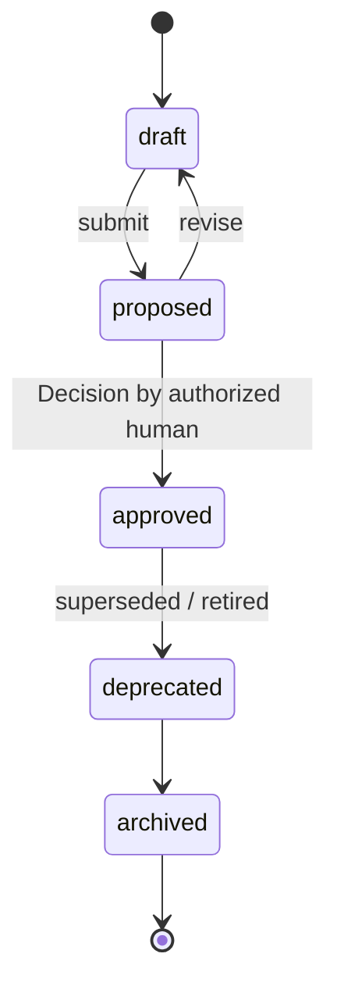

# GoldenTest

A canonical scenario, with fixed inputs and expected outcomes, that
the Product must always satisfy; regression armor for autonomous
change ([glossary](../../reference/glossary.md)).

## Definition

A `GoldenTest` states one scenario precisely enough that an automated
harness, an agent, or a human can execute it and judge the outcome
without further interpretation: the situation being exercised, fixed
inputs, the expected outcome, optional ordered steps, and the
execution method (`automated`, `agentic`, or `manual`)
([PP-0008 §6](../../pp/PP-0008-evaluation.md#6-the-goldentest-kind-and-golden-datasets)).
Golden tests are the protocol's regression armor: autonomous change is
safe only because these scenarios are re-judged continuously.

A GoldenTest is not an ordinary unit test, and not agent-editable
quality criteria. It is a governed object: approved versions are
immutable, and only a human can approve one — deliberately, because if
agents could weaken golden tests, they could grade their own homework.
Only *approved* GoldenTests count toward
[QualityGates](./quality-gate.md)
([PP-0008 §9.2](../../pp/PP-0008-evaluation.md#92-gate-semantics)).
A **Golden Dataset** is not a separate kind either: it is the set of
GoldenTests sharing the reserved label `metadata.labels.dataset`
([PP-0008 §6.2](../../pp/PP-0008-evaluation.md#62-golden-datasets)).

## Responsibilities

- State one scenario precisely enough to execute and judge without
  further interpretation.
- Pin fixed inputs and the expected outcome, with an explicit
  tolerance for acceptable deviation where needed.
- Declare which objects it protects via `spec.appliesTo` (Story,
  Feature, Capability, or Constitution).
- Declare dataset membership, at most one, via the reserved `dataset`
  label.

## Lifecycle

`GoldenTest` is a governed object
([PP-0002 §6.2](../../pp/PP-0002-core-concepts.md#62-governed-objects)):
`metadata.lifecycle` is required, approval is a human act recorded as
a [Decision](./decision.md), and an approved version is immutable —
changing a golden test means proposing a new version that a human
approves.



## Inputs / Outputs

| Direction | What | From / To |
| --- | --- | --- |
| In | Scenarios drafted from Stories, Features, Constitution articles | [Story](./story.md), [Feature](./feature.md), [Constitution](./constitution.md) — typically proposed by agents after a Story ships, approved by humans |
| Out | Criteria for evaluation runs | [Evaluations](./evaluation.md) via `criteria[].source` |
| Out | Members of Golden Datasets | Dataset consumers (harnesses, reports, gates) |
| Out | Selectable requirements in gates | [QualityGates](./quality-gate.md) via `spec.requires[].evaluations` |

## Relationships

- Protects [Stories](./story.md), [Features](./feature.md),
  [Capabilities](./capability.md), or
  [Constitutions](./constitution.md) via `spec.appliesTo`.
- Referenced by [Story](./story.md) acceptance criteria via
  `verification.evaluations`
  ([PP-0004 §7.2](../../pp/PP-0004-product-specification.md#72-verification))
  and by [Specification](./specification.md) `spec.acceptance`.
- Judged by [Evaluators](./evaluator.md); each run is recorded as an
  [Evaluation](./evaluation.md) pinning the exact member versions used
  ([PP-0008 §6.3](../../pp/PP-0008-evaluation.md#63-dataset-versioning)).
- Required by [QualityGates](./quality-gate.md), which resolve only
  tests whose lifecycle is `approved`.
- Approved by a [Decision](./decision.md) at each version.

## Example

`.product/evaluation/golden/golden-guest-checkout.yaml`, a member of
the `checkout-core` dataset:

```yaml
pp: "0.1"
kind: GoldenTest
metadata:
  id: golden-guest-checkout
  name: Guest checkout completes without an account
  version: 1.0.0
  lifecycle: approved
  labels:
    dataset: checkout-core
  createdAt: 2026-06-10T10:00:00Z
spec:
  scenario: >
    A first-time visitor with three books in the cart checks out as a
    guest, paying by card, without creating an account.
  inputs:
    cart:
      items: 3
      totalUsd: 47.5
    paymentMethod: test-card-visa
  expected: >
    The order is placed, a confirmation page with an order number is
    shown, a confirmation email is queued, and no account record is
    created.
  steps:
    - step: Add three in-stock books to the cart as an anonymous visitor.
    - step: Proceed to checkout and choose "continue as guest".
    - step: Enter shipping details and the test card, then submit.
    - step: Verify confirmation page, queued email, and absence of an account.
  method: agentic
  appliesTo:
    - ref: { kind: Story, id: story-guest-checkout-happy-path, version: "1.0.0" }
  tolerance: >
    Copy and layout may vary; the order number format and the absence
    of an account record may not.
```

## Where it's defined

- Specification: [PP-0008 §6 — The GoldenTest Kind and Golden Datasets](../../pp/PP-0008-evaluation.md#6-the-goldentest-kind-and-golden-datasets)
- Schema: [`schemas/evaluation/golden-test.schema.json`](../../schemas/evaluation/golden-test.schema.json)
- Glossary: [Golden Test](../../reference/glossary.md), [Golden Dataset](../../reference/glossary.md)
