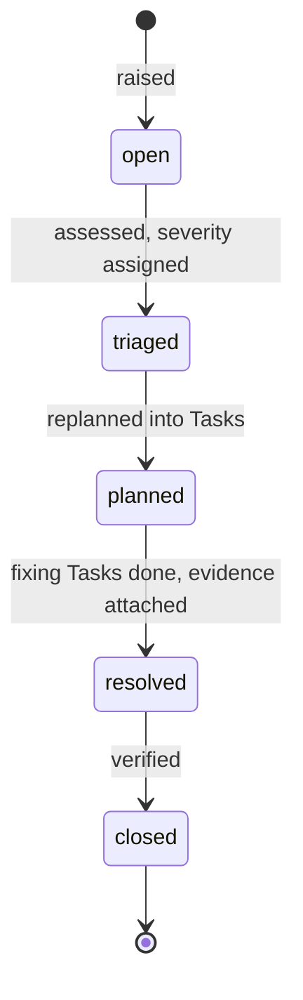

# Issue

An Issue is a tracked defect, risk, or anomaly requiring resolution, typically
raised from Observations or rejected Evaluations and resolved by replanning
into Tasks ([glossary](../../reference/glossary.md)).

## Definition

An Issue is a durable record of something wrong or risky, carrying enough
structure — severity, source, affected objects — for a
[Planner](./planner.md) to act on it
([PP-0006 §2.3](../../pp/PP-0006-task-graph.md#23-the-issue-kind-planning-role)).
Its data model is owned by the task domain (PP-0006); its runtime triage
lifecycle is owned by [PP-0010 §6.4](../../pp/PP-0010-runtime.md#64-issue-triage-lifecycle).
Once triaged, an Issue is one of the two valid sources of work — the other
being approved governed intent — so it is the doorway through which production
reality re-enters planning.

An Issue is *not* itself a work item and not a Task backlog entry: the work to
resolve it lives in [Tasks](./task.md) that trace back to it. It is also not
disposable — Issues are never deleted, and a mistakenly opened Issue is
triaged and closed with its history intact.

## Responsibilities

- Capture the anomaly durably: title, description, reproduction if known.
- Carry triage severity (`critical`, `high`, `medium`, `low`).
- Link the evidence that raised it via `spec.source`
  (`observation`, `evaluation`, `human`, or `constitution_violation`).
- Accumulate the Tasks spawned to resolve it in `status.tasks`.

## Lifecycle

`Issue.status.state` moves through exactly these states, without skipping:
`open → triaged → planned → resolved → closed`
([PP-0010 §6.4](../../pp/PP-0010-runtime.md#64-issue-triage-lifecycle)).



Any actor may open an Issue; the runtime must open one automatically for
every Constitution violation reported by a `constitution_audit` Evaluation and
for every failed Evaluation concerning production. A Planner or human triages
it; a Planner may only plan from an Issue that is `triaged` or later
([PP-0006 §2.1](../../pp/PP-0006-task-graph.md#21-sources-of-work)). It
becomes `planned` when Tasks are emitted for it, `resolved` when all fixing
Tasks are `done`, and `closed` only after verification — a passing Evaluation
against the affected subject, or explicit human confirmation. Agents cannot
close an Issue without that verification evidence.

## Inputs / Outputs

| Direction | What | Source / consumer |
| --- | --- | --- |
| In | Raising records: [Observations](./observation.md), failed [Evaluations](./evaluation.md), Constitution enforcement, human reports | `spec.source` |
| In | Triage (severity, validity assessment) | [Planner](./planner.md) or human |
| Out | Resolving [Tasks](./task.md), recorded in `status.tasks` | replanning ([PP-0006 §8.3](../../pp/PP-0006-task-graph.md#83-on-issues)) |
| Out | Resolution evidence and history | auditors; the learning loop |

## Relationships

- `spec.source.ref` → the raising record — an [Observation](./observation.md)
  or [Evaluation](./evaluation.md).
- `spec.affects` → the objects impaired, e.g. a Feature or
  [Deployment](./deployment.md).
- `status.tasks` → the [Tasks](./task.md) spawned to resolve it; those Tasks
  point back via `spec.tracesTo`, making a triaged Issue a valid Task parent.
- Missed Task deadlines and unclaimable Tasks should surface as Issues
  ([PP-0006 §6.3](../../pp/PP-0006-task-graph.md#63-deadlines),
  [§7](../../pp/PP-0006-task-graph.md#7-work-allocation)).

## Example

```yaml
pp: "0.1"
kind: Issue
metadata:
  id: issue-checkout-timeout
  name: Checkout requests time out under load
  version: 1.0.0
  createdAt: 2026-07-01T22:10:00Z
spec:
  title: Checkout requests time out under load
  description: >
    P95 latency on POST /checkout exceeds 8s above 40 rps; users see
    gateway timeouts. First observed after the 2026-06-30 deploy.
  severity: high
  source:
    type: observation
    ref: { ref: { kind: Observation, id: obs-latency-2026-07-01 } }
  affects:
    - { ref: { kind: Feature, id: feature-checkout } }
status:
  state: planned
  tasks:
    - { ref: { kind: Task, id: task-fix-checkout-timeout } }
```

## Where it's defined

- Specification: [PP-0006 §2.3 — The Issue Kind (planning role)](../../pp/PP-0006-task-graph.md#23-the-issue-kind-planning-role)
  and [PP-0010 §6.4 — Issue triage lifecycle](../../pp/PP-0010-runtime.md#64-issue-triage-lifecycle)
- Schema: [`schemas/task/issue.schema.json`](../../schemas/task/issue.schema.json)
- Glossary: [Issue](../../reference/glossary.md)
