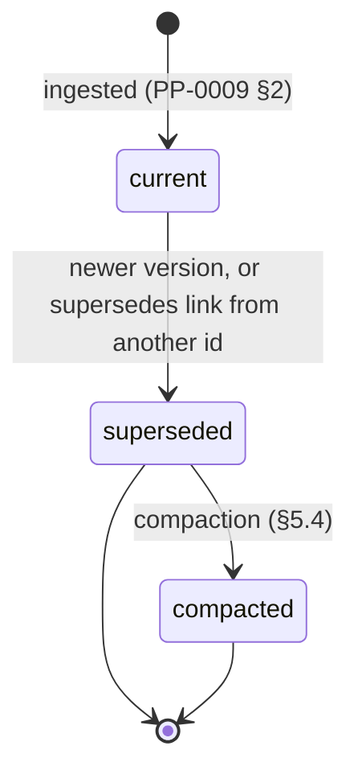

# Knowledge

A single validated, versioned unit of product knowledge with a
category, confidence, provenance, and links, living in the Product
Brain ([glossary](../../reference/glossary.md)).

## Definition

A `Knowledge` object is one self-contained, versioned claim about the
Product or its world — one claim per object: "shoppers abandon carts
when shipping cost appears late" is one Knowledge; a page summarizing
the whole checkout funnel is not
([PP-0003 §3.1](../../pp/PP-0003-product-brain.md#3-the-knowledge-kind)).
Every claim declares a category from a closed eight-value enum
(`domain`, `user`, `market`, `technical`, `architectural`,
`operational`, `process`, `lesson` —
[PP-0003 §2](../../pp/PP-0003-product-brain.md#2-knowledge-categories)),
a confidence rung, at least one provenance entry, and optional typed
graph links.

Knowledge is not documentation and not raw source material: ingestion
distills claims, it never stores transcripts or documents verbatim
([PP-0009 §2.2](../../pp/PP-0009-knowledge-protocol.md#22-distillation-obligations)).
It is also deliberately *not* a governed object: the governed
lifecycle protects intent, while the confidence ladder grades belief —
the human gate sits at `canonical`, playing the role approval plays
for governed objects
([PP-0003 §4](../../pp/PP-0003-product-brain.md#4-trust-the-confidence-ladder)).

## Responsibilities

- State one claim, self-contained (`spec.statement`).
- Carry the evidence trail for it (`spec.provenance`).
- Declare how much it may be trusted (`spec.confidence`):
  `hypothesis` → `observed` → `validated` → `canonical`, each rung
  with an entry condition; moving in or out of `canonical` requires a
  human [Decision](./decision.md)
  ([PP-0009 §4](../../pp/PP-0009-knowledge-protocol.md#4-update-and-confidence-transitions)).
- Situate itself in the Knowledge Graph (`spec.links`, with the six
  edge types of [PP-0003 §8.2](../../pp/PP-0003-product-brain.md#82-edge-semantics)).

## Lifecycle

Knowledge is versioned, never edited in place: any change — statement
revision, added provenance, confidence movement, even a `reviewedAt`
touch — is a new `metadata.version` of the same `id`
([PP-0003 §3.3](../../pp/PP-0003-product-brain.md#33-lifecycle),
[PP-0009 §4](../../pp/PP-0009-knowledge-protocol.md#4-update-and-confidence-transitions)).
Superseded versions are retained, never silently deleted; old
superseded versions may eventually be compacted into summaries that
preserve identity and provenance
([PP-0003 §5.3–§5.4](../../pp/PP-0003-product-brain.md#53-retention-and-supersession--never-silent-deletion)).
Knowledge does not use `metadata.lifecycle`; its state is derived from
version ordering and supersession links.



## Inputs / Outputs

| Direction | What | From / To |
| --- | --- | --- |
| In | Distilled claims from conversations, documents, telemetry | Ingestion ([PP-0009 §2](../../pp/PP-0009-knowledge-protocol.md#2-ingestion)) |
| In | Corroborating or contradicting evidence | [Observations](./observation.md), [Evaluations](./evaluation.md) |
| In | Promotions/demotions with required evidence or authority | Update operation ([PP-0009 §4](../../pp/PP-0009-knowledge-protocol.md#4-update-and-confidence-transitions)) |
| Out | Worker context bundles (id@version, confidence, provenance) | [Workers](./worker.md) via retrieval ([PP-0009 §3.2](../../pp/PP-0009-knowledge-protocol.md#32-context-assembly-for-workers)) |
| Out | Citable claims | Other Knowledge, [Specifications](./specification.md), [Decisions](./decision.md) |

## Relationships

- Belongs to the Product's [ProductBrain](./product-brain.md).
- Distilled from [Observations](./observation.md),
  [Evaluations](./evaluation.md), [Decisions](./decision.md),
  conversations, and documents — recorded in `spec.provenance`.
- Linked to Knowledge, Decisions, and any other PP object via
  `spec.links` (`supports`, `contradicts`, `refines`, `derived_from`,
  `supersedes`, `relates_to`).
- Promoted to and demoted from `canonical` only by a human
  [Decision](./decision.md) referencing the exact version
  ([PP-0003-RQ-008](../../pp/PP-0003-product-brain.md#normative-requirements)).
- Contradictions carry a review obligation and block promotion of
  either end until resolved
  ([PP-0009 §5](../../pp/PP-0009-knowledge-protocol.md#5-linking)).

## Example

`.product/brain/knowledge/know-cart-abandon-shipping.yaml`:

```yaml
pp: "0.1"
kind: Knowledge
metadata:
  id: know-cart-abandon-shipping
  name: Late shipping cost drives cart abandonment
  version: 2.1.0
  labels:
    area: checkout
  createdAt: 2026-06-02T10:00:00Z
  updatedAt: 2026-06-28T09:30:00Z
spec:
  category: user
  subcategory: behavior
  statement: >
    Shoppers abandon carts significantly more often when shipping cost
    is first revealed at the payment step rather than on the cart page.
  detail: >
    June 2026 funnel telemetry shows a 23% drop-off at the payment step
    for orders under $25, versus 9% when a shipping estimate is shown on
    the cart page. Effect concentrates in first-time buyers.
  confidence: validated
  provenance:
    - type: observation
      ref: { ref: { kind: Observation, id: obs-funnel-2026-06 } }
      description: Checkout funnel telemetry, June 2026.
    - type: evaluation
      ref: { ref: { kind: Evaluation, id: eval-checkout-ab-01 } }
      description: A/B evaluation of early shipping estimate.
  links:
    - rel: supports
      target: { ref: { kind: Knowledge, id: know-early-price-transparency } }
    - rel: relates_to
      target: { ref: { kind: Story, id: story-guest-checkout-happy-path } }
  reviewedAt: 2026-06-28T09:30:00Z
```

## Where it's defined

- Specification: [PP-0003 §3 — The Knowledge Kind](../../pp/PP-0003-product-brain.md#3-the-knowledge-kind)
  (categories: §2, confidence: §4, graph: §8); operations:
  [PP-0009 — Knowledge Protocol](../../pp/PP-0009-knowledge-protocol.md)
- Schema: [`schemas/knowledge/knowledge.schema.json`](../../schemas/knowledge/knowledge.schema.json)
- Glossary: [Knowledge](../../reference/glossary.md), [Knowledge Graph](../../reference/glossary.md)
