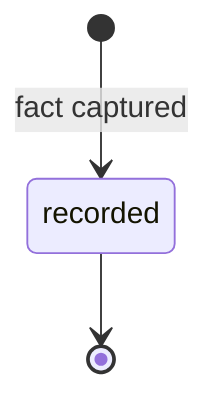

# Observation

An Observation is a telemetry-derived fact about the running Product — a
metric reading, incident, or user signal — recorded append-only, feeding the
learning loop ([glossary](../../reference/glossary.md)).

## Definition

An Observation states **one fact, once**, with enough context — source, time,
environment, links — to be distilled into Knowledge or triaged into an Issue
([PP-0010 §6.3](../../pp/PP-0010-runtime.md#63-the-observation-kind)). It is
how the world outside the Product tree gets back in: telemetry pipelines,
incident tooling, user feedback channels, analytics, and humans all write
Observations, and the runtime distills them into the Product Brain on a
declared cadence ([PP-0010 §8.2](../../pp/PP-0010-runtime.md#82-the-learning-loop)).

An Observation is *not* a judgment and not a to-do. It carries no verdict —
judging is the [Evaluation](./evaluation.md)'s job — and it demands no action
by itself: when a fact warrants work, an [Issue](./issue.md) is raised from it
and a [Planner](./planner.md) plans the response. It is also not a mutable
metric dashboard: once recorded, it never changes.

## Responsibilities

- State the fact plainly (`spec.statement`), with its `source`, the instant
  it was observed, and optionally a structured `measurement`.
- Link what it concerns via `spec.relatesTo` — typically the Deployment,
  Goal, Feature, or a prior Observation.
- Carry a severity when one applies; `critical` and `high` Observations
  should open Issues ([PP-0010 §6.4](../../pp/PP-0010-runtime.md#64-issue-triage-lifecycle)).

## Lifecycle

Observations are **append-only records**
([PP-0002 §6.3](../../pp/PP-0002-core-concepts.md#63-records)); there is no
state machine to drive. They are never modified or deleted — a correction is
a new Observation referencing the old one via `relatesTo`.



## Inputs / Outputs

| Direction | What | Source / consumer |
| --- | --- | --- |
| In | Telemetry pipelines, incident tooling, user channels, analytics, humans | `spec.source`: `telemetry`, `incident`, `user_feedback`, `analytics`, `manual` |
| Out | Distilled [Knowledge](./knowledge.md) on a declared cadence | [PP-0010 §8.2](../../pp/PP-0010-runtime.md#82-the-learning-loop), PP-0009 ingestion |
| Out | [Issues](./issue.md) raised from anomalies | [PP-0010 §6.4](../../pp/PP-0010-runtime.md#64-issue-triage-lifecycle) |
| Out | Replanning signals for the [Planner](./planner.md) | the `observation` trigger ([PP-0006 §8.1](../../pp/PP-0006-task-graph.md#81-triggers)) |

## Relationships

- `spec.relatesTo` → typically the [Deployment](./deployment.md) it observed,
  a Goal (metric movements), a Feature, or a prior Observation it corrects.
- Distilled into [Knowledge](./knowledge.md) — no Observation is left
  indefinitely undistilled ([PP-0010 §8.2](../../pp/PP-0010-runtime.md#82-the-learning-loop)).
- May raise an [Issue](./issue.md), which the Issue records via
  `spec.source` (`type: observation`, `ref` → this Observation).
- Feeds continuous improvement: the Brain informs the next turn of the loop
  ([object model §3](../../reference/object-model.md#3-relationships)).

## Example

```yaml
pp: "0.1"
kind: Observation
metadata:
  id: obs-2026-07-03-checkout-latency
  name: Checkout p95 latency rising after release 42
  version: 1.0.0
  createdAt: 2026-07-03T18:40:00Z
spec:
  source: telemetry
  statement: >
    Checkout p95 latency rose from 812 ms to 934 ms in the three hours
    after release 42 reached 100% of traffic; still inside the 1000 ms
    budget, but the margin halved.
  measurement:
    metric: checkout_p95_latency
    value: 934
    unit: ms
  observedAt: 2026-07-03T18:30:00Z
  environment: production
  relatesTo:
    - ref: { kind: Deployment, id: deploy-2026-07-03-prod-042 }
    - ref: { kind: Goal, id: goal-checkout-conversion }
  severity: medium
```

## Where it's defined

- Specification: [PP-0010 §6.3 — The Observation Kind](../../pp/PP-0010-runtime.md#63-the-observation-kind)
- Schema: [`schemas/deployment/observation.schema.json`](../../schemas/deployment/observation.schema.json)
- Glossary: [Observation](../../reference/glossary.md)
