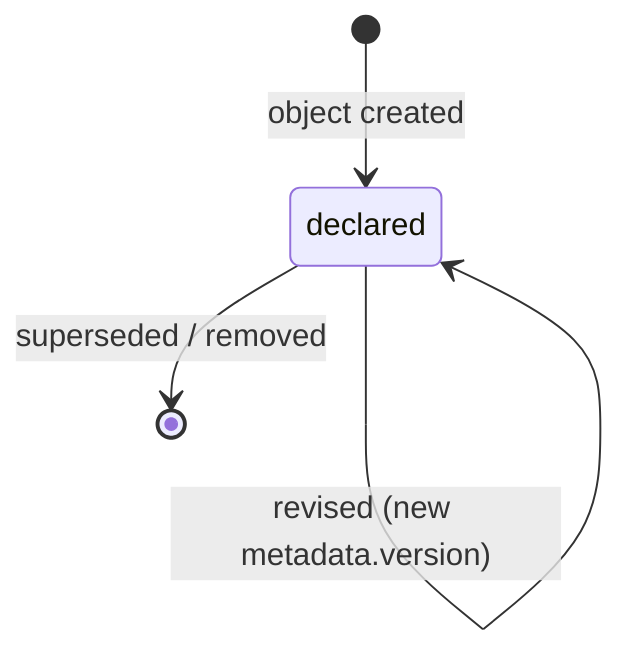

# Planner

A Planner is the actor that decomposes approved intent into the Task Graph and
maintains its dependencies, priorities, and scheduling
([glossary](../../reference/glossary.md)).

## Definition

A Planner is an **actor declaration**: an agent, human, or hybrid participant
authorized to turn approved sources into Tasks and to keep the
[Task Graph](../../pp/PP-0006-task-graph.md#4-the-task-graph) coherent. Like
all actor kinds ([object model §6](../../reference/object-model.md#6-actors-vs-records)),
the Planner object describes *who may plan and how* — it holds no work state.
Everything the Planner does shows up on the records it touches: Task objects,
their edges, their priorities.

A Planner is *not* an executor or a judge. It never performs the work
(that is the [Worker](./worker.md)'s role) and never accepts it (that is the
[Evaluator](./evaluator.md)'s). Nor is it a source of intent: a Planner may
only plan from an approved Story or Feature, or from an Issue that has been
triaged — planning from drafts is how an autonomous system would escape human
governance, and [PP-0006 §2.1](../../pp/PP-0006-task-graph.md#21-sources-of-work)
closes that door.

## Responsibilities

- Decompose approved Stories/Features and triaged Issues into Tasks whose
  completion contracts cover the source's acceptance criteria
  ([PP-0006 §2.2](../../pp/PP-0006-task-graph.md#22-decomposition)).
- Maintain `dependsOn` edges and keep the graph acyclic
  ([PP-0006 §4](../../pp/PP-0006-task-graph.md#4-the-task-graph)).
- Assign priorities and constraints
  ([PP-0006 §6](../../pp/PP-0006-task-graph.md#6-priority-and-scheduling)).
- Replan on rejection, Issues, specification change, and Observations,
  per its declared `spec.policies.replanOn`
  ([PP-0006 §8](../../pp/PP-0006-task-graph.md#8-replanning)).
- Never execute or evaluate work — those roles are strictly separated
  ([PP-0007 §1](../../pp/PP-0007-worker-protocol.md#1-overview-and-actor-roles)).

## Lifecycle

Planner is not a governed object and has no work-state machine. A Planner
declaration follows ordinary object versioning
([PP-0002 §6.1](../../pp/PP-0002-core-concepts.md#61-object-versioning)): it is
created, revised as new `metadata.version`s, and eventually superseded or
removed ([PP-0006 §3](../../pp/PP-0006-task-graph.md#3-the-planner-kind)).



## Inputs / Outputs

| Direction | What | Source / consumer |
| --- | --- | --- |
| In | Approved [Stories](./story.md) and Features | [PP-0004](../../pp/PP-0004-product-specification.md) |
| In | Triaged [Issues](./issue.md) | [PP-0010 §6.4](../../pp/PP-0010-runtime.md#64-issue-triage-lifecycle) |
| In | Rejected [Evaluations](./evaluation.md), [Observations](./observation.md) | replanning triggers ([PP-0006 §8.1](../../pp/PP-0006-task-graph.md#81-triggers)) |
| In | The current Task Graph and relevant Brain Knowledge | [PP-0010 §8.2](../../pp/PP-0010-runtime.md#82-the-learning-loop) |
| Out | [Task](./task.md) objects and edits to unstarted Tasks' `spec` | Workers claim them ([PP-0007 §3](../../pp/PP-0007-worker-protocol.md#3-the-claim-protocol)) |

## Relationships

- Emits [Tasks](./task.md); the emitted Tasks form the Task Graph.
- Reads [Stories](./story.md), Features, [Issues](./issue.md),
  [Evaluations](./evaluation.md), and [Observations](./observation.md).
- Constrained by the [Constitution](./constitution.md).
- Records the Tasks it emits for an Issue in that Issue's `status.tasks`
  ([PP-0006 §8.3](../../pp/PP-0006-task-graph.md#83-on-issues)).
- Scheduled and bounded by the runtime
  ([PP-0010 §5](../../pp/PP-0010-runtime.md#5-orchestration-of-planning-execution-and-evaluation)).

## Example

```yaml
pp: "0.1"
kind: Planner
metadata:
  id: planner-main
  name: Primary Planner
  version: 1.0.0
  owners:
    - { type: team, id: platform, name: Platform Team }
spec:
  description: >
    Agent planner that decomposes approved Stories and triaged Issues
    into Tasks, maintains the dependency graph, and replans on
    evaluator rejections and specification changes.
  type: agent
  policies:
    scheduling: priority_fifo
    maxParallelism: 4
    replanOn:
      - rejection
      - issue
      - specification_change
  capabilities:
    - plan.decomposition
    - plan.estimation
```

## Where it's defined

- Specification: [PP-0006 §3 — The Planner Kind](../../pp/PP-0006-task-graph.md#3-the-planner-kind)
- Schema: [`schemas/task/planner.schema.json`](../../schemas/task/planner.schema.json)
- Glossary: [Planner](../../reference/glossary.md)
