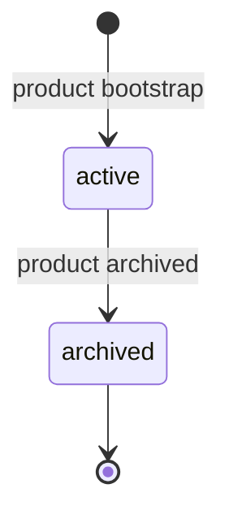

# ProductBrain

The structured, versioned knowledge store of a Product: Knowledge,
Decisions, and their graph — not documentation, but the machine-usable
memory of the Product ([glossary](../../reference/glossary.md)).

## Definition

The `ProductBrain` object is the root of the Product Brain: the set of
all [Knowledge](./knowledge.md) and [Decision](./decision.md) objects
belonging to a Product, connected by the Knowledge Graph
([PP-0003 §1.1](../../pp/PP-0003-product-brain.md#1-the-product-brain-and-the-productbrain-kind)).
The object itself is small — a summary of what the Brain covers,
retention policy hints, and declared retrieval indexes — while the
content lives in the Knowledge and Decision objects that implicitly
belong to it.

The Brain is explicitly *not documentation*. Documentation describes;
the Brain asserts: every entry is one discrete, addressable claim with
a category, a confidence level, provenance, and typed links
([PP-0003, Motivation](../../pp/PP-0003-product-brain.md#motivation-informative)).
Free-form documents (READMEs, wikis, design docs) are never Brain
content — they may appear only as provenance *sources* of Knowledge.
Human-facing documentation may be generated *from* the Brain, but such
renderings are [Artifacts](./artifact.md), not the Brain itself.

## Responsibilities

- Anchor the Brain's identity: exactly one `ProductBrain` per Product,
  referenced by `Product.spec.brain`.
- Declare retention policy hints (`reviewInterval`, `compactAfter`)
  that drive staleness review and compaction
  ([PP-0003 §5](../../pp/PP-0003-product-brain.md#5-synchronization-and-long-term-memory)).
- Declare retrieval indexes (hints only; no tool is obligated to build
  them).
- Serve as the root every Knowledge and Decision object implicitly
  belongs to
  ([PP-0003 §1.4](../../pp/PP-0003-product-brain.md#14-responsibilities-inputs-outputs-relationships)).

## Lifecycle

The ProductBrain is created at product bootstrap — before the first
Goal is drafted, so bootstrap conversations already have a place to
distill into — and lives exactly as long as the Product. It is
archived, never deleted, when the Product itself is archived
([PP-0003 §1.3](../../pp/PP-0003-product-brain.md#13-lifecycle)).
`metadata.lifecycle` should be `active` or `archived`; absent means
`active`.



## Inputs / Outputs

| Direction | What | From / To |
| --- | --- | --- |
| In | Distilled intent (conversations, documents) | Ingestion operations ([PP-0009 §2](../../pp/PP-0009-knowledge-protocol.md#2-ingestion)) |
| In | Observations, Evaluations, Decisions | [Observation](./observation.md), [Evaluation](./evaluation.md), [Decision](./decision.md) |
| Out | Retrieved knowledge; assembled Worker context | [Workers](./worker.md), [Planner](./planner.md) ([PP-0009 §3](../../pp/PP-0009-knowledge-protocol.md#3-retrieval)) |
| Out | Generated documentation renderings (informative) | Humans, as [Artifacts](./artifact.md) |

## Relationships

- Referenced by exactly one [Product](./product.md) via `spec.brain`
  ([PP-0003-RQ-001](../../pp/PP-0003-product-brain.md#normative-requirements)).
- Parent of all [Knowledge](./knowledge.md) and
  [Decision](./decision.md) objects.
- Source of Worker context under the worker contract
  ([PP-0007](../../pp/PP-0007-worker-protocol.md)).
- Sink of the learning loop: telemetry becomes
  [Observations](./observation.md), which are distilled into Knowledge
  ([PP-0010](../../pp/PP-0010-runtime.md)).
- Operated on exclusively through the six operations of
  [PP-0009](../../pp/PP-0009-knowledge-protocol.md): ingest, retrieve,
  update, link, validate, version.

## Example

`.product/brain/brain.yaml`:

```yaml
pp: "0.1"
kind: ProductBrain
metadata:
  id: aurora-brain
  name: Aurora Books Product Brain
  version: 1.1.0
  lifecycle: active
  createdAt: 2026-05-01T09:05:00Z
  updatedAt: 2026-07-03T12:00:00Z
spec:
  summary: >
    Knowledge store for Aurora Books: online bookstore domain rules,
    reader behavior, checkout and recommendation architecture, and
    lessons from autonomous operation since May 2026.
  retention:
    reviewInterval: P90D
    compactAfter: P365D
  indexes:
    - name: by-category
      description: Category + subcategory lookup for Worker context.
    - name: checkout-graph
      description: Link-traversal index seeded from checkout objects.
```

In the Git binding, the Brain occupies `.product/brain/` with
`brain.yaml`, `knowledge/`, and `decisions/`
([PP-0003 §6](../../pp/PP-0003-product-brain.md#6-brain-storage-layout-git-binding)).

## Where it's defined

- Specification: [PP-0003 — Product Brain](../../pp/PP-0003-product-brain.md)
  (kind: §1); operations: [PP-0009 — Knowledge Protocol](../../pp/PP-0009-knowledge-protocol.md)
- Schema: [`schemas/knowledge/product-brain.schema.json`](../../schemas/knowledge/product-brain.schema.json)
- Glossary: [Product Brain](../../reference/glossary.md)
