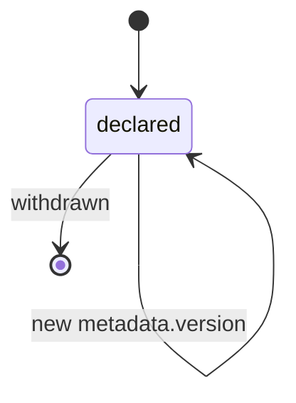

# QualityGate

A QualityGate is a named predicate over Evaluations that must pass before a
transition — such as Task acceptance or Deployment promotion — is permitted
([glossary](../../reference/glossary.md)).

## Definition

A QualityGate states, ahead of time and in reviewable form, what evidence must
exist before a transition may occur
([PP-0008 §9](../../pp/PP-0008-evaluation.md#9-quality-gates)). It is a
**declarative predicate**, not a process or a pipeline step: the gate itself
does nothing — the runtime checks it against the set of current Evaluation
records at each gated transition and either permits or refuses.

A gate is *not* an Evaluation. Evaluations are the testimony; the gate is the
rule that says which testimony suffices. A `blocking` gate that is not
satisfied prevents the transition; an `advisory` gate never blocks but its
outcome is still recorded. Evaluations with verdict `error` or `inconclusive`
never satisfy any requirement, and stale Evaluations — those of an earlier
version of the subject — never count
([PP-0008 §9.2](../../pp/PP-0008-evaluation.md#92-gate-semantics)).

## Responsibilities

- Name the transition it applies to via `spec.trigger`: `task_acceptance`,
  `deployment_promotion`, `constitution_audit`, or `scheduled`.
- Declare its requirements — all must be satisfied for the gate to pass —
  each selecting Evaluations by named [GoldenTests](./golden-test.md), by
  category, or by labels (e.g. a golden `dataset`), optionally with a
  `minScore` ([PP-0008 §9.1](../../pp/PP-0008-evaluation.md#91-fields)).
- Resolve only *approved* GoldenTests when requirements select them
  ([PP-0008 §6.3](../../pp/PP-0008-evaluation.md#63-dataset-versioning)).

## Lifecycle

QualityGates are declarations, versioned per
[PP-0002 §6.1](../../pp/PP-0002-core-concepts.md#61-object-versioning). They
are not governed objects, but because they control what blocks production,
changes should be human-reviewed and may be pinned by a
[Constitution](./constitution.md) article
([PP-0008 §9](../../pp/PP-0008-evaluation.md#9-quality-gates)).



## Inputs / Outputs

| Direction | What | Source / consumer |
| --- | --- | --- |
| In | [Evaluation](./evaluation.md) records for the gated subject | [Evaluators](./evaluator.md), [PP-0008 §4](../../pp/PP-0008-evaluation.md#4-the-evaluation-kind) |
| Out | A satisfied / not-satisfied determination | recorded by the runtime on the gated object's `status`, e.g. `Deployment.status.evaluations` ([PP-0010 §6.2](../../pp/PP-0010-runtime.md#62-deployment-record-fields)) |

## Relationships

- Referenced by [Deployment](./deployment.md) `spec.gates`; a promotion into
  a `production` environment must pass every blocking gate with trigger
  `deployment_promotion` ([PP-0010 §6.1](../../pp/PP-0010-runtime.md#61-environments)).
- Gates the [Task](./task.md) transition `evaluating → done` via the
  `task_acceptance` trigger; Tasks reference gates in
  `spec.completion.evaluations`.
- Requirements select [GoldenTests](./golden-test.md) directly or via the
  reserved `dataset` label, and [Evaluation](./evaluation.md) categories.
- May be run pre-submission by a [Worker](./worker.md)'s evaluation hooks —
  the same check the Evaluator will make
  ([PP-0007 §8](../../pp/PP-0007-worker-protocol.md#8-evaluation-hooks)).
- Checked by the runtime at every phase transition
  ([PP-0010 §3](../../pp/PP-0010-runtime.md#3-phase-contracts)).

## Example

```yaml
pp: "0.1"
kind: QualityGate
metadata:
  id: gate-production-promotion
  name: Production promotion gate
  version: 1.1.0
  createdAt: 2026-06-15T08:00:00Z
spec:
  description: >
    No release reaches production unless the checkout-core golden
    dataset passes and the performance budget holds with headroom.
  trigger: deployment_promotion
  mode: blocking
  requires:
    - description: >
        Every approved golden test in the checkout-core dataset has a
        current passing evaluation.
      selector:
        category: regression
        labels:
          dataset: checkout-core
      verdict: pass
    - description: >
        Performance budget evaluations pass with at least 10% headroom.
      selector:
        category: performance
      minScore: 0.9
```

## Where it's defined

- Specification: [PP-0008 §9 — Quality Gates](../../pp/PP-0008-evaluation.md#9-quality-gates)
- Schema: [`schemas/evaluation/quality-gate.schema.json`](../../schemas/evaluation/quality-gate.schema.json)
- Glossary: [Quality Gate](../../reference/glossary.md)
