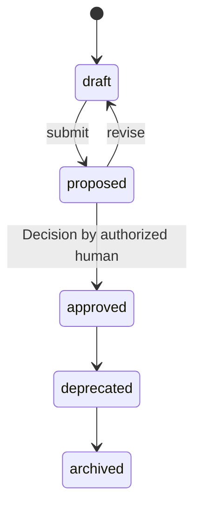

# Specification

The structured, versioned statement of what to build: goals,
requirements, UX, business rules, acceptance criteria, constraints
([glossary](../../reference/glossary.md)).

## Definition

A `Specification` is the definition document of the protocol: for a
declared scope of [Capabilities](./capability.md) and
[Features](./feature.md), it carries the personas, identified
functional and non-functional requirements (`FR-*`, `NFR-*`), UX
principles and prototypes, business rules (`BR-*`), constraints, and
dependencies that give that scope its precise, citable meaning
([PP-0004 §2](../../pp/PP-0004-product-specification.md#2-the-specification-kind)).
It points *sideways* at what it specifies via `spec.scope`, while the
decomposition spine (Goal → Capability → Feature → Story) links upward
([PP-0004 §1.1](../../pp/PP-0004-product-specification.md#11-hierarchy)).

A Specification is not a wiki page or a design doc — it is a
structured object whose internal identifiers are a public surface:
Stories, Tasks, Evaluations, and Decisions cite requirement and rule
ids, so those ids stay stable across versions and are never reused
with a different meaning
([PP-0004 §8.1](../../pp/PP-0004-product-specification.md#81-versioning)).
Nor are its UX prototypes the source of truth: where a prototype and
the prose disagree, the prose and requirements prevail
([PP-0004 §2.7](../../pp/PP-0004-product-specification.md#27-ux-prototypes)).

## Responsibilities

- Bind a scope of Capabilities and/or Features to an explicit,
  reviewable definition.
- Carry the identified requirements and business rules that Stories,
  Tasks, and Evaluations cite by id.
- Anchor UX intent: principles plus informative prototypes.
- Declare constraints and external dependencies that the Planner and
  Workers must respect
  ([PP-0004 §2.2](../../pp/PP-0004-product-specification.md#22-responsibilities)).

## Lifecycle

`Specification` is a governed object following the governed state
machine exactly
([PP-0002 §6.2](../../pp/PP-0002-core-concepts.md#62-governed-objects)).
A Specification should not be submitted while any Ref in `spec.scope`
dangles ([PP-0004 §2.3](../../pp/PP-0004-product-specification.md#23-lifecycle)).
An approved version is immutable; amendments are new versions
re-entering `draft`, and only a human [Decision](./decision.md) makes
them effective.



## Inputs / Outputs

| Direction | What | From / To |
| --- | --- | --- |
| In | Human intent (conversation, documents) | Human Interface ([PP-0010](../../pp/PP-0010-runtime.md)) |
| In | Approved Goals, existing Capabilities/Features, Knowledge | [Goal](./goal.md), [Capability](./capability.md), [Feature](./feature.md), [Product Brain](./product-brain.md) |
| Out | Requirement and rule ids cited downstream | [Stories](./story.md), [Tasks](./task.md), [Evaluations](./evaluation.md) |
| Out | UX prototypes rendered for human review | Approval workflow ([PP-0010](../../pp/PP-0010-runtime.md)) |
| Out | Acceptance links | [GoldenTests](./golden-test.md) via `spec.acceptance` |

## Relationships

- Specifies [Capabilities](./capability.md) and [Features](./feature.md)
  via `spec.scope` (at least one entry,
  [PP-0004-RQ-002](../../pp/PP-0004-product-specification.md#normative-requirements)).
- Motivated by [Goals](./goal.md) via `spec.businessGoals`.
- Cited by [Stories](./story.md), which bind its business rules by id
  ([PP-0004 §6.6](../../pp/PP-0004-product-specification.md#66-fields)).
- Operationalizes acceptance via refs to
  [GoldenTests](./golden-test.md) in `spec.acceptance`.
- May reference [Artifacts](./artifact.md) holding stored prototype
  renderings.
- Approved by a [Decision](./decision.md) at each version.

## Example

`.product/specification/spec-guest-checkout.yaml` (small but complete):

```yaml
pp: "0.1"
kind: Specification
metadata:
  id: spec-guest-checkout
  name: Guest Checkout Specification
  version: 2.0.0
  lifecycle: approved
  createdAt: 2026-05-25T08:00:00Z
  updatedAt: 2026-06-10T14:30:00Z
  owners:
    - { type: human, id: dana@example.com, name: Dana Ito }
spec:
  scope:
    - ref: { kind: Capability, id: cap-payments }
    - ref: { kind: Feature, id: feat-guest-checkout }
  summary: >
    Defines guest checkout end to end: personas, functional behavior,
    quality budgets, UX intent, and the business rules governing
    payment capture and tax.
  businessGoals:
    - ref: { kind: Goal, id: goal-checkout-conversion }
  personas:
    - id: guest-shopper
      name: Guest shopper
      description: >
        A first-time or infrequent buyer who will abandon the purchase
        if asked to create an account.
      needs: [Buy in under three minutes, No account creation]
  functionalRequirements:
    - id: FR-1
      statement: >
        The system MUST allow a purchase to complete with only email,
        shipping address, and payment details.
      priority: critical
  nonFunctionalRequirements:
    - id: NFR-1
      category: performance
      statement: Checkout page transitions MUST feel instant on 4G.
      budget: { metric: p95_step_latency, value: 800, unit: ms }
  ux:
    principles:
      - One decision per screen; never ask twice for the same fact.
    prototypes:
      - name: guest-checkout-flow
        path: docs/prototypes/guest-checkout.html
        format: html
  businessRules:
    - id: BR-PAY-1
      statement: Payment MUST be captured exactly once per order.
      appliesTo:
        - ref: { kind: Feature, id: feat-guest-checkout }
  constraints:
    - Card data never touches product infrastructure; use the payment
      provider's hosted fields.
  dependencies:
    - name: payments-provider
      description: Hosted card fields, capture, and refunds.
  acceptance:
    - ref: { kind: GoldenTest, id: golden-guest-checkout }
```

(The BCP 14 capitals inside `statement` fields belong to the example
product's own requirement prose, as recommended by
[PP-0004 §2.6.2](../../pp/PP-0004-product-specification.md#262-functionalrequirement).)

## Where it's defined

- Specification: [PP-0004 §2 — The Specification Kind](../../pp/PP-0004-product-specification.md#2-the-specification-kind)
- Schema: [`schemas/specification/specification.schema.json`](../../schemas/specification/specification.schema.json)
- Glossary: [Specification](../../reference/glossary.md)
