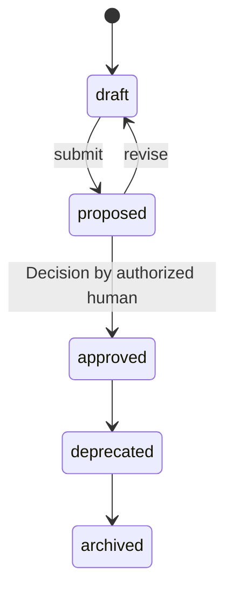

# Story

The narrowest governed unit of functionality: a testable slice of a
Feature with acceptance criteria, small enough to plan into Tasks
([glossary](../../reference/glossary.md)).

## Definition

A `Story` is a slice of exactly one [Feature](./feature.md), stated as
a user-value narrative and made testable by acceptance criteria —
machine-checkable or human-verifiable conditions that decide when the
Story is complete
([PP-0004 §6](../../pp/PP-0004-product-specification.md#6-the-story-kind),
[§7](../../pp/PP-0004-product-specification.md#7-the-acceptance-criteria-model)).
Each criterion takes one of two forms — a single prose `criterion`, or
Gherkin-style `given`/`when`/`then` — and declares how it is verified:
`automated`, `agentic`, or `manual`.

A Story is not a ticket. Tickets describe work for a person to
interpret; a Story is a governed, versioned object whose acceptance
criteria are consumed directly by [Evaluators](./evaluator.md) to
judge Task output, and whose approval is a human act recorded as a
[Decision](./decision.md). It is also not the work itself: the atomic
work unit is the [Task](./task.md), which a Planner produces *from*
the Story.

## Responsibilities

- State the slice as a user-value narrative (the form "As a
  `<persona>`, I want `<capability>`, so that `<benefit>`" is
  recommended).
- Carry the acceptance criteria that Evaluators judge Task output
  against.
- Bind applicable business rules by id, so rules cannot silently drop
  out during planning
  ([PP-0004 §6.2](../../pp/PP-0004-product-specification.md#62-responsibilities)).

## Lifecycle

`Story` is a governed object following the governed state machine
exactly ([PP-0002 §6.2](../../pp/PP-0002-core-concepts.md#62-governed-objects)),
with one readiness rule: a Story needs at least one acceptance
criterion before it may be approved — implementations reject the
approval of a Story with an empty criteria list
([PP-0004 §7.3](../../pp/PP-0004-product-specification.md#73-approval-readiness)).
Deprecating a Story does not cancel Tasks already done against it; it
prevents new planning from it
([PP-0004 §6.3](../../pp/PP-0004-product-specification.md#63-lifecycle)).



Every approved Story sits on a complete, resolvable chain
Story → Feature → Capability → Goal
([PP-0004 §8.2](../../pp/PP-0004-product-specification.md#82-traceability)).

## Inputs / Outputs

| Direction | What | From / To |
| --- | --- | --- |
| In | Its parent Feature | [Feature](./feature.md) |
| In | Business rules and personas from covering definitions | [Specifications](./specification.md) |
| In | UX prototype renderings | [Artifacts](./artifact.md) via `spec.uxRefs` |
| Out | Acceptance criteria to judge against | [Evaluators](./evaluator.md), [QualityGates](./quality-gate.md) ([PP-0008](../../pp/PP-0008-evaluation.md)) |
| Out | The primary `tracesTo` target for planned work | [Tasks](./task.md) ([PP-0006](../../pp/PP-0006-task-graph.md)) |

## Relationships

- Slices exactly one [Feature](./feature.md) via `spec.feature`
  ([PP-0004-RQ-010](../../pp/PP-0004-product-specification.md#normative-requirements)).
- Binds business rules by id from a [Specification](./specification.md)
  whose scope covers its Feature
  ([PP-0004-RQ-011](../../pp/PP-0004-product-specification.md#normative-requirements)).
- Points criteria at [GoldenTests](./golden-test.md) and
  [QualityGates](./quality-gate.md) via
  `verification.evaluations`.
- Planned into [Tasks](./task.md) whose `spec.tracesTo` names it.
- Judged by [Evaluations](./evaluation.md) against its criteria.
- Approved by a [Decision](./decision.md) at each version.

## Example

`.product/specification/story-guest-checkout-happy-path.yaml`:

```yaml
pp: "0.1"
kind: Story
metadata:
  id: story-guest-checkout-happy-path
  name: Guest completes a purchase
  version: 1.0.0
  lifecycle: approved
  createdAt: 2026-06-01T09:15:00Z
  updatedAt: 2026-06-10T14:30:00Z
spec:
  narrative: >
    As a guest shopper, I want to pay for my cart with only my email
    and shipping details, so that I can buy without creating an account.
  feature: { ref: { kind: Feature, id: feat-guest-checkout } }
  acceptanceCriteria:
    - id: ac-1
      given: a cart with at least one in-stock item and no signed-in user
      when: the shopper submits valid email, shipping, and card details
      then: >
        the order is created, payment is captured exactly once, and a
        confirmation page and email include the order number
      verification:
        method: automated
        evaluations:
          - ref: { kind: GoldenTest, id: golden-guest-checkout }
    - id: ac-2
      criterion: >
        The confirmation email is sent within 2 minutes of payment
        capture.
      verification:
        method: automated
  businessRules:
    - BR-PAY-1
  uxRefs:
    - ref: { kind: Artifact, id: proto-guest-checkout-render }
```

## Where it's defined

- Specification: [PP-0004 §6 — The Story Kind](../../pp/PP-0004-product-specification.md#6-the-story-kind)
  and [§7 — The Acceptance Criteria Model](../../pp/PP-0004-product-specification.md#7-the-acceptance-criteria-model)
- Schema: [`schemas/specification/story.schema.json`](../../schemas/specification/story.schema.json)
- Glossary: [Story](../../reference/glossary.md), [Acceptance Criteria](../../reference/glossary.md)
