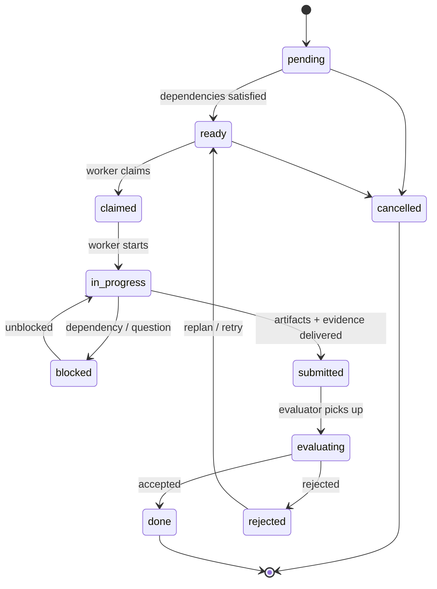

# Task

A Task is the atomic unit of schedulable work: produced by a Planner, executed
by a Worker, judged by an Evaluator ([glossary](../../reference/glossary.md)).

## Definition

A Task is a **work contract**, not a chat message or a ticket in the informal
sense. Its `spec` is the work order — a self-contained statement of intent, the
provenance that justifies it, the context a Worker needs, the completion
contract by which it will be judged, and its execution constraints. Its
`status` is the live work state, written only by the managing implementation
([PP-0006 §5.7](../../pp/PP-0006-task-graph.md#57-mutability)).

A Task is *not* the plan itself, either — the plan of a Product is simply the
set of its Tasks and their `dependsOn` edges, the
[Task Graph](../../pp/PP-0006-task-graph.md#4-the-task-graph). There is no
separate plan or graph object to drift out of sync. Nor is a Task negotiable:
once claimed, its `spec` is fixed; changing the work means releasing or
rejecting it first ([PP-0006 §5.7](../../pp/PP-0006-task-graph.md#57-mutability)).

## Responsibilities

- Carry a single, self-contained statement of intent a Worker can act on
  without renegotiation.
- Trace to exactly one governed or triaged source — a Story, Feature, or Issue
  — via `spec.tracesTo` ([PP-0006 §5.4](../../pp/PP-0006-task-graph.md#54-traceability)).
- Declare its completion contract (criteria, required evaluations, expected
  artifact types) *before* becoming claimable
  ([PP-0006 §5.5](../../pp/PP-0006-task-graph.md#55-completion-contract)).
- Record the execution trail: attempts, worker, timestamps, blockers.

## Lifecycle

Task state lives in `status.state` and follows the canonical work-object state
machine ([object model §4](../../reference/object-model.md#4-lifecycles),
normative definition [PP-0006 §5.3](../../pp/PP-0006-task-graph.md#53-lifecycle)).
States cannot be skipped, and transitions not shown are rejected. A `done`
Task is immutable; `done` and `cancelled` are the only terminal states.



Readiness requires both satisfied dependencies (every `dependsOn` target is
`done`) and a present completion contract. The `rejected → ready` transition
happens only as a bounded retry or after a Planner replan — a rejected Task is
never silently abandoned
([PP-0006 §8.2](../../pp/PP-0006-task-graph.md#82-on-rejection)).

## Inputs / Outputs

| Direction | What | Who / where |
| --- | --- | --- |
| In | Emitted from an approved Story/Feature or triaged Issue | [Planner](./planner.md), [PP-0006 §2](../../pp/PP-0006-task-graph.md#2-planning-model) |
| In | Context refs (Knowledge, Specification slices, Constitution articles) | `spec.context`, assembled at claim time ([PP-0007 §4](../../pp/PP-0007-worker-protocol.md#4-execution-context)) |
| Out | Artifacts referencing the Task via `producedBy` | [Worker](./worker.md), [PP-0007 §6](../../pp/PP-0007-worker-protocol.md#6-the-artifact-kind) |
| Out | Evaluations judging the submission | [Evaluator](./evaluator.md), [PP-0008](../../pp/PP-0008-evaluation.md) |
| Out | State history in `status` | the managing runtime |

## Relationships

- `spec.tracesTo` → exactly one [Story](./story.md), Feature, or
  [Issue](./issue.md) — the Task's justification.
- `spec.dependsOn` → prerequisite Tasks; these edges form the Task Graph.
- Claimed by one [Worker](./worker.md) at a time via the
  [claim protocol](../../pp/PP-0007-worker-protocol.md#3-the-claim-protocol).
- Produces [Artifacts](./artifact.md); judged by [Evaluations](./evaluation.md);
  acceptance may be gated by a [QualityGate](./quality-gate.md).
- Constrained by the [Constitution](./constitution.md), whose in-scope articles
  travel in `spec.context.constitutionArticles`.

## Example

```yaml
pp: "0.1"
kind: Task
metadata:
  id: task-guest-checkout-api
  name: Implement guest checkout API
  version: 1.0.0
  createdAt: 2026-07-03T09:00:00Z
spec:
  intent: >
    Implement the POST /checkout/guest endpoint: create an order from
    an anonymous cart, validate payment intent, return confirmation.
  tracesTo: { ref: { kind: Story, id: story-guest-checkout, version: 1.0.0 } }
  dependsOn:
    - { ref: { kind: Task, id: task-cart-model } }
  priority: high
  capabilities:
    - code.typescript
    - api.rest
  completion:
    criteria:
      - id: ac-1
        statement: A guest with a non-empty cart can complete checkout
          without creating an account.
    evaluations:
      - { ref: { kind: GoldenTest, id: golden-guest-checkout } }
    artifacts:
      - changeset
      - report
  constraints:
    effortBudget: PT4H
    maxAttempts: 3
status:
  state: ready
  attempts: 0
```

## Where it's defined

- Specification: [PP-0006 §5 — The Task Kind](../../pp/PP-0006-task-graph.md#5-the-task-kind)
  (state machine also in the [object model §4](../../reference/object-model.md#4-lifecycles))
- Schema: [`schemas/task/task.schema.json`](../../schemas/task/task.schema.json)
- Glossary: [Task](../../reference/glossary.md)
