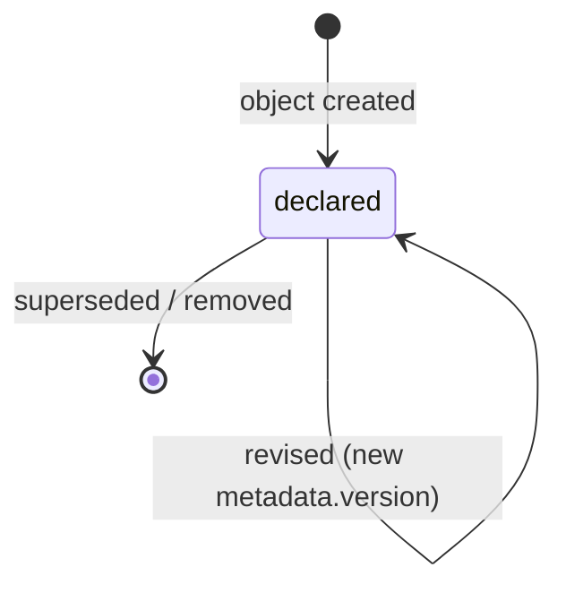

# Worker

A Worker is an actor (agent or human) that claims and executes Tasks under the
worker contract ([glossary](../../reference/glossary.md)).

## Definition

A Worker is an **actor declaration**: the capabilities, constraints, context
contract, and self-check hooks of a participant that executes Tasks. Like all
actor kinds ([object model §6](../../reference/object-model.md#6-actors-vs-records)),
a Worker object describes *who may do what* and holds no work state — live
state lives on the Tasks it claims (`status.worker`,
[PP-0006 §5.6](../../pp/PP-0006-task-graph.md#56-field-reference)).

A Worker is the protocol's unit of substitution: any conformant executor — a
coding agent, a human engineer, a hybrid pair — can pick up the same Task and
be held to the same contract. A Worker is *not* a judge of its own work: it
never authors the Evaluation of its own submission, never transitions its Task
to `done` or `rejected`, never transitions governed objects, and never invents
Tasks ([PP-0007 §5.2](../../pp/PP-0007-worker-protocol.md#52-boundaries)).

## Responsibilities

- Claim only Tasks it covers — every tag in the Task's `spec.capabilities`
  appears in its own ([PP-0006 §7](../../pp/PP-0006-task-graph.md#7-work-allocation)).
- Execute within the [Constitution](./constitution.md) and the Task's
  constraints ([PP-0007 §5](../../pp/PP-0007-worker-protocol.md#5-execution-obligations)).
- Produce only declared [Artifact](./artifact.md) types, and record every
  deliverable as an Artifact before submission.
- Surface blockers honestly: move the Task to `blocked` with a
  `status.blockedReason` rather than guess or exceed its authority.
- Submit with a self-assessment and evidence pointers
  ([PP-0007 §7](../../pp/PP-0007-worker-protocol.md#7-submission-and-completion)).
- Renew or release its claim leases
  ([PP-0007 §3.3](../../pp/PP-0007-worker-protocol.md#33-leases)).

## Lifecycle

Worker is not a governed object and has no work-state machine; the declaration
follows ordinary object versioning
([PP-0002 §6.1](../../pp/PP-0002-core-concepts.md#61-object-versioning)).
Removing or superseding a Worker declaration does not touch in-flight Tasks —
their leases simply expire ([PP-0007 §2](../../pp/PP-0007-worker-protocol.md#2-the-worker-kind)).



The interesting machine is the **claim protocol**
([PP-0007 §3](../../pp/PP-0007-worker-protocol.md#3-the-claim-protocol)): a
claim moves a Task `ready → claimed` atomically — one winner among concurrent
claimants, at most one claiming Worker per Task. Every claim carries a finite
lease; if it expires without renewal, the runtime returns the Task to `ready`
and clears `status.worker`, with the consumed attempt preserved. A Worker may
also release a claim it cannot complete, with the same effect.

## Inputs / Outputs

| Direction | What | Source / consumer |
| --- | --- | --- |
| In | Ready [Tasks](./task.md), via atomic claims | [PP-0007 §3](../../pp/PP-0007-worker-protocol.md#3-the-claim-protocol) |
| In | Execution context: task, spec at exact approved versions, constitution articles, knowledge, prior attempts | assembled by the runtime ([PP-0007 §4](../../pp/PP-0007-worker-protocol.md#4-execution-context)) |
| Out | [Artifacts](./artifact.md) and submissions with self-assessment | judged by an [Evaluator](./evaluator.md) |
| Out | Blocked-state reasons, lease renewals and releases | the runtime and [Planner](./planner.md) |

## Relationships

- Claims [Tasks](./task.md) it covers by capability matching.
- Produces [Artifacts](./artifact.md) — the only currency of submission.
- Constrained by the [Constitution](./constitution.md)
  (`spec.constraints.constitutionBound` cannot be `false` for production work).
- Its submissions are judged by an [Evaluator](./evaluator.md) via
  [Evaluations](./evaluation.md); the independence rule forbids evaluating
  its own output ([PP-0008 §5.2](../../pp/PP-0008-evaluation.md#52-independence)).
- May pre-check its work against a [GoldenTest](./golden-test.md) or
  [QualityGate](./quality-gate.md) through evaluation hooks
  ([PP-0007 §8](../../pp/PP-0007-worker-protocol.md#8-evaluation-hooks)).

## Example

```yaml
pp: "0.1"
kind: Worker
metadata:
  id: worker-ts-agent
  name: TypeScript Coding Agent
  version: 1.0.0
  owners:
    - { type: team, id: platform, name: Platform Team }
spec:
  description: >
    Autonomous coding agent for TypeScript services: implements API
    endpoints, data models, and unit tests from approved Stories.
  type: agent
  capabilities:
    - code.typescript
    - api.rest
    - test.unit
  constraints:
    allowedArtifactTypes:
      - changeset
      - report
    maxConcurrentTasks: 1
    constitutionBound: true
  contextContract:
    requires:
      - task
      - specification
      - constitution
      - prior_attempts
    maxContextItems: 40
  evaluationHooks:
    - name: lint-and-typecheck
      description: ESLint and tsc --noEmit over the changeset.
      mode: blocking
```

## Where it's defined

- Specification: [PP-0007 §2 — The Worker Kind](../../pp/PP-0007-worker-protocol.md#2-the-worker-kind)
  and [§3 — The Claim Protocol](../../pp/PP-0007-worker-protocol.md#3-the-claim-protocol)
- Schema: [`schemas/worker/worker.schema.json`](../../schemas/worker/worker.schema.json)
- Glossary: [Worker](../../reference/glossary.md)
