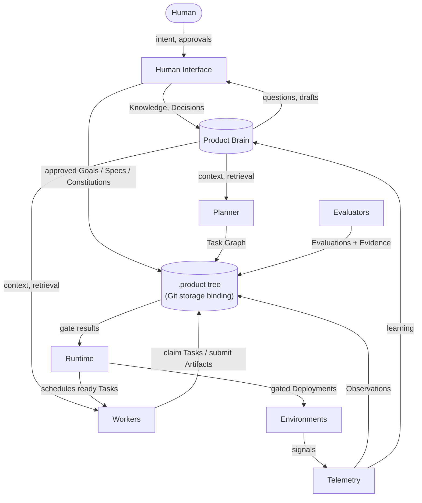
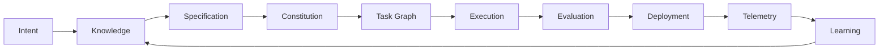
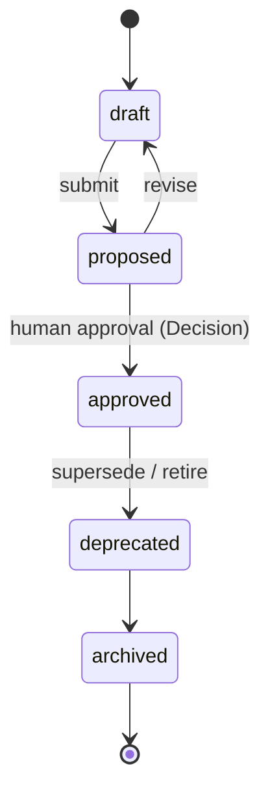
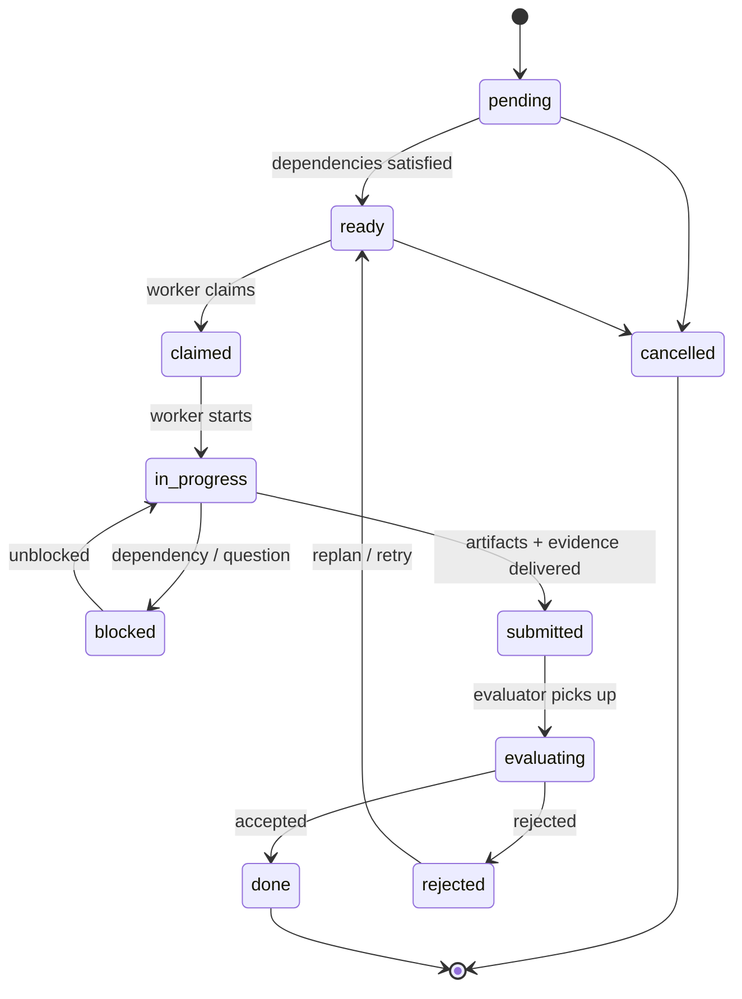
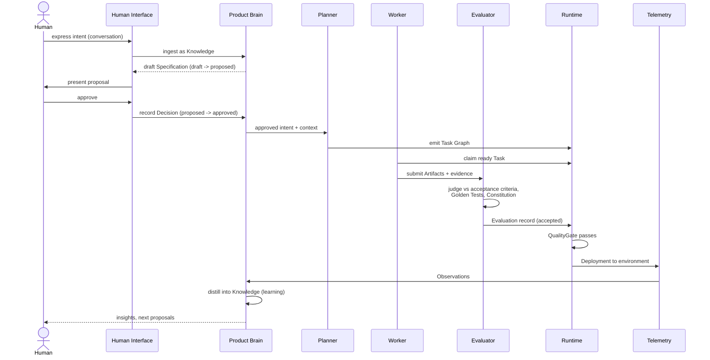

# Diagram Gallery

Rendered views of the core Product Protocol diagrams. GitHub renders
the Mermaid blocks below natively. The editable sources — Mermaid
`.mmd` files and simplified draw.io `.drawio` equivalents — live in
[`diagrams/`](../../diagrams/); see
[`diagrams/README.md`](../../diagrams/README.md) for rendering
instructions.

## Architecture

The actors and stores of a conformant system and the data that flows
between them. Humans express intent and grant approvals through a
Human Interface; the Product Brain holds structured knowledge and
supplies context; the Planner emits the Task Graph; Workers claim
Tasks and submit Artifacts; Evaluators record Evaluations with
Evidence; the Runtime deploys only what the quality gates admit; and
Telemetry feeds Observations back into the Brain. Everything durable
lives in the `.product` tree, the Git storage binding of
[PP-0002 §7](../../pp/PP-0002-core-concepts.md). Source:
[`diagrams/architecture.mmd`](../../diagrams/architecture.mmd).

## The Lifecycle Loop

The full autonomous engineering loop from
[PP-0001 §1](../../pp/PP-0001-vision.md): intent is distilled into
knowledge, knowledge into approved specifications governed by the
constitution, specifications into a task graph, tasks into executed
and evaluated work, accepted work into deployments, deployments into
telemetry, and telemetry into learning that re-enters the knowledge
base — a loop with no terminal state. Source:
[`diagrams/lifecycle.mmd`](../../diagrams/lifecycle.mmd).

## State Machines

### Governed objects

The lifecycle of `Goal`, `Capability`, `Specification`,
`Constitution`, `Feature`, `Story`, and `GoldenTest`
([PP-0002 §6.2](../../pp/PP-0002-core-concepts.md)). The
`proposed → approved` transition is the protocol's root privilege
boundary: it must be authorized by a human and recorded as a Decision,
and an approved version is immutable — changes re-enter the lifecycle
as a new version in `draft`. Source:
[`diagrams/state-machines-governed.mmd`](../../diagrams/state-machines-governed.mmd).

### Task

The work lifecycle of a `Task` (PP-0006 §5, summarized in the
[object model](../../reference/object-model.md)). Tasks become `ready`
when dependencies are satisfied, are claimed and executed by a Worker,
and are only `done` once an Evaluator accepts the submitted artifacts
and evidence; rejection routes the task back to `ready` for replanning
or retry. Source:
[`diagrams/state-machines-task.mmd`](../../diagrams/state-machines-task.mmd).

## One Loop Turn (sequence)

A single turn of the loop as an interaction: a human expresses intent,
the Brain ingests it and drafts a specification, the human approves it
(recorded as a Decision), the Planner decomposes it into tasks, a
Worker claims and executes one, an Evaluator judges the artifacts and
records an Evaluation with evidence, the Runtime deploys once the
quality gate passes, and telemetry-derived Observations flow back into
the Brain as new Knowledge. Source:
[`diagrams/sequence-loop.mmd`](../../diagrams/sequence-loop.mmd).

