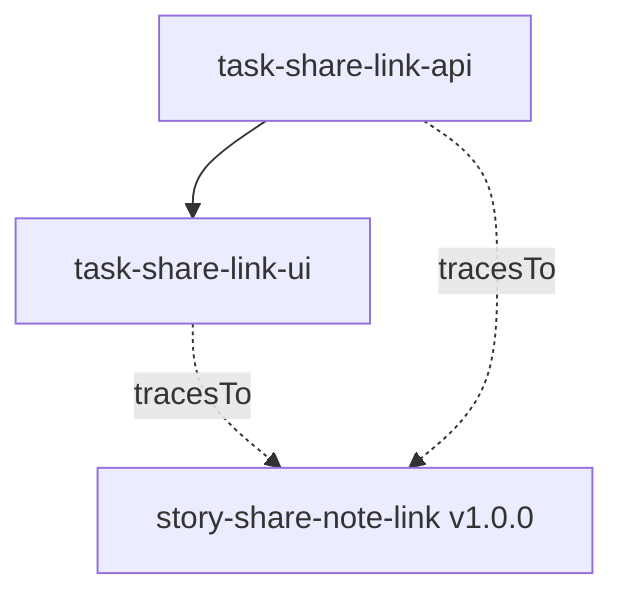

# Tutorial 4 — One turn of the loop, by hand

*(Informative. Normative sources:
[PP-0006](../../pp/PP-0006-task-graph.md) for Tasks and planning;
[PP-0007](../../pp/PP-0007-worker-protocol.md) for claims, execution,
and Artifacts; [PP-0008](../../pp/PP-0008-evaluation.md) for
Evaluations and gates; [PP-0010](../../pp/PP-0010-runtime.md) for the
loop a runtime drives.)*

You now play every role yourself — planner, worker, evaluator — and
take the approved Story from tutorial 2 through one full turn:
plan → claim → execute → submit → evaluate → gate → deploy → observe →
learn. Every step is just writing YAML into `.product/`. Keep that in
mind throughout: **this walkthrough is exactly what a PP/Runtime
implementation automates**. The runtime schedules, enforces, and
records; it adds no object kind you will not touch here by hand.

## 1. The cast

Actors are declared, not implied. Two declarations — a Worker at
`.product/workers/worker-alex.yaml` and an Evaluator at
`.product/evaluation/evaluators/eval-jordan.yaml` (one object per
file; shown together here):

```yaml
pp: "0.1"
kind: Worker
metadata:
  id: worker-alex
  name: Alex (human worker)
  version: 1.0.0
  createdAt: "2026-07-14T09:00:00Z"
spec:
  description: >
    Human engineer executing tasks by hand for this walkthrough:
    TypeScript service and React UI work.
  type: human
  capabilities:
    - code.typescript
    - ui.react
  constraints:
    maxConcurrentTasks: 1
    constitutionBound: true
---
pp: "0.1"
kind: Evaluator
metadata:
  id: eval-jordan
  name: Jordan (human evaluator)
  version: 1.0.0
  createdAt: "2026-07-14T09:05:00Z"
spec:
  description: >
    Human reviewer judging submitted work against story acceptance
    criteria. Never evaluates work they authored.
  type: human
  categories:
    - acceptance
    - regression
```

Worker and Evaluator are different people for a reason: no actor may
evaluate its own work (PP-0008 §5.2). Alone, you can still *write*
both sides — the protocol invariant a runtime would enforce is that
the producing and judging identities differ.

## 2. Plan: Stories become Tasks

Playing planner, decompose `story-share-note-link` (approved, so it is
a valid source — planning from drafts is forbidden, PP-0006 §2.1) into
two Tasks. `.product/tasks/task-share-link-api.yaml`:

```yaml
pp: "0.1"
kind: Task
metadata:
  id: task-share-link-api
  name: Implement share-link API and model
  version: 1.0.0
  createdAt: "2026-07-14T09:10:00Z"
spec:
  intent: >
    Implement share-link creation and revocation: a share_links
    record tied to a note, POST /notes/{id}/share and DELETE
    /notes/{id}/share endpoints enforcing ownership (BR-SHARE-1),
    and read-only note retrieval by link token (BR-SHARE-2).
  tracesTo: { ref: { kind: Story, id: story-share-note-link, version: "1.0.0" } }
  priority: high
  capabilities:
    - code.typescript
  context:
    specifications:
      - ref: { kind: Specification, id: spec-note-sharing, version: "1.0.0" }
      - ref: { kind: Story, id: story-share-note-link, version: "1.0.0" }
    constitutionArticles:
      - SEC-1
      - ARCH-1
      - CODE-1
    notes: >
      Token entropy constraint is in the specification's constraints;
      use the existing crypto helper, not a new dependency.
  completion:
    criteria:
      - id: c-1
        statement: >
          A teammate opening a valid share link receives the note
          title and content, read-only (story ac-1, ac-2).
      - id: c-2
        statement: >
          Only the owner can create or revoke links; others get 403
          (BR-SHARE-1).
    evaluations:
      - ref: { kind: QualityGate, id: gate-secret-scan }
    artifacts:
      - changeset
      - report
  constraints:
    effortBudget: PT4H
    maxAttempts: 2
status:
  state: pending
```

and `.product/tasks/task-share-link-ui.yaml`, which depends on it:

```yaml
pp: "0.1"
kind: Task
metadata:
  id: task-share-link-ui
  name: Build the share dialog and shared-note view
  version: 1.0.0
  createdAt: "2026-07-14T09:12:00Z"
spec:
  intent: >
    Build the share dialog (create, copy, revoke a link) and the
    read-only shared-note view against the share-link API, matching
    the approved prototype's flow.
  tracesTo: { ref: { kind: Story, id: story-share-note-link, version: "1.0.0" } }
  dependsOn:
    - ref: { kind: Task, id: task-share-link-api }
  priority: high
  capabilities:
    - ui.react
  context:
    specifications:
      - ref: { kind: Specification, id: spec-note-sharing, version: "1.0.0" }
    constitutionArticles:
      - A11Y-1
      - ARCH-1
  completion:
    criteria:
      - id: c-1
        statement: >
          The dialog needs one action to create a link and one to
          copy it (story ac-3).
    evaluations:
      - ref: { kind: GoldenTest, id: golden-keyboard-only }
      - ref: { kind: QualityGate, id: gate-secret-scan }
    artifacts:
      - changeset
      - report
status:
  state: pending
```

The Task Graph *is* these files — there is no separate graph object
(PP-0006 §4). `dependsOn` edges point at prerequisites:



Both tasks carry a completion contract before they may become
`ready` — a Task that cannot be judged must never reach a worker
(PP-0006 §5.5). The API task has no dependencies, so it moves
`pending → ready` immediately; the UI task waits.

## 3. Claim and execute

Playing worker, claim the ready task. A claim is atomic and exclusive
— one winner, one owning worker, a finite lease (PP-0007 §3); by hand,
"atomic" means you record it in `status` and commit. The task's
`status` evolves through the canonical state machine (PP-0006 §5.3),
never skipping states:

```yaml
status:                                  # ready → claimed
  state: claimed
  worker: { ref: { kind: Worker, id: worker-alex } }
  claimedAt: "2026-07-14T10:00:00Z"
  attempts: 1
```

then `state: in_progress` as work starts. While claimed, the Task's
`spec` is frozen — the contract cannot change under the worker. Write
the code on a branch, honoring the constitution articles in
`spec.context` (SEC-1: no secrets; ARCH-1: through the API layer). If
you hit something you cannot resolve, the honest move is
`state: blocked` with a `blockedReason`, never guessing.

## 4. Record the Artifact

Work not captured in an Artifact does not exist for evaluation
(PP-0007 §5.3). An Artifact is content-addressed: compute the digest
over the payload bytes —

```bash
git diff main..share-link-api > /tmp/share-link-api.patch
shasum -a 256 /tmp/share-link-api.patch     # or: git hash-object (sha1)
```

— and record it at
`.product/tasks/artifacts/art-share-link-api-changeset.yaml`:

```yaml
pp: "0.1"
kind: Artifact
metadata:
  id: art-share-link-api-changeset
  name: Share-link API changeset
  version: 1.0.0
  createdAt: "2026-07-14T14:30:00Z"
spec:
  type: changeset
  digest: sha256:44342d581e636777756ba9b30a7e7b4f053c4f0e699ada85b0a141c6fc2bd669
  uri: https://git.example.com/notely/notely/commit/4f09b7c2a1e8d3f6905c8b12aa74e0d19c3b5a77
  path: src/server/share
  summary: >
    Adds the share_links model, POST and DELETE share endpoints with
    ownership checks, and token-based read-only note retrieval, with
    unit tests. No changes outside src/server.
  producedBy: { ref: { kind: Task, id: task-share-link-api } }
  producedAt: "2026-07-14T14:30:00Z"
  mediaType: text/x-diff
```

Artifacts are append-only records: never edited, superseded by newer
Artifacts if wrong. Write your self-assessment — how the work meets
`c-1` and `c-2` — as a second Artifact of type `report`
(`art-share-link-api-selfassessment`), then submit: at least one
Artifact plus the self-assessment, and the task moves on
(`state: submitted`, `submittedAt: "2026-07-14T14:35:00Z"`).

## 5. Evaluate, check the gate, accept

Now switch hats. The evaluator judges the submission against the
completion contract and records the judgment — with evidence, because
an Evaluation without evidence is an opinion (PP-0008 §8). The task is
now `evaluating`. Record
`.product/evaluation/runs/ev-2026-07-14-share-api-acceptance.yaml`:

```yaml
pp: "0.1"
kind: Evaluation
metadata:
  id: ev-2026-07-14-share-api-acceptance
  name: Acceptance — share-link API against story criteria
  version: 1.0.0
  createdAt: "2026-07-14T16:00:00Z"
spec:
  subject:
    ref: { kind: Task, id: task-share-link-api, version: "1.0.0" }
  category: acceptance
  criteria:
    - source:
        ref: { kind: Story, id: story-share-note-link, version: "1.0.0" }
      description: >
        ac-1: a teammate opening a share link sees the note read-only
        with title and content, no edit controls.
    - source:
        ref: { kind: Story, id: story-share-note-link, version: "1.0.0" }
      description: >
        ac-2: a revoked link denies access within 60 seconds.
    - description: >
        c-2: non-owners receive 403 on create and revoke (BR-SHARE-1).
  verdict: pass
  score: 1.0
  evidence:
    - type: test_report
      description: Unit and API test run, 34 passing.
      path: evaluation/runs/evidence/ev-2026-07-14-share-api-acceptance/report.json
      digest: sha256:fd0d3416a2d4d2d2600ac58870b5771cedc9b8a5c3b83a50e9f6619a84cda1c9
    - type: log
      description: Manual revocation timing check, 41 seconds observed.
      path: evaluation/runs/evidence/ev-2026-07-14-share-api-acceptance/revoke-timing.log
  evaluator:
    ref: { kind: Evaluator, id: eval-jordan }
  evaluatedAt: "2026-07-14T16:00:00Z"
```

The completion contract also names `gate-secret-scan`, whose
requirement selects a *current* `security`-category Evaluation of this
work. The auditor from tutorial 3 supplies it
(`.product/evaluation/runs/ev-2026-07-14-share-api-secrets.yaml`):

```yaml
pp: "0.1"
kind: Evaluation
metadata:
  id: ev-2026-07-14-share-api-secrets
  name: Security — secret scan of the share-link changeset
  version: 1.0.0
  createdAt: "2026-07-14T15:45:00Z"
spec:
  subject:
    ref: { kind: Artifact, id: art-share-link-api-changeset, version: "1.0.0" }
  category: security
  criteria:
    - source:
        ref: { kind: QualityGate, id: gate-secret-scan, version: "1.0.0" }
      description: >
        No secrets, keys, or credentials in the changeset (SEC-1).
  verdict: pass
  evidence:
    - type: log
      description: Secret scanner output over the changeset, 0 findings.
      path: evaluation/runs/evidence/ev-2026-07-14-share-api-secrets/scan.log
      digest: sha256:9b739184f6f498f94b3063f7423fb519c36c80d3688fdf1ce8ae840e7ab9e3e0
  evaluator:
    ref: { kind: Evaluator, id: eval-notely-auditor }
  evaluatedAt: "2026-07-14T15:45:00Z"
```

Gate check (PP-0008 §9.2): every requirement of every blocking gate
with trigger `task_acceptance` needs a passing, current Evaluation —
`error` or `inconclusive` verdicts never satisfy anything. Both
records pass, so the task is accepted:

```yaml
status:                                  # evaluating → done
  state: done
  worker: { ref: { kind: Worker, id: worker-alex } }
  attempts: 1
  claimedAt: "2026-07-14T10:00:00Z"
  submittedAt: "2026-07-14T14:35:00Z"
  completedAt: "2026-07-14T16:05:00Z"
```

A `done` task is immutable, and its acceptance is only as good as the
records behind it — which is why they are all files you can point at.
With the API task `done`, `task-share-link-ui` becomes `ready`; repeat
the cycle (its golden-test hook catches a missing focus trap before
submission — remember that for step 8), producing
`art-share-link-ui-changeset`.

## 6. Deploy

A Deployment records the act of releasing Artifacts into a declared
environment — `staging`, declared in `product.yaml` back in tutorial 1.
Write `.product/deployments/deploy-2026-07-15-staging-001.yaml`:

```yaml
pp: "0.1"
kind: Deployment
metadata:
  id: deploy-2026-07-15-staging-001
  name: Staging release — note sharing
  version: 1.0.0
  createdAt: "2026-07-15T10:00:00Z"
spec:
  environment: staging
  artifacts:
    - ref: { kind: Artifact, id: art-share-link-api-changeset }
    - ref: { kind: Artifact, id: art-share-link-ui-changeset }
  strategy: recreate
  requestedBy: { type: human, id: alex@notely.dev, name: Alex Rivera }
  requestedAt: "2026-07-15T10:00:00Z"
status:
  state: active
  evaluations:
    - ref: { kind: Evaluation, id: ev-2026-07-14-share-api-secrets }
  startedAt: "2026-07-15T10:02:00Z"
  completedAt: "2026-07-15T10:06:00Z"
```

The `spec` is written once and never changes; only `status` walks its
state machine (`requested → validating → deploying → active`,
PP-0010 §6). Promotion to the `production` environment would
additionally require every blocking gate with trigger
`deployment_promotion` and every constitution article with
`evaluatedOn: deployment` — SEC-1 and PERF-1 — to pass first.

## 7. Observe

The running system reports back as append-only Observations
(`.product/observations/obs-2026-07-16-share-usage.yaml`):

```yaml
pp: "0.1"
kind: Observation
metadata:
  id: obs-2026-07-16-share-usage
  name: Pilot teams share notes right after meetings
  version: 1.0.0
  createdAt: "2026-07-16T17:00:00Z"
spec:
  source: analytics
  statement: >
    In the first day on staging, 14 of 17 share links were created
    within 30 minutes of the note's last edit — consistent with the
    post-meeting sharing hypothesis. Shared-note p95 open time was
    360 ms, inside the 500 ms budget.
  measurement:
    metric: p95_shared_note_open
    value: 360
    unit: ms
  observedAt: "2026-07-16T16:30:00Z"
  environment: staging
  relatesTo:
    - ref: { kind: Deployment, id: deploy-2026-07-15-staging-001 }
    - ref: { kind: Goal, id: goal-team-adoption }
  severity: info
```

This is also the evidence that could promote `know-meeting-capture`
from `hypothesis` up the confidence ladder.

## 8. Learn — close the loop

The turn ends where it began: in the Brain. Distill what the turn
taught into a lesson
(`.product/brain/knowledge/know-lesson-a11y-early.yaml`):

```yaml
pp: "0.1"
kind: Knowledge
metadata:
  id: know-lesson-a11y-early
  name: Wire golden tests into completion contracts early
  version: 1.0.0
  createdAt: "2026-07-16T17:30:00Z"
spec:
  category: lesson
  statement: >
    Putting the keyboard-only golden test into the UI task's
    completion contract caught a missing focus trap in the share
    dialog before evaluation, at the cost of one local run — cheaper
    than a rejection round trip.
  detail: >
    The first local run of golden-keyboard-only failed on the dialog
    focus trap; fixed before submission, so the task passed
    evaluation on its first attempt.
  confidence: observed
  provenance:
    - type: evaluation
      ref: { ref: { kind: Evaluation, id: ev-2026-07-14-share-api-acceptance } }
      description: First-attempt acceptance of the share-link work.
  links:
    - rel: relates_to
      target: { ref: { kind: Story, id: story-share-note-link } }
    - rel: derived_from
      target: { ref: { kind: GoldenTest, id: golden-keyboard-only } }
```

The next planning pass reads this before decomposing the next Story.
That is the whole loop.

## The final tree

```
.product/
├── product.yaml
├── brain/
│   ├── brain.yaml
│   ├── decisions/          # one per approval: goal, capability, feature,
│   │                       # 2 stories, specification, golden test, constitution
│   └── knowledge/
│       ├── know-meeting-capture.yaml
│       └── know-lesson-a11y-early.yaml
├── constitution/
│   └── notely-constitution.yaml
├── specification/
│   ├── goal-team-adoption.yaml
│   ├── cap-collaboration.yaml
│   ├── feat-note-sharing.yaml
│   ├── story-share-note-link.yaml
│   ├── story-restrict-share.yaml
│   └── spec-note-sharing.yaml
├── tasks/
│   ├── task-share-link-api.yaml
│   ├── task-share-link-ui.yaml
│   └── artifacts/
│       ├── art-share-link-api-changeset.yaml
│       ├── art-share-link-api-selfassessment.yaml
│       └── art-share-link-ui-changeset.yaml
├── workers/
│   └── worker-alex.yaml
├── evaluation/
│   ├── evaluators/         # eval-jordan, eval-notely-auditor
│   ├── golden/             # golden-keyboard-only
│   ├── gates/              # gate-secret-scan
│   └── runs/               # 3 evaluation records + evidence/
├── deployments/
│   └── deploy-2026-07-15-staging-001.yaml
├── observations/
│   └── obs-2026-07-16-share-usage.yaml
└── issues/
    └── issue-arch-1-note-list.yaml
```

Everything you did manually — readiness computation, atomic claims and
leases, freezing specs under claims, scheduling an independent
evaluator, checking gates, recording deployment state, distilling
observations on a cadence — is precisely the contract a **PP/Runtime**
implementation automates ([PP-0010](../../pp/PP-0010-runtime.md)).
What it may never automate is the part you also played: the human
approvals behind every governed object in this tree. Compare your
result with the complete products under
[`examples/`](../../examples), and read the specifications in
[`pp/`](../../pp/README.md) for every rule this walkthrough leaned on.
