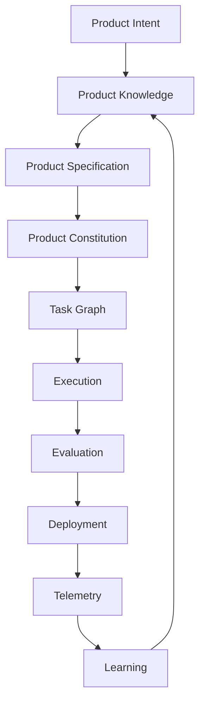

# PP-0001: Vision and Scope

| Field | Value |
| --- | --- |
| **PP** | 0001 |
| **Title** | Vision and Scope |
| **Status** | Draft |
| **Authors** | Product Protocol Contributors |
| **Created** | 2026-07-03 |
| **Updated** | 2026-07-03 |
| **Version** | 0.1.0 |
| **Requires** | — |

## Abstract

Product Protocol (PP) is an open, vendor-neutral standard describing how
autonomous AI engineering systems represent, manage, and execute software
products. It defines the objects, contracts, and lifecycle through which
product intent becomes running, observed, continuously improving software.
This document states the vision, the scope boundary, and the criteria by
which the standard judges itself. It is almost entirely **informative**;
its only normative content is the scope boundary in §5.

## Motivation *(Informative)*

Autonomous engineering systems are being built today on ad-hoc, private
conventions: each vendor invents its own way to describe a product to its
agents, its own task format, its own notion of "done," its own memory. The
consequences are familiar from every pre-standard era:

- **Lock-in.** A product managed by one system cannot be handed to
  another. The product's own definition — its requirements, rules,
  history, and knowledge — is trapped in a vendor's format.
- **No composability.** A planner from one vendor cannot feed workers from
  another; an independent evaluator cannot judge either.
- **No auditability.** When agents decide and act in proprietary
  black-boxes, humans cannot trace why the software is the way it is.
- **Reinvention.** Every team rebuilds specification formats, task
  lifecycles, evaluation harnesses, and knowledge stores from scratch.

HTTP did not build the web's applications; it made them interoperable.
OpenAPI did not implement APIs; it made them describable. Product Protocol
aims to be that layer for autonomous software engineering: the contract
between *product design* and *autonomous execution*.

## Terminology

Defined terms are used per the [glossary](../reference/glossary.md).

The key words **MUST**, **MUST NOT**, **REQUIRED**, **SHALL**, **SHALL
NOT**, **SHOULD**, **SHOULD NOT**, **RECOMMENDED**, **NOT RECOMMENDED**,
**MAY**, and **OPTIONAL** in this document are to be interpreted as
described in BCP 14 [RFC 2119] [RFC 8174] when, and only when, they appear
in all capitals, as shown here.

## Specification

### §1 The Vision *(Informative)*

Product Protocol defines how to transform product intent into a continuous
autonomous engineering loop:



A human expresses intent conversationally. The system distills it into
structured Knowledge in the Product Brain, from which Specifications are
drafted and approved. The Constitution states the rules that always hold.
A Planner decomposes approved intent into a Task Graph; Workers execute
Tasks and produce Artifacts; Evaluators judge them against acceptance
criteria, Golden Tests, and the Constitution, producing Evidence.
Accepted work is Deployed; the running Product emits Observations;
Observations become Knowledge; and the loop continues — with humans
governing Goals, Specifications, Constitutions, and architectural
Decisions, and agents doing everything else.

### §2 What the Protocol Is *(Informative)*

- A **data model**: a small set of versioned, YAML-serialized object kinds
  with defined lifecycles and relationships (PP-0002).
- A set of **contracts** between roles: Planner ↔ Worker ↔ Evaluator ↔
  Runtime (PP-0006, PP-0007, PP-0008, PP-0010).
- A **knowledge discipline**: how a product's memory is structured,
  validated, versioned, and linked (PP-0003, PP-0009).
- A **governance boundary**: which state changes require human authority
  and how approvals are recorded (PP-0005, PP-0010 §7).
- A **conformance framework**: named classes an implementation can claim
  and be tested against ([terminology §4](../reference/terminology.md)).

### §3 What the Protocol Is Not *(Informative)*

- Not an agent framework, orchestrator, or model. It does not specify how
  a Worker thinks — only what it consumes, produces, and promises.
- Not a project-management methodology. Kinds like Feature and Story are
  interoperability constructs, not a prescription of how teams talk.
- Not a hosting, CI, or deployment technology. PP records that a
  Deployment happened and what gated it, not how bits reached servers.
- Not documentation tooling. The Product Brain is structured knowledge
  with schemas and provenance, not a wiki format.

### §4 Design Tenets *(Informative)*

The twelve design principles in
[`reference/design-principles.md`](../reference/design-principles.md)
govern all PP documents. The load-bearing four:

1. **Implementation agnostic, vendor neutral** — interfaces, never
   implementations (P1, P2).
2. **AI-native, human-governed** — agents execute, humans hold approval
   authority over intent and rules (P3).
3. **Git-native, plain-text** — files, commits, and diffs are the
   canonical substrate (P4, P5).
4. **Traceable and evidence-based** — every object justifies its
   existence; every acceptance carries Evidence (P6, P7).

### §5 Scope Boundary

This section is **normative** for PP document authors:

- **[PP-0001-RQ-001]** PP documents MUST NOT require the use of any named
  vendor product, model, or service for conformance.
- **[PP-0001-RQ-002]** PP documents MUST specify observable contracts
  (inputs, outputs, state transitions, storage) and MUST NOT specify
  internal implementation strategy of actors.
- **[PP-0001-RQ-003]** PP documents MUST keep human approval authority
  over Goals, Specifications, Constitutions, and architectural Decisions;
  no PP document may define a fully human-free path to approving these.
- **[PP-0001-RQ-004]** PP documents MUST express all normative object
  formats in YAML/JSON with a published JSON Schema.

### §6 Success Criteria *(Informative)*

The standard succeeds when:

- Two independent implementations pass a shared conformance suite and can
  exchange a Product — Brain, Specifications, Constitution, Task Graph —
  without translation loss.
- A product team can switch execution vendors while keeping their
  product's definition, history, and knowledge intact.
- Auditors can reconstruct, from the repository alone, why any shipped
  behavior exists and who or what approved it.

## Normative Requirements

- **[PP-0001-RQ-001]** — see §5.
- **[PP-0001-RQ-002]** — see §5.
- **[PP-0001-RQ-003]** — see §5.
- **[PP-0001-RQ-004]** — see §5.

## Examples *(Informative)*

A minimal Product object — the root of everything the protocol manages:

```yaml
pp: "0.1"
kind: Product
metadata:
  id: aurora-books
  name: Aurora Books
  version: 1.0.0
spec:
  summary: Online bookstore with personalized recommendations.
  brain: { ref: { kind: ProductBrain, id: aurora-books-brain } }
  constitutions:
    - ref: { kind: Constitution, id: aurora-constitution }
  goals:
    - ref: { kind: Goal, id: goal-weekly-active-readers }
```

## Security Considerations

This document introduces no protocol mechanisms. It does establish the
governance invariant ([PP-0001-RQ-003]) that prevents autonomous systems
from self-approving changes to their own rules — the root security
property on which PP-0005 and PP-0010 build.

## Future Work *(Informative)*

- A published conformance test suite per class.
- Profiles for regulated industries (see PP-0005 Future Work).
- An interchange/migration guide between implementations.

## References

- [PP-0002 — Core Concepts and Object Model](./PP-0002-core-concepts.md)
- [Design Principles](../reference/design-principles.md)
- [Terminology and Conformance Language](../reference/terminology.md)
- *(Informative)* OpenAPI Specification, OCI Distribution Spec, Kubernetes
  Enhancement Proposals, Rust RFCs, Python PEPs — prior art in open
  specification practice.
