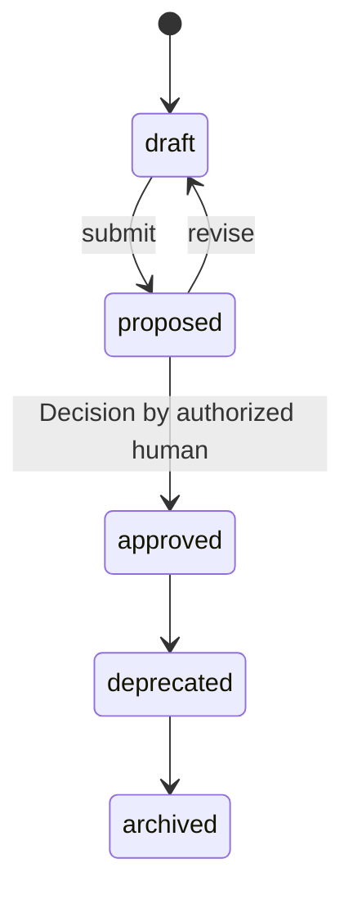

# PP-0002: Core Concepts and Object Model

| Field | Value |
| --- | --- |
| **PP** | 0002 |
| **Title** | Core Concepts and Object Model |
| **Status** | Draft |
| **Authors** | Product Protocol Contributors |
| **Created** | 2026-07-03 |
| **Updated** | 2026-07-03 |
| **Version** | 0.1.0 |
| **Requires** | PP-0001 |

## Abstract

This document defines the foundation every other Product Protocol
specification builds on: the object envelope, identity, references,
versioning and immutability rules, the governed-object lifecycle, the
Git storage binding, and the extension mechanism. It also defines the
root `Product` kind. Conformance to this document constitutes the
**PP/Core** conformance class, which all other classes require.

## Motivation *(Informative)*

Interoperability dies in the details: how objects are identified, how
they point at each other, what "version" means, and where files live on
disk. By fixing these mechanics once, every higher-level specification
(Brain, Specification, Task Graph, …) can be defined purely in terms of
its domain, and any two conformant tools can read each other's products.
The envelope deliberately echoes widely understood declarative-config
practice (a `kind`, a `metadata`, a `spec`, a `status`) so that the shape
is instantly familiar, while remaining independent of any orchestrator.

## Terminology

*Object*, *Kind*, *Governed Object*, *Product*, *Product Brain*,
*Decision* — per the [glossary](../reference/glossary.md).

The key words **MUST**, **MUST NOT**, **REQUIRED**, **SHALL**, **SHALL
NOT**, **SHOULD**, **SHOULD NOT**, **RECOMMENDED**, **NOT RECOMMENDED**,
**MAY**, and **OPTIONAL** in this document are to be interpreted as
described in BCP 14 [RFC 2119] [RFC 8174] when, and only when, they appear
in all capitals, as shown here.

## Specification

### §1 Documents and Encoding

A **PP object** is a single YAML 1.2 document. Files:

- MUST be encoded in UTF-8 without BOM.
- MUST contain exactly one object per file in the Git binding (§7).
- MUST parse to the JSON data model (no YAML-specific types beyond
  strings, numbers, booleans, null, sequences, mappings; timestamps are
  RFC 3339 **strings**, not YAML timestamps).
- MAY equivalently be serialized as JSON; YAML is the canonical
  authoring form.

### §2 Protocol Version

Every object declares the protocol version it conforms to in its
top-level `pp` field, as a string of the form `MAJOR.MINOR` (e.g.
`"0.1"`).

- Objects with the same MAJOR version are interoperable: a consumer of
  `pp: "1.2"` MUST accept `pp: "1.0"` objects.
- During MAJOR version `0`, MINOR versions MAY break compatibility
  (experimental period).
- A consumer encountering a higher MAJOR version than it supports MUST
  refuse to process the object rather than guess.

### §3 The Object Envelope

| Field | Type | Req | Description |
| --- | --- | --- | --- |
| `pp` | string | MUST | Protocol version, `"MAJOR.MINOR"`. |
| `kind` | string | MUST | Registered kind name in PascalCase (see [object model kind index](../reference/object-model.md#2-kind-index)), or an `x-`-prefixed extension kind. |
| `metadata` | object | MUST | Identity and lifecycle metadata (§3.1). |
| `spec` | object | MUST | The kind-specific body, defined by the kind's specification. Desired/declared state. |
| `status` | object | MAY | Implementation-managed observed state. Consumers MUST tolerate its absence; producers other than the managing implementation MUST NOT write it. |

Unknown top-level fields other than these five MUST be rejected.

#### §3.1 Metadata

| Field | Type | Req | Description |
| --- | --- | --- | --- |
| `metadata.id` | string | MUST | Object identifier, unique per (Product, kind). Pattern `[a-z0-9]([a-z0-9-]{0,126}[a-z0-9])?`. Stable across versions. |
| `metadata.name` | string | SHOULD | Human-readable display name. |
| `metadata.version` | string | MUST | Semantic Version 2.0.0 of this object (§6). |
| `metadata.labels` | map[string]string | MAY | Selection metadata. Keys ≤ 63 chars. |
| `metadata.annotations` | map[string]string | MAY | Non-identifying tooling metadata. |
| `metadata.createdAt` | string (RFC 3339) | SHOULD | Creation instant. |
| `metadata.updatedAt` | string (RFC 3339) | SHOULD | Last modification instant. |
| `metadata.owners` | list[Actor] | MAY | Accountable actors: `{type: human\|agent\|team, id, name?}`. |
| `metadata.lifecycle` | string | Conditional | Current lifecycle state. REQUIRED for governed objects (§6.2); enum per the kind's state machine. |

#### §3.2 Identity

The **fully qualified identity** of an object is the tuple
`(product, kind, id, version)`. Rendered as a URI:

```
pp://<product-id>/<kind>/<id>@<version>
pp://aurora-books/Task/task-4hz1@1.0.0
```

The `@<version>` suffix is OPTIONAL; when absent, the reference resolves
to the highest approved (or, if none, highest) version.

### §4 Values and Conventions

- Timestamps: RFC 3339 UTC strings (`2026-07-03T12:00:00Z`).
- Durations: ISO 8601 (`PT4H`).
- Field names: `camelCase`.
- Enumerated values: `snake_case` strings.
- Digests: `<algorithm>:<hex>`, e.g. `sha256:ab12…` (used by Artifacts).
- Markdown is permitted inside string fields designated *prose fields* by
  a kind's specification; consumers MUST treat prose fields as opaque
  text for validation purposes.

### §5 References

Objects point at other objects with a **Ref**:

| Field | Type | Req | Description |
| --- | --- | --- | --- |
| `ref.kind` | string | MUST | Target kind. |
| `ref.id` | string | MUST | Target `metadata.id`. |
| `ref.version` | string | MAY | Exact SemVer or SemVer range. Absent ⇒ resolution per §3.2. |
| `ref.product` | string | MAY | Target Product id, for the rare cross-product link. Absent ⇒ same Product. |

Rules:

- Producers MUST NOT emit dangling refs; validators MUST report a ref
  whose target does not exist in the Product as an error.
- Cross-product refs SHOULD be avoided and MUST NOT be required for any
  core workflow.

### §6 Versioning, Immutability, and the Governed Lifecycle

#### §6.1 Object versioning

`metadata.version` follows SemVer 2.0.0 with these semantics:

- **MAJOR** — a breaking change in meaning (e.g. a requirement removed or
  reversed).
- **MINOR** — backward-compatible addition.
- **PATCH** — editorial/clarifying change only.

#### §6.2 Governed objects

The kinds `Goal`, `Capability`, `Specification`, `Constitution`,
`Feature`, `Story`, and `GoldenTest` are **governed objects**. Their
`metadata.lifecycle` MUST be one of:

`draft → proposed → approved → deprecated → archived`



- The `proposed → approved` transition MUST be authorized by a human and
  MUST be recorded as a `Decision` referencing the object at its exact
  version.
- An `approved` object version is **immutable**: implementations MUST
  reject any change to its `spec` or a widening of its `metadata` other
  than lifecycle progression. To change an approved object, create the
  same `id` at a higher `version` in `draft`.
- Autonomous agents MUST NOT perform the `proposed → approved`
  transition, directly or indirectly (see PP-0010 §7).

#### §6.3 Records

`Evaluation`, `Observation`, `Decision`, and `Artifact` objects are
**append-only records**: once written they MUST NOT be modified or
deleted; corrections are new records that reference what they supersede.

### §7 Git Storage Binding

The canonical storage of a Product is a directory tree, normally the
root (or a subdirectory) of a Git repository:

```
.product/
├── product.yaml              # the Product object
├── brain/                    # ProductBrain (layout: PP-0003 §6)
│   ├── brain.yaml
│   ├── knowledge/
│   └── decisions/
├── specification/            # Goal, Capability, Specification, Feature, Story
├── constitution/             # Constitution objects
├── tasks/                    # Task objects (graph: PP-0006 §4)
├── workers/                  # Worker declarations
├── evaluation/
│   ├── golden/               # GoldenTest objects
│   ├── gates/                # QualityGate definitions (PP-0008 §9)
│   └── runs/                 # Evaluation records
├── deployments/              # Deployment records + environment declarations
├── observations/             # Observation records
└── issues/                   # Issue objects
```

Rules:

- The root directory MUST be named `.product` unless the Product object
  is discovered by other means; tools MUST locate a Product by searching
  for `.product/product.yaml` upward from the working directory.
- Each object is one file named `<id>.yaml`. Superseded versions of
  governed objects MAY be retained as `<id>@<version>.yaml`; Git history
  is the authoritative version archive regardless.
- File paths are a projection, not identity: consumers MUST derive
  identity from object content, never from filenames.
- Implementations MAY offer databases, APIs, or other backends, but MUST
  support lossless export to and import from this binding.
- Large binary Artifact payloads SHOULD be stored outside the tree and
  referenced by digest and URI (PP-0007 §6); the Artifact *record* stays
  in-tree.

### §8 Extensions

- **Fields:** any object MAY carry additional fields whose names begin
  with `x-` at any level of `spec`. Implementations MUST preserve `x-`
  fields they do not understand (read-modify-write safe) and MUST NOT
  assign them semantics that conflict with future core fields.
- **Kinds:** implementations MAY define kinds named `x-<vendor>-<Name>`.
  Core tooling MUST ignore (not reject) extension kinds it does not
  understand, except that validators SHOULD warn.
- **Labels/annotations:** vendor metadata SHOULD use reverse-DNS-style
  key prefixes, e.g. `example.com/build-id`.
- Extensions MUST NOT alter the semantics of core fields or lifecycles.

### §9 The Product Kind

`Product` is the root object anchoring identity and top-level wiring.

| Field | Type | Req | Description |
| --- | --- | --- | --- |
| `spec.summary` | string (prose) | MUST | One-paragraph description of the product. |
| `spec.brain` | Ref | MUST | The Product's ProductBrain. |
| `spec.constitutions` | list[Ref] | MUST | Active Constitutions (≥ 1 once past bootstrap). |
| `spec.goals` | list[Ref] | SHOULD | Top-level Goals. |
| `spec.environments` | list[Environment] | MAY | Deployment targets (PP-0010 §6.1). |
| `spec.repositories` | list[{name, uri, role}] | MAY | Source/artifact repositories associated with the product. |

A Product MUST contain exactly one `Product` object. Every other object
in the tree belongs to it implicitly.

## Normative Requirements

- **[PP-0002-RQ-001]** An object MUST be a single YAML 1.2 document,
  UTF-8, parseable to the JSON data model (§1).
- **[PP-0002-RQ-002]** An object MUST carry exactly the top-level fields
  `pp`, `kind`, `metadata`, `spec`, and optionally `status`; consumers
  MUST reject other top-level fields (§3).
- **[PP-0002-RQ-003]** `metadata.id` MUST match
  `[a-z0-9]([a-z0-9-]{0,126}[a-z0-9])?` and be unique per (Product,
  kind) (§3.1).
- **[PP-0002-RQ-004]** `metadata.version` MUST be a valid SemVer 2.0.0
  string (§6.1).
- **[PP-0002-RQ-005]** A consumer MUST refuse to process an object whose
  `pp` MAJOR version exceeds what it supports (§2).
- **[PP-0002-RQ-006]** Producers MUST NOT emit references to objects that
  do not exist in the Product; validators MUST report dangling refs as
  errors (§5).
- **[PP-0002-RQ-007]** Governed objects MUST carry `metadata.lifecycle`
  and follow the state machine of §6.2 without skipping states.
- **[PP-0002-RQ-008]** The `proposed → approved` transition of a governed
  object MUST be authorized by a human and recorded as a Decision
  referencing the exact object version (§6.2).
- **[PP-0002-RQ-009]** An approved governed object version MUST be
  immutable; changes MUST be made as a new version starting in `draft`
  (§6.2).
- **[PP-0002-RQ-010]** Autonomous agents MUST NOT perform the
  `proposed → approved` transition (§6.2).
- **[PP-0002-RQ-011]** Record kinds (Evaluation, Observation, Decision,
  Artifact) MUST be append-only (§6.3).
- **[PP-0002-RQ-012]** Implementations MUST support lossless import from
  and export to the Git storage binding of §7.
- **[PP-0002-RQ-013]** Implementations MUST preserve unrecognized `x-`
  fields on read-modify-write (§8).
- **[PP-0002-RQ-014]** Extension kinds MUST be named `x-<vendor>-<Name>`;
  core tooling MUST NOT hard-fail on unknown extension kinds (§8).
- **[PP-0002-RQ-015]** A Product tree MUST contain exactly one `Product`
  object, which MUST reference exactly one ProductBrain (§9).
- **[PP-0002-RQ-016]** Consumers MUST derive object identity from content,
  not file paths (§7).

## Examples *(Informative)*

A complete Product object (`.product/product.yaml`):

```yaml
pp: "0.1"
kind: Product
metadata:
  id: aurora-books
  name: Aurora Books
  version: 1.2.0
  labels:
    domain: ecommerce
  owners:
    - { type: human, id: dana@example.com, name: Dana Ito }
  createdAt: 2026-05-01T09:00:00Z
  updatedAt: 2026-07-03T12:00:00Z
spec:
  summary: >
    Online bookstore with personalized recommendations and
    subscription-based reading clubs.
  brain: { ref: { kind: ProductBrain, id: aurora-brain } }
  constitutions:
    - ref: { kind: Constitution, id: aurora-constitution, version: ">=2.0.0" }
  goals:
    - ref: { kind: Goal, id: goal-weekly-active-readers }
    - ref: { kind: Goal, id: goal-checkout-conversion }
  environments:
    - name: staging
      classification: pre_production
    - name: production
      classification: production
  repositories:
    - { name: main, uri: "https://git.example.com/aurora/books.git", role: source }
```

A governed object moving through its lifecycle (metadata excerpts):

```yaml
# v1.0.0 — approved 2026-06-10, now immutable
metadata: { id: story-guest-checkout, version: 1.0.0, lifecycle: approved }
---
# v1.1.0 — a proposed amendment, awaiting human decision
metadata: { id: story-guest-checkout, version: 1.1.0, lifecycle: proposed }
```

## Security Considerations

- **Approval integrity.** The human-only approval rule ([PP-0002-RQ-008],
  [PP-0002-RQ-010]) is the protocol's root privilege boundary.
  Implementations SHOULD bind Decision records to strong identity
  (e.g. signed commits) so that "a human approved this" is verifiable.
- **Append-only records.** Evidence and Decisions gain their audit value
  from immutability ([PP-0002-RQ-011]); storage backends should make
  tampering evident (Git history, signatures).
- **Secrets.** Objects are plain text under version control. Objects MUST
  NOT contain credentials or secrets; refs to secret *managers* belong in
  implementation configuration, not PP objects.
- **`x-` fields.** Extension data flows through conformant tools
  unexamined ([PP-0002-RQ-013]); implementations processing untrusted
  Products SHOULD treat `x-` content as data, never as instructions.

## Future Work *(Informative)*

- A canonical JSON serialization and object digest for signing.
- A registry process for extension kinds.
- Conformance test vectors for the Git binding (import/export
  round-trip).

## References

- [PP-0001 — Vision and Scope](./PP-0001-vision.md)
- [Object Model](../reference/object-model.md) · [Glossary](../reference/glossary.md)
- Schemas: [`schemas/`](../schemas/) — envelope and per-kind schemas
- [Semantic Versioning 2.0.0](https://semver.org/spec/v2.0.0.html)
- [RFC 3339 — Date and Time on the Internet](https://www.rfc-editor.org/rfc/rfc3339)
- [YAML 1.2](https://yaml.org/spec/1.2.2/)
