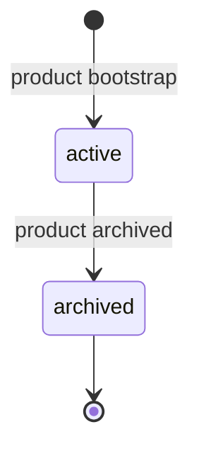
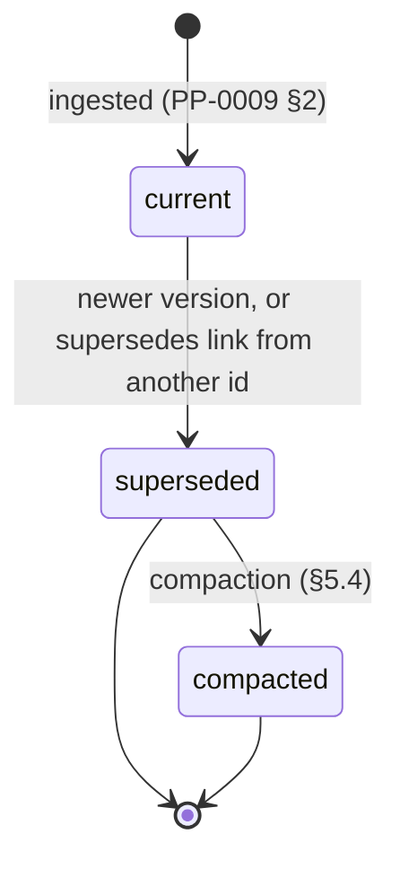
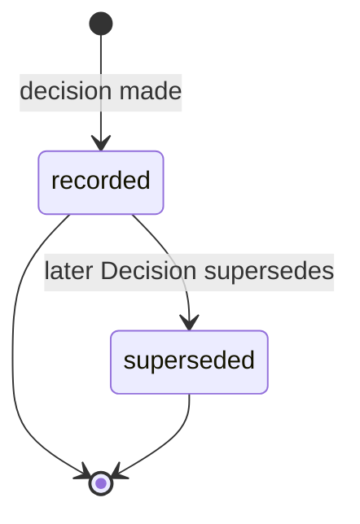
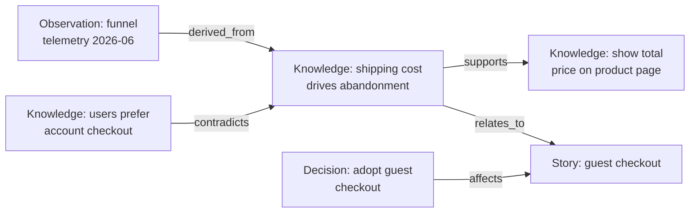

# PP-0003: Product Brain

| Field | Value |
| --- | --- |
| **PP** | 0003 |
| **Title** | Product Brain |
| **Status** | Draft |
| **Authors** | Product Protocol Contributors |
| **Created** | 2026-07-03 |
| **Updated** | 2026-07-03 |
| **Version** | 0.1.0 |
| **Requires** | PP-0002 |

## Abstract

This document defines the **Product Brain**: the structured, versioned,
machine-usable knowledge store of a Product. It specifies three kinds —
`ProductBrain`, `Knowledge`, and `Decision` — their trust model, their
storage layout in the Git binding, the Knowledge Graph that connects
them, and the synchronization and long-term-memory rules that keep the
Brain truthful over years of autonomous operation. Together with
[PP-0009](./PP-0009-knowledge-protocol.md), which defines the operations
on the Brain, this document defines the **PP/Brain** conformance class.

## Motivation *(Informative)*

Autonomous engineering fails without memory. An agent that rediscovers
the same domain rule in every session, or that acts on a design decision
that was reversed months ago, is not autonomous — it is amnesiac.
Documentation does not solve this: prose documents are written for
humans, drift silently from reality, and cannot be queried, trusted, or
updated at the granularity of a single claim.

The Product Brain is explicitly **not documentation**. Documentation
*describes*; the Brain *asserts*. Each entry is one discrete, addressable
claim with a category, a confidence level, provenance, and typed links to
what it supports or contradicts. A machine can retrieve exactly the
claims relevant to a Task, know how much to trust each one, and record
new learning without a human rewriting a wiki page. Architecture Decision
Records (Nygard, 2011) proved the value of immutable decision logs; the
Brain generalizes that practice into a full knowledge substrate with a
graph, a trust ladder, and reconciliation rules.

## Terminology

This document uses *Product Brain*, *Knowledge*, *Decision*, *Knowledge
Graph*, *Governed Object*, *Observation*, *Evaluation*, *Actor*, and
*Product* as defined in the [glossary](../reference/glossary.md), and the
envelope, Ref, versioning, and lifecycle mechanics of
[PP-0002](./PP-0002-core-concepts.md).

The key words **MUST**, **MUST NOT**, **REQUIRED**, **SHALL**, **SHALL
NOT**, **SHOULD**, **SHOULD NOT**, **RECOMMENDED**, **NOT RECOMMENDED**,
**MAY**, and **OPTIONAL** in this document are to be interpreted as
described in BCP 14 [RFC 2119] [RFC 8174] when, and only when, they appear
in all capitals, as shown here.

## Specification

### §1 The Product Brain and the ProductBrain Kind

#### §1.1 Definition

The **Product Brain** is the set of all `Knowledge` and `Decision`
objects belonging to a Product, rooted in exactly one `ProductBrain`
object and connected by the Knowledge Graph (§8). It is the Product's
long-term memory: everything the Product has learned, and every choice
that shaped it, in machine-usable form.

The Brain is **not documentation**. Brain content consists exclusively of
PP objects; free-form documents (READMEs, wikis, design docs) are never
Brain content — they may only appear as provenance *sources* of Knowledge
(§3). Conversely, human-facing documentation MAY be generated *from* the
Brain, but such renderings are Artifacts, not the Brain itself.

#### §1.2 Ownership and trust boundary

- The **Product owns the Brain**: exactly one `ProductBrain` per Product,
  referenced by `Product.spec.brain` (PP-0002 §9).
- **Agents write** to the Brain freely: any actor may create Knowledge,
  record Decisions it is authorized to make, and add links.
- **Humans and validation govern trust**: what agents write enters at low
  confidence (§4); promotion to the trusted levels requires evaluation
  evidence or human authority, and the validation checks of PP-0009 §6
  continuously police integrity. Writing is cheap; being believed is not.

#### §1.3 Lifecycle

The `ProductBrain` is created at product bootstrap — before the first
Goal is drafted, so that bootstrap conversations already have a place to
distill into — and lives exactly as long as the Product. It is archived,
never deleted, when the Product itself is archived.



`metadata.lifecycle` on a `ProductBrain` SHOULD be `active` or
`archived`; absent means `active`.

#### §1.4 Responsibilities, inputs, outputs, relationships

- **Responsibilities:** anchor the Brain's identity; declare retention
  policy hints and retrieval indexes; serve as the root every Knowledge
  and Decision object implicitly belongs to.
- **Inputs:** distilled intent (conversations, documents), Observations,
  Evaluations, Decisions — via the ingestion operations of PP-0009 §2.
- **Outputs:** retrieved knowledge and assembled Worker context
  (PP-0009 §3); generated documentation renderings (informative).
- **Relationships:** referenced by exactly one `Product`; parent of all
  `Knowledge` and `Decision` objects; source of Worker context
  ([PP-0007](./PP-0007-worker-protocol.md)); sink of the learning loop
  ([PP-0010](./PP-0010-runtime.md)).

#### §1.5 ProductBrain fields

| Field | Type | Req | Description |
| --- | --- | --- | --- |
| `spec.summary` | string (prose) | MUST | What this Brain covers: the product domain and knowledge scope, for orientation of retrievers. |
| `spec.retention` | object | MAY | Retention policy hints (§5). |
| `spec.retention.reviewInterval` | string (duration) | MAY | Cadence at which Knowledge is considered for staleness review (§5.1). Absent ⇒ implementation-defined. |
| `spec.retention.compactAfter` | string (duration) | MAY | Age after supersession at which a Knowledge version becomes eligible for compaction (§5.4). Absent ⇒ never eligible. |
| `spec.indexes` | list[object] | MAY | Declared retrieval indexes, `{name, description?}`. Hints for implementations; carrying them does not obligate any tool to build them. |

Schema: [`schemas/knowledge/product-brain.schema.json`](../schemas/knowledge/product-brain.schema.json).

### §2 Knowledge Categories

Every `Knowledge` object declares exactly one category from this closed
enum. Categories partition retrieval: a Worker fixing a checkout bug asks
for `technical` and `architectural` knowledge about checkout, not the
whole Brain.

| Category | Contents |
| --- | --- |
| `domain` | Facts about the problem domain itself: business rules, regulations, industry invariants. |
| `user` | Who the users are and how they behave: personas, observed behavior, preferences, pain points. |
| `market` | Competitive landscape, positioning, pricing dynamics, market timing. |
| `technical` | Implementation-level facts: APIs, data shapes, library behavior, performance characteristics. |
| `architectural` | System structure and its rationale: boundaries, patterns in force, technology commitments. |
| `operational` | Running-system facts: capacity, failure modes, runbook knowledge, cost behavior. |
| `process` | How this Product's loop works: conventions, workflow rules, team agreements. |
| `lesson` | Distilled learning from failure or success: what was tried, what happened, what to do differently. |

The category enum is **strict**: implementations MUST reject values
outside it. Finer-grained taxonomy uses the free-form
`spec.subcategory` string (e.g. `category: technical`,
`subcategory: performance`), `metadata.labels`, or `x-` fields — never
new category values.

### §3 The Knowledge Kind

#### §3.1 Definition

A `Knowledge` object is a single, self-contained, versioned claim about
the Product or its world. One claim per object: "shoppers abandon carts
when shipping cost appears late" is one Knowledge; a page summarizing the
whole checkout funnel is not.

#### §3.2 Responsibilities, inputs, outputs, relationships

- **Responsibilities:** state one claim (`statement`); carry the evidence
  trail for it (`provenance`); declare how much it may be trusted
  (`confidence`); situate itself in the graph (`links`).
- **Inputs:** created and updated by the ingestion and update operations
  of PP-0009 §§2, 4.
- **Outputs:** retrieved into Worker context (PP-0009 §3); cited by other
  Knowledge, Specifications, and Decisions.
- **Relationships:** belongs to the Product's Brain; links to Knowledge,
  Decisions, and any other PP object (§8); distilled from Observations,
  Evaluations, conversations, and documents (object model §3).

#### §3.3 Lifecycle

Knowledge is **versioned, never edited in place**. A change is a new
`metadata.version` of the same `id`; the newer version supersedes the
older, and superseded versions are retained (§5.3). A Knowledge version
therefore moves through:



Confidence transitions (§4) happen *within* this lifecycle: a promotion
or demotion is itself a new version that supersedes the old one.
`Knowledge` is not a governed object (PP-0002 §6.2) and does not use
`metadata.lifecycle`; its state is derived from version ordering and
supersession links.

#### §3.4 Knowledge fields

| Field | Type | Req | Description |
| --- | --- | --- | --- |
| `spec.category` | string (enum) | MUST | One of the eight categories of §2. |
| `spec.subcategory` | string | MAY | Free-form refinement of `category`. |
| `spec.statement` | string (prose) | MUST | The claim, self-contained: readable without any other object or source open. |
| `spec.detail` | string (prose) | MAY | Elaboration, caveats, quantitative detail. |
| `spec.confidence` | string (enum) | MUST | `hypothesis`, `observed`, `validated`, or `canonical` (§4). |
| `spec.provenance` | list[Provenance] | MUST | Where this claim comes from. At least one entry. |
| `spec.provenance[].type` | string (enum) | MUST | `conversation`, `document`, `observation`, `evaluation`, `decision`, or `external`. |
| `spec.provenance[].ref` | Ref | MAY | The source as a PP object (e.g. an Observation or Evaluation). |
| `spec.provenance[].uri` | string (uri) | MAY | The source as external material (document, transcript, URL). |
| `spec.provenance[].description` | string | MAY | Human-readable note on the source. |
| `spec.links` | list[Link] | MAY | Typed graph edges (§8). |
| `spec.links[].rel` | string (enum) | MUST | `supports`, `contradicts`, `refines`, `derived_from`, `supersedes`, or `relates_to`. |
| `spec.links[].target` | Ref | MUST | The edge target. |
| `spec.reviewedAt` | string (RFC 3339) | MAY | When the claim was last reviewed and confirmed current (§5.1). |

A provenance entry SHOULD carry `ref` when the source is a PP object and
`uri` when it is external material; `type` alone is permitted when the
source is ephemeral (e.g. a conversation that was not archived).

Schema: [`schemas/knowledge/knowledge.schema.json`](../schemas/knowledge/knowledge.schema.json).

### §4 Trust: the Confidence Ladder

`spec.confidence` states how much a consumer may rely on a claim. The
four levels form a ladder; each rung has an entry condition:

| Confidence | Meaning | Entry condition |
| --- | --- | --- |
| `hypothesis` | Asserted, not yet corroborated. Distilled from conversation or inference. | Any actor may create. |
| `observed` | Corroborated by at least one Observation, Evaluation, or direct measurement. | Provenance includes a source of type `observation` or `evaluation`. |
| `validated` | Systematically confirmed: passing Evaluation evidence or explicit human review. | Per PP-0009 §4. |
| `canonical` | Endorsed as ground truth for this Product; safe to treat as a premise. | Human Decision required (PP-0009 §4). |

Rules:

- Newly created Knowledge enters at `hypothesis`, or at `observed` when
  its provenance already satisfies the `observed` entry condition.
  Creating directly at `validated` or `canonical` MUST be backed by the
  same authority and evidence that PP-0009 §4 requires for promotion to
  that level.
- Promotion to `canonical`, and demotion from it, MUST be authorized by
  a human and recorded as a Decision referencing the exact Knowledge
  version (§7; operations in PP-0009 §4).
- Confidence is a property of the claim's *support*, not its importance.
  A trivial fact can be `canonical`; a business-critical guess is still a
  `hypothesis`.
- `Knowledge` is deliberately not a governed object: the governed
  lifecycle (PP-0002 §6.2) protects *intent*; the confidence ladder
  grades *belief*. The human gate sits at `canonical`, playing the role
  approval plays for governed objects.

### §5 Synchronization and Long-Term Memory

The Brain is only useful if it stays true to the code, the telemetry,
and the specifications it describes — and only trustworthy if it never
lies about its own past.

#### §5.1 Staleness detection

Implementations SHOULD treat a current Knowledge version as **stale**
when its `spec.reviewedAt` (or, if absent, `metadata.updatedAt`) is older
than `ProductBrain.spec.retention.reviewInterval`. Additional drift
signals that SHOULD mark Knowledge for review:

- a ref in its provenance or links targets an object that has since been
  `deprecated` or `archived`;
- a new Observation or Evaluation contradicts the claim;
- the code or Specification region the claim describes has materially
  changed (heuristics are implementation-defined).

Staleness is a *review flag*, never a deletion trigger. Stale Knowledge
MUST NOT be auto-deleted; it is re-confirmed (bump `reviewedAt`, PATCH
version), revised (new version), demoted, or superseded.

#### §5.2 Reconciliation

When reality and the Brain disagree, the Brain records the disagreement
before resolving it. On detecting a contradiction between a Knowledge
claim and code, telemetry, or specifications, an implementation MUST
either create a new Knowledge object carrying the contradicting evidence
with a `contradicts` link to the existing claim, or publish a new version
of the existing claim that cites the new evidence — and MUST NOT edit or
erase the existing version in place. The contradiction then follows the
review obligation of PP-0009 §5.

#### §5.3 Retention and supersession — never silent deletion

The Brain's history is part of its value: knowing what was believed, and
when belief changed, is what makes `lesson` knowledge possible.

- Superseded Knowledge versions MUST be retained and identifiable as
  superseded (version ordering, `supersedes` links, and the storage
  convention of §6). Implementations MUST NOT silently delete Knowledge.
- Decisions are append-only records (PP-0002 §6.3) and MUST NOT be
  deleted or modified under any retention policy.
- Records are **superseded, not erased**: correction always takes the
  form of a newer object pointing at what it replaces.

#### §5.4 Compaction

Long-lived Products accumulate superseded versions. Implementations MAY
**compact** superseded Knowledge versions older than
`retention.compactAfter`, under these rules:

- Compaction applies only to *superseded* Knowledge versions; current
  versions and all Decisions MUST NOT be compacted.
- A compaction MUST preserve, for every compacted version: its identity
  (`id@version`), a summary of its statement, its confidence at
  supersession, and its provenance chain. The natural form is a single
  summary Knowledge object (often `category: lesson`) with
  `derived_from` links to what it condenses.
- Compaction is itself a supersession, not a deletion: in the Git binding
  (§6) the full objects remain recoverable from history, and the
  compaction record says what was condensed and why.

### §6 Brain Storage Layout (Git Binding)

Within the Git storage binding of PP-0002 §7, the Brain occupies
`.product/brain/`:

```
.product/brain/
├── brain.yaml                          # the ProductBrain object
├── knowledge/
│   ├── know-cart-abandon-shipping.yaml           # current version
│   └── know-cart-abandon-shipping@1.0.0.yaml     # superseded (optional)
└── decisions/
    ├── dec-2026-06-10-guest-checkout.yaml
    └── dec-2026-06-24-search-engine.yaml
```

Rules:

- `brain.yaml` MUST contain the Product's single `ProductBrain` object.
- `knowledge/` holds `Knowledge` objects, one per file, named
  `<id>.yaml` for the current version. Superseded versions MAY be
  retained as `<id>@<version>.yaml`; Git history is the authoritative
  version archive regardless (PP-0002 §7).
- `decisions/` holds `Decision` objects, one per file. Because Decisions
  are append-only, a committed Decision file MUST NOT be rewritten;
  corrections are new files (§7).
- All PP-0002 §7 rules apply: identity derives from content, not paths;
  implementations with other backends MUST round-trip losslessly through
  this layout.

### §7 The Decision Kind

#### §7.1 Definition

A `Decision` is an **immutable record of a choice**: the context in which
it was made, the options considered, the outcome, the authority who made
it, and the objects it affects. Decisions are the Brain's answer to "why
is it this way?" — the other half of memory, alongside what is known.

Two named profiles share this one kind:

- **Architecture Decision Records (ADRs)** are Decisions — typically with
  `spec.options` and `spec.consequences` populated and
  `category`-relevant Knowledge linked via `affects`. No separate kind
  exists for ADRs.
- **Approval Decisions** are the Decisions required by PP-0002 §6.2 for
  the `proposed → approved` transition of governed objects. An approval
  Decision carries `spec.approves` pointing at the exact governed object
  version approved.

#### §7.2 Lifecycle

Decisions are append-only records (PP-0002 §6.3): created once, never
modified or deleted. A Decision that no longer stands is superseded by a
newer Decision whose `spec.supersedes` names it; the superseded state is
derived, not written back.



#### §7.3 Responsibilities, inputs, outputs, relationships

- **Responsibilities:** durably record choice, context, and authority;
  gate governed-object approval (via `approves`); anchor `canonical`
  confidence (§4).
- **Inputs:** created by any actor with authority over the decision being
  recorded; approval and architecture Decisions require human authority.
- **Outputs:** cited as provenance (`type: decision`) by Knowledge;
  traversed in the graph (§8); audited via Git history.
- **Relationships:** affects one or more objects of any kind; may approve
  exactly one governed object version; may supersede one earlier
  Decision.

#### §7.4 Decision fields

| Field | Type | Req | Description |
| --- | --- | --- | --- |
| `spec.context` | string (prose) | MUST | The situation and forces at decision time, self-contained. |
| `spec.options` | list[object] | MAY | Options considered: `{option, rationale?}`. |
| `spec.options[].option` | string | MUST | The option, stated briefly. |
| `spec.options[].rationale` | string (prose) | MAY | Why it was or was not chosen. |
| `spec.outcome` | string (prose) | MUST | The choice made. |
| `spec.authority` | Actor | MUST | Who decided. For approval Decisions and architecture Decisions this MUST be `type: human`. |
| `spec.decidedAt` | string (RFC 3339) | MUST | When the decision was made. |
| `spec.affects` | list[Ref] | MUST | The objects this decision affects. At least one entry (object model §3). |
| `spec.approves` | Ref | MAY | For approval Decisions: the exact governed object version approved. `ref.version` MUST be present and exact. |
| `spec.supersedes` | Ref | MAY | An earlier Decision this one replaces. |
| `spec.consequences` | string (prose) | MAY | Expected consequences and accepted trade-offs. |

Schema: [`schemas/knowledge/decision.schema.json`](../schemas/knowledge/decision.schema.json).

### §8 The Knowledge Graph

#### §8.1 Structure

The **Knowledge Graph** is the directed, typed link structure over the
Brain and beyond:

- **Nodes:** every `Knowledge` and `Decision` object, plus any PP object
  they reference (Observations, Evaluations, Stories, …).
- **Edges:** `Knowledge.spec.links[]` (typed by `rel`);
  `Decision.spec.affects`, `spec.approves`, `spec.supersedes`; and
  `provenance[].ref` entries (which read as `derived_from` edges).



#### §8.2 Edge semantics

| `rel` | Meaning of `A → B` | Symmetry |
| --- | --- | --- |
| `supports` | A provides evidence or argument for B. | Directed |
| `contradicts` | A and B cannot both hold. | Symmetric |
| `refines` | A narrows, specializes, or adds precision to B. | Directed |
| `derived_from` | A was distilled or concluded from B. | Directed |
| `supersedes` | A replaces B; B is no longer current. | Directed |
| `relates_to` | A and B are associated without a stronger claim. | Symmetric |

The `rel` enum is closed. Extension edge semantics MUST be expressed via
`x-` fields on the link entry or the object, never by new `rel` values.

#### §8.3 Traversal semantics

- Edges are stored on the source object and are directed; consumers MUST
  additionally traverse `contradicts` and `relates_to` in both
  directions (they are symmetric), and MUST NOT invert the other four.
- Unversioned edge targets resolve per PP-0002 §3.2 (highest approved,
  else highest, version). Versioned targets pin the exact version.
- Traversal MUST be depth-bounded by the caller and MUST terminate on
  cycles among symmetric edges.
- `supersedes` chains — explicit links plus the implicit supersession
  between versions of one `id` — MUST be acyclic, and an object MUST NOT
  supersede itself. Following a chain backward yields the full history of
  a belief; forward, its current form.
- Traversal excludes superseded nodes unless the caller asks for history
  (PP-0009 §3).

## Normative Requirements

- **[PP-0003-RQ-001]** A Product MUST have exactly one `ProductBrain`,
  created at product bootstrap; it MUST persist for the life of the
  Product and MUST NOT be deleted (§1.3, PP-0002 §9).
- **[PP-0003-RQ-002]** Brain content MUST consist of PP objects
  (`ProductBrain`, `Knowledge`, `Decision`); free-form documents MUST NOT
  be treated as Brain content and MAY appear only as provenance sources
  (§1.1).
- **[PP-0003-RQ-003]** `Knowledge.spec.category` MUST be one of the eight
  values of §2; implementations MUST reject other values. Refinement MUST
  use `spec.subcategory`, labels, or `x-` fields (§2).
- **[PP-0003-RQ-004]** A `Knowledge` object MUST carry `spec.statement`,
  `spec.category`, `spec.confidence`, and at least one
  `spec.provenance` entry (§3.4).
- **[PP-0003-RQ-005]** Every provenance entry MUST declare `type`; it
  SHOULD carry `ref` for PP-object sources and `uri` for external
  sources (§3.4).
- **[PP-0003-RQ-006]** Knowledge MUST NOT be edited in place; every
  change MUST be a new `metadata.version` of the same `id` (§3.3).
- **[PP-0003-RQ-007]** Knowledge created at `validated` or `canonical`
  MUST be backed by the authority and evidence PP-0009 §4 requires for
  promotion to that level; otherwise new Knowledge MUST enter at
  `hypothesis` or `observed` (§4).
- **[PP-0003-RQ-008]** Promotion of Knowledge to `canonical`, and
  demotion from it, MUST be authorized by a human and recorded as a
  Decision referencing the exact Knowledge version (§4).
- **[PP-0003-RQ-009]** Superseded Knowledge versions MUST be retained and
  identifiable as superseded; implementations MUST NOT silently delete
  Knowledge or Decision objects (§5.3).
- **[PP-0003-RQ-010]** Stale Knowledge MUST NOT be auto-deleted;
  staleness MUST only trigger review (§5.1).
- **[PP-0003-RQ-011]** On contradiction between a Knowledge claim and
  code, telemetry, or specifications, implementations MUST record the
  contradiction (new Knowledge with a `contradicts` link, or a new
  version citing the evidence) and MUST NOT edit or erase the existing
  version in place (§5.2).
- **[PP-0003-RQ-012]** Compaction MUST apply only to superseded Knowledge
  versions; it MUST preserve each compacted version's identity, a summary
  of its statement, and its provenance chain; it MUST NOT compact current
  Knowledge or any Decision (§5.4).
- **[PP-0003-RQ-013]** In the Git binding, the Brain MUST use the layout
  of §6: `.product/brain/brain.yaml`, `knowledge/`, and `decisions/`
  (§6, PP-0002 §7).
- **[PP-0003-RQ-014]** A committed Decision MUST NOT be modified or
  deleted; a correction MUST be a new Decision whose `spec.supersedes`
  names the one it replaces (§7.2, PP-0002 §6.3).
- **[PP-0003-RQ-015]** `Decision.spec.affects` MUST contain at least one
  ref, and every ref MUST resolve within the Product (§7.4,
  PP-0002 §5).
- **[PP-0003-RQ-016]** An approval Decision (PP-0002 §6.2) MUST set
  `spec.approves` to the exact version of the governed object approved,
  and its `spec.authority` MUST be of type `human`; architecture
  Decisions likewise MUST have human authority (§7.1, §7.4).
- **[PP-0003-RQ-017]** Graph edges MUST use only the six `rel` values of
  §8.2; extension edge semantics MUST use `x-` fields (§8.2).
- **[PP-0003-RQ-018]** Consumers MUST traverse `contradicts` and
  `relates_to` symmetrically and MUST NOT invert directed edge types;
  `supersedes` chains MUST be acyclic and an object MUST NOT supersede
  itself (§8.3).

## Examples *(Informative)*

A `ProductBrain` (`.product/brain/brain.yaml`):

```yaml
pp: "0.1"
kind: ProductBrain
metadata:
  id: aurora-brain
  name: Aurora Books Product Brain
  version: 1.1.0
  lifecycle: active
  createdAt: 2026-05-01T09:05:00Z
  updatedAt: 2026-07-03T12:00:00Z
spec:
  summary: >
    Knowledge store for Aurora Books: online bookstore domain rules,
    reader behavior, checkout and recommendation architecture, and
    lessons from autonomous operation since May 2026.
  retention:
    reviewInterval: P90D
    compactAfter: P365D
  indexes:
    - name: by-category
      description: Category + subcategory lookup for Worker context.
    - name: checkout-graph
      description: Link-traversal index seeded from checkout objects.
```

A `Knowledge` object at `validated` confidence
(`.product/brain/knowledge/know-cart-abandon-shipping.yaml`):

```yaml
pp: "0.1"
kind: Knowledge
metadata:
  id: know-cart-abandon-shipping
  name: Late shipping cost drives cart abandonment
  version: 2.1.0
  labels:
    area: checkout
  createdAt: 2026-06-02T10:00:00Z
  updatedAt: 2026-06-28T09:30:00Z
spec:
  category: user
  subcategory: behavior
  statement: >
    Shoppers abandon carts significantly more often when shipping cost
    is first revealed at the payment step rather than on the cart page.
  detail: >
    June 2026 funnel telemetry shows a 23% drop-off at the payment step
    for orders under $25, versus 9% when a shipping estimate is shown on
    the cart page. Effect concentrates in first-time buyers.
  confidence: validated
  provenance:
    - type: observation
      ref: { ref: { kind: Observation, id: obs-funnel-2026-06 } }
      description: Checkout funnel telemetry, June 2026.
    - type: evaluation
      ref: { ref: { kind: Evaluation, id: eval-checkout-ab-01 } }
      description: A/B evaluation of early shipping estimate.
  links:
    - rel: supports
      target: { ref: { kind: Knowledge, id: know-early-price-transparency } }
    - rel: relates_to
      target: { ref: { kind: Story, id: story-guest-checkout } }
  reviewedAt: 2026-06-28T09:30:00Z
```

An approval `Decision`
(`.product/brain/decisions/dec-2026-06-10-guest-checkout.yaml`):

```yaml
pp: "0.1"
kind: Decision
metadata:
  id: dec-2026-06-10-guest-checkout
  name: Approve guest checkout story v1.0.0
  version: 1.0.0
  createdAt: 2026-06-10T15:04:00Z
spec:
  context: >
    Story story-guest-checkout v1.0.0 was proposed to reduce first-time
    buyer drop-off. Funnel telemetry and the shipping-cost knowledge
    support prioritizing checkout friction.
  outcome: >
    Approved for implementation as specified.
  authority: { type: human, id: dana@example.com, name: Dana Ito }
  decidedAt: 2026-06-10T15:04:00Z
  affects:
    - ref: { kind: Story, id: story-guest-checkout, version: "1.0.0" }
  approves: { ref: { kind: Story, id: story-guest-checkout, version: "1.0.0" } }
```

An architecture Decision in the ADR profile, superseding an earlier one
(`.product/brain/decisions/dec-2026-06-24-search-engine.yaml`):

```yaml
pp: "0.1"
kind: Decision
metadata:
  id: dec-2026-06-24-search-engine
  name: Use PostgreSQL full-text search instead of a dedicated engine
  version: 1.0.0
  createdAt: 2026-06-24T11:20:00Z
spec:
  context: >
    Catalog search latency targets are modest (p95 < 300ms over ~40k
    titles). The earlier decision to adopt a dedicated search cluster
    predates the operational-cost knowledge gathered in June.
  options:
    - option: Dedicated search engine cluster
      rationale: Best relevance tooling; highest operational cost.
    - option: PostgreSQL full-text search
      rationale: Meets latency targets at current scale; zero new infra.
  outcome: >
    Use PostgreSQL full-text search; revisit if the catalog exceeds
    500k titles or relevance Evaluations regress.
  authority: { type: human, id: dana@example.com, name: Dana Ito }
  decidedAt: 2026-06-24T11:15:00Z
  affects:
    - ref: { kind: Capability, id: cap-catalog-search }
    - ref: { kind: Knowledge, id: know-search-operational-cost }
  supersedes: { ref: { kind: Decision, id: dec-2026-05-20-search-engine } }
  consequences: >
    Relevance tuning options are limited; accepted until scale demands
    otherwise. Removes one production dependency.
```

## Security Considerations

- **The Brain is a prompt-injection surface.** Knowledge statements flow
  into Worker context (PP-0009 §3). Consumers MUST treat Knowledge
  content as data — claims to weigh, never instructions to follow — and
  the confidence ladder (§4) exists so that unvetted `hypothesis` text
  is never mistaken for ground truth.
- **`canonical` is a privilege boundary.** [PP-0003-RQ-008] gates the
  highest trust level behind human Decisions, mirroring the approval rule
  of PP-0002 §6.2. Implementations SHOULD bind those Decisions to strong
  identity (signed commits).
- **Append-only integrity.** The audit value of Decisions and superseded
  Knowledge depends on tamper-evidence ([PP-0003-RQ-009],
  [PP-0003-RQ-014]); Git history and signatures provide it.
- **Secrets.** Distillation must not launder credentials, personal data,
  or private conversation content into long-lived Knowledge. Objects MUST
  NOT contain secrets (PP-0002); ingestors SHOULD redact provenance
  descriptions accordingly.

## Future Work *(Informative)*

- Standardized embedding/semantic index declarations under
  `spec.indexes`.
- Confidence decay: time- or evidence-based automatic demotion policies.
- A cross-product knowledge-sharing profile (today, cross-product refs
  are discouraged by PP-0002 §5).
- An export profile rendering the Brain into retrieval-augmented
  generation stores and human documentation.

## References

- [PP-0002 — Core Concepts and Object Model](./PP-0002-core-concepts.md)
  *(normative)*
- [PP-0009 — Knowledge Protocol](./PP-0009-knowledge-protocol.md)
  *(normative for PP/Brain)*
- Schemas: [`schemas/knowledge/`](../schemas/knowledge/) *(normative)*
- [Object Model](../reference/object-model.md) ·
  [Glossary](../reference/glossary.md) ·
  [Terminology](../reference/terminology.md)
- [BCP 14 / RFC 2119 / RFC 8174](https://www.rfc-editor.org/info/bcp14)
- M. Nygard, *Documenting Architecture Decisions*, 2011 *(informative)*
