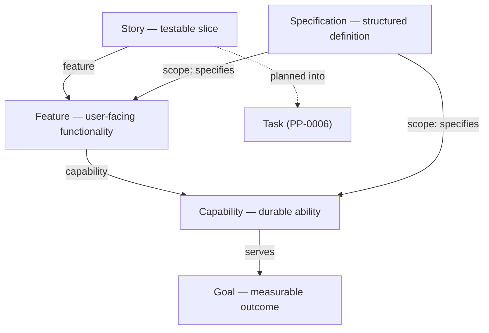
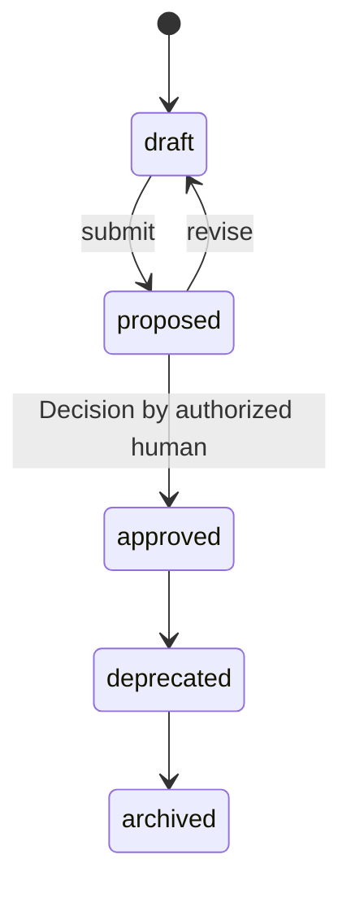

# PP-0004: Product Specification

| Field | Value |
| --- | --- |
| **PP** | 0004 |
| **Title** | Product Specification |
| **Status** | Draft |
| **Authors** | Product Protocol Contributors |
| **Created** | 2026-07-03 |
| **Updated** | 2026-07-03 |
| **Version** | 0.1.0 |
| **Requires** | PP-0002 |

## Abstract

This document defines the intent and definition layers of the Product
Protocol: the kinds `Goal`, `Capability`, `Specification`, `Feature`, and
`Story`, the acceptance-criteria model attached to Stories, and the
versioning and traceability rules that connect them. Together these kinds
form the governed hierarchy from measurable business outcome down to the
narrowest testable slice of functionality — the material a Planner
decomposes into Tasks. Conformance to this document (with PP-0002)
constitutes the **PP/Spec** conformance class.

## Motivation *(Informative)*

Autonomous engineering fails first at the definition layer. When "what to
build" lives in chat transcripts, tickets, and tribal memory, agents
optimize for whatever text happens to be in context, humans cannot audit
what was actually authorized, and no two tools agree on what "done" means.

This specification fixes a small, boring, machine-readable hierarchy:

- **Goal** — the *why*: a measurable outcome humans care about.
- **Capability** — the *what, durably*: an ability the product offers.
- **Feature** — the *what, concretely*: a coherent unit of user-facing
  functionality.
- **Story** — the *what, testably*: a slice small enough to plan, with
  acceptance criteria that decide completion.
- **Specification** — the *definition document*: personas, requirements,
  UX, business rules, and constraints that give Capabilities and Features
  their precise meaning.

Prior art includes user-story practice (Cohn), requirements standards
(ISO/IEC/IEEE 29148), Gherkin's given/when/then, and OKR-style goal
metrics. This document borrows their vocabulary but subordinates all of
it to the PP-0002 governance machinery: every object here is versioned,
human-approved, immutable once approved, and traceable.

## Terminology

*Goal*, *Capability*, *Specification*, *Feature*, *Story*, *Acceptance
Criteria*, *Governed Object*, *Golden Test*, *Quality Gate*, *Task*,
*Artifact*, *Decision* — per the [glossary](../reference/glossary.md).

The key words **MUST**, **MUST NOT**, **REQUIRED**, **SHALL**, **SHALL
NOT**, **SHOULD**, **SHOULD NOT**, **RECOMMENDED**, **NOT RECOMMENDED**,
**MAY**, and **OPTIONAL** in this document are to be interpreted as
described in BCP 14 [RFC 2119] [RFC 8174] when, and only when, they appear
in all capitals, as shown here.

## Specification

### §1 Overview: the Intent/Definition Hierarchy

#### §1.1 Hierarchy

The five kinds of this document form a directed hierarchy. `Goal`,
`Capability`, `Feature`, and `Story` are the *decomposition spine*;
`Specification` is the *definition document* that specifies one or more
Capabilities and Features in depth.



Links point *upward*: a Story names its Feature, a Feature names its
Capability, a Capability names the Goals it serves. Parents do not
enumerate children; the child-to-parent Ref is the single authoritative
edge, and any downward index is a derived view. A `Specification` points
*sideways* at the Capabilities and Features it defines via `spec.scope`.

#### §1.2 Governance

All five kinds are **governed objects** per PP-0002 §6.2. Each object
MUST carry `metadata.lifecycle` and follow this state machine exactly —
no states may be added, removed, or skipped:



The `proposed → approved` transition MUST be authorized by a human and
recorded as a Decision (PP-0002 [PP-0002-RQ-008]); an approved version is
immutable ([PP-0002-RQ-009]); autonomous agents MUST NOT perform the
approval ([PP-0002-RQ-010]). Kind-specific *approval readiness* rules
(what must be true before `proposed → approved` is permitted) are given
per kind below and in §7 and §8.

Objects of these kinds are stored under `.product/specification/` in the
Git binding (PP-0002 §7).

### §2 The Specification Kind

#### §2.1 Definition

A `Specification` is the structured, versioned statement of what to
build for a defined scope: summary, personas, functional and
non-functional requirements, UX principles and prototypes, business
rules, constraints, and dependencies. It is the definition document that
gives one or more Capabilities and Features their precise, citable
meaning.

#### §2.2 Responsibilities

- Bind a scope of Capabilities and/or Features to an explicit,
  reviewable definition.
- Carry the identified requirements (`FR-*`, `NFR-*`) and business rules
  (`BR-*`) that Stories, Tasks, and Evaluations cite by id.
- Anchor UX intent: principles plus informative prototypes.
- Declare constraints and external dependencies the Planner and Workers
  must respect.

#### §2.3 Lifecycle

Governed object; state machine per §1.2 (PP-0002 §6.2). A Specification
SHOULD NOT be submitted (`draft → proposed`) while any Ref in
`spec.scope` is dangling; validators MUST report dangling refs as errors
per PP-0002 [PP-0002-RQ-006].

#### §2.4 Inputs and Outputs

- **Inputs:** human intent (conversation, documents), approved Goals,
  existing Capabilities/Features, Knowledge from the Product Brain.
- **Outputs:** requirement and rule identifiers cited by Stories (§6),
  Tasks (PP-0006), and Evaluations (PP-0008); UX prototypes rendered for
  human review; acceptance links to Golden Tests.

#### §2.5 Relationships

| Direction | Kind | Via | Meaning |
| --- | --- | --- | --- |
| out | Capability, Feature | `spec.scope` | What this document specifies. |
| out | Goal | `spec.businessGoals` | Outcomes motivating the scope. |
| out | GoldenTest | `spec.acceptance` | Canonical scenarios the scope must satisfy. |
| out | Artifact | `spec.ux.prototypes[].artifact` | Stored prototype renderings. |
| in | Story | `spec.businessRules` (string ids) | Stories bind rules by id (§6). |
| in | Decision | approval | The Decision approving each version. |

#### §2.6 Fields

| Field | Type | Req | Description |
| --- | --- | --- | --- |
| `spec.scope` | list[Ref] | MUST | ≥ 1 Ref; each target MUST be a `Capability` or `Feature`. |
| `spec.summary` | string (prose) | MUST | What this Specification defines, in one or two paragraphs. |
| `spec.businessGoals` | list[Ref] | MAY | Refs to `Goal` objects this scope advances. |
| `spec.personas` | list[Persona] | MAY | Who the scope is for (§2.6.1). |
| `spec.functionalRequirements` | list[FunctionalRequirement] | MAY | Identified functional requirements (§2.6.2). |
| `spec.nonFunctionalRequirements` | list[NonFunctionalRequirement] | MAY | Identified quality requirements (§2.6.3). |
| `spec.ux` | UX | MAY | UX principles and prototypes (§2.6.4, §2.7). |
| `spec.businessRules` | list[BusinessRule] | MAY | Identified domain rules (§2.6.5). |
| `spec.constraints` | list[string (prose)] | MAY | Hard constraints on solution space. |
| `spec.dependencies` | list[Dependency] | MAY | External systems or objects the scope depends on (§2.6.6). |
| `spec.acceptance` | list[Ref] | MAY | Refs to `GoldenTest` objects that operationalize acceptance. |

##### §2.6.1 Persona

| Field | Type | Req | Description |
| --- | --- | --- | --- |
| `id` | string | MUST | Stable persona identifier, unique within the Specification (e.g. `guest-shopper`). |
| `name` | string | MUST | Display name. |
| `description` | string (prose) | MUST | Who they are and their context. |
| `needs` | list[string] | MAY | Salient needs, one per entry. |

##### §2.6.2 FunctionalRequirement

| Field | Type | Req | Description |
| --- | --- | --- | --- |
| `id` | string | MUST | Stable requirement id, unique within the Specification (e.g. `FR-3`). |
| `statement` | string (prose) | MUST | The requirement, phrased with BCP 14 keywords where normative force is intended. |
| `priority` | enum | MAY | `critical`, `high`, `medium`, `low`. Absent ⇒ `medium`. |
| `rationale` | string (prose) | MAY | Why this requirement exists. |

##### §2.6.3 NonFunctionalRequirement

| Field | Type | Req | Description |
| --- | --- | --- | --- |
| `id` | string | MUST | Stable id, unique within the Specification (e.g. `NFR-1`). |
| `category` | enum | MUST | `performance`, `security`, `accessibility`, `reliability`, `usability`, `compliance`, `scalability`, `maintainability`, `other`. |
| `statement` | string (prose) | MUST | The quality requirement. |
| `budget` | Budget | MAY | Quantified budget: `{metric MUST, value MUST, unit?}`. `value` is a number or string. |

##### §2.6.4 UX

| Field | Type | Req | Description |
| --- | --- | --- | --- |
| `principles` | list[string (prose)] | MAY | Design principles for the scope. |
| `prototypes` | list[Prototype] | MAY | Informative renderings (§2.7). |

Prototype:

| Field | Type | Req | Description |
| --- | --- | --- | --- |
| `name` | string | MUST | Prototype name. |
| `description` | string | MAY | What it demonstrates. |
| `path` | string | MAY | Repo-relative path to the prototype file (e.g. `docs/prototypes/guest-checkout.html`). |
| `artifact` | Ref | MAY | Ref to an `Artifact` holding the prototype. |
| `format` | enum | MUST | `html`, `markdown`, `image`, `other`. |

##### §2.6.5 BusinessRule

| Field | Type | Req | Description |
| --- | --- | --- | --- |
| `id` | string | MUST | Stable rule id, unique within the Specification (e.g. `BR-PAY-1`). |
| `statement` | string (prose) | MUST | The domain rule. |
| `appliesTo` | list[Ref] | MAY | Objects the rule applies to; absent ⇒ the whole scope. |

##### §2.6.6 Dependency

| Field | Type | Req | Description |
| --- | --- | --- | --- |
| `name` | string | MUST | Dependency name. |
| `description` | string | MAY | Nature of the dependency. |
| `ref` | Ref | MAY | Ref to a PP object, when the dependency is one. |

Schema: [`schemas/specification/specification.schema.json`](../schemas/specification/specification.schema.json).

#### §2.7 UX Prototypes

UX prototypes are plain, self-contained **HTML files** (or Markdown or
images) stored either as ordinary repository files, referenced by a
repo-relative `path`, or as `Artifact` objects, referenced via
`artifact`. They exist so humans can *see* a Specification before
approving it, and so agents can consult a concrete rendering of intent.

Prototypes are **informative renderings of the Specification, never the
source of truth**. When a prototype and the Specification's prose or
requirements disagree, the prose and requirements prevail; consumers
MUST NOT derive requirements from a prototype that the Specification
does not state. `path` values MUST be repo-relative (no absolute paths,
no `..` escaping the repository). A prototype entry SHOULD carry at
least one of `path` or `artifact`; an entry with neither is a name-only
placeholder.

### §3 The Goal Kind

#### §3.1 Definition

A `Goal` is a measurable business or user outcome the Product pursues:
a statement, one primary metric with a target and direction, and
optionally a timeframe. Goals are owned by humans; they answer *why*
anything below them exists.

#### §3.2 Responsibilities

- State the outcome in language a human sponsor recognizes.
- Fix the metric by which progress and success are judged, so that
  Observations (PP-0010) can be compared against `target`.
- Anchor prioritization: Planners and humans rank work by the Goals it
  serves.

#### §3.3 Lifecycle

Governed object; state machine per §1.2. A Goal SHOULD be approved
before Capabilities serving it are approved (§8).

#### §3.4 Inputs and Outputs

- **Inputs:** human intent; Observations establishing `baseline`.
- **Outputs:** the target that Capabilities cite via `serves`; the
  metric that the learning loop (PP-0010) evaluates the running Product
  against.

#### §3.5 Relationships

| Direction | Kind | Via | Meaning |
| --- | --- | --- | --- |
| in | Capability | `spec.serves` | Abilities built to move this Goal. |
| in | Product | `spec.goals` | Listed as a top-level Goal (PP-0002 §9). |
| in | Specification | `spec.businessGoals` | Definitions motivated by this Goal. |
| in | Observation | subject | Metric readings against `spec.metric`. |

#### §3.6 Fields

| Field | Type | Req | Description |
| --- | --- | --- | --- |
| `spec.statement` | string (prose) | MUST | The outcome, in one or two sentences. |
| `spec.metric` | Metric | MUST | The primary measure of the Goal. |
| `spec.metric.name` | string | MUST | Metric identifier (e.g. `checkout_conversion_rate`). |
| `spec.metric.description` | string | MAY | How the metric is defined and measured. |
| `spec.metric.unit` | string | MAY | Unit (e.g. `percent`, `ms`, `users`). |
| `spec.metric.baseline` | number \| string | MAY | Current value when the Goal was set. |
| `spec.metric.target` | number \| string | MUST | The value that constitutes success. |
| `spec.metric.direction` | enum | MUST | `increase`, `decrease`, `maintain`. |
| `spec.timeframe` | string | MAY | Horizon for reaching the target (e.g. `2026-Q4`). |
| `spec.rationale` | string (prose) | MAY | Why this Goal, why now. |

Schema: [`schemas/specification/goal.schema.json`](../schemas/specification/goal.schema.json).

### §4 The Capability Kind

#### §4.1 Definition

A `Capability` is a durable ability the Product offers (e.g. "accept
payments", "recommend books") in service of one or more Goals. It is
the stable middle layer: Goals change targets and Features come and go,
but Capabilities describe what the Product *is able to do* across
releases.

#### §4.2 Responsibilities

- Group Features into a coherent, long-lived ability.
- Justify its existence by the Goals it serves (`spec.serves`).
- Provide the unit at which Specifications most naturally take scope.

#### §4.3 Lifecycle

Governed object; state machine per §1.2. A Capability's `serves` refs
MUST resolve; approving a Capability whose Goals are not yet approved is
NOT RECOMMENDED (§8).

#### §4.4 Inputs and Outputs

- **Inputs:** approved Goals; human intent; Specifications defining it.
- **Outputs:** the parent that Features attach to; scope entries for
  Specifications.

#### §4.5 Relationships

| Direction | Kind | Via | Meaning |
| --- | --- | --- | --- |
| out | Goal | `spec.serves` | Outcomes this ability advances (≥ 1). |
| in | Feature | `spec.capability` | Functionality realizing the ability. |
| in | Specification | `spec.scope` | Definitions of this ability. |

#### §4.6 Fields

| Field | Type | Req | Description |
| --- | --- | --- | --- |
| `spec.description` | string (prose) | MUST | The ability, described durably (not release-bound). |
| `spec.serves` | list[Ref] | MUST | ≥ 1 Ref; each target MUST be a `Goal`. |

Schema: [`schemas/specification/capability.schema.json`](../schemas/specification/capability.schema.json).

### §5 The Feature Kind

#### §5.1 Definition

A `Feature` is a coherent unit of user-facing functionality within
exactly one Capability (e.g. "guest checkout" within "accept
payments"). Features are the granularity at which humans usually
discuss, prioritize, and release functionality; they decompose into
Stories.

#### §5.2 Responsibilities

- Bound a releasable, discussable unit of functionality.
- Attach to exactly one Capability (`spec.capability`).
- Name the personas it serves, by persona id from a Specification whose
  scope covers it.

#### §5.3 Lifecycle

Governed object; state machine per §1.2. A Feature SHOULD NOT be
approved before its Capability is approved (§8).

#### §5.4 Inputs and Outputs

- **Inputs:** its Capability; Specifications in whose scope it falls;
  personas defined there.
- **Outputs:** the parent that Stories attach to; a `tracesTo` target
  for Tasks (PP-0006).

#### §5.5 Relationships

| Direction | Kind | Via | Meaning |
| --- | --- | --- | --- |
| out | Capability | `spec.capability` | The ability this Feature belongs to. |
| in | Story | `spec.feature` | Testable slices of this Feature. |
| in | Specification | `spec.scope` | Definitions covering this Feature. |
| in | Task | `spec.tracesTo` | Work traced directly to the Feature (PP-0006). |

#### §5.6 Fields

| Field | Type | Req | Description |
| --- | --- | --- | --- |
| `spec.description` | string (prose) | MUST | What the Feature does for its users. |
| `spec.capability` | Ref | MUST | Ref; target MUST be a `Capability`. |
| `spec.personas` | list[string] | MAY | Persona ids (§2.6.1) from a covering Specification. |
| `spec.notes` | string (prose) | MAY | Non-normative notes, open questions, context. |

Schema: [`schemas/specification/feature.schema.json`](../schemas/specification/feature.schema.json).

### §6 The Story Kind

#### §6.1 Definition

A `Story` is the narrowest governed unit of functionality: a testable
slice of exactly one Feature, small enough for a Planner to decompose
into Tasks, with acceptance criteria (§7) that decide when it is
complete.

#### §6.2 Responsibilities

- State the slice as a user-value narrative.
- Carry the acceptance criteria that Evaluators (PP-0008) judge Task
  output against.
- Bind applicable business rules by id, so rules cannot silently drop
  out during planning.

#### §6.3 Lifecycle

Governed object; state machine per §1.2, with one additional readiness
rule: a Story MUST have at least one acceptance criterion before it may
be approved (§7.3). Deprecating a Story does not cancel Tasks already
done against it; it prevents new planning from it.

#### §6.4 Inputs and Outputs

- **Inputs:** its Feature; business rules and personas from covering
  Specifications; UX Artifacts.
- **Outputs:** acceptance criteria consumed by Evaluators and Quality
  Gates (PP-0008); the primary `tracesTo` target for Tasks (PP-0006).

#### §6.5 Relationships

| Direction | Kind | Via | Meaning |
| --- | --- | --- | --- |
| out | Feature | `spec.feature` | The Feature this Story slices. |
| out | GoldenTest, QualityGate | `spec.acceptanceCriteria[].verification.evaluations` | How criteria are checked (§7). |
| out | Artifact | `spec.uxRefs` | Prototype or design renderings. |
| in | Task | `spec.tracesTo` | Work planned from this Story (PP-0006). |
| in | Evaluation | criteria | Judgments against this Story's criteria (PP-0008). |

#### §6.6 Fields

| Field | Type | Req | Description |
| --- | --- | --- | --- |
| `spec.narrative` | string (prose) | MUST | The story. The form "As a `<persona>`, I want `<capability>`, so that `<benefit>`." is RECOMMENDED. |
| `spec.feature` | Ref | MUST | Ref; target MUST be a `Feature`. |
| `spec.acceptanceCriteria` | list[AcceptanceCriterion] | MUST | Criteria per §7. MUST be non-empty before approval (§7.3). |
| `spec.businessRules` | list[string] | MAY | Business-rule ids (§2.6.5) from a Specification whose scope covers this Story's Feature. |
| `spec.uxRefs` | list[Ref] | MAY | Refs, typically to `Artifact` objects holding prototypes or designs; repo-file prototypes live on the covering Specification (§2.7). |

Schema: [`schemas/specification/story.schema.json`](../schemas/specification/story.schema.json).

### §7 The Acceptance Criteria Model

#### §7.1 Shape

An **acceptance criterion** is a machine-checkable or human-verifiable
condition that must hold for its Story to be complete. Each criterion is
an object:

| Field | Type | Req | Description |
| --- | --- | --- | --- |
| `id` | string | MUST | Stable criterion id, unique within the Story (e.g. `ac-1`). |
| `criterion` | string (prose) | Conditional | Single-sentence form of the condition. |
| `given` | string (prose) | Conditional | Precondition (Gherkin-style form). |
| `when` | string (prose) | Conditional | Action or trigger. |
| `then` | string (prose) | Conditional | Expected outcome. |
| `verification` | Verification | MUST | How the criterion is checked (§7.2). |

A criterion MUST take exactly one of two forms: the **single-prose
form** (`criterion` present; `given`/`when`/`then` absent) or the
**given/when/then form** (all three of `given`, `when`, `then` present;
`criterion` absent).

#### §7.2 Verification

| Field | Type | Req | Description |
| --- | --- | --- | --- |
| `verification.method` | enum | MUST | `automated` (deterministic check), `agentic` (checked by an agent Evaluator), `manual` (checked by a human). |
| `verification.evaluations` | list[Ref] | MAY | Refs to `GoldenTest` or `QualityGate` objects (PP-0008) that operationalize the check. |

Criteria SHOULD be `automated` or `agentic` wherever feasible; `manual`
verification reintroduces a human bottleneck and SHOULD be reserved for
conditions that genuinely require human judgment.

#### §7.3 Approval Readiness

Acceptance criteria are what make a Story *testable*; a Story without
them cannot be evaluated and therefore cannot be safely handed to
autonomous execution. `spec.acceptanceCriteria` MUST be non-empty for
the Story's `proposed → approved` transition to be permitted.
Implementations MUST reject the approval of a Story whose
`acceptanceCriteria` list is empty.

### §8 Versioning and Traceability

#### §8.1 Versioning

Objects of all five kinds version per PP-0002 §6.1, with these
kind-specific interpretations:

- **MAJOR** — meaning reversed or narrowed: a requirement, business
  rule, or acceptance criterion removed or weakened; a Goal target
  relaxed; a `scope`, `serves`, `capability`, or `feature` edge
  retargeted.
- **MINOR** — backward-compatible addition: new requirement, persona,
  rule, criterion, or prototype; a Goal target tightened.
- **PATCH** — editorial only: wording, typos, formatting.

An approved version is immutable (PP-0002 [PP-0002-RQ-009]); to change
an approved Specification, Goal, Capability, Feature, or Story, create
the same `id` at a higher `version` entering the lifecycle at `draft`.
Autonomous agents MUST NOT modify approved objects of these kinds in
place and MUST NOT approve the replacement version
([PP-0002-RQ-010]) — an agent MAY draft and propose amendments; only a
human Decision makes them effective.

Identifiers *inside* a Specification (`personas[].id`,
`functionalRequirements[].id`, `nonFunctionalRequirements[].id`,
`businessRules[].id`) and inside a Story (`acceptanceCriteria[].id`) are
part of its public surface: they MUST remain stable across versions and
MUST NOT be reused for a different meaning, because Stories, Tasks,
Evaluations, and Decisions cite them.

#### §8.2 Traceability

Every approved Story MUST sit on a complete, resolvable chain:

```
Story --feature--> Feature --capability--> Capability --serves--> Goal
```

Validators MUST verify, for every Story in lifecycle `approved`, that
`spec.feature` resolves to a Feature, that Feature's `spec.capability`
resolves to a Capability, and that Capability's `spec.serves` resolves
to at least one Goal — and MUST report any break in this chain as an
error. This is what lets any Task (which traces to a Story, Feature, or
Issue per PP-0006) answer *"why does this work exist?"* by pure
reference-following.

Approval SHOULD proceed top-down: implementations SHOULD warn when an
object is approved while an object it references upward (Feature's
Capability, Capability's Goals, Story's Feature) is not yet approved.

## Normative Requirements

- **[PP-0004-RQ-001]** `Goal`, `Capability`, `Specification`, `Feature`,
  and `Story` objects MUST carry `metadata.lifecycle` and MUST follow
  the governed lifecycle of PP-0002 §6.2 exactly. (§1.2)
- **[PP-0004-RQ-002]** A Specification's `spec.scope` MUST contain at
  least one Ref, and every entry MUST target a `Capability` or
  `Feature`. (§2.6)
- **[PP-0004-RQ-003]** Identifiers defined within a Specification
  (`personas[].id`, `functionalRequirements[].id`,
  `nonFunctionalRequirements[].id`, `businessRules[].id`) MUST be unique
  within that Specification. (§2.6, §8.1)
- **[PP-0004-RQ-004]** When `functionalRequirements[].priority` is
  absent, consumers MUST treat the requirement as priority `medium`.
  (§2.6.2)
- **[PP-0004-RQ-005]** Consumers MUST NOT treat a UX prototype as the
  source of truth; where a prototype conflicts with the Specification's
  prose or requirements, the prose and requirements prevail. (§2.7)
- **[PP-0004-RQ-006]** `spec.ux.prototypes[].path` values MUST be
  repo-relative paths; a prototype entry SHOULD carry at least one of
  `path` or `artifact`. (§2.7)
- **[PP-0004-RQ-007]** A Goal's `spec` MUST contain `statement` and
  `metric`, and `spec.metric` MUST contain `name`, `target`, and
  `direction`, with `direction` one of `increase`, `decrease`,
  `maintain`. (§3.6)
- **[PP-0004-RQ-008]** A Capability's `spec.serves` MUST contain at
  least one Ref, and every entry MUST target a `Goal`. (§4.6)
- **[PP-0004-RQ-009]** A Feature's `spec.capability` MUST be a Ref
  targeting a `Capability`. (§5.6)
- **[PP-0004-RQ-010]** A Story's `spec.feature` MUST be a Ref targeting
  a `Feature`. (§6.6)
- **[PP-0004-RQ-011]** Every entry of a Story's `spec.businessRules`
  MUST equal the `id` of a business rule defined in a Specification
  whose `spec.scope` covers the Story's Feature or that Feature's
  Capability; validators MUST report unmatched rule ids as errors.
  (§6.6)
- **[PP-0004-RQ-012]** Every acceptance criterion MUST have an `id`
  unique within its Story and MUST take exactly one of the two forms of
  §7.1: `criterion` alone, or all of `given`, `when`, `then`. (§7.1)
- **[PP-0004-RQ-013]** Every acceptance criterion MUST carry
  `verification.method`, one of `automated`, `agentic`, `manual`; each
  entry of `verification.evaluations`, when present, MUST target a
  `GoldenTest` or `QualityGate`. (§7.2)
- **[PP-0004-RQ-014]** Implementations MUST reject the
  `proposed → approved` transition of a Story whose
  `spec.acceptanceCriteria` is empty. (§7.3)
- **[PP-0004-RQ-015]** Autonomous agents MUST NOT modify an approved
  Specification, Goal, Capability, Feature, or Story; amendments MUST be
  authored as a new `metadata.version` entering the lifecycle at
  `draft`, per PP-0002 [PP-0002-RQ-009] and [PP-0002-RQ-010]. (§8.1)
- **[PP-0004-RQ-016]** Identifiers inside Specifications and Stories
  (§8.1) MUST remain stable across versions and MUST NOT be reused for
  a different meaning. (§8.1)
- **[PP-0004-RQ-017]** Version increments for the kinds of this document
  MUST follow the MAJOR/MINOR/PATCH semantics of PP-0002 §6.1 as
  interpreted in §8.1. (§8.1)
- **[PP-0004-RQ-018]** For every Story in lifecycle `approved`, the
  chain Story → Feature → Capability → Goal MUST resolve completely;
  validators MUST report any break in the chain as an error. (§8.2)

## Examples *(Informative)*

A Goal (`.product/specification/goal-checkout-conversion.yaml`):

```yaml
pp: "0.1"
kind: Goal
metadata:
  id: goal-checkout-conversion
  name: Raise checkout conversion
  version: 1.0.0
  lifecycle: approved
  createdAt: 2026-05-02T09:00:00Z
  updatedAt: 2026-06-10T14:30:00Z
  owners:
    - { type: human, id: dana@example.com, name: Dana Ito }
spec:
  statement: >
    Visitors who start checkout should finish it. Raise the share of
    started checkouts that complete a purchase.
  metric:
    name: checkout_conversion_rate
    description: Completed purchases divided by started checkouts, weekly.
    unit: percent
    baseline: 2.4
    target: 3.5
    direction: increase
  timeframe: 2026-Q4
  rationale: >
    Checkout abandonment is the largest single loss point in the funnel;
    support tickets and session replays point at forced account creation.
```

A Capability:

```yaml
pp: "0.1"
kind: Capability
metadata:
  id: cap-payments
  name: Accept payments
  version: 1.1.0
  lifecycle: approved
  createdAt: 2026-05-02T10:00:00Z
  updatedAt: 2026-06-10T14:30:00Z
spec:
  description: >
    Take payment for a cart: cards and major wallets, with tax and
    receipt handling, for signed-in and guest purchasers.
  serves:
    - ref: { kind: Goal, id: goal-checkout-conversion }
    - ref: { kind: Goal, id: goal-weekly-active-readers }
```

A Feature:

```yaml
pp: "0.1"
kind: Feature
metadata:
  id: feat-guest-checkout
  name: Guest checkout
  version: 1.0.0
  lifecycle: approved
  createdAt: 2026-05-20T11:00:00Z
  updatedAt: 2026-06-10T14:30:00Z
spec:
  description: >
    Complete a purchase without creating an account: email, shipping,
    payment, order confirmation, and an optional post-purchase upgrade
    to a full account.
  capability: { ref: { kind: Capability, id: cap-payments } }
  personas:
    - guest-shopper
  notes: >
    Post-purchase account upgrade is in scope; social sign-in during
    checkout is explicitly out of scope for v1.
```

A Story:

```yaml
pp: "0.1"
kind: Story
metadata:
  id: story-guest-checkout-happy-path
  name: Guest completes a purchase
  version: 1.0.0
  lifecycle: approved
  createdAt: 2026-06-01T09:15:00Z
  updatedAt: 2026-06-10T14:30:00Z
spec:
  narrative: >
    As a guest shopper, I want to pay for my cart with only my email
    and shipping details, so that I can buy without creating an account.
  feature: { ref: { kind: Feature, id: feat-guest-checkout } }
  acceptanceCriteria:
    - id: ac-1
      given: a cart with at least one in-stock item and no signed-in user
      when: the shopper submits valid email, shipping, and card details
      then: >
        the order is created, payment is captured exactly once, and a
        confirmation page and email include the order number
      verification:
        method: automated
        evaluations:
          - ref: { kind: GoldenTest, id: golden-guest-checkout-happy }
    - id: ac-2
      criterion: >
        The confirmation email is sent within 2 minutes of payment
        capture.
      verification:
        method: automated
    - id: ac-3
      criterion: >
        The checkout flow reads clearly and matches the approved
        prototype's step order.
      verification:
        method: agentic
  businessRules:
    - BR-PAY-1
    - BR-TAX-1
  uxRefs:
    - ref: { kind: Artifact, id: proto-guest-checkout-render }
```

A Specification (excerpted but complete and valid):

```yaml
pp: "0.1"
kind: Specification
metadata:
  id: spec-guest-checkout
  name: Guest Checkout Specification
  version: 2.0.0
  lifecycle: approved
  createdAt: 2026-05-25T08:00:00Z
  updatedAt: 2026-06-10T14:30:00Z
  owners:
    - { type: human, id: dana@example.com, name: Dana Ito }
spec:
  scope:
    - ref: { kind: Capability, id: cap-payments }
    - ref: { kind: Feature, id: feat-guest-checkout }
  summary: >
    Defines guest checkout end to end: personas, functional behavior,
    quality budgets, UX intent, and the business rules governing
    payment capture and tax.
  businessGoals:
    - ref: { kind: Goal, id: goal-checkout-conversion }
  personas:
    - id: guest-shopper
      name: Guest shopper
      description: >
        A first-time or infrequent buyer who will abandon the purchase
        if asked to create an account.
      needs:
        - Buy in under three minutes
        - No account creation
  functionalRequirements:
    - id: FR-1
      statement: >
        The system MUST allow a purchase to complete with only email,
        shipping address, and payment details.
      priority: critical
      rationale: Core of the feature; everything else is refinement.
    - id: FR-2
      statement: >
        The system SHOULD offer a one-click account upgrade on the
        confirmation page, preserving order history.
      priority: medium
  nonFunctionalRequirements:
    - id: NFR-1
      category: performance
      statement: Checkout page transitions MUST feel instant on 4G.
      budget: { metric: p95_step_latency, value: 800, unit: ms }
    - id: NFR-2
      category: accessibility
      statement: >
        All checkout steps MUST be operable by keyboard alone and
        satisfy WCAG 2.2 AA.
  ux:
    principles:
      - One decision per screen; never ask twice for the same fact.
      - Errors appear inline, next to the field that caused them.
    prototypes:
      - name: guest-checkout-flow
        description: Clickable three-step flow, desktop and mobile.
        path: docs/prototypes/guest-checkout.html
        format: html
      - name: confirmation-email
        description: Rendered confirmation email.
        artifact: { ref: { kind: Artifact, id: proto-confirmation-email } }
        format: image
  businessRules:
    - id: BR-PAY-1
      statement: Payment MUST be captured exactly once per order.
      appliesTo:
        - ref: { kind: Feature, id: feat-guest-checkout }
    - id: BR-TAX-1
      statement: >
        Tax MUST be computed from the shipping address at submission
        time, not from the cart-creation address.
  constraints:
    - Card data never touches product infrastructure; use the payment
      provider's hosted fields.
  dependencies:
    - name: payments-provider
      description: Hosted card fields, capture, and refunds.
    - name: tax-service
      description: Address-based tax computation.
  acceptance:
    - ref: { kind: GoldenTest, id: golden-guest-checkout-happy }
```

## Security Considerations

- **Approval integrity.** All five kinds ride on the PP-0002 human-only
  approval boundary; the readiness rules here ([PP-0004-RQ-014]) narrow
  what may even be put in front of a human. Implementations SHOULD
  present acceptance criteria and business rules verbatim at approval
  time — summarization by an agent is a prompt-injection and
  laundering surface.
- **Prototype content.** HTML prototypes are executable content.
  Renderers SHOULD treat them as untrusted (sandboxed iframe, no
  network, no cookies), and agents consuming prototypes MUST treat
  their content as data, never as instructions ([PP-0004-RQ-005]
  limits their authority regardless).
- **Path traversal.** `prototypes[].path` is repo-relative by
  requirement ([PP-0004-RQ-006]); implementations MUST NOT resolve
  paths outside the repository root.
- **Criterion gaming.** Since Stories gate on acceptance criteria,
  weakening a criterion is equivalent to weakening the gate. Criterion
  ids are stable ([PP-0004-RQ-016]) and weakening is a MAJOR change
  (§8.1), so any such move is visible in diff and version history.

## Future Work *(Informative)*

- A profile for cross-Specification requirement reuse (shared NFR
  libraries) without duplicating ids.
- Structured persona references (Ref-based) once personas graduate to a
  standalone kind.
- A machine-readable coverage report format: which criteria are covered
  by which GoldenTests, and which are `manual`-only.
- Estimation and sizing fields for Stories, deliberately omitted from
  0.1.

## References

- [PP-0002 — Core Concepts and Object Model](./PP-0002-core-concepts.md)
- [Object Model](../reference/object-model.md) ·
  [Glossary](../reference/glossary.md) ·
  [Terminology](../reference/terminology.md)
- Schemas:
  [`schemas/specification/`](../schemas/specification/)
- [BCP 14 / RFC 2119 / RFC 8174](https://www.rfc-editor.org/info/bcp14)
- ISO/IEC/IEEE 29148:2018 — Requirements engineering *(informative)*
- Gherkin reference (given/when/then) *(informative)*
