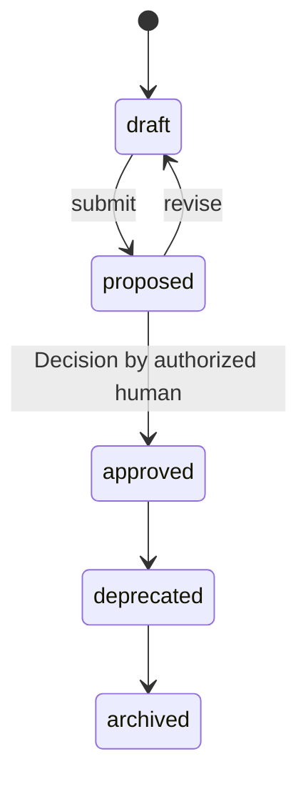
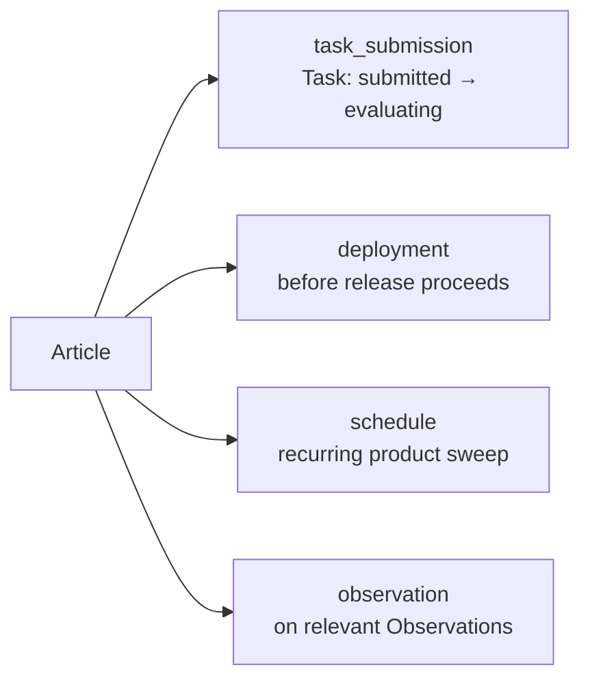

# PP-0005: Product Constitution

| Field | Value |
| --- | --- |
| **PP** | 0005 |
| **Title** | Product Constitution |
| **Status** | Draft |
| **Authors** | Product Protocol Contributors |
| **Created** | 2026-07-03 |
| **Updated** | 2026-07-03 |
| **Version** | 0.1.0 |
| **Requires** | PP-0002 |

## Abstract

This document defines the `Constitution` kind: a versioned set of
**Articles** — rules that hold for the entire Product at all times, are
continuously evaluated at defined enforcement points, and are changeable
only by human-approved amendment. It specifies the Article model, article
categories, enforcement semantics (blocking vs. advisory), the amendment
process, and precedence rules when articles conflict with each other or
with Specifications. Conformance to this document (with PP-0002)
constitutes the **PP/Constitution** conformance class.

## Motivation *(Informative)*

Specifications say what to build; nothing in them says what must *never*
be violated while building it. An autonomous system that optimizes for
acceptance criteria alone will happily trade away security headers,
accessibility, or an architectural boundary to make a test pass — each
individually reasonable, collectively ruinous.

Human organizations solve this with standing rules that outrank any
single project: security policy, coding standards, brand and
accessibility guidelines, error budgets. The Constitution is that
mechanism made machine-readable and machine-enforced: a small, stable,
human-ratified set of Articles that every Task, Deployment, and running
system is continuously checked against. It is deliberately hard to
change — amendment requires the full governed-object approval cycle —
because its value is precisely that no agent, and no single enthusiastic
change, can move it.

Prior art: constitutional AI rulesets, Open Policy Agent policy-as-code,
SRE error budgets, and architecture fitness functions. The Constitution
differs in being part of the Product's own object tree: versioned,
diffable, and bound to enforcement points of the protocol's lifecycles.

## Terminology

*Constitution*, *Constitution Article*, *Governed Object*, *Evaluation*,
*Evaluator*, *Quality Gate*, *Golden Test*, *Issue*, *Observation*,
*Decision*, *Task*, *Deployment* — per the
[glossary](../reference/glossary.md).

The key words **MUST**, **MUST NOT**, **REQUIRED**, **SHALL**, **SHALL
NOT**, **SHOULD**, **SHOULD NOT**, **RECOMMENDED**, **NOT RECOMMENDED**,
**MAY**, and **OPTIONAL** in this document are to be interpreted as
described in BCP 14 [RFC 2119] [RFC 8174] when, and only when, they appear
in all capitals, as shown here.

## Specification

### §1 Overview and Role

A `Constitution` is the Product's standing law. Where a Specification
(PP-0004) is scoped — it defines particular Capabilities and Features —
a Constitution is total: its Articles apply to the **entire Product at
all times**, to every Task, every Artifact, every Deployment, and the
running system itself.

Three properties define the kind:

1. **Universal scope.** An Article needs no enumeration of what it
   applies to; it applies to everything unless it says otherwise.
2. **Continuous evaluation.** Articles are not reviewed once and filed;
   each Article declares *when* it is checked (`enforcement.evaluatedOn`),
   and implementations check it there, every time.
3. **Human-controlled change.** A Constitution is a governed object
   (PP-0002 §6.2). Its approved versions are immutable; it changes only
   by amendment — a new version, drafted, proposed, and approved by a
   human Decision.

The Product object lists its active Constitutions in
`spec.constitutions` (PP-0002 §9). Every active Constitution's Articles
are in force simultaneously. Constitution objects are stored under
`.product/constitution/` in the Git binding (PP-0002 §7).

Enforcement plugs into machinery defined elsewhere and referenced here
by name only: `Evaluation`, `Evaluator`, `GoldenTest`, and `QualityGate`
are specified in PP-0008; `Issue` and `Observation` in PP-0010 and
PP-0006.

### §2 The Constitution Kind

#### §2.1 Definition

A `Constitution` is a versioned set of Articles: identified,
categorized, normatively phrased rules, each with an enforcement
binding. It MAY open with a preamble stating the product's non-negotiable
character in prose.

#### §2.2 Responsibilities

- Hold the rules that outrank every Specification, Story, and Task
  instruction.
- Bind each rule to concrete enforcement points and, where available,
  executable checks.
- Record sanctioned exceptions explicitly, with expiry, rather than
  letting them accumulate as folklore.

#### §2.3 Lifecycle

Governed object per PP-0002 §6.2. The state machine, exactly:



Only Articles of an **approved** Constitution version are in force.
A `draft` or `proposed` Constitution binds nothing; a `deprecated`
Constitution ceases to bind once a successor version is approved (§6).

#### §2.4 Inputs and Outputs

- **Inputs:** human policy intent; hard lessons (Issues, incident
  Observations) distilled into standing rules; regulatory obligations.
- **Outputs:** evaluation demands at each enforcement point;
  Evaluations recording compliance or violation; Issues opened on
  violation; blocked transitions when blocking Articles fail.

#### §2.5 Relationships

| Direction | Kind | Via | Meaning |
| --- | --- | --- | --- |
| in | Product | `spec.constitutions` | Marks this Constitution active (PP-0002 §9). |
| out | GoldenTest, QualityGate, Evaluator | `articles[].enforcement.evaluations` | Executable checks operationalizing an Article. |
| out | Decision | `articles[].exceptions[].approvedBy` | Human authority behind an exception. |
| in | Evaluation | subject/criteria | Records of each Article check (PP-0008). |
| in | Issue | raised-by | Violations demanding resolution. |
| in | Decision | approval | The Decision approving each version. |

#### §2.6 Fields

| Field | Type | Req | Description |
| --- | --- | --- | --- |
| `spec.preamble` | string (prose) | MAY | The product's standing character and the spirit in which Articles are to be read. |
| `spec.articles` | list[Article] | MUST | ≥ 1 Article, per the model of §4. |

Schema: [`schemas/constitution/constitution.schema.json`](../schemas/constitution/constitution.schema.json).

### §3 Article Categories

Every Article declares exactly one category. Categories exist so that
tooling can route checks to the right Evaluators and humans can audit
coverage ("do we have any accessibility articles at all?").

| Category | Typical subject matter |
| --- | --- |
| `security` | Secrets handling, authentication, data exposure, dependencies. |
| `performance` | Latency/size/resource budgets the product must stay within. |
| `accessibility` | Assistive-technology and perception requirements (e.g. WCAG). |
| `compliance` | Legal and regulatory obligations (privacy, retention, audit). |
| `architecture` | Boundaries, layering, and dependency rules of the system. |
| `coding_standards` | Language, style, and review rules for produced code. |
| `ux` | Interaction laws that hold across all features. |
| `reliability` | Availability, error budgets, rollback and recovery rules. |

The category list is closed in protocol version 0.1; rules that fit no
category best belong in the closest one, with the fit explained in
`rationale`.

### §4 The Constitution Article Model

An **Article** is a single rule with identity, normative text, and an
enforcement binding:

| Field | Type | Req | Description |
| --- | --- | --- | --- |
| `id` | string | MUST | Stable article id, unique within the Constitution (e.g. `SEC-1`). Never reused for a different rule. |
| `category` | enum | MUST | One of the categories of §3. |
| `rule` | string (prose) | MUST | The rule itself, written with BCP 14 keywords so its force is unambiguous. |
| `rationale` | string (prose) | MAY | Why the rule exists; the incident or obligation behind it. |
| `enforcement` | Enforcement | MUST | How and when the rule is checked (§4.1). |
| `exceptions` | list[Exception] | MAY | Explicit, bounded carve-outs (§4.2). |

#### §4.1 Enforcement

| Field | Type | Req | Description |
| --- | --- | --- | --- |
| `enforcement.mode` | enum | MUST | `blocking` — a violation prevents the guarded transition; `advisory` — a violation is recorded and raised but does not block. |
| `enforcement.evaluatedOn` | list[enum] | MUST | ≥ 1 of: `task_submission` (when a Task's output is submitted for evaluation), `deployment` (before a Deployment proceeds), `schedule` (recurring sweep of the whole Product), `observation` (when relevant Observations are recorded from the running system). |
| `enforcement.evaluations` | list[Ref] | MAY | Refs to `GoldenTest`, `QualityGate`, or `Evaluator` objects (PP-0008) that operationalize the check. Absent ⇒ the Article is checked by whatever Evaluator handles its category and point. |
| `enforcement.monitor` | string (prose) | MAY | For `schedule`/`observation` points: what to watch and how (metric, threshold, source). |

#### §4.2 Exceptions

An exception is a sanctioned, bounded suspension of an Article for a
described case — never a silent one.

| Field | Type | Req | Description |
| --- | --- | --- | --- |
| `description` | string (prose) | MUST | Precisely what is exempted, and why. |
| `approvedBy` | Ref | MAY | Ref to the `Decision` authorizing the exception. |
| `expiresAt` | string (RFC 3339) | MAY | Instant after which the exception is void. Absent ⇒ standing (NOT RECOMMENDED). |

An exception is **active** if its `expiresAt` is absent or in the
future. Expired exceptions MUST be ignored by enforcement. For a
`blocking` Article, an exception suppresses enforcement only if it is
active **and** carries `approvedBy` referencing a Decision — an
unapproved exception never unblocks anything. Exceptions SHOULD carry
`expiresAt`; standing exceptions are a sign the Article itself needs
amendment.

### §5 Continuous Evaluation and Enforcement

#### §5.1 Evaluation points

Each Article is evaluated at every point listed in
`enforcement.evaluatedOn`:



- `task_submission` — checked as part of evaluating a submitted Task
  (PP-0006 task lifecycle), before the Task may be accepted as `done`.
- `deployment` — checked before a Deployment (PP-0010) proceeds into
  its target environment.
- `schedule` — checked on a recurring cadence against the Product as a
  whole. The cadence is implementation-defined but MUST be bounded: an
  implementation MUST declare its sweep interval and honor it.
- `observation` — checked whenever an Observation relevant to the
  Article (per `enforcement.monitor`) is recorded from the running
  system.

#### §5.2 Blocking semantics

For every Article with `mode: blocking`, the implementation MUST
evaluate the Article at each of its `evaluatedOn` points **before the
guarded transition completes**, and MUST NOT complete that transition
while an unresolved violation of the Article stands, unless an active,
Decision-approved exception (§4.2) covers the case. For
`task_submission` the guarded transition is Task acceptance; for
`deployment` it is the Deployment proceeding. `schedule` and
`observation` points guard no single transition; a blocking violation
found there MUST instead block the *next* guarded transition of the
affected scope until resolved, in addition to the duties of §5.3.

#### §5.3 Violation handling

Every detected violation — blocking or advisory, at any point — MUST:

1. produce an `Evaluation` record (PP-0008) with verdict `fail`,
   referencing the Constitution at its exact version and the violated
   Article `id`, with the evidence that shows the violation; and
2. open an `Issue` referencing that Evaluation, so the violation enters
   the planning loop and cannot be silently dropped.

Advisory violations MUST NOT block any transition; their entire force is
the Evaluation and the Issue. Implementations SHOULD deduplicate: a
persisting violation already tracked by an open Issue does not need a
new Issue per sweep, but each evaluation run still records its
Evaluation.

Compliance runs (verdict `pass`) SHOULD also be recorded at blocking
points, so that "this Deployment was checked against Constitution
vX.Y.Z" is reconstructible from the record alone.

### §6 The Amendment Process

A Constitution changes only by amendment, which is the governed-object
version cycle of PP-0002 §6.2 applied deliberately:

1. **Draft.** Anyone — human or agent — MAY author a new version of the
   Constitution (`same metadata.id`, higher `metadata.version`,
   lifecycle `draft`) containing the changed, added, or removed
   Articles.
2. **Propose.** The draft is submitted (`draft → proposed`) with its
   diff against the currently approved version.
3. **Approve.** Only a human MAY approve (`proposed → approved`), and
   the approval MUST be recorded as a Decision referencing the exact
   version (PP-0002 [PP-0002-RQ-008]). Autonomous agents MUST NOT
   perform or induce this transition ([PP-0002-RQ-010]).
4. **Supersede.** Upon approval of version N, the previously approved
   version SHOULD be moved to `deprecated`; Articles of the new version
   are in force from the moment of approval.

Approved Constitution versions are immutable ([PP-0002-RQ-009]) — this
is what "constitution" means here. Article `id`s are part of the
Constitution's public surface: an amendment MAY remove an Article or
change its `rule`, but MUST NOT reuse a retired `id` for a different
rule, because Evaluations, Issues, and Decisions cite Article ids
across versions. Removing or weakening an Article is a MAJOR version
change; adding an Article or tightening enforcement is MINOR; editorial
changes are PATCH (PP-0002 §6.1).

### §7 Conflicts and Precedence

Conflicts are resolved by explicit precedence; where precedence cannot
decide, humans do.

1. **Constitution over Specification.** If an Article conflicts with
   any Specification, Feature, Story, acceptance criterion, or Task
   instruction, the Article prevails. Content of governed definition
   objects MUST NOT be interpreted as overriding, suspending, or
   satisfying-by-redefinition any Article. The only ways around an
   Article are an exception (§4.2) or an amendment (§6).
2. **Article over Article — specificity.** If two Articles of the
   active Constitution set conflict in a given case, the Article whose
   terms address the case more specifically prevails for that case
   (e.g. an Article about payment-data logging over a general logging
   Article).
3. **Unresolvable conflicts.** If an implementation cannot determine
   which Article prevails, it MUST NOT guess: it MUST open an Issue
   describing the conflict for human resolution, and until resolved it
   MUST treat any transition guarded by either conflicting `blocking`
   Article as blocked. The lasting fix for a recurring conflict is an
   amendment, not a tie-breaking heuristic.

Precedence never *disables* the losing Article; it decides one case.
Both Articles remain in force everywhere their terms do not collide.

## Normative Requirements

- **[PP-0005-RQ-001]** A `Constitution` object MUST carry
  `metadata.lifecycle` and follow the governed lifecycle of PP-0002
  §6.2 exactly; only Articles of an `approved` version are in force.
  (§2.3)
- **[PP-0005-RQ-002]** `spec.articles` MUST contain at least one
  Article. (§2.6)
- **[PP-0005-RQ-003]** Article `id`s MUST be unique within their
  Constitution, MUST remain stable across versions, and MUST NOT be
  reused for a different rule. (§4, §6)
- **[PP-0005-RQ-004]** Every Article MUST declare exactly one
  `category` from the closed list of §3. (§3, §4)
- **[PP-0005-RQ-005]** Every Article `rule` MUST state its requirement
  using BCP 14 keywords. (§4)
- **[PP-0005-RQ-006]** Every Article MUST carry an `enforcement`
  binding with `mode` (`blocking` or `advisory`) and `evaluatedOn`
  listing at least one evaluation point. (§4.1)
- **[PP-0005-RQ-007]** Implementations MUST evaluate the Articles of
  every active Constitution referenced by the Product's
  `spec.constitutions`, at each Article's declared evaluation points.
  (§1, §5.1)
- **[PP-0005-RQ-008]** An implementation MUST declare a bounded sweep
  interval for `schedule` evaluation points and honor it. (§5.1)
- **[PP-0005-RQ-009]** For every `blocking` Article, the implementation
  MUST complete the Article's evaluation before the guarded transition
  completes, and MUST NOT complete that transition while an unresolved
  violation stands, absent an active approved exception. (§5.2)
- **[PP-0005-RQ-010]** Every detected Article violation MUST produce an
  `Evaluation` with verdict `fail` referencing the Constitution's exact
  version and the violated Article `id`. (§5.3)
- **[PP-0005-RQ-011]** Every detected Article violation MUST open an
  `Issue` referencing the failing Evaluation; advisory violations MUST
  NOT block any transition. (§5.3)
- **[PP-0005-RQ-012]** Enforcement MUST ignore expired exceptions; for
  a `blocking` Article, an exception suppresses enforcement only if it
  is active and carries `approvedBy` referencing a `Decision`. (§4.2)
- **[PP-0005-RQ-013]** A Constitution MUST be changed only by
  amendment: a new `metadata.version` entering the lifecycle at
  `draft`; approved versions are immutable per PP-0002
  [PP-0002-RQ-009]. (§6)
- **[PP-0005-RQ-014]** Autonomous agents MUST NOT perform the
  `proposed → approved` transition of a Constitution, per PP-0002
  [PP-0002-RQ-010]; the approval MUST be recorded as a Decision
  referencing the exact version per [PP-0002-RQ-008]. (§6)
- **[PP-0005-RQ-015]** On conflict between an Article and any
  Specification, Feature, Story, acceptance criterion, or Task
  instruction, the Article MUST prevail; definition-object content MUST
  NOT be interpreted as overriding an Article. (§7)
- **[PP-0005-RQ-016]** When two Articles conflict in a case, the more
  specific Article prevails for that case; if the implementation cannot
  determine precedence, it MUST NOT guess — it MUST open an Issue for
  human resolution and MUST treat transitions guarded by either
  conflicting blocking Article as blocked until resolution. (§7)

## Examples *(Informative)*

A Constitution with Articles across categories
(`.product/constitution/aurora-constitution.yaml`):

```yaml
pp: "0.1"
kind: Constitution
metadata:
  id: aurora-constitution
  name: Aurora Books Constitution
  version: 2.1.0
  lifecycle: approved
  createdAt: 2026-05-01T09:00:00Z
  updatedAt: 2026-06-20T10:00:00Z
  owners:
    - { type: human, id: dana@example.com, name: Dana Ito }
spec:
  preamble: >
    Aurora Books is trusted with readers' money, addresses, and reading
    habits. These Articles hold for every change, every deployment, and
    the running product, at all times. Read them strictly; when in
    doubt, they win.
  articles:
    - id: SEC-1
      category: security
      rule: >
        Secrets, credentials, and API keys MUST NOT appear in source
        code, configuration files under version control, or logs.
      rationale: >
        Incident 2026-03: a payment-provider key committed to a branch
        reached a public fork.
      enforcement:
        mode: blocking
        evaluatedOn: [task_submission, deployment]
        evaluations:
          - ref: { kind: QualityGate, id: gate-secret-scan }
    - id: PERF-1
      category: performance
      rule: >
        The 95th-percentile server response time of any user-facing
        endpoint MUST remain at or below 300 ms in production.
      enforcement:
        mode: blocking
        evaluatedOn: [deployment, observation]
        monitor: >
          p95 latency per endpoint from production telemetry, 1-hour
          window; violation when above 300 ms for two consecutive
          windows.
    - id: A11Y-1
      category: accessibility
      rule: >
        Every user-facing page MUST satisfy WCAG 2.2 level AA, and all
        interactive flows MUST be operable by keyboard alone.
      enforcement:
        mode: blocking
        evaluatedOn: [task_submission]
        evaluations:
          - ref: { kind: QualityGate, id: gate-a11y-audit }
    - id: ARCH-1
      category: architecture
      rule: >
        Frontend code MUST NOT access data stores directly; all data
        access MUST go through the published API layer.
      rationale: Keeps the storage schema replaceable and auditable.
      enforcement:
        mode: blocking
        evaluatedOn: [task_submission]
    - id: CODE-1
      category: coding_standards
      rule: >
        All TypeScript MUST compile under strict mode, and the `any`
        type MUST NOT be introduced.
      enforcement:
        mode: blocking
        evaluatedOn: [task_submission]
        evaluations:
          - ref: { kind: QualityGate, id: gate-typecheck-strict }
    - id: UX-1
      category: ux
      rule: >
        Destructive actions MUST require explicit confirmation and
        SHOULD be undoable for at least 10 seconds after execution.
      enforcement:
        mode: advisory
        evaluatedOn: [task_submission]
    - id: REL-1
      category: reliability
      rule: >
        Monthly availability of the storefront MUST be at least 99.9%;
        deployments MUST NOT proceed while the remaining monthly error
        budget is exhausted.
      enforcement:
        mode: blocking
        evaluatedOn: [deployment, observation]
        monitor: >
          Error-budget burn from availability SLO; violation when the
          30-day budget is spent.
    - id: COMP-1
      category: compliance
      rule: >
        A verified user request to delete personal data MUST be honored
        completely within 30 days, including backups reachable by
        restore.
      enforcement:
        mode: blocking
        evaluatedOn: [schedule]
        monitor: >
          Weekly sweep of open deletion requests against their age.
      exceptions:
        - description: >
            Order records required for tax law are retained 10 years
            with personal fields pseudonymized.
          approvedBy: { ref: { kind: Decision, id: dec-tax-retention } }
          expiresAt: 2027-01-01T00:00:00Z
```

An amendment in flight (metadata excerpts):

```yaml
# v2.1.0 — approved and in force, immutable
metadata: { id: aurora-constitution, version: 2.1.0, lifecycle: approved }
---
# v3.0.0 — drafted amendment removing UX-1, awaiting human decision
metadata: { id: aurora-constitution, version: 3.0.0, lifecycle: proposed }
```

## Security Considerations

- **The Constitution is a privilege boundary.** Blocking Articles are
  the strongest automated control in the protocol; the human-only
  amendment rule ([PP-0005-RQ-013], [PP-0005-RQ-014]) is what keeps an
  agent from loosening its own constraints. Implementations SHOULD bind
  Constitution approvals to strong identity (signed commits, verified
  Decision records).
- **Exception abuse.** Exceptions are the designed bypass; that is why
  a blocking Article's exception requires a Decision and expires
  ([PP-0005-RQ-012]). Implementations SHOULD surface all active
  exceptions in any compliance report, and SHOULD alert on standing
  (non-expiring) exceptions.
- **Evaluator integrity.** An Article is only as strong as the check in
  `enforcement.evaluations`. Evaluators and QualityGates referenced by
  blocking Articles are prime tampering targets; PP-0008's evidence
  requirements apply, and changes to those objects SHOULD be reviewed
  with the same care as the Article itself.
- **Prompt injection.** Article `rule` text is read by agents.
  Conversely, content an agent reads elsewhere (code comments, issue
  text) may *claim* to amend or waive the Constitution; per
  [PP-0005-RQ-015] such claims are void, and implementations MUST treat
  only the object tree — not conversational or file content — as the
  source of active Articles.

## Future Work *(Informative)*

- Scoped articles (per-environment or per-Capability applicability)
  without weakening the default of universal scope.
- A standard library of reusable Article templates per category (OWASP,
  WCAG, SLO patterns).
- Machine-readable conflict declarations between Articles, so
  precedence (§7) can be verified statically.
- Aggregated compliance status on `Constitution.status` for dashboards.

## References

- [PP-0002 — Core Concepts and Object Model](./PP-0002-core-concepts.md)
- [PP-0004 — Product Specification](./PP-0004-product-specification.md)
- [Object Model](../reference/object-model.md) ·
  [Glossary](../reference/glossary.md) ·
  [Terminology](../reference/terminology.md)
- Schema:
  [`schemas/constitution/constitution.schema.json`](../schemas/constitution/constitution.schema.json)
- [BCP 14 / RFC 2119 / RFC 8174](https://www.rfc-editor.org/info/bcp14)
- WCAG 2.2 — Web Content Accessibility Guidelines *(informative)*
- Open Policy Agent — policy as code *(informative)*
