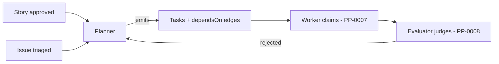
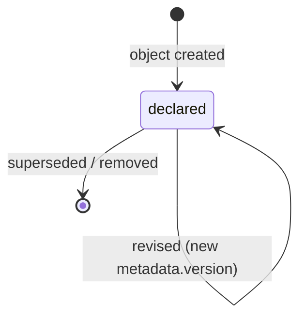
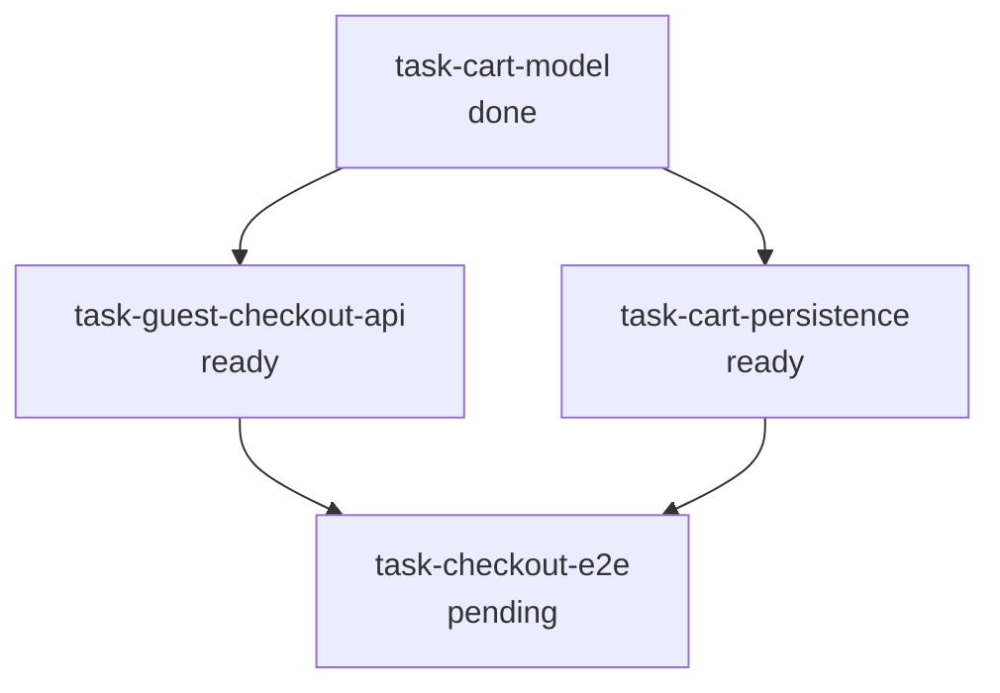
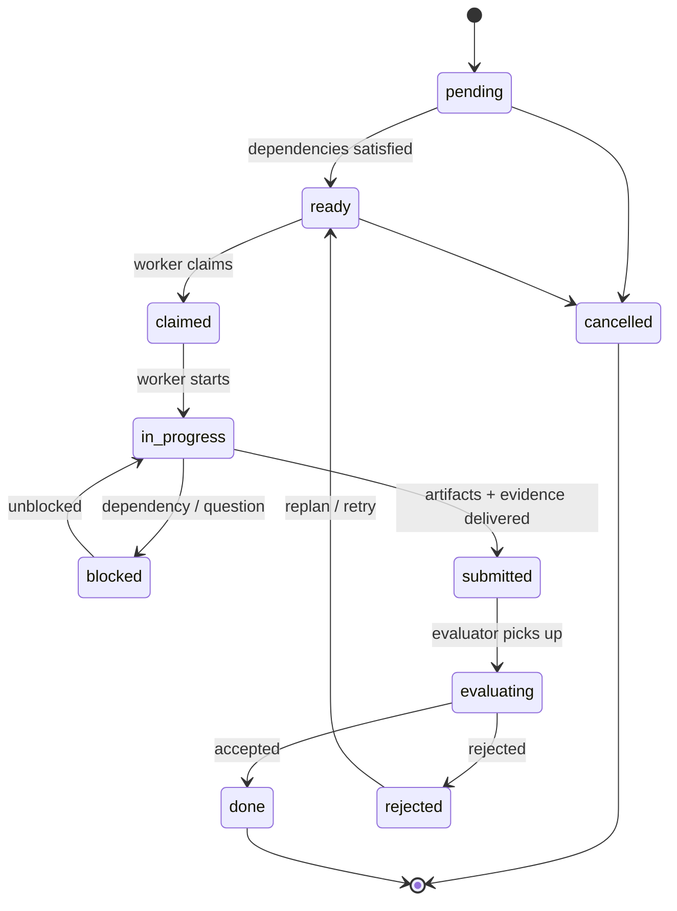

# PP-0006: Task Graph and Planning

| Field | Value |
| --- | --- |
| **PP** | 0006 |
| **Title** | Task Graph and Planning |
| **Status** | Draft |
| **Authors** | Product Protocol Contributors |
| **Created** | 2026-07-03 |
| **Updated** | 2026-07-03 |
| **Version** | 0.1.0 |
| **Requires** | PP-0002 |

## Abstract

This document defines how approved product intent becomes schedulable
work: the `Task` kind (the atomic unit of work and its state machine),
the **Task Graph** (the dependency DAG formed by Tasks), the `Planner`
kind (the actor that decomposes Stories and Issues into Tasks), and the
rules for priority, scheduling, work allocation, and replanning. It
also defines the `Issue` kind's data model and its planning role — how
Issues become Tasks. Conformance to this document (with PP-0002)
constitutes the **PP/Planner** conformance class.

## Motivation *(Informative)*

Between "what to build" (PP-0004 Stories) and "who does the work"
(PP-0007 Workers) sits planning: turning approved intent into small,
independently evaluable units with explicit dependencies. Without a
shared task model, orchestrators cannot exchange work, workers cannot
be substituted, and evaluation cannot be attached to anything stable.
The Task Graph makes the execution frontier of a Product inspectable:
at any moment, anyone — human or agent — can read `.product/tasks/`
and know what is ready, what is blocked, what was rejected and why.
The design deliberately avoids a separate "plan" object: the plan *is*
the set of Tasks, so there is nothing to drift out of sync.

## Terminology

*Task*, *Task Graph*, *Planner*, *Issue*, *Story*, *Feature*, *Worker*,
*Evaluator*, *Governed Object*, *Acceptance Criteria* — per the
[glossary](../reference/glossary.md).

The key words **MUST**, **MUST NOT**, **REQUIRED**, **SHALL**, **SHALL
NOT**, **SHOULD**, **SHOULD NOT**, **RECOMMENDED**, **NOT RECOMMENDED**,
**MAY**, and **OPTIONAL** in this document are to be interpreted as
described in BCP 14 [RFC 2119] [RFC 8174] when, and only when, they appear
in all capitals, as shown here.

## Specification

### §1 Overview

Planning in Product Protocol is the closed step that converts governed
intent into executable structure:



The pieces defined here:

- **§2** — the planning model: which sources a Planner may plan from,
  and what a decomposition must preserve.
- **§3** — the `Planner` kind: the declared actor that plans.
- **§4** — the **Task Graph**: the DAG formed by Tasks and their
  `dependsOn` edges.
- **§5** — the `Task` kind and its state machine.
- **§6** — priority and scheduling of ready Tasks.
- **§7** — work allocation: matching Tasks to Workers by capability.
- **§8** — replanning: reacting to rejections, Issues, and
  specification changes.

Execution of Tasks is PP-0007's contract; judgment of submitted work
is PP-0008's. This document owns everything about a Task *except* how
it is executed and how it is judged.

### §2 Planning Model

#### §2.1 Sources of work

A Task exists only to advance something the humans governing the
Product have sanctioned. Exactly two families of source are valid:

1. **Governed intent** — a `Story` or `Feature` (PP-0004) whose
   `metadata.lifecycle` is `approved`. A Planner MUST NOT create Tasks
   tracing to a Story or Feature in any other lifecycle state
   (`draft`, `proposed`, `deprecated`, `archived`).
2. **Triaged Issues** — an `Issue` (§2.3) whose `status.state` is
   `triaged` or later. A Planner MUST NOT create Tasks tracing to an
   Issue that is still `open`.

Planning from unapproved sources is the primary way an autonomous
system escapes human governance; these two rules close that door.
Every Task declares its source in `spec.tracesTo` (§5.4), giving the
Product end-to-end traceability from running code back to a human
decision.

#### §2.2 Decomposition

A Planner decomposes a source into one or more Tasks. Decomposition is
correct when:

- every Task's `spec.intent` is achievable by a single Worker in a
  single claim;
- the union of the Tasks' completion contracts (§5.5) covers the
  source's acceptance criteria — a Story SHOULD NOT be considered
  satisfied while any of its acceptance criteria is not covered by
  some Task's `spec.completion`;
- ordering constraints are expressed as `dependsOn` edges, never as
  prose;
- each Task carries, in `spec.context`, the Knowledge, Specification
  slices, and Constitution articles a Worker needs — context selection
  follows PP-0009 retrieval.

Decomposition granularity is a quality of implementation concern; the
protocol constrains only the structure above.

#### §2.3 The Issue kind (planning role)

An `Issue` is a tracked defect, risk, or anomaly requiring resolution
— raised from Observations, rejected Evaluations, Constitution
violations, or humans. Its triage lifecycle
(`open → triaged → planned → resolved → closed`) is defined in
PP-0010 §6.4; this document defines its data model and how it enters
the Task Graph.

**Definition.** A record of something wrong or risky, carrying enough
structure (severity, source, affected objects) for a Planner to act
on it.

**Responsibilities.** Capture the anomaly durably; carry triage
severity; link the evidence that raised it; accumulate the Tasks
spawned to resolve it.

**Lifecycle.** Per PP-0010 §6.4. States: `open`, `triaged`, `planned`,
`resolved`, `closed`, held in `status.state`. For planning purposes:
an Issue becomes plannable at `triaged`; when a Planner emits Tasks
for it, the Issue moves to `planned` and the Tasks are recorded in
`status.tasks`; when all such Tasks are `done`, the Issue is eligible
for `resolved`.

**Inputs.** Observations, Evaluations, human reports, Constitution
enforcement (via `spec.source`).

**Outputs.** Tasks (via replanning, §8), recorded in `status.tasks`.

**Relationships.** `spec.source.ref` → the raising record;
`spec.affects` → impaired objects; `status.tasks` → resolving Tasks;
resolving Tasks point back via `spec.tracesTo`.

| Field | Type | Req | Description |
| --- | --- | --- | --- |
| `spec.title` | string | MUST | One-line summary. |
| `spec.description` | string (prose) | MUST | What is wrong, how it manifests, reproduction if known. |
| `spec.severity` | string | MUST | Enum: `critical`, `high`, `medium`, `low`. |
| `spec.source` | object | MAY | Where the Issue came from. |
| `spec.source.type` | string | MUST (in `source`) | Enum: `observation`, `evaluation`, `human`, `constitution_violation`. |
| `spec.source.ref` | Ref | MAY | The raising record (Observation, Evaluation, …). |
| `spec.affects` | list[Ref] | MAY | Objects impaired by the Issue. |
| `spec.resolution` | string (prose) | MAY | How the Issue was (or is to be) resolved. |
| `status.state` | string | MUST (in `status`) | Enum: `open`, `triaged`, `planned`, `resolved`, `closed`. |
| `status.tasks` | list[Ref→Task] | MAY | Tasks spawned to resolve this Issue. |

Schema: [`schemas/task/issue.schema.json`](../schemas/task/issue.schema.json).

### §3 The Planner Kind

**Definition.** A `Planner` is an actor declaration: an agent, human,
or hybrid participant authorized to decompose approved sources into
Tasks and to maintain the Task Graph. Like all actor kinds
(object model §6), it declares *who may do what* and holds no work
state.

**Responsibilities.**

- Decompose approved Stories/Features and triaged Issues into Tasks
  (§2).
- Maintain `dependsOn` edges and keep the graph acyclic (§4).
- Assign priorities and constraints (§6).
- Replan on rejection, Issues, and specification change (§8).
- Never execute or evaluate work — those are Worker (PP-0007) and
  Evaluator (PP-0008) roles.

**Lifecycle.** Planner is not a governed object and has no work-state
machine. A Planner declaration follows ordinary object versioning
(PP-0002 §6.1): it is created, revised as new `metadata.version`s, and
superseded.



**Inputs.** Approved Stories/Features, triaged Issues, rejected
Evaluations (PP-0008), Observations (PP-0010), the current Task Graph.

**Outputs.** Task objects and updates to unstarted Tasks' `spec`
(subject to §5.7 immutability rules).

**Relationships.** Emits `Task`s; reads `Story`, `Feature`, `Issue`,
`Evaluation`, `Observation`; is constrained by `Constitution`.

| Field | Type | Req | Description |
| --- | --- | --- | --- |
| `spec.description` | string (prose) | MUST | What this Planner is and how it plans. |
| `spec.type` | string | MUST | Enum: `agent`, `human`, `hybrid`. |
| `spec.policies` | object | MAY | Declared planning policies. |
| `spec.policies.scheduling` | string | MAY | Enum: `priority_fifo`, `deadline_first`, `custom` (§6). |
| `spec.policies.maxParallelism` | integer ≥ 1 | MAY | Maximum Tasks it will keep claimable concurrently. |
| `spec.policies.replanOn` | list[string] | MAY | Enum items: `rejection`, `issue`, `specification_change`, `observation` (§8). |
| `spec.capabilities` | list[string] | MAY | Capability tags (§7 namespace) describing what it can plan. |

Schema: [`schemas/task/planner.schema.json`](../schemas/task/planner.schema.json).

### §4 The Task Graph

The **Task Graph** of a Product is the directed graph whose nodes are
the Product's `Task` objects and whose edges are their `spec.dependsOn`
references: an edge A → B (`A.spec.dependsOn` contains B) means *A
cannot start until B is done*.

Rules:

- **The graph is the Tasks.** The Task Graph is exactly the set of
  Task objects stored under `.product/tasks/` (PP-0002 §7). There is
  **no separate graph object**; implementations MUST derive the graph
  from the Task objects and MUST NOT require any additional
  registration for a Task to be part of the graph.
- **Acyclic.** The graph MUST be acyclic. Validators MUST reject a
  Product whose Task Graph contains a dependency cycle. Planners MUST
  check acyclicity before emitting an edge.
- **Edges are Tasks.** Every `dependsOn` entry MUST reference a `Task`
  in the same Product. Dangling edges are dangling refs (PP-0002 §5).
- **Readiness.** A Task's dependencies are *satisfied* when every Task
  referenced by its `spec.dependsOn` has `status.state: done`. A Task
  MUST NOT transition `pending → ready` before its dependencies are
  satisfied. A Task with no `dependsOn` is satisfied trivially.
- **Cancelled dependencies.** A dependency in `cancelled` is not
  satisfied; the Planner MUST replan the dependent Task (rewire or
  cancel it, §8) — it never becomes `ready` over a cancelled edge.



*(Arrows point from prerequisite to dependent for readability; in the
objects, the dependent carries the `dependsOn` ref.)*

### §5 The Task Kind

#### §5.1 Definition

A `Task` is the atomic unit of schedulable work: produced by a
Planner, claimed and executed by exactly one Worker at a time
(PP-0007 §3), judged by an Evaluator (PP-0008). Its `spec` is the work
order — intent, provenance, context, completion contract, constraints
— and its `status` is the live work state.

#### §5.2 Responsibilities

- Carry a single, self-contained statement of intent a Worker can act
  on without renegotiation.
- Trace to exactly one governed or triaged source (§5.4).
- Declare its completion contract — the criteria and evaluations that
  decide acceptance — *before* becoming claimable (§5.5).
- Record the execution trail: attempts, worker, timestamps, blockers.

#### §5.3 Lifecycle

Task state lives in `status.state`. The state machine below is the
canonical work-object machine (object model §4); kind or vendor
extensions MUST NOT remove states or transitions from it.



Transition semantics:

- `pending → ready` — dependencies satisfied (§4) **and** the
  completion contract is present (§5.5).
- `ready → claimed` — atomic claim by a capability-matched Worker
  (§7, PP-0007 §3). Sets `status.worker`, `status.claimedAt`,
  increments `status.attempts`.
- `claimed → in_progress` — the Worker starts executing.
- `in_progress ⇄ blocked` — the Worker records an obstacle it cannot
  resolve (`status.blockedReason`, PP-0007 §5) and later resumes.
- `in_progress → submitted` — Artifacts and evidence delivered
  (PP-0007 §7). Sets `status.submittedAt`.
- `submitted → evaluating` — an Evaluator picks the submission up
  (PP-0008).
- `evaluating → done` — accepted. Sets `status.completedAt`. A `done`
  Task is **immutable**: implementations MUST reject any subsequent
  change to its `spec` or `status`.
- `evaluating → rejected` — not accepted; the Evaluation record says
  why.
- `rejected → ready` — retry or replan, per §8.2 only.
- `pending|ready → cancelled` — withdrawn by the Planner before any
  Worker holds it. `cancelled` and `done` are the only terminal
  states; a claimed or later Task cannot be cancelled directly — it
  must first travel its normal path (or be released back to `ready`,
  PP-0007 §3).

Transitions not shown MUST be rejected, and states MUST NOT be
skipped.

#### §5.4 Traceability

`spec.tracesTo` holds **exactly one** Ref, to a `Story`, `Feature`, or
`Issue` (object model §3 cardinality). It is the Task's justification;
a Task with no valid `tracesTo` target is unplannable and MUST be
reported by validators as an error (dangling ref, PP-0002 §5).

#### §5.5 Completion contract

`spec.completion` declares how the Task will be judged:

- `criteria` — human-readable acceptance criteria, each with a stable
  `id` so Evaluations can cite them;
- `evaluations` — refs to `GoldenTest`s and `QualityGate`s (PP-0008)
  that MUST pass for acceptance;
- `artifacts` — the artifact types (PP-0007 §6) the Worker is expected
  to produce.

A Task without any completion contract cannot be evaluated, so it must
never reach a Worker: a Task MUST carry at least one `completion`
criterion or at least one `completion` evaluation ref before it may
transition to `ready`.

#### §5.6 Field reference

| Field | Type | Req | Description |
| --- | --- | --- | --- |
| `spec.intent` | string (prose) | MUST | What to accomplish, self-contained for a single Worker. |
| `spec.tracesTo` | Ref | MUST | Exactly one parent: `Story`, `Feature`, or `Issue` (§5.4). |
| `spec.dependsOn` | list[Ref→Task] | MAY | Prerequisite Tasks; the graph edges (§4). |
| `spec.priority` | string | MAY | Enum: `critical`, `high`, `medium`, `low`. Default `medium` (§6). |
| `spec.capabilities` | list[string] | MAY | Capability tags required to execute (§7). |
| `spec.context` | object | MAY | Curated execution context (PP-0007 §4). |
| `spec.context.knowledge` | list[Ref→Knowledge] | MAY | Knowledge selected per PP-0009 retrieval. |
| `spec.context.specifications` | list[Ref→Specification\|Story] | MAY | Specification material at exact versions. |
| `spec.context.constitutionArticles` | list[string] | MAY | Article ids (PP-0005 §4) in scope for this Task. |
| `spec.context.notes` | string (prose) | MAY | Planner guidance to the Worker. |
| `spec.completion` | object | Conditional | Completion contract; REQUIRED before `ready` (§5.5). |
| `spec.completion.criteria[]` | list[object] | MAY | Each `{id: string MUST, statement: prose MUST}`. |
| `spec.completion.evaluations` | list[Ref→GoldenTest\|QualityGate] | MAY | Evaluations that must pass. |
| `spec.completion.artifacts` | list[string] | MAY | Enum items: `changeset`, `document`, `image`, `binary`, `report`, `prototype`, `dataset`, `other`. |
| `spec.constraints` | object | MAY | Execution bounds. |
| `spec.constraints.effortBudget` | duration | MAY | ISO 8601 budget, e.g. `PT4H`. |
| `spec.constraints.deadline` | timestamp | MAY | RFC 3339 deadline (§6.3). |
| `spec.constraints.maxAttempts` | integer ≥ 1 | MAY | Retry ceiling (§8.2). |
| `status.state` | string | MUST (in `status`) | Enum per §5.3. |
| `status.worker` | Ref→Worker | MAY | Current (or last) claiming Worker. |
| `status.attempts` | integer ≥ 0 | MAY | Number of claims made so far. |
| `status.claimedAt` | timestamp | MAY | Instant of the current claim. |
| `status.submittedAt` | timestamp | MAY | Instant of the latest submission. |
| `status.completedAt` | timestamp | MAY | Instant of reaching `done`. |
| `status.blockedReason` | string (prose) | MAY | Why the Task is `blocked`. |

Schema: [`schemas/task/task.schema.json`](../schemas/task/task.schema.json).

#### §5.7 Mutability

- A `done` Task is immutable (§5.3).
- While a Task is `claimed`, `in_progress`, `blocked`, `submitted`, or
  `evaluating`, its `spec` MUST NOT be modified — the Worker's contract
  is fixed at claim time (PP-0007 §4). To change the work, release or
  reject it first.
- `status` is written only by the managing implementation
  (PP-0002 §3); Workers effect status changes through the runtime, not
  by editing files ad hoc.

#### §5.8 Inputs and outputs

**Inputs.** Emitted by a Planner from an approved/triaged source;
enriched with context refs; ordered by graph edges.

**Outputs.** `Artifact`s (PP-0007 §6) referencing the Task via
`producedBy`; `Evaluation`s (PP-0008) judging those Artifacts; state
history in `status`.

**Relationships.** `tracesTo` → Story/Feature/Issue; `dependsOn` →
Tasks; claimed by → Worker; produces → Artifacts; judged by →
Evaluations; constrained by → Constitution.

### §6 Priority and Scheduling

#### §6.1 Priority

`spec.priority` is one of `critical`, `high`, `medium`, `low`; when
absent, consumers MUST treat the Task as `medium`. Priority expresses
the Planner's ordering intent; it never overrides readiness — an
unready `critical` Task is still unready.

#### §6.2 The ready queue

The **ready queue** is the set of Tasks with `status.state: ready`,
as derived from the graph — there is no separate queue object. When
offering Tasks to Workers (or when Workers choose what to claim,
PP-0007 §3), ordering SHOULD be:

1. higher `spec.priority` first (`critical` > `high` > `medium` >
   `low`);
2. among equal priorities, older first (earlier
   `metadata.createdAt`), so work cannot starve.

This is the `priority_fifo` policy. Under `deadline_first`, Tasks
with a `spec.constraints.deadline` sort by earliest deadline before
the priority rule applies. `custom` policies MAY order differently
but SHOULD still prevent starvation.

#### §6.3 Deadlines

`spec.constraints.deadline` is advisory to scheduling and binding to
monitoring: when a Task that is not `done` or `cancelled` passes its
deadline, the implementation SHOULD raise an `Issue` (severity at the
implementation's discretion, at least the Task's priority) so the
Planner replans (§8) rather than letting the miss go unrecorded.

### §7 Work Allocation

Tasks meet Workers through **capability matching**.

- Capability tags are freeform, dot-namespaced, lowercase strings —
  e.g. `code.typescript`, `test.e2e`, `docs.api`. The namespace is
  shared between `Task.spec.capabilities` and
  `Worker.spec.capabilities` (PP-0007 §2); the protocol registers no
  tag vocabulary.
- A Worker **covers** a Task when every tag in
  `Task.spec.capabilities` appears in `Worker.spec.capabilities`.
  Matching is exact string equality; prefix or wildcard semantics are
  not defined by this version.
- A Task MUST only be claimed by a Worker that covers it. A Task with
  no `spec.capabilities` is coverable by every Worker.
- If no declared Worker covers a `ready` Task, the implementation
  SHOULD surface this (e.g. as an Issue) rather than let the Task sit
  silently unclaimable.

Claim mechanics — atomicity, leases, release — are PP-0007 §3.

### §8 Replanning

Planning is continuous. A Planner reacts to feedback according to its
declared `spec.policies.replanOn` triggers.

#### §8.1 Triggers

- `rejection` — an Evaluator rejected a submission (PP-0008).
- `issue` — an Issue reached `triaged` (§2.3).
- `specification_change` — a Specification, Story, or Feature that
  Tasks trace to (or carry in `spec.context.specifications`) was
  superseded by a newer approved version (PP-0002 §6.2).
- `observation` — an Observation (PP-0010 §6.3) warrants proactive
  replanning.

#### §8.2 On rejection

A `rejected` Task has exactly one outgoing transition:
`rejected → ready`. Taking it requires one of:

1. **Retry** — `status.attempts` is below
   `spec.constraints.maxAttempts` (or no ceiling is set), and the
   Planner judges retry sensible. The Task returns to `ready`
   unchanged; the next Worker sees the prior attempt history
   (PP-0007 §4).
2. **Replan** — the Planner amends the Task's `spec` (permitted:
   the Task is not in an in-flight state, §5.7) — refining intent,
   context, or completion — and returns it to `ready`.

If neither applies — attempts exhausted and amendment would not help —
the Planner MUST NOT return the Task to `ready`. It instead supersedes
it: raise or update an Issue, emit replacement Tasks tracing to the
same source, and retire the rejected Task by moving it `ready →
cancelled` (via the replan transition) with the replacement recorded
in the cancellation's provenance (e.g. `metadata.annotations`).
A rejected Task MUST NOT be silently abandoned in `rejected`.

#### §8.3 On Issues

When a triaged Issue requires work, the Planner emits Tasks with
`spec.tracesTo` → the Issue, records them in the Issue's
`status.tasks`, and the Issue moves to `planned` (PP-0010 §6.4).

#### §8.4 On specification change

Approved governed objects are immutable; change arrives as a new
approved `metadata.version` (PP-0002 §6.2). When that happens, every
Task that traces to — or carries in `spec.context.specifications` — a
now-superseded version, and is not yet `done` or `cancelled`, MUST be
re-validated by the Planner before it proceeds (before it is claimed,
or before its submission is evaluated, whichever comes first).
Re-validation ends in one of:

- **confirm** — the change does not affect the Task; annotate and
  continue;
- **amend** — update the Task `spec` to the new version (only if not
  in-flight, §5.7; otherwise release it first, PP-0007 §3);
- **cancel/supersede** — retire the Task and emit replacements
  against the new version.

`done` Tasks are never revisited — they were accepted against the
specification in force at the time, and the record stands (§5.3).

## Normative Requirements

- **[PP-0006-RQ-001]** The Task Graph MUST be acyclic; validators MUST
  reject a Product whose Tasks contain a dependency cycle. (§4)
- **[PP-0006-RQ-002]** Implementations MUST derive the Task Graph from
  the `Task` objects in `.product/tasks/`; there is no separate graph
  object and none may be required. (§4)
- **[PP-0006-RQ-003]** Every `spec.dependsOn` entry MUST reference a
  `Task` in the same Product. (§4)
- **[PP-0006-RQ-004]** A Task MUST NOT transition `pending → ready`
  until every Task in its `spec.dependsOn` is `done`. (§4)
- **[PP-0006-RQ-005]** A dependency in `cancelled` MUST NOT satisfy
  readiness; the Planner MUST replan the dependent Task. (§4)
- **[PP-0006-RQ-006]** A Planner MUST NOT create Tasks tracing to a
  `Story` or `Feature` whose lifecycle is not `approved`. (§2.1)
- **[PP-0006-RQ-007]** A Planner MUST NOT create Tasks tracing to an
  `Issue` whose `status.state` is `open`. (§2.1)
- **[PP-0006-RQ-008]** `Task.spec.tracesTo` MUST hold exactly one Ref,
  targeting a `Story`, `Feature`, or `Issue`. (§5.4)
- **[PP-0006-RQ-009]** `status.state` MUST be one of `pending`,
  `ready`, `claimed`, `in_progress`, `blocked`, `submitted`,
  `evaluating`, `done`, `rejected`, `cancelled`, and transitions MUST
  follow the §5.3 machine without skipping states. (§5.3)
- **[PP-0006-RQ-010]** A Task MUST carry at least one
  `spec.completion.criteria` entry or at least one
  `spec.completion.evaluations` ref before it may transition to
  `ready`. (§5.5)
- **[PP-0006-RQ-011]** A `done` Task is immutable; implementations
  MUST reject changes to its `spec` or `status`. (§5.3)
- **[PP-0006-RQ-012]** A Task's `spec` MUST NOT be modified while the
  Task is `claimed`, `in_progress`, `blocked`, `submitted`, or
  `evaluating`. (§5.7)
- **[PP-0006-RQ-013]** Consumers MUST treat a Task without
  `spec.priority` as `medium`. (§6.1)
- **[PP-0006-RQ-014]** Ready-queue ordering SHOULD be by priority
  (`critical` first) and then by age (older first) under
  `priority_fifo`; custom policies SHOULD prevent starvation. (§6.2)
- **[PP-0006-RQ-015]** When a non-terminal Task passes its
  `spec.constraints.deadline`, the implementation SHOULD raise an
  Issue. (§6.3)
- **[PP-0006-RQ-016]** A Task MUST only be claimed by a Worker whose
  `spec.capabilities` include every tag in the Task's
  `spec.capabilities`; a Task with no capability tags MAY be claimed
  by any Worker. (§7)
- **[PP-0006-RQ-017]** `rejected → ready` MUST occur only as a retry
  within `spec.constraints.maxAttempts` or after a Planner replan; a
  rejected Task MUST NOT be silently abandoned. (§8.2)
- **[PP-0006-RQ-018]** Tasks emitted to resolve an Issue MUST set
  `spec.tracesTo` to that Issue and MUST be recorded in the Issue's
  `status.tasks`. (§8.3)
- **[PP-0006-RQ-019]** When a Specification, Story, or Feature version
  that a non-terminal Task traces to or carries in
  `spec.context.specifications` is superseded, the Task MUST be
  re-validated (confirm, amend, or supersede) before it proceeds.
  (§8.4)

## Examples *(Informative)*

A fully specified Task (`.product/tasks/task-guest-checkout-api.yaml`):

```yaml
pp: "0.1"
kind: Task
metadata:
  id: task-guest-checkout-api
  name: Implement guest checkout API
  version: 1.0.0
  createdAt: 2026-07-03T09:00:00Z
  updatedAt: 2026-07-03T12:00:00Z
spec:
  intent: >
    Implement the POST /checkout/guest endpoint per the story's
    acceptance criteria: create an order from an anonymous cart,
    validate payment intent, and return the order confirmation.
  tracesTo: { ref: { kind: Story, id: story-guest-checkout, version: 1.0.0 } }
  dependsOn:
    - { ref: { kind: Task, id: task-cart-model } }
  priority: high
  capabilities:
    - code.typescript
    - api.rest
  context:
    knowledge:
      - { ref: { kind: Knowledge, id: know-payment-provider-limits } }
    specifications:
      - { ref: { kind: Specification, id: spec-checkout, version: 2.1.0 } }
    constitutionArticles:
      - art-security-pii
      - art-api-compatibility
    notes: >
      Reuse the cart validation middleware from task-cart-model; do
      not introduce a new payment client.
  completion:
    criteria:
      - id: ac-1
        statement: A guest with a non-empty cart can complete checkout
          without creating an account.
      - id: ac-2
        statement: Failed payment intents return a retryable error and
          never create an order.
    evaluations:
      - { ref: { kind: GoldenTest, id: golden-checkout-happy-path } }
      - { ref: { kind: QualityGate, id: gate-unit-coverage } }
    artifacts:
      - changeset
      - report
  constraints:
    effortBudget: PT4H
    deadline: 2026-07-10T00:00:00Z
    maxAttempts: 3
status:
  state: ready
  attempts: 0
```

A Planner declaration (`.product/tasks/planner-main.yaml`):

```yaml
pp: "0.1"
kind: Planner
metadata:
  id: planner-main
  name: Primary Planner
  version: 1.0.0
  owners:
    - { type: team, id: platform, name: Platform Team }
spec:
  description: >
    Agent planner that decomposes approved Stories and triaged Issues
    into Tasks, maintains the dependency graph, and replans on
    evaluator rejections and specification changes.
  type: agent
  policies:
    scheduling: priority_fifo
    maxParallelism: 4
    replanOn:
      - rejection
      - issue
      - specification_change
  capabilities:
    - plan.decomposition
    - plan.estimation
```

An Issue that has been planned into Tasks
(`.product/issues/issue-checkout-timeout.yaml`):

```yaml
pp: "0.1"
kind: Issue
metadata:
  id: issue-checkout-timeout
  name: Checkout requests time out under load
  version: 1.0.0
  createdAt: 2026-07-01T22:10:00Z
spec:
  title: Checkout requests time out under load
  description: >
    P95 latency on POST /checkout exceeds 8s above 40 rps; users see
    gateway timeouts. First observed after the 2026-06-30 deploy.
  severity: high
  source:
    type: observation
    ref: { ref: { kind: Observation, id: obs-latency-2026-07-01 } }
  affects:
    - { ref: { kind: Feature, id: feature-checkout } }
status:
  state: planned
  tasks:
    - { ref: { kind: Task, id: task-fix-checkout-timeout } }
```

## Security Considerations

- **Planning as privilege escalation.** The rules that a Planner MUST
  plan only from `approved` Stories/Features and non-`open` Issues
  ([PP-0006-RQ-006], [PP-0006-RQ-007]) keep the human approval
  boundary of PP-0002 §6.2 meaningful: an agent that could plan from
  drafts would execute unapproved intent. Implementations SHOULD
  verify source lifecycle at plan time *and* at claim time.
- **Prompt injection via context.** `spec.intent`,
  `spec.context.notes`, and referenced Knowledge flow into Worker
  contexts. Content originating from untrusted channels (e.g. Issues
  raised from user reports) SHOULD be treated as data, not
  instructions, when assembling context (PP-0007 §4).
- **Graph integrity.** A forged `done` state or a dropped `dependsOn`
  edge releases work early. Because the graph lives in Git
  (PP-0002 §7), implementations SHOULD rely on reviewed/signed history
  for state-bearing changes and validators SHOULD recompute readiness
  rather than trust recorded states blindly.
- **Denial of service.** Cycles ([PP-0006-RQ-001]), unclaimable Tasks
  (§7), and starvation ([PP-0006-RQ-014]) are availability hazards;
  validators and monitors are the countermeasure.

## Future Work *(Informative)*

- Prefix or hierarchical semantics for capability tags (e.g. `code.*`).
- A standard estimation field and calibration loop for effort budgets.
- Cross-Product dependencies (currently discouraged by PP-0002 §5).
- Richer scheduling policies (weighted fair queuing, cost-aware).

## References

- [PP-0002 — Core Concepts and Object Model](./PP-0002-core-concepts.md)
- [PP-0004 — Product Specification](./PP-0004-product-specification.md)
  (Stories, Features)
- [PP-0007 — Worker Protocol](./PP-0007-worker-protocol.md)
- [PP-0008 — Evaluation System](./PP-0008-evaluation.md)
- [PP-0010 — Runtime](./PP-0010-runtime.md) (Issue triage lifecycle §6.4)
- [Object Model](../reference/object-model.md) ·
  [Glossary](../reference/glossary.md)
- Schemas: [`schemas/task/`](../schemas/task/)
- [BCP 14 / RFC 2119 / RFC 8174](https://www.rfc-editor.org/info/bcp14)
