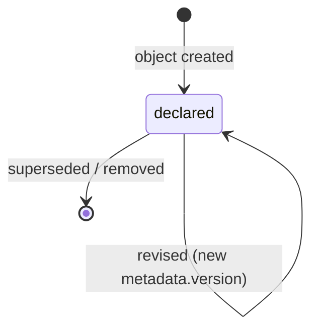
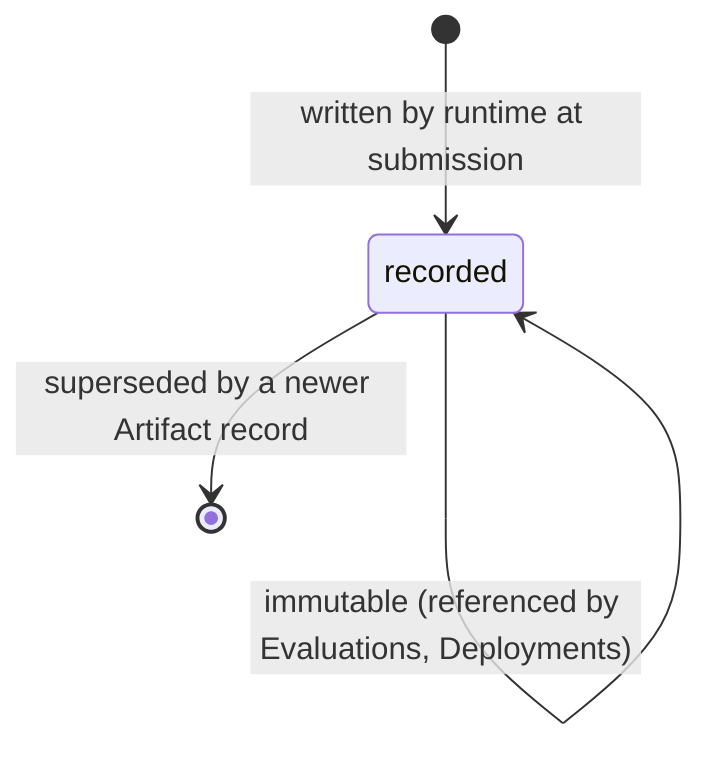

# PP-0007: Worker Protocol

| Field | Value |
| --- | --- |
| **PP** | 0007 |
| **Title** | Worker Protocol |
| **Status** | Draft |
| **Authors** | Product Protocol Contributors |
| **Created** | 2026-07-03 |
| **Updated** | 2026-07-03 |
| **Version** | 0.1.0 |
| **Requires** | PP-0002, PP-0006 |

## Abstract

This document defines the execution contract between a Product and the
actors that do its work: the `Worker` kind (a declared agent, human,
or hybrid executor), the claim protocol (atomic, leased, single-owner
acquisition of ready Tasks), the execution context a runtime must
assemble for a claimed Worker, the Worker's obligations while
executing, the `Artifact` kind (content-addressed, immutable outputs),
and the submission handshake that passes finished work to evaluation
(PP-0008). Conformance to this document (with PP-0002 and PP-0006)
constitutes the **PP/Worker** conformance class.

## Motivation *(Informative)*

If Tasks are the unit of work, Workers are the unit of substitution:
the promise of the protocol is that any conformant executor — a
coding agent, a human engineer, a hybrid pair — can pick up the same
Task and be held to the same contract. That requires fixing, in one
place, what a Worker may claim, what it is owed (context), what it
owes (constitution-bound execution, declared artifact types, honest
blockers), and what "finished" means (a submission judged by someone
else). Without a claim protocol, two agents silently duplicate work;
without bounded, provenance-preserving context, results cannot be
audited; without content-addressed Artifacts, evidence cannot be
trusted. Prior art: job queues and lease-based schedulers
(single-consumer semantics), and OCI's digest-addressed artifacts.

## Terminology

*Worker*, *Task*, *Task Graph*, *Artifact*, *Evaluator*, *Evaluation*,
*Evidence*, *Constitution*, *Knowledge*, *Governed Object* — per the
[glossary](../reference/glossary.md).

The key words **MUST**, **MUST NOT**, **REQUIRED**, **SHALL**, **SHALL
NOT**, **SHOULD**, **SHOULD NOT**, **RECOMMENDED**, **NOT RECOMMENDED**,
**MAY**, and **OPTIONAL** in this document are to be interpreted as
described in BCP 14 [RFC 2119] [RFC 8174] when, and only when, they appear
in all capitals, as shown here.

## Specification

### §1 Overview and Actor Roles

Three actor roles surround a Task, and they are strictly separated:

- the **Planner** (PP-0006) decides *what* work exists;
- the **Worker** (this document) *executes* claimed work and produces
  Artifacts;
- the **Evaluator** (PP-0008) *judges* submitted work.

An implementation MAY host these roles in one process, but the role
boundaries are normative: a Worker never accepts its own work, never
creates or approves governed objects, and never invents Tasks. The
full round trip:

```mermaid
sequenceDiagram
    participant P as Planner
    participant R as Runtime
    participant W as Worker
    participant E as Evaluator
    P->>R: emit Task (pending → ready)
    W->>R: claim(task-id)
    R-->>W: claim granted (atomic; lease; status.worker = W)
    W->>R: request execution context
    R-->>W: Task + Story/Spec @ approved versions + Constitution articles + Knowledge + prior attempts
    Note over W: in_progress — execute,<br/>renew lease, run evaluation hooks
    W->>R: submit(Artifacts + self-assessment)
    R->>E: Task submitted → evaluating
    E->>E: judge against Task.spec.completion (PP-0008)
    E-->>R: Evaluation record (accept / reject)
    R-->>W: done | rejected
```

The Task state machine these interactions drive is PP-0006 §5.3; this
document defines the Worker's side of each transition.

### §2 The Worker Kind

**Definition.** A `Worker` is an actor declaration: the capabilities,
constraints, context contract, and self-check hooks of a participant
that executes Tasks. Like all actor kinds (object model §6), it holds
no work state — a Worker object describes *who may do what*; live
state lives on Tasks (`status.worker`, PP-0006 §5.6).

**Responsibilities.** Claim only covered Tasks; execute within the
Constitution and the Task's constraints; produce declared Artifact
types; surface blockers honestly; submit with a self-assessment; renew
or release its leases.

**Lifecycle.** Worker is not a governed object and has no work-state
machine. A Worker declaration follows ordinary object versioning
(PP-0002 §6.1):



Removing or superseding a Worker declaration does not touch in-flight
Tasks; their leases simply expire (§3.3).

**Inputs.** Ready Tasks (via claims, §3) and the execution context
(§4).

**Outputs.** Artifacts (§6), submissions (§7), blocked-state reasons
(§5), lease renewals and releases (§3).

**Relationships.** Claims `Task`s; produces `Artifact`s; is
constrained by `Constitution`; its submissions are judged by an
`Evaluator` via `Evaluation`s.

| Field | Type | Req | Description |
| --- | --- | --- | --- |
| `spec.description` | string (prose) | MUST | What this Worker is and how it executes. |
| `spec.type` | string | MUST | Enum: `agent`, `human`, `hybrid`. |
| `spec.capabilities` | list[string] | MUST (≥ 1) | Capability tags; same namespace as `Task.spec.capabilities` (PP-0006 §7). |
| `spec.constraints` | object | MAY | Declared execution limits. |
| `spec.constraints.allowedArtifactTypes` | list[string] | MAY | Artifact types (§6) this Worker may produce. Absent ⇒ all types. |
| `spec.constraints.maxConcurrentTasks` | integer ≥ 1 | MAY | Claim ceiling enforced by the runtime (§3.2). |
| `spec.constraints.constitutionBound` | boolean | MAY | Default `true`. MUST NOT be `false` for production work (§5.1). |
| `spec.contextContract` | object | MAY | What the runtime must assemble at claim time (§4). |
| `spec.contextContract.requires` | list[string] | MAY | Enum items: `task`, `specification`, `constitution`, `knowledge`, `prior_attempts`. |
| `spec.contextContract.maxContextItems` | integer ≥ 1 | MAY | Upper bound on context items (§4.3). |
| `spec.evaluationHooks` | list[object] | MAY | Pre-submission self-checks (§8). |
| `spec.evaluationHooks[].name` | string | MUST | Hook name, unique within the Worker. |
| `spec.evaluationHooks[].description` | string (prose) | MAY | What the hook checks. |
| `spec.evaluationHooks[].mode` | string | MUST | Enum: `blocking`, `advisory` (§8). |
| `spec.evaluationHooks[].evaluation` | Ref | MAY | A `GoldenTest` or `QualityGate` the hook runs (PP-0008). |

Schema: [`schemas/worker/worker.schema.json`](../schemas/worker/worker.schema.json).

### §3 The Claim Protocol

#### §3.1 Atomic claim

A **claim** moves a Task `ready → claimed` and binds it to one Worker.

- Claims MUST be atomic: when multiple Workers attempt to claim the
  same Task, exactly one succeeds and the others observe failure. How
  atomicity is achieved (compare-and-set, serialized commits, a
  broker) is implementation-defined; the single-winner semantics are
  not.
- A Task MUST have at most one claiming Worker at a time
  (`status.worker`).
- A successful claim sets `status.worker` and `status.claimedAt` and
  increments `status.attempts` (PP-0006 §5.3).
- A Worker MUST NOT claim a Task it does not cover
  (PP-0006 §7 capability matching), and the runtime MUST refuse such
  claims regardless.

#### §3.2 Claim ordering and ceilings

When choosing among claimable Tasks, Workers and runtimes SHOULD
follow the scheduling order of PP-0006 §6 (priority, then age, or the
Planner's declared policy). The runtime MUST NOT grant a Worker more
simultaneous claims than its
`spec.constraints.maxConcurrentTasks` (when declared).

#### §3.3 Leases

Every claim carries a **lease** — a bounded validity period.

- The lease duration is implementation-configured; it MUST be finite.
- A Worker renews its lease while it works; renewal MUST only be
  possible for the current claim holder.
- If the lease expires without renewal (crash, stall, disappearance),
  the runtime MUST return the Task to `ready`, clearing
  `status.worker`. The consumed attempt stands in `status.attempts`.
- Lease bookkeeping is implementation state; it MAY be recorded on
  the Task via `metadata.annotations` or `x-` status fields, but the
  expiry semantics above are normative regardless of representation.

#### §3.4 Release and abandonment

A Worker MAY **release** a claim it cannot or should not complete
(wrong fit, discovered precondition failure, shutdown). Release
returns the Task to `ready`, clears `status.worker`, and preserves
`status.attempts`. Abandonment (silent disappearance) is handled by
lease expiry (§3.3) — identically, only slower. A release SHOULD carry
a reason (e.g. in `metadata.annotations`) so the Planner can react.

### §4 Execution Context

A claimed Worker is owed a complete, bounded, provenance-preserving
picture of its job. The runtime MUST be able to provide, at claim
time, each context component the Worker's
`spec.contextContract.requires` lists:

| Component | Content |
| --- | --- |
| `task` | The claimed Task object itself, at its current version. |
| `specification` | The traced Story/Feature and the Specification material in `spec.context.specifications`, each at the **exact approved version** referenced — never a draft, never "latest". |
| `constitution` | The Constitution articles in scope: those listed in `Task.spec.context.constitutionArticles` plus any articles the active Constitutions mark as universally applicable (PP-0005). |
| `knowledge` | The Knowledge referenced in `Task.spec.context.knowledge`, plus any additional Knowledge selected per PP-0009 retrieval. |
| `prior_attempts` | For re-attempted Tasks: prior Artifacts, prior Evaluations (including rejection reasons), and prior `blockedReason`s for this Task. |

Rules:

- **Bounded.** Context MUST be bounded: the runtime MUST respect
  `spec.contextContract.maxContextItems` when declared, and MUST use
  the PP-0009 retrieval contract to select — not dump — Knowledge.
  An unbounded context is unauditable and unaffordable.
- **Provenance.** Context MUST preserve provenance: every item is
  identified by its fully qualified identity (PP-0002 §3.2), so any
  claim in the Worker's output can be traced to the exact object
  version that informed it.
- **Fixed at claim.** The contract is fixed when the claim is granted;
  the Task's `spec` cannot change underneath a claim (PP-0006 §5.7).
  If the world changes (specification superseded), the path is
  release-and-replan (PP-0006 §8.4), not silent context swaps.
- Content assembled from untrusted origins (user-reported Issues,
  external documents) SHOULD be marked as data, not instructions, in
  whatever prompt or briefing the runtime constructs.

### §5 Execution Obligations

While holding a claim, a Worker:

#### §5.1 Constitution

- MUST honor every Constitution article in scope (§4) for the entire
  execution — the Constitution binds *how* work is done, not only
  what is submitted (PP-0005).
- `spec.constraints.constitutionBound` MUST NOT be `false` for any
  Worker executing production work; the escape hatch exists only for
  sandboxed experimentation, and runtimes MUST refuse to let an
  unbound Worker claim Tasks affecting production environments.

#### §5.2 Boundaries

- MUST NOT transition governed objects — not to `proposed`, and
  never to `approved` (PP-0002 §6.2). A Worker that believes a
  Specification is wrong records a blocker (§5.4) or raises an Issue;
  it does not edit the Specification.
- MUST NOT approve or evaluate its own work: it MUST NOT author the
  Evaluation of its own submission and MUST NOT transition its Task
  to `done` or `rejected` — those transitions belong to the Evaluator
  (PP-0008).
- MUST NOT modify the claimed Task's `spec`, other Tasks, or the Task
  Graph.

#### §5.3 Artifact discipline

- MUST produce only Artifact types permitted by *both* its own
  `spec.constraints.allowedArtifactTypes` (when declared) *and* the
  Task's `spec.completion.artifacts` (when declared).
- MUST record every deliverable as an Artifact (§6) before
  submission; work not captured in an Artifact does not exist for
  evaluation purposes.

#### §5.4 Blockers and questions

- When progress stops on something the Worker cannot resolve — a
  missing dependency, an ambiguous requirement, a question only a
  human can answer — the Worker MUST move the Task to `blocked` with
  a `status.blockedReason` stating what is needed, rather than
  guessing, stalling silently, or exceeding its authority.
- On unblocking, the Task returns to `in_progress` (PP-0006 §5.3).

#### §5.5 Constraints

- SHOULD respect `spec.constraints.effortBudget`; on exhaustion, the
  Worker SHOULD submit partial verifiable work as Artifacts with an
  honest self-assessment, release the claim, or block — whichever
  best preserves value — rather than burn unbounded effort.

### §6 The Artifact Kind

**Definition.** An `Artifact` is a content-addressed, immutable record
of one output of a Task: a code changeset, document, image, binary,
report, prototype, or dataset. Artifacts are the *only* currency of
submission: Evaluators judge Artifacts, Deployments ship Artifacts,
and Evidence points at Artifacts.

**Responsibilities.** Bind an output to the Task that produced it;
make the payload verifiable by digest; locate the payload (in-tree
path or external URI).

**Lifecycle.** Artifacts are **append-only records** (PP-0002 §6.3):
created once, never modified or deleted; corrections are new Artifacts
that supersede old ones by reference.



**Inputs.** Produced by a Worker executing a claimed Task.

**Outputs / consumers.** Evaluations (PP-0008) judge them; Deployments
(PP-0010) release them; Evidence cites them.

**Relationships.** `producedBy` → the Task (MUST, object model §3);
referenced by `Evaluation`, `Deployment`.

Rules:

- The `digest` is the Artifact's content address: it MUST be computed
  over the payload bytes, and consumers MUST verify the payload
  against it before trusting or deploying the Artifact.
- Large binary payloads SHOULD live outside the Product tree,
  referenced by `uri`; the Artifact *record* stays in-tree
  (PP-0002 §7).
- An Artifact whose payload is a repository change (`changeset`)
  SHOULD identify the change immutably (e.g. commit digest) rather
  than by branch name.

| Field | Type | Req | Description |
| --- | --- | --- | --- |
| `spec.type` | string | MUST | Enum: `changeset`, `document`, `image`, `binary`, `report`, `prototype`, `dataset`, `other`. |
| `spec.digest` | digest | MUST | Content address, `<algorithm>:<hex>` (PP-0002 §4), computed over the payload. |
| `spec.uri` | string (URI) | MAY | Where the payload lives, if not in-tree. |
| `spec.path` | string | MAY | Repository-relative path of the payload or affected area. |
| `spec.summary` | string (prose) | MAY | What the Artifact contains. |
| `spec.producedBy` | Ref→Task | MUST | The Task that produced this Artifact. |
| `spec.producedAt` | timestamp | MUST | RFC 3339 production instant. |
| `spec.size` | integer ≥ 0 | MAY | Payload size in bytes. |
| `spec.mediaType` | string | MAY | IANA media type of the payload. |

Schema: [`schemas/worker/artifact.schema.json`](../schemas/worker/artifact.schema.json).

### §7 Submission and Completion

A **submission** moves a Task `in_progress → submitted`
(PP-0006 §5.3) and consists of:

1. **Artifacts** — at least one Artifact (§6) with
   `producedBy` → the Task. A submission with no Artifacts MUST be
   rejected by the runtime.
2. **Self-assessment** — the Worker's own statement of how the work
   meets each entry of `Task.spec.completion` (criteria, evaluations,
   artifact types). The self-assessment SHOULD be delivered as a
   `report` Artifact so it is durable and citable.
3. **Evidence pointers** — references to the material that backs the
   self-assessment (test output, hook results §8, logs), in the form
   PP-0008 §8 defines for Evidence.

Completion semantics:

- The completion contract is `Task.spec.completion` — the Worker
  neither adds to it nor negotiates it down at submission time.
- Submission sets `status.submittedAt`; the Task then moves to
  `evaluating` when an Evaluator picks it up.
- **Acceptance is the Evaluator's alone** (PP-0008). The Worker's
  self-assessment is input to evaluation, never a substitute for it;
  the `evaluating → done` and `evaluating → rejected` transitions are
  made only on the strength of an Evaluation record.
- After submitting, the Worker's claim obligations end when the Task
  leaves `evaluating`; if rejected, the Task returns to the pool per
  PP-0006 §8.2 — the same Worker MAY claim it again but has no
  entitlement to.

### §8 Evaluation Hooks

Evaluation hooks are **pre-submission self-checks** declared on the
Worker (`spec.evaluationHooks`): fast, local approximations of the
judgment the Evaluator will render, run by the Worker before it
submits.

- A Worker SHOULD run its evaluation hooks against its Artifacts
  before every submission.
- A hook with `mode: blocking` that fails SHOULD prevent submission:
  the Worker fixes the work, or blocks (§5.4), or releases (§3.4) —
  it SHOULD NOT submit over a failing blocking hook, and a runtime
  MAY refuse such submissions outright.
- A hook with `mode: advisory` informs the Worker (and, via the
  self-assessment, the Evaluator) but never gates.
- A hook MAY point at a `GoldenTest` or `QualityGate` via its
  `evaluation` ref, running the same check the Evaluator will run —
  the cheapest way to avoid a rejection round trip.
- Hook results are self-checks, not Evaluations: they MUST NOT be
  recorded as `Evaluation` objects (that would violate §5.2
  self-approval) but SHOULD be included as evidence pointers in the
  submission (§7).

## Normative Requirements

- **[PP-0007-RQ-001]** A Worker declaration MUST include
  `spec.description`, `spec.type`, and at least one entry in
  `spec.capabilities`. (§2)
- **[PP-0007-RQ-002]** Claims MUST be atomic: concurrent claim
  attempts on one Task yield exactly one winner, and a Task MUST have
  at most one claiming Worker at a time. (§3.1)
- **[PP-0007-RQ-003]** A successful claim MUST set `status.worker`
  and `status.claimedAt` and increment `status.attempts`. (§3.1)
- **[PP-0007-RQ-004]** A Worker MUST NOT claim, and the runtime MUST
  NOT grant, a Task the Worker's capabilities do not cover
  (PP-0006 §7). (§3.1)
- **[PP-0007-RQ-005]** The runtime MUST NOT grant a Worker more
  simultaneous claims than its declared
  `spec.constraints.maxConcurrentTasks`. (§3.2)
- **[PP-0007-RQ-006]** Every claim MUST carry a finite lease; on
  expiry without renewal the runtime MUST return the Task to `ready`
  and clear `status.worker`. Only the claim holder may renew. (§3.3)
- **[PP-0007-RQ-007]** A released or abandoned Task MUST return to
  `ready` with `status.attempts` preserved. (§3.4)
- **[PP-0007-RQ-008]** The runtime MUST provide a claimed Worker every
  context component its `spec.contextContract.requires` lists,
  including specification material at the exact approved versions
  referenced. (§4)
- **[PP-0007-RQ-009]** Execution context MUST be bounded (respecting
  `maxContextItems` when declared) and MUST preserve per-item
  provenance via fully qualified identities. (§4)
- **[PP-0007-RQ-010]** A Worker MUST honor all in-scope Constitution
  articles; `spec.constraints.constitutionBound` MUST NOT be `false`
  for Workers executing production work. (§5.1)
- **[PP-0007-RQ-011]** A Worker MUST NOT transition governed objects
  and MUST NOT author the Evaluation of, or accept, its own work; the
  `done`/`rejected` transitions belong to the Evaluator. (§5.2)
- **[PP-0007-RQ-012]** A Worker MUST NOT modify the claimed Task's
  `spec`, other Tasks, or the Task Graph. (§5.2)
- **[PP-0007-RQ-013]** A Worker MUST produce only Artifact types
  permitted by both its `spec.constraints.allowedArtifactTypes` and
  the Task's `spec.completion.artifacts`, where declared. (§5.3)
- **[PP-0007-RQ-014]** A Worker that cannot proceed MUST move its
  Task to `blocked` with a `status.blockedReason` rather than guess
  or exceed its authority. (§5.4)
- **[PP-0007-RQ-015]** An Artifact MUST carry `spec.type`,
  `spec.digest` (computed over the payload), `spec.producedBy`, and
  `spec.producedAt`; Artifacts are append-only records
  (PP-0002 §6.3). (§6)
- **[PP-0007-RQ-016]** Consumers MUST verify an Artifact payload
  against `spec.digest` before trusting or deploying it. (§6)
- **[PP-0007-RQ-017]** A submission MUST include at least one
  Artifact referencing the Task via `producedBy`; the runtime MUST
  reject Artifact-less submissions. (§7)
- **[PP-0007-RQ-018]** A Worker SHOULD run its evaluation hooks
  before submission and SHOULD NOT submit while a `blocking` hook
  fails; hook results MUST NOT be recorded as Evaluation objects.
  (§8)

## Examples *(Informative)*

A Worker declaration (`.product/workers/worker-ts-agent.yaml`):

```yaml
pp: "0.1"
kind: Worker
metadata:
  id: worker-ts-agent
  name: TypeScript Coding Agent
  version: 1.0.0
  labels:
    runtime: sandbox-a
  owners:
    - { type: team, id: platform, name: Platform Team }
spec:
  description: >
    Autonomous coding agent for TypeScript services: implements API
    endpoints, data models, and unit tests from approved Stories.
  type: agent
  capabilities:
    - code.typescript
    - api.rest
    - test.unit
  constraints:
    allowedArtifactTypes:
      - changeset
      - report
    maxConcurrentTasks: 1
    constitutionBound: true
  contextContract:
    requires:
      - task
      - specification
      - constitution
      - knowledge
      - prior_attempts
    maxContextItems: 40
  evaluationHooks:
    - name: lint-and-typecheck
      description: ESLint and tsc --noEmit over the changeset.
      mode: blocking
    - name: golden-smoke
      description: Run the checkout golden test locally before submit.
      mode: advisory
      evaluation: { ref: { kind: GoldenTest, id: golden-checkout-happy-path } }
```

An Artifact record
(`.product/tasks/artifacts/artifact-guest-checkout-changeset.yaml`,
payload kept in the source repository and addressed by digest):

```yaml
pp: "0.1"
kind: Artifact
metadata:
  id: artifact-guest-checkout-changeset
  name: Guest checkout API changeset
  version: 1.0.0
  createdAt: 2026-07-03T15:20:00Z
spec:
  type: changeset
  digest: sha256:7f83b1657ff1fc53b92dc18148a1d65dfc2d4b1fa3d677284addd200126d9069
  uri: https://git.example.com/aurora/books/commit/9fceb02d0ae598e95dc970b74767f19372d61af8
  path: services/checkout
  summary: >
    Adds POST /checkout/guest with cart validation, payment-intent
    handling, and unit tests; no schema migrations.
  producedBy: { ref: { kind: Task, id: task-guest-checkout-api } }
  producedAt: 2026-07-03T15:20:00Z
  size: 18432
  mediaType: text/x-diff
```

## Security Considerations

- **Self-approval.** The separation of Worker and Evaluator
  ([PP-0007-RQ-011]) is, with PP-0002's human-approval rule, the
  protocol's core privilege boundary. Implementations SHOULD enforce
  it with identity, not convention: the principal that produced an
  Artifact must be distinguishable from the principal that evaluates
  it.
- **Artifact integrity.** Digest verification ([PP-0007-RQ-016]) is
  what makes evaluation and deployment evidence-based; skipping it
  lets a compromised Worker (or storage) swap payloads after
  judgment. Signing Artifact records (e.g. signed commits) is
  RECOMMENDED.
- **Prompt injection.** Execution context aggregates prose from many
  origins (specifications, Knowledge, prior rejection notes,
  user-derived Issues). Runtimes SHOULD segregate untrusted content
  and present it as data; a Worker SHOULD treat instructions found
  *inside* context payloads that conflict with its Task and
  Constitution as hostile.
- **Lease theft and races.** Renewal restricted to the claim holder
  ([PP-0007-RQ-006]) prevents claim hijacking; implementations should
  bind claims to authenticated Worker identity.
- **Secrets.** Artifacts and context are durable records; Workers
  MUST NOT embed credentials in Artifacts, summaries, or blocked
  reasons (PP-0002 security considerations).
- **Sandbox escape via `constitutionBound: false`.** Unbound Workers
  exist for isolated experiments only; [PP-0007-RQ-010] plus runtime
  enforcement keeps them away from production surfaces.

## Future Work *(Informative)*

- A wire protocol (transport-level API) for claim/renew/submit;
  this version fixes semantics only.
- Standard lease-duration negotiation and heartbeat conventions.
- Worker attestation: verifiable claims about model, version, and
  sandbox of an agent Worker.
- Cost and token accounting fields on submissions.

## References

- [PP-0002 — Core Concepts and Object Model](./PP-0002-core-concepts.md)
- [PP-0006 — Task Graph and Planning](./PP-0006-task-graph.md)
- [PP-0008 — Evaluation System](./PP-0008-evaluation.md)
- [PP-0009 — Knowledge Protocol](./PP-0009-knowledge-protocol.md)
  (retrieval contract)
- [PP-0005 — Product Constitution](./PP-0005-product-constitution.md)
- [Object Model](../reference/object-model.md) ·
  [Glossary](../reference/glossary.md)
- Schemas: [`schemas/worker/`](../schemas/worker/)
- [BCP 14 / RFC 2119 / RFC 8174](https://www.rfc-editor.org/info/bcp14)
