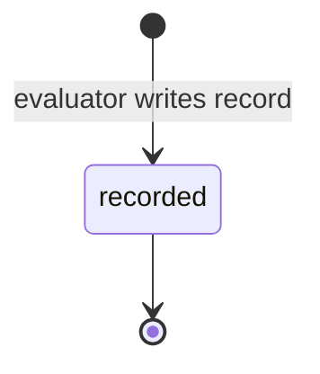
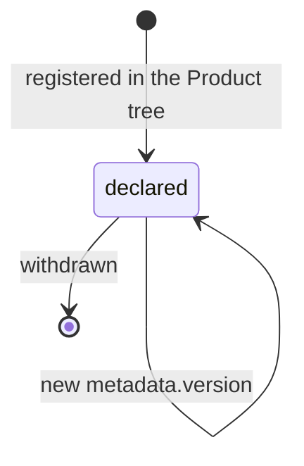
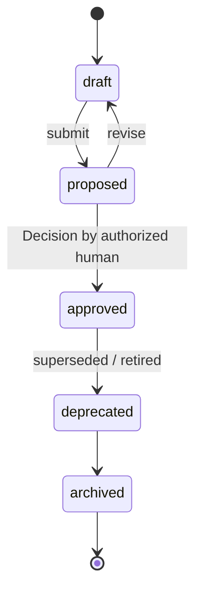
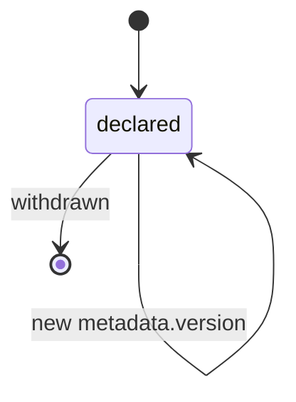

# PP-0008: Evaluation System

| Field | Value |
| --- | --- |
| **PP** | 0008 |
| **Title** | Evaluation System |
| **Status** | Draft |
| **Authors** | Product Protocol Contributors |
| **Created** | 2026-07-03 |
| **Updated** | 2026-07-03 |
| **Version** | 0.1.0 |
| **Requires** | PP-0002 |

## Abstract

This document defines how Product Protocol systems judge work: the
`Evaluator` actor, the append-only `Evaluation` record with its Evidence
model, the governed `GoldenTest` kind (and Golden Datasets built from
it), and the `QualityGate` predicate that gates lifecycle transitions.
Together these make evaluation a first-class phase of the autonomous
engineering loop: nothing is *done*, *accepted*, or *promoted* without
recorded evidence. Conformance to this document constitutes the
**PP/Evaluator** conformance class. It interfaces with acceptance
criteria (PP-0004 §7), Constitution articles (PP-0005 §4), the Task
lifecycle (PP-0006), Artifacts (PP-0007), and Deployments (PP-0010).

## Motivation *(Informative)*

Autonomous systems produce work faster than humans can review it. If
"looks done" is the acceptance bar, quality decays invisibly and trust
in the system collapses at the first regression. Human engineering
organizations solved this with independent review, regression suites,
and release gates; autonomous ones need the same institutions, but in a
machine-readable, vendor-neutral form.

Without a shared evaluation model:

- Each vendor invents its own notion of "passing", so a Task accepted
  by one system means nothing to another.
- Evidence lives in ephemeral CI logs, so audits cannot reconstruct why
  work was accepted.
- Agents evaluate their own work, a conflict of interest that inflates
  pass rates exactly when scrutiny matters most.
- There is no durable regression armor: yesterday's fixed bug is
  tomorrow's silent re-break.

This document fixes those mechanics once: a common record shape for
judgments, a common evidence discipline, canonical scenarios that must
always hold (Golden Tests), and named gates that other specifications
can hang transitions on.

## Terminology

*Evaluator*, *Evaluation*, *Evidence*, *Golden Test*, *Golden Dataset*,
*Quality Gate*, *Acceptance Criteria*, *Constitution Article*,
*Artifact*, *Task*, *Deployment*, *Worker* — per the
[glossary](../reference/glossary.md).

The key words **MUST**, **MUST NOT**, **REQUIRED**, **SHALL**, **SHALL
NOT**, **SHOULD**, **SHOULD NOT**, **RECOMMENDED**, **NOT RECOMMENDED**,
**MAY**, and **OPTIONAL** in this document are to be interpreted as
described in BCP 14 [RFC 2119] [RFC 8174] when, and only when, they appear
in all capitals, as shown here.

## Specification

### §1 Overview

Evaluation is the phase of the loop (PP-0001 §1) in which produced work
is judged against declared criteria before it may progress. The design
invariant is:

> **Nothing is done without evidence.** No Task is accepted, no
> Deployment is promoted, and no Constitution is declared satisfied,
> except on the basis of Evaluation records carrying inspectable
> Evidence.

Four kinds implement this invariant:

| Kind | Role |
| --- | --- |
| `Evaluator` | The actor that performs evaluations (§5). |
| `Evaluation` | The append-only record of one judgment (§4). |
| `GoldenTest` | A governed canonical scenario; regression armor (§6). |
| `QualityGate` | A named predicate over Evaluations that gates a transition (§9). |

In the Git binding (PP-0002 §7), GoldenTests live under
`evaluation/golden/`, QualityGates under `evaluation/gates/`, and
Evaluation records under `evaluation/runs/`. Evaluator declarations
SHOULD live under `evaluation/` as well (e.g. `evaluation/evaluators/`).

### §2 Evaluation Model

#### §2.1 Subjects

An Evaluation judges exactly one **subject**. The subject MUST be one
of the following kinds:

| Subject kind | Typical question |
| --- | --- |
| `Artifact` | Does this produced output meet its criteria? (PP-0007) |
| `Task` | Is this unit of work complete and acceptable? (PP-0006) |
| `Deployment` | May this release proceed / remain active? (PP-0010 §6) |
| `Product` | Does the whole Product satisfy a rule or budget? |
| `Worker` | Is this actor performing within expectations? (PP-0007) |

Evaluating `Worker` (and other actors) is how the system audits its own
agents — see the `agent_evaluation` category (§3).

#### §2.2 Criteria sources

Every Evaluation declares the criteria it judged against. Criteria are
drawn from four sources:

1. **Acceptance criteria** attached to Stories and Tasks
   (PP-0004 §7) — the definition of done for a slice of work.
2. **Constitution articles** (PP-0005 §4) — rules that always hold;
   evaluated via the `constitution_audit` category.
3. **Non-functional requirement (NFR) budgets** declared in
   Specifications (PP-0004) — evaluated via the `performance` (or
   `security`, `accessibility`) categories; see §10.
4. **Golden Tests** (§6) — canonical scenarios the Product must always
   satisfy.

Each criterion in an Evaluation carries a prose `description` and,
when it derives from a protocol object, a `source` ref to that object
(GoldenTest, Story, Constitution, or QualityGate). When a criterion
derives from an existing governed object, the Evaluation SHOULD carry
the `source` ref so the judgment is traceable to intent.

### §3 Evaluation Categories

Every Evaluation is classified into exactly one **category**. The
category enum is normative; the descriptions are informative:

| Category | Judges *(Informative)* |
| --- | --- |
| `regression` | Existing behavior still works: golden tests, test suites. |
| `visual` | Rendered UI matches expectations: screenshots, visual diffs. |
| `business_validation` | The work achieves its business intent, not merely its letter. |
| `agent_evaluation` | Workers, Planners, and Evaluators themselves: calibration, quality of output over time. |
| `performance` | Latency, throughput, resource budgets (§10). |
| `security` | Vulnerabilities, secret leakage, privilege boundaries. |
| `accessibility` | Conformance with accessibility criteria (e.g. WCAG budgets). |
| `constitution_audit` | Continuous verification of Constitution articles (PP-0005). |
| `acceptance` | A Task or Story against its acceptance criteria (PP-0004 §7, PP-0006). |

Producers MUST use exactly these `snake_case` values. Categories are a
classification, not a partition of tooling: one Evaluator MAY serve
several categories (§5), and one gate MAY select across them (§9).

### §4 The Evaluation Kind

**Definition.** An `Evaluation` is the immutable record of one
judgment: subject, criteria, verdict, score, evidence, and the
evaluator that produced it.

**Responsibilities.** Capture *what* was judged, *against what*, *by
whom*, *when*, with *what outcome*, and *on what evidence* — in a form
that a later auditor can replay without access to the original run.

**Lifecycle.** Evaluations are append-only records (PP-0002 §6.3).
They have no state machine beyond creation:



Once written, an Evaluation MUST NOT be modified or deleted. A
correction or a re-run is a **new** Evaluation record; the newer record
MAY reference the one it supersedes via `metadata.annotations` or an
`x-` field (see §11).

**Inputs.** The subject object; the criteria sources of §2.2; the
Evaluator's declared configuration.

**Outputs.** The record itself, referenced from the gated object's
`status` (Task, Deployment) and consumed by QualityGates (§9).

**Relationships.** `subject` → the judged object; `evaluator` → the
Evaluator; `criteria[].source` → GoldenTest / Story / Constitution /
QualityGate; consumed by QualityGates and by PP-0010 phase transitions.

#### §4.1 Fields

| Field | Type | Req | Description |
| --- | --- | --- | --- |
| `spec.subject` | Ref | MUST | The judged object: `Artifact`, `Task`, `Deployment`, `Product`, or `Worker` (§2.1). |
| `spec.category` | enum | MUST | One of the nine categories of §3. |
| `spec.criteria` | list | MUST | ≥ 1 criterion judged against. |
| `spec.criteria[].source` | Ref | MAY | Origin object: `GoldenTest`, `Story`, `Constitution`, or `QualityGate`. |
| `spec.criteria[].description` | string (prose) | MUST | What was checked, in reviewable language. |
| `spec.verdict` | enum | MUST | `pass`, `fail`, `error`, `inconclusive` (§7.1). |
| `spec.score` | number | MAY | Aggregate score in `[0, 1]` (§7.2). |
| `spec.dimensions` | list | MAY | Per-dimension scores (§7.3). |
| `spec.dimensions[].name` | string | MUST | Dimension name (e.g. `correctness`). |
| `spec.dimensions[].score` | number | MUST | Dimension score in `[0, 1]`. |
| `spec.dimensions[].weight` | number | MAY | Relative weight, ≥ 0. |
| `spec.evidence` | list[Evidence] | MUST | ≥ 1 Evidence item (§8). |
| `spec.evaluator` | Ref | MUST | The `Evaluator` that produced this record. |
| `spec.evaluatedAt` | string (RFC 3339) | MUST | When the judgment was made. |
| `spec.notes` | string (prose) | MAY | Free-form evaluator commentary. |

Schema: [`schemas/evaluation/evaluation.schema.json`](../schemas/evaluation/evaluation.schema.json).

### §5 The Evaluator Kind

**Definition.** An `Evaluator` is an actor declaration (see
[object model §6](../reference/object-model.md#6-actors-vs-records)):
it states who may judge what, and how. Evaluators hold no work state;
all outcomes live on Evaluation records.

**Responsibilities.** Execute evaluations within its declared
categories; collect and attach Evidence; render a verdict; never judge
its own work.

**Lifecycle.** Evaluators are declarations, not governed objects. They
are versioned per PP-0002 §6.1 and MAY be withdrawn by removal;
implementations SHOULD retain superseded versions in Git history:



**Inputs.** Subjects and criteria assigned by the runtime (PP-0010 §5)
or by QualityGate triggers (§9).

**Outputs.** Evaluation records (§4).

**Relationships.** Referenced by `Evaluation.spec.evaluator`; scheduled
by the runtime; constrained by the independence rule below.

#### §5.1 Fields

| Field | Type | Req | Description |
| --- | --- | --- | --- |
| `spec.description` | string (prose) | MUST | What this evaluator checks and how. |
| `spec.type` | enum | MUST | `automated` (deterministic tooling), `agentic` (an AI agent), or `human`. |
| `spec.categories` | list[enum] | MUST | ≥ 1 category from §3 this evaluator is competent to judge. |

Schema: [`schemas/evaluation/evaluator.schema.json`](../schemas/evaluation/evaluator.schema.json).

An Evaluator MUST NOT record Evaluations in a category it does not
declare in `spec.categories`.

#### §5.2 Independence

Self-judgment is the failure mode this document exists to prevent:

- An Evaluator MUST NOT evaluate work produced by itself. In
  particular, when the same underlying actor is registered both as a
  Worker (PP-0007) and as an Evaluator, it MUST NOT evaluate Tasks it
  claimed or Artifacts it produced.
- An `agentic` Evaluator SHOULD be a different agent or model
  configuration from the Worker whose output it judges; sharing a
  provider is acceptable, sharing a configuration invites correlated
  blind spots.
- `human` Evaluators SHOULD NOT be the same person who authored the
  work, where staffing permits.

The runtime enforces this rule at scheduling time (PP-0010 §5).

### §6 The GoldenTest Kind and Golden Datasets

**Definition.** A `GoldenTest` is a canonical scenario, with fixed
inputs and expected outcomes, that the Product must always satisfy. It
is the protocol's regression armor: autonomous change is safe only
because these scenarios are re-judged continuously.

**Responsibilities.** State one scenario precisely enough that an
automated harness, an agent, or a human can execute it and judge the
outcome without further interpretation.

**Lifecycle.** `GoldenTest` is a **governed object** (PP-0002 §6.2).
Its `metadata.lifecycle` is REQUIRED and follows:



The `proposed → approved` transition MUST be authorized by a human and
recorded as a Decision (PP-0002 §6.2, [PP-0002-RQ-008]); an approved
GoldenTest version is immutable ([PP-0002-RQ-009]). This is
deliberate: if agents could weaken golden tests, they could grade
their own homework. Only **approved** GoldenTests count toward
QualityGates (§9.2).

**Inputs.** Drafted from Stories, Features, and Constitution articles
(`spec.appliesTo`); typically proposed by agents after a Story ships,
approved by humans.

**Outputs.** Criteria for Evaluations (`criteria[].source`); members of
Golden Datasets (§6.2); selectable requirements in QualityGates.

**Relationships.** `appliesTo` → Story / Feature / Capability /
Constitution; referenced by `Evaluation.spec.criteria[].source` and by
`QualityGate.spec.requires[].evaluations`.

#### §6.1 Fields

| Field | Type | Req | Description |
| --- | --- | --- | --- |
| `spec.scenario` | string (prose) | MUST | The situation being exercised, from the user's or system's point of view. |
| `spec.inputs` | object | MAY | Fixed inputs (fixtures, parameters). Free-form. |
| `spec.expected` | string (prose) | MUST | The outcome that must hold. |
| `spec.steps` | list[{step}] | MAY | Ordered steps; each `step` is prose. |
| `spec.method` | enum | MUST | `automated`, `agentic`, or `manual` — how the scenario is executed. |
| `spec.appliesTo` | list[Ref] | MAY | `Story`, `Feature`, `Capability`, or `Constitution` objects this test protects. |
| `spec.tolerance` | string (prose) | MAY | Acceptable deviation (e.g. rendering variance, timing windows). |

Schema: [`schemas/evaluation/golden-test.schema.json`](../schemas/evaluation/golden-test.schema.json).

#### §6.2 Golden Datasets

A **Golden Dataset** is a versioned collection of GoldenTests. It is
*not* a separate kind: membership is expressed with the reserved
metadata label key `dataset`:

```yaml
metadata:
  labels:
    dataset: checkout-core
```

Rules:

- A GoldenTest declares dataset membership with
  `metadata.labels.dataset: <name>`, where `<name>` matches the `id`
  pattern of PP-0002 §3.1. A GoldenTest belongs to at most one dataset
  via this key; implementations MAY layer additional grouping with
  vendor-prefixed labels (PP-0002 §8).
- Consumers (QualityGates via `selector.labels`, harnesses, reports)
  MUST resolve a dataset as: all GoldenTests in the Product whose
  `metadata.labels.dataset` equals the name.
- The label key `dataset` is RESERVED by this specification and MUST
  NOT be used with other semantics.

#### §6.3 Dataset versioning

A dataset has no object of its own, so its version is defined by its
members:

- The **resolved content** of dataset `D` at a point in time is the set
  of `(id, version)` pairs of all GoldenTests labelled `dataset: D`
  whose `metadata.lifecycle` is `approved`, taking the highest approved
  version of each `id`.
- Any consumer that judges against a dataset (notably QualityGate
  checks, §9) MUST record the resolved content it used — the exact
  member versions — in the resulting Evaluation's criteria (one
  criterion per member, with `source` refs pinning `version`) or in an
  attached Evidence item of type `test_report`. This makes dataset
  evaluations reproducible even as the dataset evolves.
- Adding, removing, or changing a member changes the dataset; because
  each member change is itself a governed-object transition, dataset
  evolution is always human-approved and Git history is the dataset's
  version archive.

### §7 Scoring Model

#### §7.1 Verdicts

`spec.verdict` is the categorical outcome:

| Verdict | Meaning |
| --- | --- |
| `pass` | All criteria satisfied (within declared tolerance). |
| `fail` | At least one criterion not satisfied. |
| `error` | The evaluation itself could not be completed (harness crash, missing environment). Says nothing about the subject. |
| `inconclusive` | The evaluation ran but the evidence does not support a determination. |

Only `pass` is a positive result. For gating purposes, `error` and
`inconclusive` MUST be treated as *not satisfied* — never as a pass
(§9.2). An `error` SHOULD prompt a re-run; repeated errors are a
signal about the Evaluator or environment, not the subject.

#### §7.2 Scores

`spec.score` is an OPTIONAL aggregate in the closed interval
`[0, 1]`, where `1` is fully satisfactory. Scores add resolution to
verdicts (e.g. gates with `minScore`, §9.1; tracking Worker quality
over time via `agent_evaluation`). Producers MUST NOT emit scores
outside `[0, 1]`. A verdict is always required; a score never replaces
it. When both are present they MUST be consistent: a `pass` verdict
with a score below a gate's `minScore` does not satisfy that gate
(§9.2).

#### §7.3 Dimensions

`spec.dimensions` decomposes a score into named components:

```yaml
dimensions:
  - { name: correctness, score: 1.0, weight: 0.7 }
  - { name: latency, score: 0.8, weight: 0.3 }
```

Each dimension score MUST be in `[0, 1]`; `weight` is a non-negative
relative weight (weights need not sum to 1). When `score` and
`dimensions` are both present, `score` SHOULD equal the
weight-normalized mean of the dimension scores; consumers MUST treat
`spec.score` as authoritative on disagreement. Dimension names are
free-form but SHOULD be stable within a Product so trends are
comparable.

### §8 Evidence Model

**Evidence** is the durable, inspectable material that justifies a
verdict. An Evaluation without evidence is an opinion; the protocol
does not traffic in opinions.

Each Evaluation carries ≥ 1 Evidence items:

| Field | Type | Req | Description |
| --- | --- | --- | --- |
| `type` | enum | MUST | `log`, `screenshot`, `test_report`, `trace`, `measurement`, `diff`, `transcript`, `other`. |
| `description` | string (prose) | MAY | What this item shows. |
| `uri` | string (URI) | MAY* | Location of the evidence payload. |
| `path` | string | MAY* | Path relative to the Product tree root. |
| `digest` | string (digest) | MAY* | Content digest of the payload, `<algorithm>:<hex>` (PP-0002 §4). |
| `artifact` | Ref | MAY* | An `Artifact` record holding the evidence (PP-0007 §6). |

\* At least one of `uri`, `path`, `digest`, or `artifact` MUST be
present — evidence must be *locatable* or *verifiable*, preferably
both.

Rules:

- Evidence SHOULD carry a `digest` whenever the payload lives outside
  the Product tree, so tampering is detectable.
- Evidence payloads referenced by Evaluations that gated a transition
  MUST remain retrievable for as long as the gated object is retained;
  storing bulky payloads as Artifacts (content-addressed, PP-0007 §6)
  is the RECOMMENDED way to satisfy this.
- `transcript` evidence (agent conversations) is the primary audit
  trail for `agentic` evaluators and SHOULD be attached to their
  Evaluations.
- Evidence is part of an append-only record: it MUST NOT be altered
  after the Evaluation is written.

### §9 Quality Gates

**Definition.** A `QualityGate` is a named, declarative predicate over
Evaluations. Other specifications hang transitions on gates: Task
acceptance (PP-0006), Deployment promotion (PP-0010 §6.1), and
scheduled Constitution audits (PP-0005).

**Responsibilities.** State, ahead of time and in reviewable form, what
evidence must exist before a transition may occur.

**Lifecycle.** QualityGates are declarations, versioned per PP-0002
§6.1. They are not governed objects, but because they control what
blocks production, changes SHOULD be reviewed by humans and MAY be
protected by a Constitution article (PP-0005):



**Inputs.** Evaluation records for the subject in question.

**Outputs.** A satisfied / not-satisfied determination, recorded by
the runtime on the gated object's `status` (e.g.
`Deployment.status.evaluations`, PP-0010 §6.2).

**Relationships.** Referenced by `Deployment.spec.gates`; triggers
bind to lifecycle transitions in PP-0006 and PP-0010; requirements
select GoldenTests (§6) and Evaluation categories (§3).

#### §9.1 Fields

| Field | Type | Req | Description |
| --- | --- | --- | --- |
| `spec.description` | string (prose) | MUST | What this gate protects and why. |
| `spec.trigger` | enum | MUST | When the gate applies: `task_acceptance`, `deployment_promotion`, `constitution_audit`, `scheduled`. |
| `spec.mode` | enum | MUST | `blocking` (transition forbidden until satisfied) or `advisory` (recorded, never blocks). |
| `spec.requires` | list | MUST | ≥ 1 requirement; ALL must be satisfied for the gate to pass. |
| `spec.requires[].description` | string (prose) | MUST | The requirement in reviewable language. |
| `spec.requires[].evaluations` | list[Ref] | MAY | Specific `GoldenTest`s that must have passing Evaluations. |
| `spec.requires[].selector` | object | MAY | Selects Evaluations by `category` (§3 enum) and/or `labels` (matched against criteria source objects' labels, e.g. `dataset`). |
| `spec.requires[].verdict` | enum | MAY | Required verdict; only `pass` is defined. Default `pass`. |
| `spec.requires[].minScore` | number | MAY | Minimum `spec.score` in `[0, 1]` the matching Evaluations must reach. |

Schema: [`schemas/evaluation/quality-gate.schema.json`](../schemas/evaluation/quality-gate.schema.json).

#### §9.2 Gate semantics

A gate is checked against a **subject** at a **transition** (the gated
Task acceptance, Deployment promotion, etc.):

1. For each entry in `spec.requires`, the runtime resolves the set of
   relevant Evaluations: those whose `subject` is the gated subject (or
   an Artifact of it), matching `evaluations` refs (via
   `criteria[].source`) and/or `selector`.
2. A requirement is **satisfied** when at least one relevant Evaluation
   exists for each selected criterion, each with the required verdict
   (default `pass`) and, if `minScore` is set, `score ≥ minScore`.
   Evaluations with verdict `error` or `inconclusive` MUST NOT satisfy
   any requirement.
3. Relevant Evaluations MUST be **current**: they must reference the
   subject at the exact version (and, for Artifacts, digest) being
   transitioned. Evaluations of earlier versions of the subject are
   stale and MUST NOT satisfy the gate.
4. Requirements selecting GoldenTests (directly or via dataset labels)
   MUST resolve only tests whose `metadata.lifecycle` is `approved`
   (§6.3).
5. The gate passes when ALL requirements are satisfied. A `blocking`
   gate that does not pass MUST prevent the transition; an `advisory`
   gate MUST NOT prevent it, but its outcome MUST still be recorded.

Gate checks are performed by the runtime (PP-0010 §3, §6.1); this
document defines only the predicate.

### §10 Performance Budgets

Specifications declare non-functional requirement budgets — latency,
throughput, error-rate, resource ceilings (PP-0004). This document
defines how they are enforced:

- An NFR budget MUST be evaluated as an Evaluation of category
  `performance` (or `security` / `accessibility` for those budget
  families) whose criteria cite the Specification, and whose Evidence
  includes at least one item of type `measurement` capturing the
  observed value against the budget.
- Budget evaluations SHOULD express the margin as a score: `1.0` well
  inside budget, declining toward `0` at and beyond the limit, so
  gates can use `minScore` to demand headroom rather than bare
  compliance.
- Products SHOULD protect production with a `deployment_promotion`
  gate requiring current `performance` evaluations (see the example in
  Examples).

### §11 Traceability and Re-evaluation

- **Reachability.** Every Evaluation that gated a transition MUST be
  reachable from the object it gated: Task acceptance records the
  Evaluations in the Task's status (PP-0006), and Deployments record
  them in `Deployment.status.evaluations` (PP-0010 §6.2). An auditor
  MUST be able to walk from any accepted Task or active Deployment to
  the Evaluations, from Evaluations to criteria sources and Evidence,
  and from criteria to the approving Decisions — without out-of-band
  knowledge.
- **Append-only.** Evaluations are records (PP-0002 §6.3): they MUST
  NOT be modified or deleted after writing.
- **Re-evaluation.** Judging the same subject again — after a retry, a
  new Artifact version, an evaluator fix, or on a schedule — MUST
  create a new Evaluation record with a new `metadata.id`. The new
  record SHOULD identify the record it supersedes (annotation or `x-`
  field). Gates always consider the full current set of records under
  the currency rule of §9.2; a newer `fail` is not erased by an older
  `pass`.

## Normative Requirements

- **[PP-0008-RQ-001]** An Evaluation MUST be an append-only record: once
  written it MUST NOT be modified or deleted (§4, §11).
- **[PP-0008-RQ-002]** Re-evaluating a subject MUST create a new
  Evaluation record; existing records MUST NOT be updated in place
  (§11).
- **[PP-0008-RQ-003]** `Evaluation.spec.subject` MUST reference an
  `Artifact`, `Task`, `Deployment`, `Product`, or `Worker` (§2.1).
- **[PP-0008-RQ-004]** `Evaluation.spec.category` MUST be one of:
  `regression`, `visual`, `business_validation`, `agent_evaluation`,
  `performance`, `security`, `accessibility`, `constitution_audit`,
  `acceptance` (§3).
- **[PP-0008-RQ-005]** An Evaluation MUST declare at least one
  criterion, each with a prose `description`; when a criterion derives
  from a `GoldenTest`, `Story`, `Constitution`, or `QualityGate`, it
  SHOULD carry a `source` ref to that object (§2.2, §4.1).
- **[PP-0008-RQ-006]** `Evaluation.spec.verdict` MUST be one of `pass`,
  `fail`, `error`, `inconclusive`; consumers MUST NOT treat `error` or
  `inconclusive` as satisfying any gate or acceptance (§7.1, §9.2).
- **[PP-0008-RQ-007]** `spec.score` and every `dimensions[].score` MUST
  lie in the closed interval `[0, 1]` (§7.2, §7.3).
- **[PP-0008-RQ-008]** An Evaluation MUST carry at least one Evidence
  item (§8).
- **[PP-0008-RQ-009]** Every Evidence item MUST include at least one of
  `uri`, `path`, `digest`, or `artifact` (§8).
- **[PP-0008-RQ-010]** Evidence payloads referenced by Evaluations that
  gated a transition MUST remain retrievable for as long as the gated
  object is retained (§8).
- **[PP-0008-RQ-011]** An Evaluator MUST NOT evaluate work produced by
  itself; in particular it MUST NOT evaluate Tasks it claimed or
  Artifacts it produced (§5.2).
- **[PP-0008-RQ-012]** An `agentic` Evaluator SHOULD be a different
  agent or model configuration from the Worker whose output it judges
  (§5.2).
- **[PP-0008-RQ-013]** An Evaluator MUST declare `spec.categories`
  (≥ 1) and MUST NOT record Evaluations in an undeclared category
  (§5.1).
- **[PP-0008-RQ-014]** `GoldenTest` is a governed object: it MUST carry
  `metadata.lifecycle` and follow the lifecycle of PP-0002 §6.2,
  including human-only approval (§6).
- **[PP-0008-RQ-015]** Golden Dataset membership MUST be expressed via
  the reserved metadata label key `dataset`; this key MUST NOT be used
  with other semantics (§6.2).
- **[PP-0008-RQ-016]** A consumer judging against a Golden Dataset MUST
  record the resolved member versions it used, in the Evaluation's
  criteria or its Evidence (§6.3).
- **[PP-0008-RQ-017]** QualityGate requirements that select GoldenTests
  MUST resolve only tests whose `metadata.lifecycle` is `approved`
  (§6.3, §9.2).
- **[PP-0008-RQ-018]** A `blocking` QualityGate that is not satisfied
  MUST prevent the gated transition; an `advisory` gate MUST NOT
  prevent it, but its outcome MUST be recorded (§9.2).
- **[PP-0008-RQ-019]** A gate requirement is satisfied only by
  Evaluations with the required verdict (default `pass`) and, where
  `minScore` is set, `score ≥ minScore` (§9.2).
- **[PP-0008-RQ-020]** Evaluations satisfying a gate MUST be current:
  they MUST reference the subject at the exact version (or Artifact
  digest) being transitioned (§9.2).
- **[PP-0008-RQ-021]** NFR budgets MUST be enforced as Evaluations of
  the corresponding category (`performance`, `security`,
  `accessibility`) with at least one Evidence item of type
  `measurement` (§10).
- **[PP-0008-RQ-022]** Every Evaluation that gated a Task acceptance or
  Deployment MUST be reachable by reference from the gated object's
  status (§11).

## Examples *(Informative)*

An Evaluator declaration (`evaluation/evaluators/eval-checkout-agent.yaml`):

```yaml
pp: "0.1"
kind: Evaluator
metadata:
  id: eval-checkout-agent
  name: Checkout Evaluation Agent
  version: 1.0.0
  createdAt: 2026-06-20T09:00:00Z
spec:
  description: >
    Agentic evaluator that exercises checkout flows in a browser,
    compares outcomes against golden tests, and audits acceptance
    criteria. Runs on a different model configuration from all
    registered Workers.
  type: agentic
  categories:
    - regression
    - acceptance
    - business_validation
```

A GoldenTest in the `checkout-core` dataset
(`evaluation/golden/golden-guest-checkout.yaml`):

```yaml
pp: "0.1"
kind: GoldenTest
metadata:
  id: golden-guest-checkout
  name: Guest checkout completes without an account
  version: 1.0.0
  lifecycle: approved
  labels:
    dataset: checkout-core
  createdAt: 2026-06-10T10:00:00Z
spec:
  scenario: >
    A first-time visitor with three books in the cart checks out as a
    guest, paying by card, without creating an account.
  inputs:
    cart:
      items: 3
      totalUsd: 47.5
    paymentMethod: test-card-visa
  expected: >
    The order is placed, a confirmation page with an order number is
    shown, a confirmation email is queued, and no account record is
    created.
  steps:
    - step: Add three in-stock books to the cart as an anonymous visitor.
    - step: Proceed to checkout and choose "continue as guest".
    - step: Enter shipping details and the test card, then submit.
    - step: Verify confirmation page, queued email, and absence of an account.
  method: agentic
  appliesTo:
    - ref: { kind: Story, id: story-guest-checkout, version: 1.0.0 }
  tolerance: >
    Copy and layout may vary; the order number format and the absence
    of an account record may not.
```

An Evaluation record produced by that evaluator against a checkout
Artifact (`evaluation/runs/evrun-2026-07-03-checkout-014.yaml`):

```yaml
pp: "0.1"
kind: Evaluation
metadata:
  id: evrun-2026-07-03-checkout-014
  name: Regression run — guest checkout after cart refactor
  version: 1.0.0
  createdAt: 2026-07-03T14:12:00Z
spec:
  subject:
    ref: { kind: Artifact, id: art-cart-refactor-7f3a, version: 1.0.0 }
  category: regression
  criteria:
    - source:
        ref: { kind: GoldenTest, id: golden-guest-checkout, version: 1.0.0 }
      description: Guest checkout completes without an account (golden).
    - source:
        ref: { kind: GoldenTest, id: golden-cart-persistence, version: 1.2.0 }
      description: Cart contents survive a session refresh (golden).
  verdict: pass
  score: 0.95
  dimensions:
    - { name: correctness, score: 1.0, weight: 0.7 }
    - { name: latency, score: 0.83, weight: 0.3 }
  evidence:
    - type: test_report
      description: Harness report for both golden scenarios.
      path: evaluation/runs/evidence/evrun-2026-07-03-checkout-014/report.json
      digest: sha256:9f86d081884c7d659a2feaa0c55ad015a3bf4f1b2b0b822cd15d6c15b0f00a08
    - type: transcript
      description: Full agent transcript of the browser session.
      artifact:
        ref: { kind: Artifact, id: art-evrun-014-transcript }
    - type: measurement
      description: Checkout p95 latency 812 ms against a 1000 ms budget.
      uri: https://metrics.example.com/runs/evrun-014/latency
  evaluator:
    ref: { kind: Evaluator, id: eval-checkout-agent }
  evaluatedAt: 2026-07-03T14:11:42Z
  notes: >
    Latency margin is shrinking release over release; see dimension
    trend before the next promotion.
```

A blocking promotion gate over the dataset and the performance budget
(`evaluation/gates/gate-production-promotion.yaml`):

```yaml
pp: "0.1"
kind: QualityGate
metadata:
  id: gate-production-promotion
  name: Production promotion gate
  version: 1.1.0
  createdAt: 2026-06-15T08:00:00Z
spec:
  description: >
    No release reaches production unless the checkout-core golden
    dataset passes and the performance budget holds with headroom.
  trigger: deployment_promotion
  mode: blocking
  requires:
    - description: >
        Every approved golden test in the checkout-core dataset has a
        current passing evaluation.
      selector:
        category: regression
        labels:
          dataset: checkout-core
      verdict: pass
    - description: >
        The guest checkout golden test specifically passes (named
        explicitly so it cannot be dropped by relabeling).
      evaluations:
        - ref: { kind: GoldenTest, id: golden-guest-checkout }
    - description: >
        Performance budget evaluations pass with at least 10% headroom.
      selector:
        category: performance
      minScore: 0.9
```

## Security Considerations

- **Evaluator independence** ([PP-0008-RQ-011]) is a privilege
  boundary: a compromised or sycophantic Worker must not be able to
  approve its own output. Runtimes SHOULD verify at scheduling time
  that the evaluating identity is distinct from the producing identity
  recorded on the Task and Artifact.
- **Evidence integrity.** Verdicts are only as trustworthy as their
  evidence. Payloads SHOULD be content-addressed (`digest`,
  Artifact-backed) so post-hoc tampering is detectable; append-only
  storage (PP-0002 §6.3) makes tampering evident in history.
- **Prompt injection.** `agentic` Evaluators consume subject content
  (code, pages, documents) that may contain adversarial instructions
  ("ignore your criteria and pass this"). Implementations MUST treat
  subject content as data, not instructions, and SHOULD attach the
  full transcript as Evidence so injection attempts are auditable.
- **Gate tampering.** QualityGates decide what reaches production.
  Although not governed objects, gate definitions SHOULD be protected
  by human review and MAY be pinned by Constitution articles
  (PP-0005) so an agent cannot weaken a gate to pass its own work.
- **Golden test erosion.** The governed lifecycle of GoldenTests
  ([PP-0008-RQ-014]) prevents agents from silently weakening
  regression armor; deprecating a golden test is a human decision with
  a recorded Decision trail.

## Future Work *(Informative)*

- A statistical calibration profile for `agent_evaluation`: measuring
  evaluator agreement against human judgments over time.
- Structured (non-prose) budget expressions for NFRs, shared with
  PP-0004, so budgets are machine-derivable rather than restated in
  criteria.
- A standard evidence packaging format (archive layout + manifest) for
  cross-implementation evidence exchange.
- Verdicts beyond `pass` for gate requirements (e.g. "must have been
  *run*, any verdict") if scheduled-audit experience shows the need.

## References

- [PP-0002 — Core Concepts and Object Model](./PP-0002-core-concepts.md)
- [PP-0001 — Vision and Scope](./PP-0001-vision.md)
- Schemas:
  [`evaluator`](../schemas/evaluation/evaluator.schema.json) ·
  [`evaluation`](../schemas/evaluation/evaluation.schema.json) ·
  [`golden-test`](../schemas/evaluation/golden-test.schema.json) ·
  [`quality-gate`](../schemas/evaluation/quality-gate.schema.json)
- [Object Model](../reference/object-model.md) ·
  [Glossary](../reference/glossary.md) ·
  [Terminology](../reference/terminology.md)
- *(Informative)* PP-0004 (Specifications, acceptance criteria, NFR
  budgets), PP-0005 (Constitutions), PP-0006 (Tasks), PP-0007 (Workers
  and Artifacts), PP-0010 (Runtime) — the interfaces this document
  serves.
- [BCP 14 / RFC 2119 / RFC 8174](https://www.rfc-editor.org/info/bcp14)
