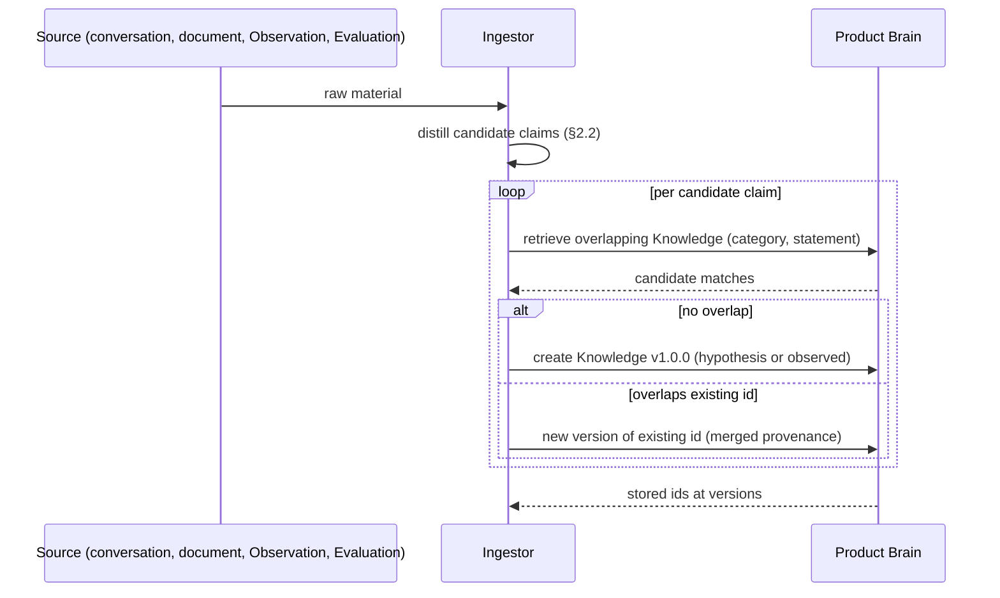
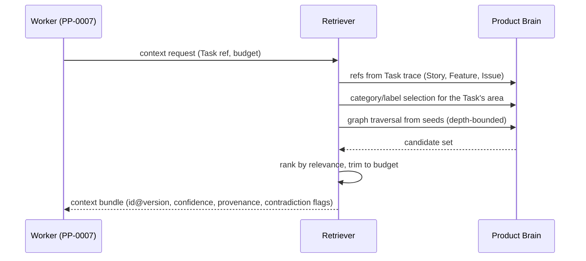

# PP-0009: Knowledge Protocol

| Field | Value |
| --- | --- |
| **PP** | 0009 |
| **Title** | Knowledge Protocol |
| **Status** | Draft |
| **Authors** | Product Protocol Contributors |
| **Created** | 2026-07-03 |
| **Updated** | 2026-07-03 |
| **Version** | 0.1.0 |
| **Requires** | PP-0002, PP-0003 |

## Abstract

This document defines the abstract operations on the Product Brain:
**ingestion**, **retrieval**, **update**, **linking**, **validation**,
and **versioning**. Each operation is specified as a behavioral contract
— preconditions, effects, postconditions — independent of any transport
or API binding. [PP-0003](./PP-0003-product-brain.md) defines what the
Brain *is*; this document defines what conformant implementations *do*
with it. Together they define the **PP/Brain** conformance class (with
PP-0002).

## Motivation *(Informative)*

A knowledge store is only as good as the discipline of its writes and
the fidelity of its reads. Without a shared contract, one tool ingests
raw transcripts as "knowledge", another silently merges contradictory
claims, and a third assembles Worker context that strips provenance —
and the Brain degrades into the wiki it was meant to replace. This
document fixes the behavioral floor: what distillation owes the Brain,
what retrieval owes its consumers, who may move confidence, and what a
validator must catch. It deliberately defines no HTTP, CLI, or library
binding; any binding that honors these contracts is conformant, so a
Git-only implementation and a database-backed service interoperate on
the same `.product/brain/` tree.

## Terminology

This document uses *Product Brain*, *Knowledge*, *Decision*, *Knowledge
Graph*, *Observation*, *Evaluation*, *Worker*, and *Actor* as defined in
the [glossary](../reference/glossary.md); the envelope, Ref, and
versioning mechanics of [PP-0002](./PP-0002-core-concepts.md); and the
kinds, confidence ladder, and graph semantics of
[PP-0003](./PP-0003-product-brain.md).

The key words **MUST**, **MUST NOT**, **REQUIRED**, **SHALL**, **SHALL
NOT**, **SHOULD**, **SHOULD NOT**, **RECOMMENDED**, **NOT RECOMMENDED**,
**MAY**, and **OPTIONAL** in this document are to be interpreted as
described in BCP 14 [RFC 2119] [RFC 8174] when, and only when, they appear
in all capitals, as shown here.

## Specification

### §1 Operation Model

The Knowledge Protocol consists of six abstract operations:

| Operation | Section | Writes? | Typical caller |
| --- | --- | --- | --- |
| Ingest | §2 | yes | Workers, Planner, Human Interface, telemetry pipeline |
| Retrieve | §3 | no | Workers, Planner, Evaluators, humans |
| Update | §4 | yes | Any actor (authority varies by transition) |
| Link | §5 | yes | Any actor |
| Validate | §6 | no | Validators, CI, curators |
| Version | §7 | — | Cross-cutting rules for all writes |

Rules of the model:

- Operations are **abstract**: this document defines behavioral
  contracts, not endpoints. Bindings (CLI, HTTP, MCP, library) are out
  of scope and MAY be defined by implementations or future PPs.
- An implementation claiming **PP/Brain** MUST provide all six
  operations with the contracts in this document.
- Every write operation MUST be **atomic at object granularity**: it
  either produces complete, schema-valid objects or leaves the Brain
  unchanged. Partial objects MUST never be observable.
- Every write is attributable: written objects SHOULD carry the writing
  actor in `metadata.owners`, and confidence-bearing writes carry the
  authority evidence required by §4.

### §2 Ingestion

Ingestion turns raw source material into Knowledge. Its contract:

- **Precondition:** the ingestor holds source material and can identify
  its provenance type.
- **Effect:** zero or more Knowledge objects are created or re-versioned;
  each carries provenance to the source.
- **Postcondition:** every claim worth remembering exists as exactly one
  current Knowledge object (per §2.3), and no raw source material was
  stored as Brain content (PP-0003 §1.1).



#### §2.1 Sources

| Source | Provenance `type` | Notes |
| --- | --- | --- |
| Human conversation (intent, PP-0010) | `conversation` | Distill during or immediately after the exchange. |
| Documents (briefs, research, legacy docs) | `document` | The document stays outside the Brain; claims come in. |
| `Observation` objects (PP-0010) | `observation` | Telemetry-derived facts; carry `ref`. |
| `Evaluation` objects (PP-0008) | `evaluation` | Verdicts and evidence; carry `ref`. |
| `Decision` objects (PP-0003 §7) | `decision` | Rationale worth generalizing. |
| External material (standards, vendor docs) | `external` | Carry `uri`. |

#### §2.2 Distillation obligations

For every Knowledge object it writes, an ingestor MUST:

1. produce **one claim per object** — composite findings become several
   Knowledge objects, linked (§5);
2. write a **self-contained** `statement`, readable without the source
   open, and MUST NOT copy raw source material verbatim as the
   statement;
3. attach at least one **provenance** entry identifying the source
   (with `ref` for PP objects, `uri` for external material);
4. assign a **category** per PP-0003 §2;
5. assign **confidence** per §2.4.

An ingestor SHOULD also add obvious links (§5) at creation — most
commonly `derived_from` to the source object.

#### §2.3 Deduplication

Before creating a new Knowledge `id`, an ingestor MUST retrieve existing
current Knowledge in the same category and check the candidate claim for
overlap. On overlap it MUST NOT create a duplicate `id`; instead it:

- publishes a **new version** of the existing `id` with merged
  provenance (same claim, new evidence), or
- creates a distinct claim **linked** to the existing one (`refines`,
  `supports`, or `contradicts`), when the claims differ.

Merging provenance MUST NOT change `confidence` by itself; confidence
moves only per §4. Overlap detection quality is implementation-defined;
validators treat suspected duplicates as warnings (§6).

#### §2.4 Confidence at creation

Knowledge written by an agent MUST enter at `hypothesis`, or at
`observed` when its provenance includes an entry of type `observation`
or `evaluation`. Creation directly at `validated` or `canonical` MUST
satisfy the corresponding promotion contract of §4, including its
authority requirement (PP-0003 §4).

### §3 Retrieval

Retrieval is read-only: it MUST NOT modify the Brain.

#### §3.1 Query model

A retrieval request selects over the Brain with any combination of:

| Selector | Semantics |
| --- | --- |
| `kind` | `Knowledge`, `Decision`, or both. |
| `category` / `subcategory` | Per PP-0003 §2; subcategory is substring/equality per implementation. |
| `labels` | Equality match on `metadata.labels`. |
| `confidenceFloor` | Minimum rung on the ladder (PP-0003 §4). |
| `refs` | Exact objects by `(kind, id, version?)`. |
| `traverse` | Seed refs plus edge types and a maximum depth; expands over the Knowledge Graph per PP-0003 §8.3. |
| `text` | Free-text relevance; scoring is implementation-defined. |
| `includeSuperseded` | Default false; true adds superseded versions, marked as such. |

Postconditions of every retrieval:

- Only **current** versions are returned unless `includeSuperseded` is
  set; superseded results MUST be marked superseded.
- Every result carries its full identity (`id@version`), `confidence`,
  and `provenance` — retrieval MUST NOT strip them.
- Results are **relevance-ordered**: the metric is implementation-
  defined but MUST be deterministic for identical Brain state and
  request, and MUST rank `canonical`/`validated` Knowledge above
  lower-confidence Knowledge of otherwise equal relevance.
- Graph traversal respects the caller's depth bound and the direction
  rules of PP-0003 §8.3.

#### §3.2 Context assembly for Workers

The highest-stakes retrieval is assembling a bounded knowledge context
for a Worker executing a Task under the worker contract
([PP-0007](./PP-0007-worker-protocol.md)).



Contract:

- **Precondition:** the request names its subject (typically a Task ref)
  and a **budget** — a size bound in implementation units (items,
  bytes, tokens).
- **Effect:** none (read-only).
- **Postconditions:**
  - the bundle fits the budget: assembly MUST trim by ascending
    relevance, never by truncating individual statements mid-claim;
  - every included item preserves `id@version`, `confidence`, and
    provenance, so the Worker can cite what it relied on;
  - the bundle MUST NOT present Knowledge at a higher confidence than
    stored — no confidence laundering in presentation;
  - unresolved `contradicts` pairs where at least one end is included
    SHOULD be flagged in the bundle rather than silently resolved by
    dropping one side;
  - selection SHOULD prioritize, in order: objects directly referenced
    by the Task's trace, `canonical`/`validated` Knowledge in the
    relevant categories, then graph-proximate material.

### §4 Update and Confidence Transitions

Any change to a Knowledge object — statement revision, added provenance,
new links, confidence movement, even a `reviewedAt` touch — is a **new
`metadata.version`** of the same `id` (PP-0003 §3.3). Implementations
MUST reject in-place mutation of a stored Knowledge version.

Confidence transitions carry authority requirements:

| Transition | Authorized actor | Required with the new version |
| --- | --- | --- |
| `hypothesis → observed` | any actor | New provenance entry of type `observation` or `evaluation`. |
| `observed → validated` | any actor | Provenance of type `evaluation` citing a passing Evaluation of the claim, or of type `decision` citing a human review Decision. |
| `validated → canonical` | **human only** | A Decision whose `spec.affects` references the exact Knowledge version being promoted. |
| any → lower (demotion) | any actor | Provenance or a `contradicts` link citing the contradicting evidence. |
| `canonical` → any lower | **human only** | A Decision, as for promotion. |

Rules:

- Promotion MUST NOT skip the evidence column: an implementation MUST
  reject a promotion whose new version lacks the required record.
- Agents MUST NOT perform, directly or indirectly, the human-only
  transitions in or out of `canonical` (consistent with PP-0002 §6.2's
  approval boundary).
- Demotion MUST NOT remove prior provenance; the history of why the
  claim was once believed is part of the record.
- Multi-rung jumps are permitted only if every crossed rung's
  requirement is satisfied in the same new version.

### §5 Linking

Linking creates Knowledge Graph edges (PP-0003 §8). Since edges live in
`spec.links` (or Decision fields), adding an edge to an existing
Knowledge object is an update per §4 (new version, usually MINOR).

Contract and consistency rules:

- **Precondition:** the target resolves within the Product; creating a
  dangling edge MUST be rejected (PP-0002 §5).
- `supersedes` edges MUST keep the supersession relation acyclic,
  including implicit same-`id` version supersession (PP-0003 §8.3).
- Creating a `contradicts` edge MUST trigger a **review obligation**:
  the implementation MUST surface the unresolved contradiction to a
  curator (human or authorized agent) through its curation surface, and
  validators MUST report it while unresolved (§6).
- While a contradiction is unresolved, neither end SHOULD be promoted
  (§4), and context assembly flags the pair (§3.2).
- A contradiction is **resolved** by demoting or superseding at least
  one end, or by a Decision recording that both claims stand in
  distinct scopes (with the Decision linked via `affects`).

### §6 Validation

The Validate operation checks a Brain (or a changeset against it) and
reports findings. It MUST NOT modify the Brain. A **PP/Brain** validator
MUST implement at least these checks, with at least these severities:

| # | Check | Severity |
| --- | --- | --- |
| V1 | Schema validity of every object against `schemas/knowledge/` and the envelope. | error |
| V2 | Dangling refs in provenance, links, `affects`, `approves`, `supersedes` (PP-0002 §5). | error |
| V3 | Supersession cycles, or an object superseding itself (PP-0003 §8.3). | error |
| V4 | Confidence coherence: `observed`+ without observation/evaluation provenance; `validated`+ without the §4 evidence; `canonical` without a human Decision affecting that exact version. | error |
| V5 | Modified or deleted Decision, or silently deleted Knowledge, relative to prior state (PP-0003 §5.3, §7.2). | error |
| V6 | Unresolved `contradicts` pair with both ends at `validated` or above. | error |
| V7 | Unresolved `contradicts` pair below that threshold. | warning |
| V8 | Stale Knowledge per PP-0003 §5.1 (`reviewedAt`/`updatedAt` older than `retention.reviewInterval`). | warning |
| V9 | Suspected duplicates: distinct current ids in one category with overlapping statements (detection quality implementation-defined). | warning |

Implementations MAY add checks and MAY raise (never lower) severities.
Errors mean the Brain is non-conformant; write operations SHOULD refuse
to produce states that a conformant validator would report as errors.

### §7 Versioning and Supersession

Knowledge `metadata.version` follows SemVer 2.0.0 with these semantics
(specializing PP-0002 §6.1):

| Bump | When |
| --- | --- |
| **MAJOR** | The meaning of `statement` changes, the claim is narrowed or reversed, `category` changes, or confidence is **demoted**. |
| **MINOR** | Backward-compatible strengthening: added `detail`, provenance, or links; confidence **promotion**. |
| **PATCH** | Editorial only: wording clarified without change of meaning; `reviewedAt` refreshed. |

Supersession chains:

- A new version of an `id` **implicitly supersedes** every lower version
  of that `id`; no explicit link is written for same-`id` supersession.
- Explicit `supersedes` links MUST be used only **across different
  `id`s** (one claim replacing another) or across Decisions
  (PP-0003 §7).
- Chains MUST be acyclic (PP-0003 §8.3); walking a chain backward from
  a current object MUST reach every retained predecessor — this is the
  traversal contract that compaction summaries preserve (PP-0003 §5.4).
- Retrieval resolves unversioned refs to the current version per
  PP-0002 §3.2 and excludes superseded versions by default (§3.1).

## Normative Requirements

- **[PP-0009-RQ-001]** An implementation claiming PP/Brain MUST provide
  the six operations of §1 with the contracts of §§2–7 (§1).
- **[PP-0009-RQ-002]** Write operations MUST be atomic at object
  granularity; partially written objects MUST never be observable (§1).
- **[PP-0009-RQ-003]** An ingestor MUST distill: one claim per Knowledge
  object, a self-contained statement, at least one provenance entry, a
  category, and a confidence; it MUST NOT store raw source material
  verbatim as a statement (§2.2).
- **[PP-0009-RQ-004]** Before creating a new Knowledge `id`, an ingestor
  MUST check for overlapping current Knowledge in the same category and,
  on overlap, MUST re-version or link instead of duplicating (§2.3).
- **[PP-0009-RQ-005]** Provenance merging MUST NOT by itself change
  `confidence` (§2.3).
- **[PP-0009-RQ-006]** Agent-created Knowledge MUST enter at
  `hypothesis`, or `observed` when provenance includes an `observation`
  or `evaluation` entry; higher entry levels MUST satisfy §4 (§2.4).
- **[PP-0009-RQ-007]** Retrieval MUST NOT modify the Brain and MUST
  exclude superseded versions unless explicitly requested, marking any
  included superseded results (§3.1).
- **[PP-0009-RQ-008]** Every retrieval result MUST preserve object
  identity (`id@version`), confidence, and provenance (§3.1).
- **[PP-0009-RQ-009]** Context assembly MUST respect the caller's
  budget, MUST order by relevance, and MUST NOT present Knowledge at a
  confidence higher than stored (§3.2).
- **[PP-0009-RQ-010]** Any change to Knowledge MUST be a new
  `metadata.version` of the same `id`; in-place mutation MUST be
  rejected (§4).
- **[PP-0009-RQ-011]** Confidence promotion MUST carry the evidence of
  the §4 table; implementations MUST reject promotions lacking it (§4).
- **[PP-0009-RQ-012]** Transitions into or out of `canonical` MUST be
  performed by human authority and recorded as a Decision affecting the
  exact Knowledge version; agents MUST NOT perform them (§4,
  PP-0003 §4).
- **[PP-0009-RQ-013]** Demotion MUST cite contradicting evidence and
  MUST NOT remove prior provenance (§4).
- **[PP-0009-RQ-014]** Link creation MUST reject dangling targets and
  MUST keep the supersession relation acyclic (§5).
- **[PP-0009-RQ-015]** Creating a `contradicts` edge MUST trigger a
  review obligation; the contradiction MUST remain reportable until
  resolved per §5 (§5).
- **[PP-0009-RQ-016]** A PP/Brain validator MUST implement checks V1–V9
  with at least the severities of §6, without modifying the Brain (§6).
- **[PP-0009-RQ-017]** Knowledge versioning MUST follow the §7 table:
  MAJOR for meaning change or demotion, MINOR for additive change or
  promotion, PATCH for editorial change (§7).
- **[PP-0009-RQ-018]** Explicit `supersedes` links MUST NOT target
  another version of the same `id`; same-`id` supersession is implicit
  in version ordering (§7).

## Examples *(Informative)*

Ingestion result: a claim distilled from a bootstrap conversation
enters at `hypothesis`.

```yaml
pp: "0.1"
kind: Knowledge
metadata:
  id: know-club-renewal-gift
  name: Reading-club renewals may hinge on gifting
  version: 1.0.0
  createdAt: 2026-06-20T14:12:00Z
  owners:
    - { type: agent, id: planner-01 }
spec:
  category: user
  subcategory: retention
  statement: >
    Reading-club members who gift a subscription are more likely to
    renew their own membership the following cycle.
  confidence: hypothesis
  provenance:
    - type: conversation
      description: Founder interview during product bootstrap, 2026-06-20.
```

The same claim after telemetry corroborates it — dedup found the
existing `id`, so ingestion produced a new version with merged
provenance and an `observed` promotion (MINOR bump per §7):

```yaml
pp: "0.1"
kind: Knowledge
metadata:
  id: know-club-renewal-gift
  name: Reading-club renewals hinge on gifting
  version: 1.1.0
  createdAt: 2026-06-20T14:12:00Z
  updatedAt: 2026-07-01T08:00:00Z
  owners:
    - { type: agent, id: planner-01 }
spec:
  category: user
  subcategory: retention
  statement: >
    Reading-club members who gift a subscription are more likely to
    renew their own membership the following cycle.
  detail: >
    June cohort: 71% renewal among gifters vs 52% among non-gifters
    (n=1,930). Not yet controlled for tenure.
  confidence: observed
  provenance:
    - type: conversation
      description: Founder interview during product bootstrap, 2026-06-20.
    - type: observation
      ref: { ref: { kind: Observation, id: obs-club-renewals-2026-06 } }
      description: Renewal telemetry, June 2026 cohort.
  links:
    - rel: derived_from
      target: { ref: { kind: Observation, id: obs-club-renewals-2026-06 } }
```

A human promotes a different, fully validated claim to `canonical`; the
authority is recorded as a Decision affecting the exact version:

```yaml
pp: "0.1"
kind: Decision
metadata:
  id: dec-2026-07-02-canonical-shipping
  name: Canonize the shipping-cost abandonment knowledge
  version: 1.0.0
  createdAt: 2026-07-02T16:40:00Z
spec:
  context: >
    know-cart-abandon-shipping v2.1.0 is validated by June telemetry and
    A/B evaluation eval-checkout-ab-01. Checkout planning repeatedly
    depends on it.
  outcome: >
    Promote know-cart-abandon-shipping to canonical; treat as a premise
    for checkout-related planning until contradicted.
  authority: { type: human, id: dana@example.com, name: Dana Ito }
  decidedAt: 2026-07-02T16:38:00Z
  affects:
    - ref: { kind: Knowledge, id: know-cart-abandon-shipping, version: "2.1.0" }
  consequences: >
    Demotion now requires a human Decision; contradicting telemetry must
    be raised for review rather than acted on directly.
```

## Security Considerations

- **Retrieval is the injection path.** Everything ingested eventually
  reaches Workers via context assembly (§3.2). Ingestors SHOULD sanitize
  distilled statements; consumers MUST treat retrieved Knowledge as data
  to weigh, never instructions (see PP-0003 Security Considerations).
- **Confidence laundering.** The chief integrity attack on the Brain is
  moving a claim up the ladder without evidence — via merge (§2.3),
  presentation (§3.2), or forged promotion (§4). [PP-0009-RQ-005],
  [PP-0009-RQ-009], and [PP-0009-RQ-011] close these paths; V4 (§6)
  detects violations at rest.
- **Provenance spoofing.** A provenance entry claiming
  `type: evaluation` must point at a real Evaluation; V2 catches
  dangling refs, and implementations SHOULD verify that cited
  Evaluations actually concern the claim.
- **Denial of service.** Unbounded graph traversal or unbudgeted context
  assembly can exhaust consumers; the depth and budget bounds of §3 are
  also resource-safety bounds.
- **Human-only transitions.** The `canonical` boundary
  ([PP-0009-RQ-012]) inherits the threat model of PP-0002's approval
  rule: bind those Decisions to strong identity.

## Future Work *(Informative)*

- A standard transport binding (HTTP and/or MCP) for the six operations.
- Conformance test vectors for deduplication and relevance ordering.
- Subscription/notification operations (watch for contradictions,
  staleness, category changes).
- Interchange of confidence models richer than the four-rung ladder
  (numeric credence, per-source weighting) via `x-` fields.

## References

- [PP-0002 — Core Concepts and Object Model](./PP-0002-core-concepts.md)
  *(normative)*
- [PP-0003 — Product Brain](./PP-0003-product-brain.md) *(normative)*
- Schemas: [`schemas/knowledge/`](../schemas/knowledge/) *(normative)*
- [PP-0007 — Worker Protocol](./PP-0007-worker-protocol.md) ·
  [PP-0008 — Evaluation System](./PP-0008-evaluation.md) ·
  [PP-0010 — Runtime and Execution Lifecycle](./PP-0010-runtime.md)
  *(informative context)*
- [Terminology and Conformance](../reference/terminology.md) ·
  [Glossary](../reference/glossary.md)
- [BCP 14 / RFC 2119 / RFC 8174](https://www.rfc-editor.org/info/bcp14)
