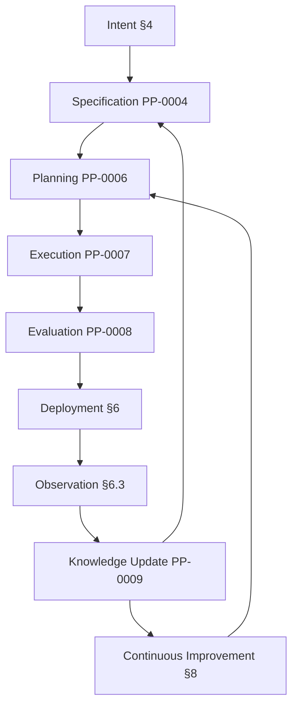
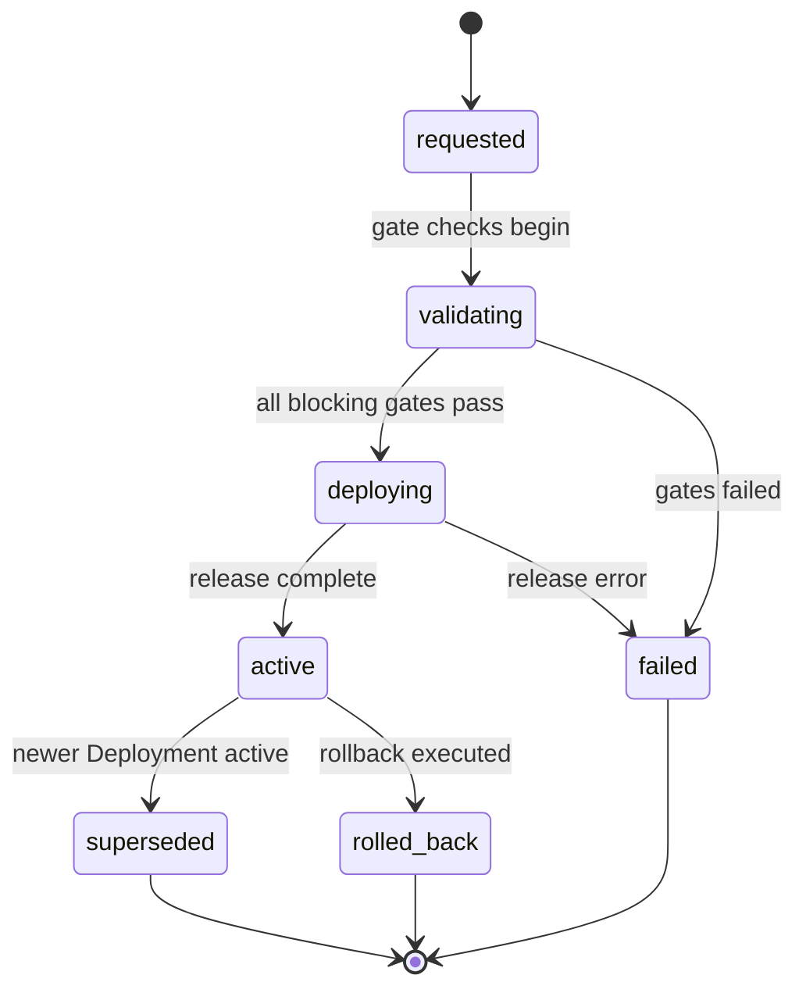
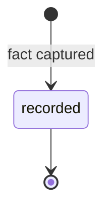
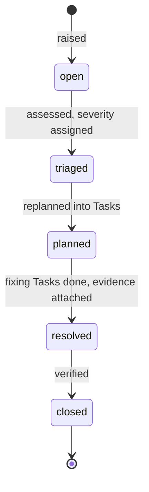
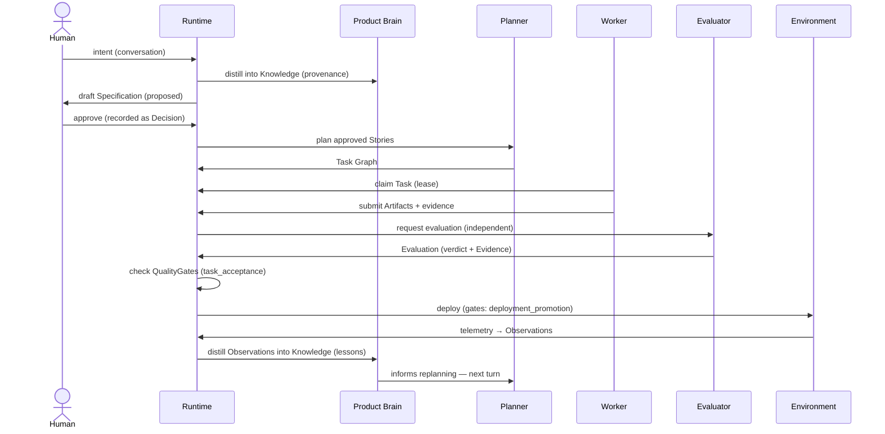

# PP-0010: Runtime and Execution Lifecycle

| Field | Value |
| --- | --- |
| **PP** | 0010 |
| **Title** | Runtime and Execution Lifecycle |
| **Status** | Draft |
| **Authors** | Product Protocol Contributors |
| **Created** | 2026-07-03 |
| **Updated** | 2026-07-03 |
| **Version** | 0.1.0 |
| **Requires** | PP-0002, PP-0003, PP-0004, PP-0005, PP-0006, PP-0007, PP-0008, PP-0009 |

## Abstract

This document is the capstone of Product Protocol: it defines the
runtime that drives the full autonomous engineering loop — from human
intent, through specification, planning, execution, and evaluation, to
deployment, observation, and learning. It defines the `Deployment` and
`Observation` kinds, the Issue triage lifecycle, the intake of
unstructured Intent, and the interaction contracts for humans (approval
authority) and AI agents (execution within governed bounds).
Conformance to this document, together with all documents it requires,
constitutes the **PP/Runtime** conformance class.

## Motivation *(Informative)*

The earlier documents each define one organ: the Brain (PP-0003),
Specifications (PP-0004), the Constitution (PP-0005), the Task Graph
(PP-0006), Workers and Artifacts (PP-0007), Evaluation (PP-0008),
Knowledge ingestion (PP-0009). None of them says how the organs form a
living system: when planning begins, what gates a release, who may say
"yes", how the running product's behavior flows back into its own
memory. Left unspecified, every vendor wires the loop differently, and
the guarantees the parts make individually — human approval, evaluation
independence, append-only evidence — can be quietly bypassed at the
seams. This document specifies the seams: phase contracts, the
deployment and observation records, the issue lifecycle, and the two
interaction contracts that keep humans in authority and agents in
motion.

## Terminology

*Intent*, *Deployment*, *Environment*, *Observation*, *Issue*,
*Approval*, *Human Interface*, *Knowledge*, *Decision*, *Quality Gate*,
*Task*, *Worker*, *Evaluator*, *Planner* — per the
[glossary](../reference/glossary.md).

The key words **MUST**, **MUST NOT**, **REQUIRED**, **SHALL**, **SHALL
NOT**, **SHOULD**, **SHOULD NOT**, **RECOMMENDED**, **NOT RECOMMENDED**,
**MAY**, and **OPTIONAL** in this document are to be interpreted as
described in BCP 14 [RFC 2119] [RFC 8174] when, and only when, they appear
in all capitals, as shown here.

## Specification

### §1 The Loop

A conformant runtime drives this cycle continuously:



The loop is not a pipeline run once; it is the steady state of a
Product under autonomous management. Multiple turns run concurrently —
one Feature may be deploying while another is being specified — but
every object individually follows its own lifecycle, and every
transition between phases is gated as defined in §3.

### §2 Runtime Responsibilities and Conformance

The **runtime** is the implementation role that orchestrates actors and
enforces the protocol's invariants. It is defined, like every PP actor,
by observable contract, not internal design ([PP-0001-RQ-002]).

A runtime claiming **PP/Runtime** MUST:

1. Satisfy every MUST/MUST NOT requirement of PP-0002 through PP-0009
   and this document
   ([terminology §4](../reference/terminology.md#4-conformance-classes)).
2. Implement every phase of §1 and enforce the phase contracts of §3.
3. Enforce the governance boundary: the approval rules of §7 and the
   agent constraints of §8.
4. Maintain the Product tree (PP-0002 §7) as the canonical, losslessly
   exportable state of the loop.

The runtime is the enforcement point of last resort: where an
individual specification says a transition "MUST be gated" or an actor
"MUST NOT" act, it is the runtime that refuses.

### §3 Phase Contracts

Each phase of §1 has entry conditions (what must already hold),
obligations (what the phase must do), and exit conditions (what gates
progress). The runtime MUST NOT advance work past a phase whose exit
conditions are unmet.

| Phase | Entry conditions | Obligations | Exit conditions |
| --- | --- | --- | --- |
| Intent (§4) | Human input exists (conversation, document). | Distill into Knowledge with provenance (PP-0009); optionally draft governed objects. | Knowledge recorded; drafts, if any, enter `draft`. |
| Specification (PP-0004) | Relevant Knowledge and Goals exist. | Author/revise Goals, Capabilities, Features, Stories, Specifications; submit as `proposed`. | Human approval recorded as Decision (PP-0002 §6.2); objects `approved`. |
| Planning (PP-0006) | Approved Stories/Features/Issues to plan. | Planner decomposes into the Task Graph; dependencies, priorities. | Tasks `ready` with resolvable refs; graph acyclic. |
| Execution (PP-0007) | `ready` Tasks; Workers with matching capabilities. | Single-owner claim, lease, work within bounded context, produce Artifacts + evidence. | Task `submitted` with Artifacts recorded. |
| Evaluation (PP-0008) | Submitted work; independent Evaluator available. | Evaluate against criteria; record Evaluations with Evidence. | Blocking gates with trigger `task_acceptance` satisfied; Task `done` — or `rejected`, feeding replanning. |
| Deployment (§6) | Accepted Artifacts; declared target environment. | Check gates, execute release, record Deployment with status. | Blocking gates with trigger `deployment_promotion` satisfied (§6.1); Deployment `active`. |
| Observation (§6.3) | An active Deployment. | Collect telemetry, incidents, feedback as Observation records. | Continuous — no exit; feeds Knowledge Update. |
| Knowledge Update (PP-0009) | Observations, Evaluations, Decisions accumulating. | Distill into Knowledge on a defined cadence (§8.2); raise Issues (§6.4). | Knowledge recorded with provenance. |
| Continuous Improvement (§8.2) | Updated Brain; open Issues. | Replan: revise proposals, feed Issues into Planning. | New loop turn begins. |

Every gated transition in this table uses the QualityGate semantics of
PP-0008 §9; verdicts of `error` or `inconclusive` never satisfy a gate
([PP-0008-RQ-006]).

### §4 Intent

**Intent** is unstructured human input: conversations with the Human
Interface (§7), uploaded documents, meeting notes, sketches. Intent
itself is **not** an object — there is no `Intent` kind. What the
protocol stores is its distillation:

- The runtime MUST distill intake into `Knowledge` objects via the
  ingestion discipline of PP-0009, preserving provenance: each derived
  Knowledge object records where it came from (the conversation,
  document, or actor) so that every later Specification can be traced
  back to a human utterance.
- The runtime MAY additionally draft governed objects (Goals,
  Capabilities, Features, Stories, Specifications, GoldenTests)
  directly from intent. Such drafts MUST enter the governed lifecycle
  at `draft` (PP-0002 §6.2) and carry provenance to their source
  Knowledge; drafting never implies approving.
- Raw intake (transcripts, documents) SHOULD be retained — as
  Knowledge source material or Artifacts — so distillation can be
  audited and re-run.
- Intent MUST NOT be silently discarded: intake the runtime chooses
  not to act on SHOULD still be recorded as Knowledge (e.g. category
  `context`), because "the humans mentioned this and we did nothing"
  is itself product memory.

### §5 Orchestration of Planning, Execution, and Evaluation

The middle of the loop is specified by PP-0006 (Task Graph and
Planner), PP-0007 (Worker contract and Artifacts), and PP-0008
(Evaluation). This section binds the runtime to their enforcement:

- **Single ownership.** The runtime MUST enforce that a Task has at
  most one owning Worker at a time: claims are exclusive, and a claim
  MUST be released or expired before another Worker may claim the Task
  (PP-0006).
- **Leases.** Claims are leases, not titles. The runtime MUST expire
  claims whose lease has lapsed without progress and return the Task
  to `ready`, so a stalled or vanished Worker cannot strand work.
- **Evaluation independence.** The runtime MUST enforce PP-0008 §5.2
  at scheduling time: it MUST NOT assign an Evaluation whose subject
  was produced by the same actor identity as the Evaluator
  ([PP-0008-RQ-011]).
- **Gating.** The runtime MUST evaluate all applicable QualityGates at
  each transition of §3 and record their outcomes on the gated
  object's status (PP-0008 §9.2).
- **Rejection flow.** A `rejected` Task returns to planning
  (PP-0006); the runtime MUST preserve the rejecting Evaluations and
  SHOULD ensure the lesson reaches the Brain (§8.2).

The runtime schedules; it does not think. How a Planner decomposes or
a Worker implements is out of scope ([PP-0001-RQ-002]).

### §6 Deployment

**Definition.** A `Deployment` is the record of releasing a set of
Artifacts into an Environment. It captures the *act* — what, where,
when, by whose request, gated by what — not the mechanics of moving
bits (PP-0001 §3).

**Responsibilities.** Bind released Artifacts to an environment;
carry the gate outcomes that authorized the release; track the
release's runtime state.

**Lifecycle.** A Deployment's `spec` is written once at request time
and never changes; its `status` evolves through the state machine
below. Deployments are not among the pure record kinds of PP-0002
§6.3 precisely because `status` is mutable, but their `spec` carries
the same write-once discipline — a new release is a new Deployment,
never an edit to an old one.



**Inputs.** Accepted Artifacts (PP-0007), the declared environment
(§6.1), applicable QualityGates (PP-0008 §9).

**Outputs.** The Deployment record; Evaluations referenced in
`status.evaluations`; Observations from the running release (§6.3).

**Relationships.** `artifacts` → Artifact records; `gates` →
QualityGates; `status.evaluations` → gate-check Evaluations;
Observations reference the Deployment via `relatesTo`; constrained by
Constitution articles (PP-0005).

#### §6.1 Environments

Environments are declared per Product in `Product.spec.environments`
(PP-0002 §9): a list of `{name, classification, description?}` where
`classification` is one of `development`, `test`, `pre_production`,
`production`.

- `Deployment.spec.environment` MUST name a declared environment of
  the Product; a Deployment into an undeclared environment is invalid.
- A promotion into an environment classified `production` MUST pass
  every `blocking` QualityGate with trigger `deployment_promotion`
  applicable to the Product (PP-0008 §9.2), and MUST satisfy every
  blocking Constitution article whose enforcement binding evaluates on
  deployment (`evaluatedOn: deployment`, PP-0005 §4). The gate-check
  Evaluations MUST be recorded in `status.evaluations`.
- Lower classifications SHOULD be gated proportionately;
  implementations MAY deploy to `development` ungated.
- At most one Deployment per environment SHOULD be `active` at a time;
  when a new Deployment becomes `active`, the runtime MUST transition
  the previously active one to `superseded`.

#### §6.2 Deployment record fields

| Field | Type | Req | Description |
| --- | --- | --- | --- |
| `spec.environment` | string | MUST | Name of a declared environment (§6.1). |
| `spec.artifacts` | list[Ref] | MUST | ≥ 1 `Artifact` being released. |
| `spec.gates` | list[Ref] | MAY | `QualityGate`s evaluated for this deployment. |
| `spec.strategy` | enum | MAY | `rolling`, `blue_green`, `canary`, `recreate`, `other`. |
| `spec.requestedBy` | Actor | MAY | Who requested the release (`{type, id, name?}`). |
| `spec.requestedAt` | string (RFC 3339) | MUST | When the release was requested. |
| `status.state` | enum | MAY* | `requested`, `validating`, `deploying`, `active`, `superseded`, `rolled_back`, `failed`. |
| `status.evaluations` | list[Ref] | MAY | Gate-check `Evaluation`s for this deployment. |
| `status.startedAt` | string (RFC 3339) | MAY | When deploying began. |
| `status.completedAt` | string (RFC 3339) | MAY | When a terminal or `active` state was reached. |
| `status.reason` | string (prose) | MAY | Why `failed` / `rolled_back` / `superseded`. |

\* `status` is optional on the wire (PP-0002 §3), but a runtime
managing a Deployment MUST maintain `status.state` through the state
machine above, without skipping states. A rollback MUST be recorded by
transitioning to `rolled_back` with a `status.reason`, and any
compensating release is a new Deployment.

Schema: [`schemas/deployment/deployment.schema.json`](../schemas/deployment/deployment.schema.json).

#### §6.3 The Observation Kind

**Definition.** An `Observation` is a telemetry-derived fact about the
running Product: a metric reading, an incident, a piece of user
feedback, an analytics finding, or a manual report.

**Responsibilities.** State one fact, once, with enough context
(source, time, environment, links) to be distilled into Knowledge or
triaged into an Issue.

**Lifecycle.** Observations are append-only records (PP-0002 §6.3):



They MUST NOT be modified or deleted; a correction is a new
Observation referencing the old one via `relatesTo`.

**Inputs.** Telemetry pipelines, incident tooling, user channels,
analytics, humans.

**Outputs.** Distilled Knowledge (§8.2); Issues (§6.4).

**Relationships.** `relatesTo` → typically the `Deployment`, `Goal`
(metric movements), `Feature`, or prior `Observation` concerned;
distilled into `Knowledge`; may raise `Issue`s.

| Field | Type | Req | Description |
| --- | --- | --- | --- |
| `spec.source` | enum | MUST | `telemetry`, `incident`, `user_feedback`, `analytics`, `manual`. |
| `spec.statement` | string (prose) | MUST | The fact, stated plainly. |
| `spec.measurement` | object | MAY | `{metric (MUST), value (number\|string, MUST), unit?}`. |
| `spec.observedAt` | string (RFC 3339) | MUST | When the fact was observed. |
| `spec.environment` | string | MAY | Environment name it pertains to. |
| `spec.relatesTo` | list[Ref] | MAY | Objects this observation concerns. |
| `spec.severity` | enum | MAY | `critical`, `high`, `medium`, `low`, `info`. |

Schema: [`schemas/deployment/observation.schema.json`](../schemas/deployment/observation.schema.json).

#### §6.4 Issue triage lifecycle

An `Issue` is a tracked defect, risk, or anomaly requiring resolution.
The Issue object's schema is owned by the task domain (PP-0006); this
section defines its runtime lifecycle. `Issue.status.state` moves
through exactly these states:

`open → triaged → planned → resolved → closed`



Transitions and authority:

- **Raising (`open`).** Any actor — human or agent — MAY open an
  Issue. The runtime MUST open an Issue automatically for (a) every
  Constitution violation reported by a `constitution_audit`
  Evaluation, and (b) every failed Evaluation whose subject is a
  `production` Deployment or the Product observed in a `production`
  environment. Observations with severity `critical` or `high` SHOULD
  open Issues.
- **`open → triaged`.** A Planner or human assesses impact and
  severity. Duplicate or invalid Issues are triaged and then closed
  with a reason (the state machine is still traversed; no skipping).
- **`triaged → planned`.** A Planner decomposes the Issue into Tasks
  (PP-0006); the Issue becomes a valid `tracesTo` parent for those
  Tasks.
- **`planned → resolved`.** All fixing Tasks reach `done`, i.e. their
  accepting Evaluations exist; the Issue records refs to that
  evidence.
- **`resolved → closed`.** Verification that the resolution holds —
  by a passing Evaluation against the affected subject in the affected
  environment, or by explicit human confirmation. Agents MUST NOT
  close an Issue that lacks such verification evidence.

Issues MUST NOT skip states, and MUST NOT be deleted; a mistakenly
opened Issue is triaged and closed with its history intact.

### §7 Human Interaction

The Human Interface is conversation-first: humans express intent,
answer questions, and grant approvals through whatever surface the
implementation offers. The protocol constrains the *contract*, not the
form (glossary: *Human Interface*).

The division of authority, rooted in [PP-0001-RQ-003]:

- Humans hold approval authority over **Goals**, **Specifications**
  (and the governed specification kinds: Capabilities, Features,
  Stories, GoldenTests), **Constitutions**, and **architectural
  Decisions**. Everything else — task graphs, code, evaluations,
  deployments within gates, knowledge proposals — is derivable by
  agents and machines under those approved objects.
- Every approval MUST be recorded as a `Decision` referencing the
  approved object at its exact version, per PP-0002 §6.2 and the
  Decision profile of PP-0003 §7. An approval that is not recorded did
  not happen.
- The runtime MUST maintain an **approval queue**: the set of objects
  in `proposed` state (and pending architectural Decisions) awaiting
  human authority, presented with enough context — diffs against the
  prior version, provenance, affected objects — for an informed
  judgment.
- The runtime MUST NOT proceed past a required approval. Work that
  depends on an unapproved Specification waits; a release that
  requires an unapproved Constitution amendment waits.
- **Silence is not approval.** A timeout, an unanswered message, or
  the absence of an objection MUST NOT be treated as an approval.
  Implementations MAY escalate or remind, and MAY let humans
  pre-delegate narrow, explicit standing approvals — but a standing
  approval is itself a recorded Decision made by a human, never a
  default.

Humans MAY of course do more than approve: they can author
Specifications directly, execute Tasks as human Workers (PP-0007), or
evaluate as human Evaluators (PP-0008). The contract above is a floor
on their authority, not a ceiling on their participation.

### §8 AI Interaction and the Learning Loop

#### §8.1 What agents do

Agents are the motive force of the loop. Within it they:

- **read** the Product tree — Specifications, Constitution, Brain — as
  their operating context;
- **update knowledge** by proposing Knowledge through the ingestion
  discipline of PP-0009 (proposals, provenance, validation) — never by
  fiat;
- **generate tasks** as Planners (PP-0006) and execute them as Workers
  (PP-0007);
- **evaluate implementations** as Evaluators (PP-0008), independent of
  the producing agent;
- **produce evidence** for everything: Artifacts, Evaluations,
  transcripts, measurements.

And they are bounded: agents MUST NOT modify approved governed
objects, and MUST NOT perform the `proposed → approved` transition,
directly or indirectly ([PP-0002-RQ-009], [PP-0002-RQ-010]). An agent
that wants an approved Story changed drafts a new version and submits
it to the approval queue (§7). The runtime MUST reject writes that
violate these bounds regardless of which agent attempts them.

#### §8.2 The learning loop

Learning is what distinguishes a loop from a treadmill:

- **Distillation cadence.** The runtime MUST distill accumulated
  Observations into Knowledge (PP-0009) on a defined, declared cadence
  — continuous, scheduled, or threshold-triggered — such that no
  Observation is left indefinitely undistilled. The cadence SHOULD be
  stated in the Product tree (e.g. an annotation on the ProductBrain)
  so auditors can check it was honored.
- **Lessons.** Rejected work and production incidents are the loop's
  tuition. The runtime MUST record a Knowledge object with category
  `lesson` (PP-0003) for every production incident and SHOULD do so
  for recurring Task rejections, capturing what failed, why, and what
  to do differently — with provenance to the rejecting Evaluations or
  incident Observations.
- **Continuous improvement.** Replanning MUST be informed by the
  Brain: when a Planner revisits the Task Graph — for new intent, for
  Issues, or after rejections — the runtime MUST make the relevant
  Knowledge (lessons, constraints, prior Decisions) available to it.
  Improvement proposals that touch governed objects flow through §7;
  everything else flows through the Task Graph.

One full turn of the loop:



## Normative Requirements

- **[PP-0010-RQ-001]** An implementation claiming PP/Runtime MUST
  satisfy every MUST/MUST NOT requirement of PP-0002 through PP-0009
  and implement every phase of the loop (§1, §2).
- **[PP-0010-RQ-002]** The runtime MUST NOT advance work past a phase
  whose exit conditions, including all applicable blocking
  QualityGates per PP-0008 §9, are unmet (§3).
- **[PP-0010-RQ-003]** The runtime MUST distill human intent into
  Knowledge objects via PP-0009 ingestion, preserving provenance to
  the source conversation, document, or actor (§4).
- **[PP-0010-RQ-004]** Governed objects drafted from intent MUST enter
  the lifecycle at `draft` and MUST carry provenance; drafting MUST
  NOT imply approval (§4).
- **[PP-0010-RQ-005]** The runtime MUST enforce single ownership of
  Tasks: exclusive claims, released or expired before any other Worker
  may claim (§5).
- **[PP-0010-RQ-006]** The runtime MUST expire lapsed claim leases and
  return the Task to `ready` (§5).
- **[PP-0010-RQ-007]** The runtime MUST enforce evaluation
  independence at scheduling time per PP-0008 §5.2 (§5).
- **[PP-0010-RQ-008]** `Deployment.spec.environment` MUST name an
  environment declared in `Product.spec.environments` (§6.1).
- **[PP-0010-RQ-009]** A promotion into a `production`-classified
  environment MUST pass every blocking QualityGate with trigger
  `deployment_promotion` and every blocking Constitution article whose
  enforcement evaluates on deployment (§6.1).
- **[PP-0010-RQ-010]** Gate-check Evaluations for a Deployment MUST be
  recorded in `Deployment.status.evaluations` (§6.1, §6.2).
- **[PP-0010-RQ-011]** A Deployment's `spec` MUST be written once at
  request time and MUST NOT change thereafter; only `status` evolves
  (§6).
- **[PP-0010-RQ-012]** A managed Deployment's `status.state` MUST
  follow the state machine of §6 without skipping states (§6.2).
- **[PP-0010-RQ-013]** When a new Deployment becomes `active` in an
  environment, the runtime MUST transition the previously active
  Deployment there to `superseded`; a rollback MUST be recorded as
  `rolled_back` with a `status.reason` (§6.1, §6.2).
- **[PP-0010-RQ-014]** Observations MUST be append-only: never
  modified or deleted; corrections are new Observations (§6.3).
- **[PP-0010-RQ-015]** The runtime MUST open an Issue for every
  Constitution violation reported by a `constitution_audit` Evaluation
  and for every failed Evaluation concerning a production Deployment
  or production-observed subject (§6.4).
- **[PP-0010-RQ-016]** `Issue.status.state` MUST move through `open →
  triaged → planned → resolved → closed` without skipping states, and
  Issues MUST NOT be deleted (§6.4).
- **[PP-0010-RQ-017]** An agent MUST NOT transition an Issue to
  `closed` without verification evidence: a passing Evaluation of the
  affected subject or explicit human confirmation (§6.4).
- **[PP-0010-RQ-018]** Approvals of Goals, Specifications (and other
  governed specification kinds), Constitutions, and architectural
  Decisions MUST be made by humans and recorded as Decisions
  referencing the exact object version (§7; [PP-0001-RQ-003],
  [PP-0002-RQ-008]).
- **[PP-0010-RQ-019]** The runtime MUST maintain an approval queue of
  objects awaiting human authority and MUST NOT proceed past a
  required approval (§7).
- **[PP-0010-RQ-020]** Silence, timeouts, or absence of objection MUST
  NOT be treated as approval; standing approvals MUST themselves be
  recorded human Decisions (§7).
- **[PP-0010-RQ-021]** Agents MUST NOT modify approved governed
  objects nor perform the `proposed → approved` transition; the
  runtime MUST reject such writes ([PP-0002-RQ-009],
  [PP-0002-RQ-010]) (§8.1).
- **[PP-0010-RQ-022]** Agent knowledge updates MUST flow through the
  PP-0009 ingestion discipline, with provenance (§8.1).
- **[PP-0010-RQ-023]** The runtime MUST distill Observations into
  Knowledge on a defined, declared cadence (§8.2).
- **[PP-0010-RQ-024]** The runtime MUST record a Knowledge object with
  category `lesson` for every production incident, with provenance to
  its Observations or Evaluations (§8.2).
- **[PP-0010-RQ-025]** Replanning MUST have access to the relevant
  Knowledge in the Product Brain (§8.2).

## Examples *(Informative)*

A production Deployment, gated and active
(`deployments/deploy-2026-07-03-prod-042.yaml`):

```yaml
pp: "0.1"
kind: Deployment
metadata:
  id: deploy-2026-07-03-prod-042
  name: Production release 42 — cart refactor + guest checkout polish
  version: 1.0.0
  createdAt: 2026-07-03T15:00:00Z
spec:
  environment: production
  artifacts:
    - ref: { kind: Artifact, id: art-cart-refactor-7f3a, version: 1.0.0 }
    - ref: { kind: Artifact, id: art-checkout-polish-91c2, version: 1.0.0 }
  gates:
    - ref: { kind: QualityGate, id: gate-production-promotion }
  strategy: canary
  requestedBy: { type: agent, id: release-manager-agent, name: Release Manager }
  requestedAt: 2026-07-03T15:00:00Z
status:
  state: active
  evaluations:
    - ref: { kind: Evaluation, id: evrun-2026-07-03-checkout-014 }
    - ref: { kind: Evaluation, id: evrun-2026-07-03-perf-009 }
  startedAt: 2026-07-03T15:04:00Z
  completedAt: 2026-07-03T15:31:00Z
```

An Observation from production telemetry
(`observations/obs-2026-07-03-checkout-latency.yaml`):

```yaml
pp: "0.1"
kind: Observation
metadata:
  id: obs-2026-07-03-checkout-latency
  name: Checkout p95 latency rising after release 42
  version: 1.0.0
  createdAt: 2026-07-03T18:40:00Z
spec:
  source: telemetry
  statement: >
    Checkout p95 latency rose from 812 ms to 934 ms in the three hours
    after release 42 reached 100% of traffic; still inside the 1000 ms
    budget, but the margin halved.
  measurement:
    metric: checkout_p95_latency
    value: 934
    unit: ms
  observedAt: 2026-07-03T18:30:00Z
  environment: production
  relatesTo:
    - ref: { kind: Deployment, id: deploy-2026-07-03-prod-042 }
    - ref: { kind: Goal, id: goal-checkout-conversion }
  severity: medium
```

An Issue's runtime status as it moves through triage (excerpt — the
Issue kind's full schema is defined by the task domain, PP-0006):

```yaml
status:
  state: planned
  # open      2026-07-03T18:45Z — raised from obs-2026-07-03-checkout-latency
  # triaged   2026-07-03T19:10Z — severity medium; latency margin erosion
  # planned   2026-07-04T08:00Z — tasks task-9k2f, task-9k30 trace to this issue
```

## Security Considerations

- **The approval boundary is the root privilege boundary.** §7 and
  [PP-0010-RQ-018..021] operationalize [PP-0001-RQ-003]: no autonomous
  path may approve intent, rules, or architecture. Implementations
  SHOULD bind approvals to strong human identity (signed commits,
  authenticated interfaces) so "a human decided" is verifiable, and
  MUST guard against indirect self-approval (an agent impersonating a
  human surface, or editing a Decision record — Decisions are
  append-only per PP-0002 §6.3).
- **Prompt injection at intake.** §4 ingests arbitrary human-supplied
  text, and §6.3 ingests user feedback from the open internet. This
  content flows into the Brain that later conditions Planners and
  Workers. Runtimes MUST treat intake as data to distill, not
  instructions to obey, and SHOULD validate proposed Knowledge
  (PP-0009) before it becomes agent-visible context.
- **Deployment authority.** Gates decide what reaches production;
  §6.1 makes their satisfaction mandatory. Runtimes SHOULD ensure the
  component checking gates is distinct from the components producing
  work, and SHOULD make gate-check Evaluations tamper-evident
  (append-only, digest-backed Evidence per PP-0008 §8).
- **Issue suppression.** An agent that can silently close Issues can
  hide its own failures; [PP-0010-RQ-017] requires verification
  evidence, and Issue history is never deleted ([PP-0010-RQ-016]).
- **Telemetry integrity.** Observations drive learning and replanning;
  falsified telemetry steers the loop. Sources SHOULD be
  authenticated, and Observations carry provenance (`source`,
  `relatesTo`) so anomalous inputs can be audited.

## Future Work *(Informative)*

- A standard progress/heartbeat contract for long-running phases, so
  approval queues and lease expiry can be tuned from observed data.
- Multi-product runtimes: scheduling and isolation when one runtime
  manages many Products.
- A rollback protocol richer than `rolled_back` + reason (e.g.
  automated compensating Deployments with their own gates).
- Standing-approval profiles: a vocabulary for narrow, revocable human
  pre-approvals (§7) that remains within [PP-0001-RQ-003].
- Conformance test scenarios for PP/Runtime: replayable loop turns
  with expected object traces.

## References

- [PP-0002 — Core Concepts and Object Model](./PP-0002-core-concepts.md)
- PP-0003 (Product Brain), PP-0004 (Specifications), PP-0005
  (Constitutions), PP-0006 (Task System), PP-0007 (Worker Contract and
  Artifacts), PP-0008 — [Evaluation System](./PP-0008-evaluation.md),
  PP-0009 (Knowledge Ingestion) — the defining specifications this
  capstone requires.
- Schemas:
  [`deployment`](../schemas/deployment/deployment.schema.json) ·
  [`observation`](../schemas/deployment/observation.schema.json)
- [Object Model](../reference/object-model.md) ·
  [Glossary](../reference/glossary.md) ·
  [Terminology](../reference/terminology.md)
- [PP-0001 — Vision and Scope](./PP-0001-vision.md)
- [BCP 14 / RFC 2119 / RFC 8174](https://www.rfc-editor.org/info/bcp14)
