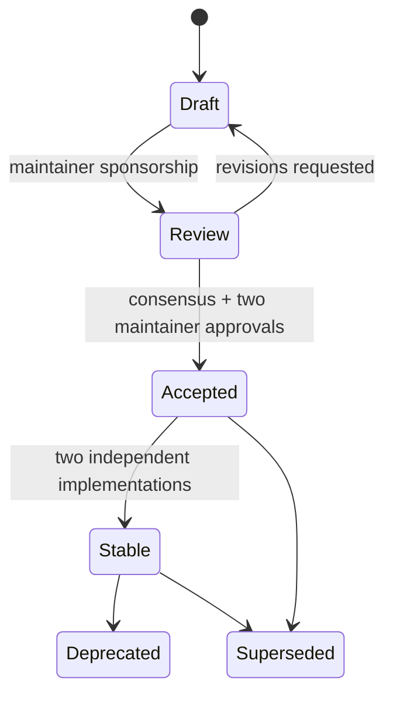

# Product Protocol Specifications (PPs)

This directory contains the numbered specification documents that
constitute the Product Protocol standard. The process below is normative
for contributors; see [GOVERNANCE](../GOVERNANCE.md) for decision
authority and [CONTRIBUTING](../CONTRIBUTING.md) for mechanics.

## Index

| PP | Title | Status | Conformance class |
| --- | --- | --- | --- |
| [PP-0000](./PP-0000-template.md) | Specification Template | Living | — |
| [PP-0001](./PP-0001-vision.md) | Vision and Scope | Draft | — (informative) |
| [PP-0002](./PP-0002-core-concepts.md) | Core Concepts and Object Model | Draft | PP/Core |
| [PP-0003](./PP-0003-product-brain.md) | Product Brain | Draft | PP/Brain |
| [PP-0004](./PP-0004-product-specification.md) | Product Specification | Draft | PP/Spec |
| [PP-0005](./PP-0005-product-constitution.md) | Product Constitution | Draft | PP/Constitution |
| [PP-0006](./PP-0006-task-graph.md) | Task Graph and Planning | Draft | PP/Planner |
| [PP-0007](./PP-0007-worker-protocol.md) | Worker Protocol | Draft | PP/Worker |
| [PP-0008](./PP-0008-evaluation.md) | Evaluation System | Draft | PP/Evaluator |
| [PP-0009](./PP-0009-knowledge-protocol.md) | Knowledge Protocol | Draft | PP/Brain |
| [PP-0010](./PP-0010-runtime.md) | Runtime and Execution Lifecycle | Draft | PP/Runtime |

## Document Lifecycle

| Status | Meaning |
| --- | --- |
| `Draft` | Under active authoring; anything may change. |
| `Review` | Feature-complete; soliciting formal review. |
| `Accepted` | Ratified for the current protocol version; changes require an amendment PR with maintainer approval. |
| `Stable` | Proven by at least two independent implementations; breaking changes require a new protocol version. |
| `Deprecated` | Discouraged; kept for historical conformance. |
| `Superseded` | Replaced by a newer PP (named in its header). |
| `Living` | Continuously maintained process/template documents. |

## Writing a New PP

1. Check the [index](#index) and open issues for prior art.
2. Open an issue describing the problem and rough shape; a maintainer
   assigns the next PP number.
3. Copy [`PP-0000-template.md`](./PP-0000-template.md) to
   `PP-NNNN-short-title.md`. Every section is required
   ([PP-0000-RQ-001]).
4. Keep normative statements in BCP 14 keywords and enumerate them in the
   *Normative Requirements* section with stable `[PP-NNNN-RQ-KKK]`
   identifiers.
5. Ship schemas under `schemas/` and at least one validating example for
   every object kind you define.
6. Submit a pull request; the document enters `Draft`.

## Numbering

- Numbers are assigned once and never reused.
- `PP-0000`–`PP-0099` are reserved for core protocol documents.
- `PP-0100+` are open for extensions, profiles, and bindings.
