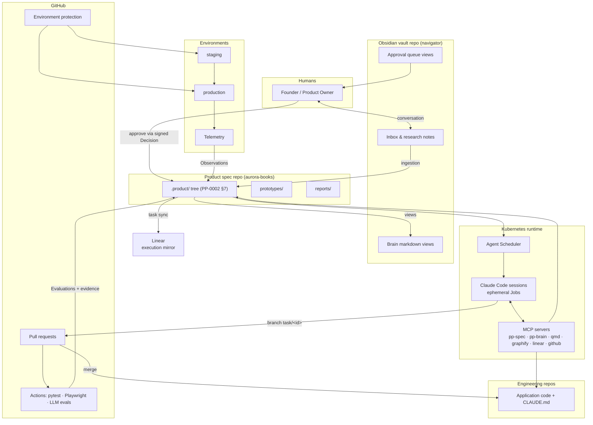

# Reference Architecture v1

*Part of the Reference Architecture v1 — an opinionated, informative
implementation blueprint. The normative standard is the
[Product Protocol](../README.md).*

Reference Architecture v1 (RA v1) is one complete, concrete, working way
to run a Product Protocol system — from a solo founder with one product
to an organization running hundreds of concurrent agents. It names real
tools, real repository layouts, real CI wiring, and a real agent roster.
It is to the Product Protocol what Swagger tooling is to OpenAPI: a
vendor-specific blueprint plus reference implementation of a
vendor-neutral standard.

## What RA v1 is — and is not

- **It is opinionated.** Every choice below (Obsidian, Claude Code,
  Linear, Kubernetes, GitHub, MCP) is a specific product decision, made
  so the whole system can be described end-to-end without hand-waving.
- **It is informative, not normative.** Nothing in `reference-architecture/`
  adds, removes, or weakens a protocol requirement. The normative
  contracts live in the [PP specifications](../pp/README.md) and
  [schemas](../schemas/README.md). Where RA text quotes the spec, BCP 14
  capitals are the spec's, not ours.
- **Every component is swappable.** Swap Linear for Jira, Obsidian for
  any git-backed markdown, Kubernetes for Nomad — the system stays
  conformant as long as the replacement honors the same PP contracts
  (conformance classes, [terminology §4](../reference/terminology.md#4-conformance-classes)).
  The [roadmap](./roadmap.md) sketches the known-good swaps.
- **The running example is `aurora-books`** — the same online bookstore
  as [`examples/ecommerce`](../examples/ecommerce/), so every RA document
  can point at real objects in a real `.product/` tree.

## The stack

| Component | Role in RA v1 | PP contract it implements |
| --- | --- | --- |
| Obsidian vault (git repo, "navigator") | Human-readable knowledge surface: research, meeting notes, inbox, approval-queue views, markdown views of Brain objects | Informative surface over PP/Brain ([PP-0003](../pp/PP-0003-product-brain.md)) |
| `.product/brain/` YAML objects | The Product Brain — single source of truth for Knowledge and Decisions | PP/Brain ([PP-0003](../pp/PP-0003-product-brain.md), [PP-0009](../pp/PP-0009-knowledge-protocol.md)) |
| Graphiti-style temporal knowledge graph | Derived, rebuildable retrieval index built *from* Brain objects | PP-0009 §3 retrieval |
| Graphify code knowledge graph + qmd semantic search | Code knowledge and semantic code retrieval for context assembly | PP-0007 §4 execution context, PP-0009 §3.2 |
| Product spec repo (Git) | Canonical `.product/` tree + `prototypes/` (HTML) + `reports/` + JSON-schema validation + golden tests | PP/Core Git binding ([PP-0002 §7](../pp/PP-0002-core-concepts.md)) |
| Planner agent | Decomposes approved Stories/Issues into the Task DAG | PP/Planner ([PP-0006](../pp/PP-0006-task-graph.md)) |
| Claude Code sessions (ephemeral, one per task) | Workers: claim, implement on a branch, open a PR, submit Artifacts | PP/Worker ([PP-0007](../pp/PP-0007-worker-protocol.md)) |
| GitHub Actions + pytest + Playwright + LLM evaluations | Evaluation harnesses producing Evidence | PP/Evaluator ([PP-0008](../pp/PP-0008-evaluation.md)) |
| Evaluation Manager agent | Writes Evaluation records, resolves golden datasets, checks gates | PP/Evaluator ([PP-0008](../pp/PP-0008-evaluation.md)) |
| Kubernetes Agent Scheduler | Watches the ready queue, launches worker Jobs, enforces leases | PP/Runtime orchestration ([PP-0010](../pp/PP-0010-runtime.md)) |
| GitHub (SCM, branch protection, environments) | Storage transport, human/agent identity separation, approval backstop | PP-0010 §7 trust enforcement |
| Linear | Execution **mirror** for human visibility — never source of truth | Annotation-linked projection of PP Task state |
| MCP servers (`pp-spec`, `pp-brain`, `qmd-search`, `graphify-code`, `linear-mirror`, `github`) | Role-scoped context and object access for every agent | PP-0007 §4, PP-0009 retrieval |

## Design goals

1. **AI-first.** Agents are the default actor for every mechanical step;
   humans appear only where the protocol reserves authority for them.
2. **Reproducibility.** Everything that matters is a versioned file in
   Git; derived stores (knowledge graph, search indexes, Linear) can be
   rebuilt from the trees at any time.
3. **Autonomy with leases.** Hundreds of concurrent ephemeral workers,
   coordinated only through the Task Graph and the claim protocol —
   no worker talks to another worker.
4. **Traceability.** Every shipped behavior traces: production →
   Deployment → Evaluation → Artifact → Task → Story → Specification →
   Decision → conversation.
5. **Version control as the spine.** Approval is a signed commit;
   history is the audit log; rollback is a revert plus a new Deployment.
6. **Continuous evaluation.** Nothing merges or promotes without
   Evidence; golden datasets are re-judged on every candidate.
7. **Human approval where it counts.** Goals, Specifications,
   Constitutions, GoldenTests, and architecture Decisions flip to
   `approved` only by human hand ([PP-0010 §7](../pp/PP-0010-runtime.md)).
8. **Explainability.** The vault renders the machine state as prose a
   human can read; "why does this exist?" is answered by following refs.

## The system at a glance

## Reading order and directory map

Start with [architecture.md](./architecture.md), then
[lifecycle.md](./lifecycle.md); the rest are deep dives.

| Document | Contents |
| --- | --- |
| [architecture.md](./architecture.md) | Component inventory, trust boundaries, data flow, source-of-truth matrix, failure domains |
| [lifecycle.md](./lifecycle.md) | The full product lifecycle, stage by stage, plus the human workflow |
| [evaluation.md](./evaluation.md) | The evaluation stack implementing PP-0008, with a worked example |
| [roadmap.md](./roadmap.md) | RA future work and the component swap table |
| [knowledge/README.md](./knowledge/README.md) | The knowledge layer overview |
| [knowledge/obsidian-vault.md](./knowledge/obsidian-vault.md) | Vault layout, views, inbox conventions |
| [knowledge/product-brain.md](./knowledge/product-brain.md) | Brain objects, temporal knowledge graph, retrieval |
| [knowledge/synchronization.md](./knowledge/synchronization.md) | Vault ↔ Brain ↔ graph sync rules |
| [repositories/README.md](./repositories/README.md) | Repository topology overview |
| [repositories/specification-repo.md](./repositories/specification-repo.md) | The product spec repo in detail |
| [repositories/engineering-repos.md](./repositories/engineering-repos.md) | Application repos and their conventions |
| [repositories/claude-md.md](./repositories/claude-md.md) | CLAUDE.md authoring for worker context |
| [agents/README.md](./agents/README.md) | The 13-agent roster and shared conventions |
| [agents/interviewer.md](./agents/interviewer.md) · [product-writer](./agents/product-writer.md) · [architect](./agents/architect.md) · [planner](./agents/planner.md) | Intent and definition agents |
| [agents/backend-engineer.md](./agents/backend-engineer.md) · [frontend-engineer](./agents/frontend-engineer.md) · [qa-engineer](./agents/qa-engineer.md) | PP Workers |
| [agents/reviewer.md](./agents/reviewer.md) · [auditor](./agents/auditor.md) · [evaluation-manager](./agents/evaluation-manager.md) | PP Evaluators |
| [agents/librarian.md](./agents/librarian.md) · [knowledge-curator](./agents/knowledge-curator.md) · [deployment-manager](./agents/deployment-manager.md) | Knowledge and operations agents |
| [runtime/README.md](./runtime/README.md) | Runtime overview |
| [runtime/claude-code-sessions.md](./runtime/claude-code-sessions.md) | Ephemeral worker sessions |
| [runtime/kubernetes.md](./runtime/kubernetes.md) | Scheduler, Jobs, leases, scaling |
| [runtime/linear-integration.md](./runtime/linear-integration.md) | The Linear mirror |
| [runtime/github-integration.md](./runtime/github-integration.md) | Branch protection, environments, bot identities |
| [runtime/mcp-context.md](./runtime/mcp-context.md) | MCP servers and role-scoped permissions |

Background from the protocol repo worth reading alongside:
[VISION](../VISION.md), the informative
[architecture guides](../docs/architecture/README.md), and the
[object model](../reference/object-model.md).
