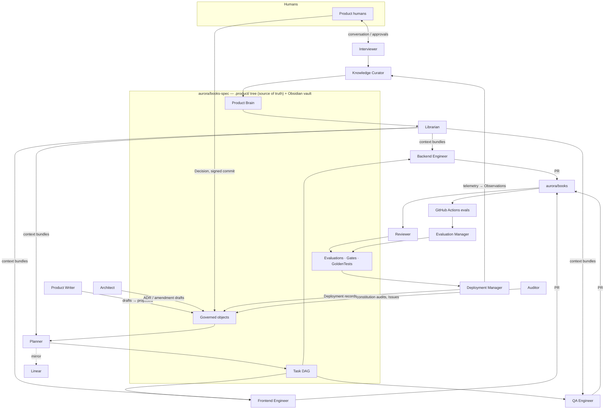

*Part of the [Reference Architecture v1](../README.md) — an opinionated, informative implementation blueprint. The normative standard is the [Product Protocol](../../README.md).*

# Agent Architecture

Thirteen specialized agents run the Product Protocol loop for a product
(our worked example is **aurora-books**, an online bookstore: repos
`aurora/books` for code, `aurora/books-spec` for the `.product/` tree and
the Obsidian vault). Every agent is a Claude Code session — interactive
for the Interviewer, ephemeral Kubernetes Jobs for everyone else — with a
role-specific agent definition, a role-scoped MCP permission profile, and
a PP actor object (Worker, Planner, or Evaluator declaration) committed
to the spec repo.

## Design Principles

1. **Single responsibility.** Each agent does one job. There is no
   "do-everything engineer"; drafting specs, planning, coding, testing,
   reviewing, deploying, and remembering are different agents with
   different permissions. When a job doesn't fit any roster role, add a
   role (see [Adding a new agent role](#adding-a-new-agent-role)) rather
   than widening an existing one.
2. **Contracts through PP objects, not agent-to-agent chat.** Agents
   never message each other. All coordination flows through durable
   objects in the spec repo: the Planner speaks through Tasks
   ([PP-0006](../../pp/PP-0006-task-graph.md)), Workers through
   Artifacts ([PP-0007 §6](../../pp/PP-0007-worker-protocol.md)),
   Evaluators through Evaluations
   ([PP-0008](../../pp/PP-0008-evaluation.md)), everyone through
   Knowledge and Issues. If it isn't in the tree, it didn't happen.
3. **Stateless sessions, durable memory.** Sessions are disposable;
   nothing an agent needs to remember may live only in its context
   window. Durable memory is the Product Brain, written through
   [PP-0009](../../pp/PP-0009-knowledge-protocol.md) ingestion (with
   provenance, at honest confidence) via the `pp-brain` MCP server.
   Losing a pod loses a lease, never knowledge.
4. **Least-privilege MCP scopes.** Each role's Claude Code settings
   grant only the MCP tools and repo scopes its contract requires: the
   Reviewer cannot push code, engineers cannot write governed objects,
   nobody but the Deployment Manager touches promotion workflows — and
   no agent, ever, approves a governed object (PP-0002-RQ-010: humans
   never create tasks; agents never approve governed objects).
5. **Every agent is itself evaluated.** Each role's output is judged
   under the `agent_evaluation` category (PP-0008 §3): rework rates,
   first-pass acceptance, calibration against human spot checks. The
   Evaluation Manager and Auditor run these sweeps; the roster audits
   itself the same way it audits the product.

## Roster

| Agent | PP binding (kind / conformance class) | Mission | Session pattern |
| --- | --- | --- | --- |
| [Interviewer](interviewer.md) | Worker / PP/Worker | Conversational intake: elicit and clarify human intent, route approvals | interactive |
| [Product Writer](product-writer.md) | Worker / PP/Worker | Draft Specifications, Features, Stories, acceptance criteria, HTML prototypes to `proposed` | per-task ephemeral |
| [Architect](architect.md) | Worker / PP/Worker | Draft ADR-profile Decisions and constitution amendments; maintain architecture views | per-task ephemeral |
| [Planner](planner.md) | Planner / PP/Planner | Decompose approved intent into the Task DAG; priorities; replanning | scheduled + event-triggered |
| [Backend Engineer](backend-engineer.md) | Worker / PP/Worker | Implement server-side changesets (Python/FastAPI/Postgres) | per-task ephemeral |
| [Frontend Engineer](frontend-engineer.md) | Worker / PP/Worker | Implement UI changesets (TypeScript/React) | per-task ephemeral |
| [QA Engineer](qa-engineer.md) | Worker / PP/Worker | Implement approved GoldenTests as Playwright/pytest suites; test data | per-task ephemeral |
| [Reviewer](reviewer.md) | Evaluator / PP/Evaluator | Judge PRs for code quality and spec conformance | per-PR ephemeral |
| [Librarian](librarian.md) | Worker / PP/Worker | Assemble bounded context bundles; garden qmd-search and Graphify indexes | scheduled + on-demand |
| [Auditor](auditor.md) | Evaluator / PP/Evaluator | Scheduled constitution audits and drift detection; open Issues | scheduled |
| [Deployment Manager](deployment-manager.md) | Worker / PP/Worker | Verify gates, write Deployment records, promote and roll back | per-deployment ephemeral |
| [Knowledge Curator](knowledge-curator.md) | Worker / PP/Worker | PP-0009 ingestion, validation, staleness sweeps, vault view generation | scheduled + event-triggered |
| [Evaluation Manager](evaluation-manager.md) | Evaluator / PP/Evaluator | Own golden datasets, wire Actions workflows, write Evaluation records, maintain gates | event-triggered + scheduled |

## The Agents Around the Spec Repo

## The Shared Agent Contract

Every ephemeral agent session follows the same four-phase contract,
regardless of role:

1. **Claim.** The scheduler (a Kubernetes controller watching
   `.product/tasks/`) matches `ready` Tasks to Worker declarations by
   capability tags (PP-0006 §7) and spawns a Claude Code Job. The
   session's first act is an atomic claim through `pp-spec` — a
   serialized commit that sets `status.worker`, `status.claimedAt`,
   increments `status.attempts`, and records a finite lease in
   `metadata.annotations` (`pp.lease-expires`). Exactly one session wins
   a contested claim (PP-0007 §3.1). Evaluator sessions "claim" a
   submitted Task or opened PR the same way, with the runtime enforcing
   PP-0008 §5.2 independence at scheduling time.
2. **Read context.** The session requests its context bundle: the Task
   at its claimed version, traced Story/Specification material at exact
   approved versions, in-scope Constitution articles, Knowledge selected
   by the Librarian through `pp-brain` retrieval, and prior attempts for
   retries — bounded per the Worker's `contextContract`, provenance
   preserved (PP-0007 §4). Content from untrusted origins arrives
   marked as data, not instructions.
3. **Write results.** Work lands as Git artifacts: a branch
   `task/<task-id>` and PR on the target repo, plus Artifact records
   (digest, `producedBy`, `producedAt`) committed to
   `.product/tasks/artifacts/`. Commits carry the trailer
   `PP-Task: <task-id>`. Evaluators write append-only Evaluation
   records under `.product/evaluation/runs/` with digest-bearing
   Evidence. Nobody edits another Task, the graph, or a governed
   object's lifecycle state.
4. **Report.** The session submits: at least one Artifact, a
   self-assessment `report` Artifact mapping work to each completion
   criterion, and evidence pointers from its pre-submit evaluation hooks
   (PP-0007 §7–8). Task status transitions flow through `pp-spec`; the
   Planner's mirror sync reflects them into Linear (execution mirror
   only — never a source of truth). Then the session terminates. On
   crash or stall, the lease expires and the Task returns to `ready`
   with attempts preserved (PP-0007 §3.3).

The Interviewer is the one exception to ephemerality — it holds an
interactive session with humans — but it reports through exactly the
same currency: distilled intent handed to the Curator and Product
Writer, never direct writes to governed objects.

## Adding a New Agent Role

A new role is a pull request against `aurora/books-spec` containing:

1. **An actor declaration** — a Worker (or Planner/Evaluator) object
   under `.product/workers/` (`.product/tasks/` for Planners,
   `.product/evaluation/evaluators/` for Evaluators), schema-valid,
   with honest capability tags in the shared dot-namespaced vocabulary
   (`code.python`, `spec.authoring`, `review.code`, `eval.constitution`,
   …). Capability tags are the routing surface: the scheduler will
   offer the role exactly the Tasks its tags cover, nothing else.
2. **An agent definition and permission profile** — the Claude Code
   agent definition, system prompt, model configuration, and MCP scope
   file under `ops/agents/<role>/` in the spec repo. Scopes default to
   deny; every grant is justified in the PR description.
3. **An operating manual note** — a page in the vault's `70-agents`
   area describing the role's mission, boundaries, escalation paths,
   and evaluation metrics, so humans can navigate the roster without
   reading YAML.

The PR is reviewed by humans (permission grants are a governance
surface even though actor declarations are not governed objects), and
the Evaluation Manager adds the role to the `agent_evaluation` sweep
before its first Task claim.

## The Thirteen

[Interviewer](interviewer.md) ·
[Product Writer](product-writer.md) ·
[Architect](architect.md) ·
[Planner](planner.md) ·
[Backend Engineer](backend-engineer.md) ·
[Frontend Engineer](frontend-engineer.md) ·
[QA Engineer](qa-engineer.md) ·
[Reviewer](reviewer.md) ·
[Librarian](librarian.md) ·
[Auditor](auditor.md) ·
[Deployment Manager](deployment-manager.md) ·
[Knowledge Curator](knowledge-curator.md) ·
[Evaluation Manager](evaluation-manager.md)
