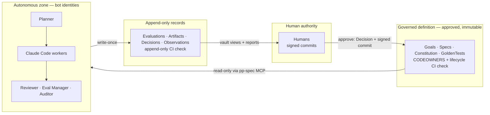
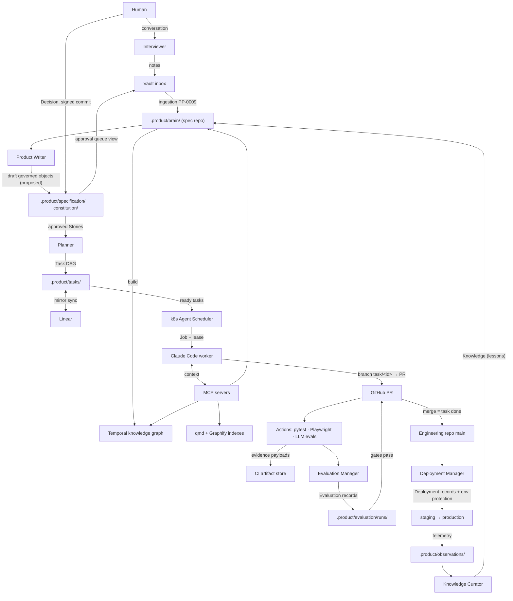

# RA v1 — System Architecture

*Part of the [Reference Architecture v1](./README.md) — an opinionated,
informative implementation blueprint. The normative standard is the
[Product Protocol](../README.md).*

This document is the full system architecture of RA v1: the components,
who trusts whom, how data flows, where truth lives, and what breaks when
a component goes down. It is the concrete counterpart of the protocol's
informative [components](../docs/architecture/components.md) and
[actors-and-trust](../docs/architecture/actors-and-trust.md) guides.

## 1. Component inventory

### Stores

| Component | Responsibility |
| --- | --- |
| **Product spec repo** (one per product, e.g. `aurora-books-spec`) | Canonical home of the `.product/` tree ([PP-0002 §7](../pp/PP-0002-core-concepts.md)): Brain, Specifications, Constitution, Task Graph, Workers, Evaluations, Deployments, Observations, Issues. Also `prototypes/` (HTML mockups referenced by Stories) and `reports/` (rendered quality and audit reports). Schema validation runs on every push. See [repositories/specification-repo.md](./repositories/specification-repo.md). |
| **Obsidian vault repo** ("navigator") | The human-facing knowledge surface: raw conversation notes, research, meeting minutes, an inbox, the approval-queue view, and generated markdown views of Brain objects. Prose lives here; structured truth does not. See [knowledge/obsidian-vault.md](./knowledge/obsidian-vault.md). |
| **Engineering repos** | Application source code, each with a `CLAUDE.md` that tells worker sessions how the repo works. See [repositories/engineering-repos.md](./repositories/engineering-repos.md). |
| **CI artifact store** | Evidence payloads (Playwright traces, screenshots, test reports, LLM transcripts), content-addressed and referenced by digest from Evaluation records ([PP-0008 §8](../pp/PP-0008-evaluation.md)). |
| **Derived indexes** | Graphiti-style temporal knowledge graph (built from Brain objects), Graphify code graph, and qmd semantic index (built from engineering repos). Rebuildable at any time; never authoritative. |

### Actors

| Component | Responsibility | PP role |
| --- | --- | --- |
| **Humans** | Discuss ideas, answer clarifying questions, approve Goals / Specifications / Constitutions / GoldenTests / architecture Decisions | Approval authority ([PP-0010 §7](../pp/PP-0010-runtime.md)) |
| **Interviewer** | Runs the conversation with humans; turns intent into inbox notes and clarifying questions | Human Interface |
| **Product Writer** | Drafts governed objects (Goals, Capabilities, Features, Stories, Specifications, Constitution amendments) from Brain content | PP/Spec author |
| **Architect** | Drafts architecture Decisions and constitution articles in `architecture` category; owns prototypes | PP/Spec author |
| **Planner** | Decomposes approved Stories and triaged Issues into the Task DAG; replans on rejection/change | PP/Planner ([PP-0006](../pp/PP-0006-task-graph.md)) |
| **Backend / Frontend / QA Engineer** | Ephemeral Claude Code sessions executing Tasks under the worker contract | PP/Worker ([PP-0007](../pp/PP-0007-worker-protocol.md)) |
| **Reviewer** | Agentic code and design review of submissions | PP/Evaluator |
| **Evaluation Manager** | Runs golden datasets, writes Evaluation records with evidence, checks QualityGates | PP/Evaluator ([PP-0008](../pp/PP-0008-evaluation.md)) |
| **Auditor** | Scheduled constitution audits (`constitution_audit` category) | PP/Evaluator ([PP-0005 §5](../pp/PP-0005-product-constitution.md)) |
| **Deployment Manager** | Writes Deployment records, drives promotions through environment gates | PP-0010 §6 |
| **Librarian** | Owns context assembly: qmd + Graphify indexes, PP-0009 retrieval for worker briefings | PP-0009 §3 |
| **Knowledge Curator** | Ingestion, distillation of Observations into Knowledge, dedup, confidence transitions | PP-0009 ops |
| **Agent Scheduler** (Kubernetes controller) | Watches the ready queue, launches worker Jobs, manages leases, reaps expired claims | PP/Runtime ([PP-0010](../pp/PP-0010-runtime.md)) |

The full roster, prompts, permissions, and MCP scopes are in
[agents/README.md](./agents/README.md).

### Transport and mirrors

| Component | Responsibility |
| --- | --- |
| **GitHub** | Hosts all repos; branch protection and environments enforce the trust boundaries; PRs are the worker submission surface |
| **GitHub Actions** | Runs schema validation, pytest, Playwright, LLM evaluations, performance budgets; publishes evidence to the artifact store |
| **Linear** | Read-optimized mirror of Task state for humans; every Linear issue carries the Task id and every Task carries `metadata.annotations["linear.app/issue"]`. Writes to Linear never change Task state; see [runtime/linear-integration.md](./runtime/linear-integration.md) |
| **MCP servers** | `pp-spec` (PP object CRUD in the spec repo), `pp-brain` (PP-0009 operations), `qmd-search`, `graphify-code`, `linear-mirror`, `github` — each role-scoped; see [runtime/mcp-context.md](./runtime/mcp-context.md) |

## 2. Trust boundaries

RA v1 implements the protocol's four authorities
([actors-and-trust](../docs/architecture/actors-and-trust.md)) with
GitHub primitives. The principle: *the protocol invariant "agents never
approve" is enforced by platform configuration, not by prompt.*

### Identities

- Every human has a personal GitHub identity with commit signing
  configured (SSH or GPG).
- Every agent runs as a **bot identity** — a GitHub App installation per
  role (`pp-planner[bot]`, `pp-worker[bot]`, `pp-eval[bot]`,
  `pp-curator[bot]`, `pp-deploy[bot]`) with least-privilege repository
  and path scopes. Agent commits are attributable and distinguishable
  from human commits at a glance and in audit queries.
- MCP servers authenticate agents per role; a worker session's `pp-spec`
  scope can update `tasks/` status and append `tasks/artifacts/`, but
  cannot touch `specification/`, `constitution/`, or `evaluation/`.

### Boundary enforcement in the spec repo

| Protocol rule | RA v1 mechanism |
| --- | --- |
| Approved governed objects are immutable ([PP-0002 §6](../pp/PP-0002-core-concepts.md)) | Branch protection on `main`; CI check rejects any diff that modifies a file whose object has `lifecycle: approved` (new versions ship as new `<id>@<version>.yaml` or a version bump re-entering `draft`) |
| `proposed → approved` requires a human Decision | The approval is a commit that (a) writes the `Decision` object with `spec.approves` at the exact version and (b) flips `metadata.lifecycle`. A required CI check verifies this commit is **signed by a human identity** — bot signatures fail the check. GitHub CODEOWNERS on `.product/specification/**`, `.product/constitution/**`, `.product/brain/decisions/**`, and `.product/evaluation/golden/**` requires human review as a backstop |
| Evaluator independence ([PP-0008 §5](../pp/PP-0008-evaluation.md)) | Only `pp-eval[bot]` can write `.product/evaluation/runs/`; worker identities cannot. Evaluation workflows run from `main`'s workflow definitions, not the PR branch |
| Append-only records | CI check rejects edits or deletions under `evaluation/runs/`, `tasks/artifacts/`, `observations/`, `brain/decisions/` |
| Production promotion gates ([PP-0010 §6.1](../pp/PP-0010-runtime.md)) | GitHub **environment protection rules** on `staging` and `production`: required checks map 1:1 to blocking QualityGates, and the production environment additionally requires the gate-check Evaluations to exist and pass (see [evaluation.md §5](./evaluation.md)) |
| Worker isolation | Worker sessions run in sandboxed Kubernetes Jobs with egress policy; credentials are per-task, short-lived, minted by the scheduler ([runtime/kubernetes.md](./runtime/kubernetes.md)) |

### The zones

## 3. Data flow

Two properties worth noting:

- **Components communicate through objects, never through calls.** The
  Planner never invokes a worker; it writes `ready` Tasks. The scheduler
  never invokes the Evaluation Manager; a `submitted` Task and a PR
  event do. Every interaction is therefore on the record.
- **All arrows into `.product/` are commits** by an identity whose
  path scope permits them; the Git history is the complete audit log.

## 4. Source-of-truth matrix

| Data | Source of truth | Mirrors / derived views |
| --- | --- | --- |
| PP objects (all kinds) | Product spec repo `.product/` tree | Vault markdown views, Linear issues, knowledge graph, reports |
| Product knowledge (Knowledge, Decision) | `.product/brain/` YAML | Graphiti-style temporal graph; vault Brain views |
| Prose research, meeting notes, inbox | Obsidian vault repo | — (distilled into Brain via PP-0009 ingestion, with provenance back to the note) |
| Application code | Engineering repos | Graphify code graph, qmd semantic index |
| Task execution state | `Task.status` in the spec repo | Linear (via `metadata.annotations["linear.app/issue"]`) |
| Evidence payloads | CI artifact store, content-addressed | Referenced by `digest` + `uri` from Evaluation records; the *record* stays in-tree |
| Deployment state | `Deployment` objects in the spec repo | GitHub environment/deployment API views |
| Prototypes (HTML) | Spec repo `prototypes/` | Rendered in vault and PR previews |

Rule of thumb: **if two stores disagree, the left column wins**, and the
sync job that let them disagree gets an Issue. Derived stores are
disposable; deleting the knowledge graph or the Linear workspace loses
nothing but convenience.

## 5. Failure domains

| Failure | Blast radius | Behavior |
| --- | --- | --- |
| **Linear down** | None critical | It is a mirror. Task state keeps advancing in the spec repo; the sync queue replays into Linear when it returns. Humans temporarily lose the pretty board, not the truth |
| **CI (Actions) down** | Evaluation and promotion stall | Workers keep implementing and submitting; Tasks pile up in `submitted` because no Evaluation can be recorded and no gate can pass. Nothing merges, nothing promotes — fail-closed, exactly as [PP-0008 §9](../pp/PP-0008-evaluation.md) intends |
| **Worker session dies** (OOM, crash, node loss) | One task attempt | The lease expires without renewal; the scheduler returns the Task to `ready`, clears `status.worker`, keeps `status.attempts` ([PP-0007 §3.3](../pp/PP-0007-worker-protocol.md)). The next claimant sees prior attempts in its context |
| **Agent Scheduler down** | New claims stop | In-flight sessions finish and submit; no new Tasks are claimed and expired leases are reaped late. Recovery is stateless: the scheduler rebuilds its view from Task objects |
| **Knowledge graph / qmd / Graphify stale or lost** | Context quality degrades | The Librarian rebuilds indexes from the Brain and the engineering repos; they are pure functions of the source trees |
| **Vault unavailable** | Human ergonomics | Ingestion of new prose pauses and humans lose their views; agents are unaffected because they read the spec repo, not the vault |
| **Linear-sync writes a wrong state** | Cosmetic | Mirror writes never flow back into `Task.status`; the next sync pass overwrites the mirror from the spec repo |
| **GitHub down** | Everything | Git hosting is the spine; the loop pauses safely. No state is lost — all actors resume from the trees. This is the accepted single point of coupling (see [roadmap](./roadmap.md) for mirroring options) |
| **LLM evaluation flaps** (`error` verdicts) | One gate check | `error` and `inconclusive` never satisfy a gate ([PP-0008 §7.1](../pp/PP-0008-evaluation.md)); the Evaluation Manager re-runs, and repeated errors raise an Issue against the Evaluator, not the subject |

## 6. Scaling model (summary)

One product scales from a founder's laptop (everything above runs as
local processes; the "scheduler" is a cron loop) to hundreds of
concurrent agents without changing a single object format:

- Concurrency is bounded by the Task Graph's width and each Worker's
  `maxConcurrentTasks`, not by any central lock — claims are atomic
  compare-and-set commits.
- Worker sessions are ephemeral Kubernetes Jobs: horizontal scale is a
  queue-depth autoscaler on the ready queue.
- Evaluation scales with CI runners; golden datasets shard across
  workflow matrix jobs.
- The spec repo is the serialization point; at very high write rates,
  status updates batch per-scheduler-tick.

Details, autoscaling policy, and the lease implementation are in
[runtime/kubernetes.md](./runtime/kubernetes.md); session anatomy is in
[runtime/claude-code-sessions.md](./runtime/claude-code-sessions.md).
