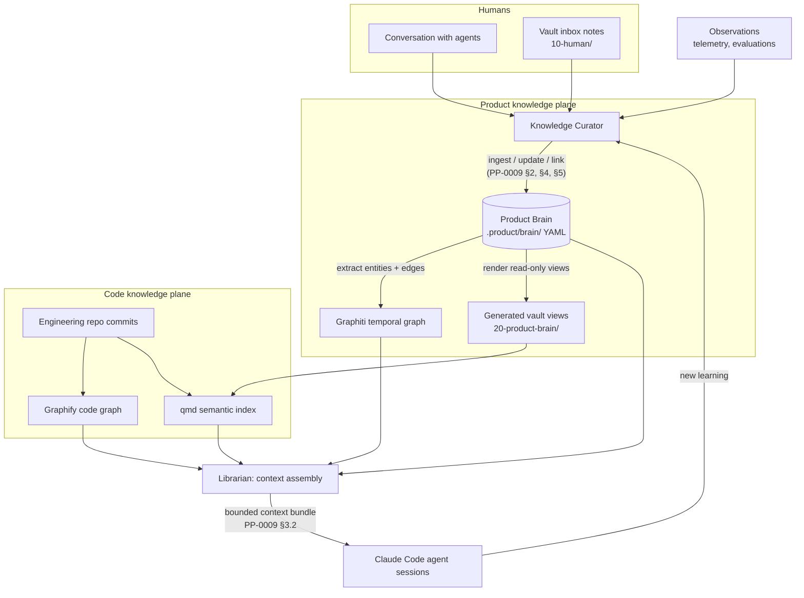

# Knowledge Architecture

*Part of the [Reference Architecture v1](../README.md) — an opinionated, informative implementation blueprint. The normative standard is the [Product Protocol](../../README.md).*

This directory describes how RA v1 implements the knowledge side of the
protocol — [PP-0003 (Product Brain)](../../pp/PP-0003-product-brain.md)
and [PP-0009 (Knowledge Protocol)](../../pp/PP-0009-knowledge-protocol.md)
— on a concrete stack: an Obsidian vault, PP objects in Git, a
Graphiti-style temporal knowledge graph, Graphify + qmd for code
knowledge, and Claude Code agents wired together through MCP servers.

The three detailed documents:

- [obsidian-vault.md](./obsidian-vault.md) — the human navigation layer
- [product-brain.md](./product-brain.md) — the canonical Brain and its temporal graph
- [synchronization.md](./synchronization.md) — the sync fabric between all of it

## The three knowledge planes

RA v1 separates knowledge into three planes with different owners,
different guarantees, and different consumers. Confusing them is the
root cause of most knowledge-system failures, so the boundary is drawn
hard.

| Plane | What it holds | Canonical store | Guarantee |
| --- | --- | --- | --- |
| **Product knowledge** | Claims, decisions, and their trust levels — everything PP-0003 calls the Brain | `.product/brain/` YAML in the product spec repo | Versioned, provenance-carrying, confidence-graded, never silently deleted |
| **Organizational / prose knowledge** | Meeting notes, drafts, runbooks, org context, human-readable *views* of the Brain | The Obsidian vault repo (`navigator`) | Navigable, linkable, human-legible; generated views are disposable projections |
| **Code knowledge** | What the code actually is: symbols, call graphs, semantics | Graphify code knowledge graph + qmd semantic index over engineering repos | Rebuilt from source on every push; always derivable, never authored |

The planes connect at exactly two seams:

1. **Prose → product**: human notes in the vault inbox are an *ingestion
   source*. The [Knowledge Curator](../agents/knowledge-curator.md)
   distills them into Brain objects; the note itself never becomes
   knowledge (PP-0003 §1.1 — the Brain is not documentation).
2. **Product → prose**: Brain objects are rendered into generated,
   read-only vault views so humans can browse what the product knows.
   Renderings are Artifacts, not the Brain.

Code knowledge never crosses into the Brain automatically; when a code
fact is worth *remembering as a claim* (a performance characteristic, a
gotcha), the Curator writes a `technical` Knowledge object that cites
the code location as provenance.

## Single-source-of-truth matrix

Every artifact class has exactly one owner system. Everything else that
holds a copy is a derived view and loses every conflict.

| Artifact class | Owner (source of truth) | Consumers (derived views) | Sync direction |
| --- | --- | --- | --- |
| Knowledge, Decision, ProductBrain objects | Product spec repo `.product/brain/` | Graphiti graph, vault `20-product-brain/` views, agent context via `pp-brain` MCP | Spec repo → everywhere |
| Goals, Specifications, Features, Stories, Constitutions | Product spec repo `.product/` | Vault views, Linear mirror, agent context via `pp-spec` MCP | Spec repo → everywhere |
| Tasks and Issues | Product spec repo `.product/tasks/`, `.product/issues/` | Linear mirror (bidirectional *comments* only — see [synchronization.md](./synchronization.md)) | Spec repo → Linear; Linear comments → ingestion |
| Human notes, meeting notes, drafts | Vault `10-human/` | Curator (as ingestion source) | Vault → Curator → Brain |
| Prose engineering/org knowledge (runbooks, policies) | Vault (`30-engineering/`, `50-company/`) | Agents via qmd search | Vault → qmd index |
| Source code | Engineering repos | Graphify graph, qmd index | Repos → indexes |
| Prototypes, reports | Product spec repo `prototypes/`, `reports/` | Vault links, qmd index | Spec repo → indexes |
| Session context bundles | Assembled on demand by the [Librarian](../agents/librarian.md) | Claude Code sessions via MCP | Ephemeral; never stored |

## How it flows

Two loops matter: the **learning loop** (Observations and session
outcomes flow through the Curator into `lesson` Knowledge, PP-0010 style)
and the **rendering loop** (every Brain write regenerates the affected
vault views and graph slices). Humans sit at the top: they converse and
drop inbox notes; agents do all the writing.

## PP-0009's six operations, mapped to components

| PP-0009 operation | RA v1 component | Binding |
| --- | --- | --- |
| **Ingest** (§2) | Knowledge Curator: distills conversations, inbox notes, Observations, Evaluations into Knowledge objects; dedup against existing Brain before creating ids | `pp-brain` MCP write tools; commits to spec repo |
| **Retrieve** (§3) | Librarian: category/label/ref selection from the Brain, graph traversal via Graphiti, free-text via qmd; assembles budgeted Worker context | `pp-brain` + `qmd-search` + `graphify-code` MCP read tools |
| **Update** (§4) | Curator publishes new versions (never in-place); enforces confidence-transition evidence; human-only `canonical` moves go through approval conversation → Decision | `pp-brain` MCP; validation pre-commit |
| **Link** (§5) | Curator adds typed edges at ingestion and during contradiction handling; `contradicts` edges open review Issues | `pp-brain` MCP |
| **Validate** (§6) | CI in the spec repo runs the PP/Brain validator (checks V1–V9) on every push; Curator runs it before every write batch | Schema + graph checks against [`schemas/knowledge/`](../../schemas/knowledge/) |
| **Version** (§7) | Git is the version substrate: every Knowledge change is a new file content at a bumped SemVer, superseded versions recoverable from history per PP-0002 §7 | Spec repo Git binding |

No component other than the Curator writes to `.product/brain/`; no
component other than the Librarian assembles retrieval context. That
single-writer / single-assembler discipline is what makes the
[synchronization fabric](./synchronization.md) tractable.

## Reading order

1. [product-brain.md](./product-brain.md) — what is true, and how trust moves
2. [obsidian-vault.md](./obsidian-vault.md) — how humans see and feed it
3. [synchronization.md](./synchronization.md) — how it all stays consistent

Related RA documents: [architecture.md](../architecture.md) (system
overview), [lifecycle.md](../lifecycle.md) (the loop end to end),
[agents/knowledge-curator.md](../agents/knowledge-curator.md),
[agents/librarian.md](../agents/librarian.md), and
[runtime/mcp-context.md](../runtime/mcp-context.md) (how context reaches
Claude Code sessions).
