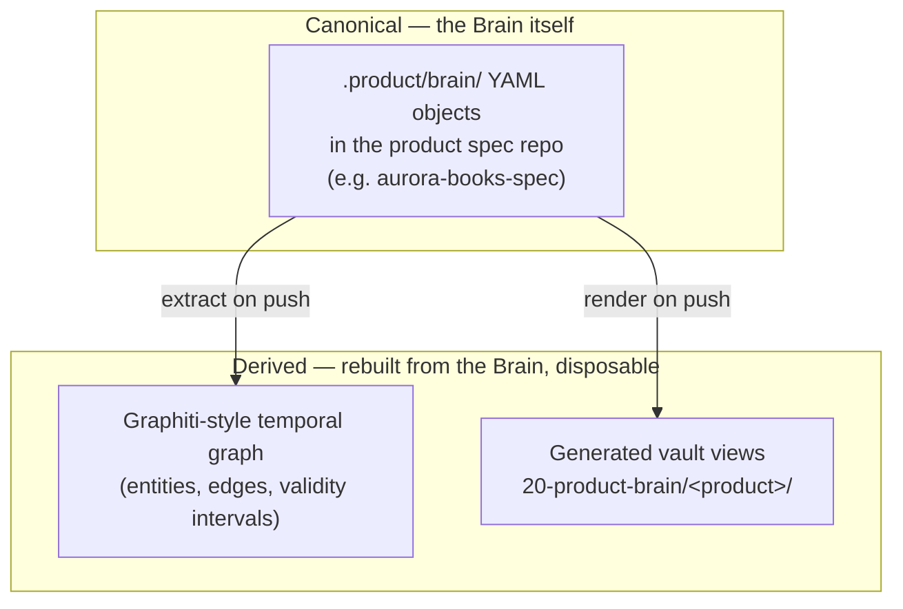

# Product Brain Implementation

*Part of the [Reference Architecture v1](../README.md) — an opinionated, informative implementation blueprint. The normative standard is the [Product Protocol](../../README.md).*

RA v1 implements the Product Brain exactly as
[PP-0003](../../pp/PP-0003-product-brain.md) specifies it and adds two
derived layers on top. Nothing here extends the protocol; everything
here is one implementation's answer to the questions the protocol
leaves open — where the objects live, what indexes them, and who is
allowed to touch them.

## Three layers, one truth



1. **Canonical**: `ProductBrain`, `Knowledge`, and `Decision` YAML
   objects in `.product/brain/` of the product spec repo, laid out per
   PP-0003 §6 (`brain.yaml`, `knowledge/`, `decisions/`). Git history is
   the version archive (PP-0002 §7). This layer is the *only* one that
   is ever written; both others are projections that can be deleted and
   rebuilt at any time.
2. **Temporal graph**: a Graphiti-style knowledge graph extracted from
   the objects, serving traversal and time-travel queries the flat tree
   answers slowly.
3. **Vault views**: human-readable markdown renderings in the
   `navigator` vault ([obsidian-vault.md](./obsidian-vault.md)).

## The temporal graph layer

PP-0003 §8 defines the Knowledge Graph abstractly — nodes are objects,
edges are typed links. RA v1 materializes it in a Graphiti-style store
because the Brain's most valuable property, per PP-0003 §5.3, is that
it *never lies about its own past* — and a temporal graph makes that
past queryable.

**Extraction.** On every spec-repo push that touches `.product/brain/`
(see [synchronization.md](./synchronization.md)), the extractor maps:

| Brain construct | Graph construct |
| --- | --- |
| Each `Knowledge` id | An **entity** whose successive versions are episodes on one node |
| Each `Decision` | An immutable entity, `decidedAt` as its event time |
| `spec.links[]` (`supports`, `contradicts`, `refines`, `derived_from`, `supersedes`, `relates_to`) | Typed **edges**, direction and symmetry per PP-0003 §8.2 |
| `provenance[].ref` | `derived_from` edges to Observations/Evaluations |
| `Decision.spec.affects` / `approves` / `supersedes` | Typed edges into the wider object graph |
| Version supersession within one id | Closing the prior episode's validity interval |

**Validity intervals.** Every node fact and edge carries
`[validFrom, validUntil)`:

- a Knowledge version is valid from its `metadata.updatedAt` (creation
  of that version) until superseded by the next version or an explicit
  `supersedes` link;
- confidence is stored as a time-varying property, so the graph knows
  the claim was `hypothesis` in May and `validated` from June 28;
- Decisions never close — they are append-only — but a superseding
  Decision closes the *effective* interval of the one it replaces.

This makes the signature query cheap: **"what did we believe about
checkout in June?"** is a point-in-time traversal at
`2026-06-15T00:00:00Z`, returning the Knowledge versions and confidence
levels current *then*, not now. The [Librarian](../agents/librarian.md)
uses it for retrospective context ("why did we plan it that way?"),
post-mortems, and rendering the product evolution timeline
(`evolution.md` in the vault).

The graph is **read-only and rebuildable**: `graph-rebuild --from-git`
replays the spec repo's history and reproduces it exactly, because
every interval boundary corresponds to a commit. If the graph store is
lost or corrupted, retrieval degrades (deep traversal and time-travel
get slow or unavailable) but nothing is lost — the failure posture in
[synchronization.md](./synchronization.md).

## Brain content areas → PP categories

Humans think in product-artifact terms ("the roadmap", "our personas").
The Brain thinks in claims. This table is the mapping RA v1's Curator
and renderers apply, and it deliberately includes two *non*-mappings:

| Human content area | PP representation | Notes |
| --- | --- | --- |
| Vision | `Goal` objects + `domain` Knowledge | The vision *statement* is Goals (governed, PP-0004); the beliefs behind it are `domain` claims |
| Roadmap | `Capability`/`Feature` objects + `domain` and `process` Knowledge | Sequencing rationale is `process` Knowledge citing the Decisions that set it |
| Research | `market` and `user` Knowledge | One finding per object (PP-0009 §2.2); the research doc itself is provenance, not content |
| Personas | `user` Knowledge, labelled `persona: <name>` | A persona is a cluster of claims, not a page; the vault view reassembles the cluster |
| Architecture decisions (ADRs) | `Decision` objects in the ADR profile (PP-0003 §7.1) | No separate ADR store; `options` + `consequences` populated, human authority |
| Customer feedback | Knowledge distilled from `Observation`s (and support-channel ingestion), mostly `user` category, provenance `type: observation` | Raw feedback is never Brain content |
| Meeting summaries | **Not knowledge.** Meetings are ingestion *sources* (PP-0009 §2.1, `type: conversation`/`document`) | The vault keeps a generated "what was distilled" summary per meeting; claims land as individual Knowledge objects |
| Business rules | `domain` Knowledge with `relates_to`/`refines` links into `Specification` objects | The enforceable form belongs in Specifications and Constitutions; the Brain holds the *why* and the edge |
| Product evolution | **Not authored at all.** Derived from supersession chains and Decision history | Rendered as a timeline from the temporal graph; writing it by hand would fork truth |

## Who writes

- **Agents write, via `pp-brain` MCP only.** The
  [Knowledge Curator](../agents/knowledge-curator.md) is the sole
  writer of `.product/brain/`; other agents (planner, workers,
  telemetry distiller) *propose* ingestion by handing the Curator
  material, keeping dedup (PP-0009 §2.3) and validation in one pair of
  hands. Every write is a spec-repo commit attributed to the agent in
  `metadata.owners`.
- **Humans never edit the YAML.** They converse with agents or drop
  inbox notes in the vault; the Curator distills. Human *authority*
  enters exactly where PP-0003 requires it — approval and canonical
  Decisions — and RA v1 implements that as a conversational approval
  flow that ends with the Curator committing a Decision object naming
  the human in `spec.authority` (bound to a signed commit).
- The `pp-brain` MCP server enforces PP-0009 mechanically: rejects
  in-place mutation, rejects promotions without their evidence row,
  rejects dangling links, refuses `canonical` transitions whose
  Decision lacks human authority. Writing is cheap; being believed is
  not (PP-0003 §1.2).

## The confidence ladder in practice

| Transition | How it actually happens in RA v1 |
| --- | --- |
| enter at `hypothesis` | Curator distills a conversation or inbox note; provenance `type: conversation`/`document` |
| enter at / promote to `observed` | Curator ingests an Observation or Evaluation, or merges its ref into an existing claim's provenance (MINOR bump) |
| `observed → validated` | Curator attaches a passing Evaluation of the claim itself, or a human review Decision from the approval queue; the MCP server verifies the evidence row before accepting |
| `validated → canonical` | Human-only. The approval-queue view surfaces candidates; a human approves in conversation; the Curator commits a Decision whose `affects` pins the exact version, then the promoted Knowledge version citing it |
| demotion | Any agent can hand the Curator contradicting evidence; the Curator writes the `contradicts` link or new version (MAJOR bump) — except out of `canonical`, which again requires a human Decision |

Unresolved `contradicts` pairs are flagged in every Librarian context
bundle (PP-0009 §3.2) and listed on the vault approval queue until a
human or authorized resolution lands (PP-0009 §5).

## Staleness sweeps

A scheduled Curator job (nightly, plus weekly deep pass) implements
PP-0003 §5.1:

1. Select current Knowledge where `reviewedAt` (else `updatedAt`) is
   older than `ProductBrain.spec.retention.reviewInterval` (Aurora
   Books: `P90D`), plus drift signals — provenance/link targets now
   `deprecated`/`archived`, newer contradicting Observations, and
   Graphify-detected change in code regions that `technical` claims
   describe.
2. For each stale claim, create (or update) a **review Issue** in
   `.product/issues/`, `labels: {type: knowledge-review}`, referencing
   the exact Knowledge version. Issues, not deletions: staleness is a
   review flag (PP-0003 §5.1), and Issues are how the RA routes work.
3. Review Issues surface on the vault approval queue and in Linear via
   the mirror. Resolution is a Curator action driven by human or agent
   review: re-confirm (`reviewedAt` bump, PATCH), revise (new version),
   demote, or supersede.
4. The same job runs the PP/Brain validator (V1–V9) and compaction
   eligibility per `retention.compactAfter` — compaction proposals are
   themselves review Issues, never automatic.

## Worked example: feedback → lesson → roadmap

**1. The Observation.** Support-channel telemetry for Aurora Books
lands as an Observation record
(`.product/observations/obs-preorder-refunds-2026-06.yaml`): pre-order
customers who receive a delayed-shipment notice refund at 4× the
baseline rate, and most had bought the pre-order as a *gift*.

**2. The Curator ingests.** Dedup finds no overlapping claim. Because
provenance includes an `observation`, the claim enters at `observed`
(PP-0009 §2.4). The Curator writes
`.product/brain/knowledge/know-preorder-gift-refunds.yaml` — a
`lesson`, because the valuable content is *what to do differently*:

```yaml
pp: "0.1"
kind: Knowledge
metadata:
  id: know-preorder-gift-refunds
  name: Delayed gift pre-orders convert to refunds, not patience
  version: 1.0.0
  labels:
    area: preorders
  createdAt: 2026-07-02T21:14:00Z
  updatedAt: 2026-07-02T21:14:00Z
  owners:
    - { type: agent, id: knowledge-curator }
spec:
  category: lesson
  subcategory: customer-feedback
  statement: >
    When a pre-ordered book slips its date, gift purchasers refund
    rather than wait: the gift occasion is fixed even though the reader
    is patient. Slip-handling must offer an occasion-preserving remedy
    (gift card at original date, printable gift notice), not just a new
    delivery estimate.
  detail: >
    June 2026: 4.1x baseline refund rate on slip-notified pre-orders;
    68% of refunding buyers had gift wrap or a gift address. Refund
    comments cite the occasion, not the wait.
  confidence: observed
  provenance:
    - type: observation
      ref: { ref: { kind: Observation, id: obs-preorder-refunds-2026-06 } }
      description: Refund telemetry joined with support tickets, June 2026.
  links:
    - rel: derived_from
      target: { ref: { kind: Observation, id: obs-preorder-refunds-2026-06 } }
    - rel: relates_to
      target: { ref: { kind: Feature, id: feature-preorder } }
```

(Schema-valid against
[`schemas/knowledge/knowledge.schema.json`](../../schemas/knowledge/knowledge.schema.json):
category and confidence in their enums, ≥1 provenance entry with
`type`, links using the closed `rel` set and nested `ref` form.)

**3. The graph updates.** The extractor opens a validity interval at
`2026-07-02T21:14:00Z`, adds the `derived_from` edge to the
Observation and the `relates_to` edge to `feature-preorder`. A June
time-travel query does *not* return this claim — in June, the product
didn't know it yet.

**4. The roadmap view reshapes.** Because the lesson links to
`feature-preorder`, the render pipeline regenerates the roadmap view.
The planner, on its next pass, sees the new claim in its context bundle
and proposes a Story ("occasion-preserving slip remedy") — but that is
[lifecycle.md](../lifecycle.md)'s story. The vault view, immediately:

```markdown
---
type: generated-view
source: pp://aurora-books/Knowledge/know-preorder-gift-refunds@1.0.0
sourceRepo: aurora-books-spec
generatedAt: 2026-07-02T21:20:07Z
generator: brain-render/1.4.2
checksum: sha256:2b90d41a77…
editable: false
confidence: observed
category: lesson
tags: [pp/knowledge, pp/category/lesson, pp/confidence/observed, product/aurora-books]
---

> ⚠️ **Generated view — edits will be overwritten.** Renders
> `pp://aurora-books/Knowledge/know-preorder-gift-refunds@1.0.0`.
> To change it, talk to the product agents or drop a note in
> `10-human/inbox/`.

# Delayed gift pre-orders convert to refunds, not patience

**Lesson · observed** · reviewed n/a · owner: knowledge-curator

When a pre-ordered book slips its date, gift purchasers refund rather
than wait: the gift occasion is fixed even though the reader is
patient. Slip-handling must offer an occasion-preserving remedy…

**Evidence** — [Observation obs-preorder-refunds-2026-06]
(`pp://aurora-books/Observation/obs-preorder-refunds-2026-06`):
4.1x baseline refunds; 68% gift purchases.

**Graph** — derived_from → `obs-preorder-refunds-2026-06` ·
relates_to → [[feature-preorder]]
```

Later, an A/B Evaluation of the gift-card remedy validates the claim;
the Curator publishes `1.1.0` at `validated` (MINOR, PP-0009 §7), the
graph closes 1.0.0's interval, the view regenerates at the new
version — and the June belief remains queryable forever.

Related: [README.md](./README.md) ·
[obsidian-vault.md](./obsidian-vault.md) ·
[synchronization.md](./synchronization.md) ·
[agents/knowledge-curator.md](../agents/knowledge-curator.md) ·
[agents/librarian.md](../agents/librarian.md) ·
[runtime/mcp-context.md](../runtime/mcp-context.md).
