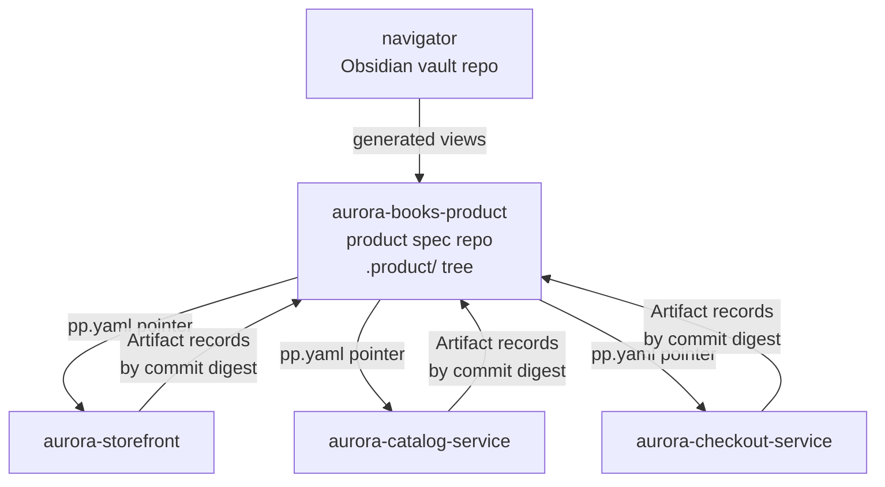

*Part of the [Reference Architecture v1](../README.md) — an opinionated,
informative implementation blueprint. The normative standard is the
[Product Protocol](../../README.md).*

# Repositories

RA v1 puts everything of record in Git, in three repository classes
plus one human-facing vault. The split follows the protocol's trust
boundaries: the product's canonical state (the PP `.product/` tree)
lives apart from the code that implements it, and the human knowledge
layer lives apart from both.

## The four repositories

| Class | Example | Holds | Canonical for |
| --- | --- | --- | --- |
| Obsidian vault | `navigator` | Human notes, meeting intake, dashboards, agent operating manuals, generated read-only views of PP objects | Nothing normative — human layer + projections |
| Product spec repo (one per product) | `aurora-books-product` | The PP `.product/` tree ([PP-0002 §7](../../pp/PP-0002-core-concepts.md#7-git-storage-binding)), plus `prototypes/`, `schemas/`, `reports/`, `datasets/` | Every PP object: specs, constitution, tasks, brain, evaluations, deployments |
| Engineering repos (one per service, or a monorepo) | `aurora-storefront`, `aurora-checkout-service` | Application source, tests, golden suites, CI/CD | Code and its history — referenced from the spec repo by Artifact digest, never copied into it |

Details per class:

- [Specification repository](specification-repo.md) — the product spec
  repo, area by area.
- [Engineering repositories](engineering-repos.md) — application repo
  scaffold and product binding.
- [The CLAUDE.md system](claude-md.md) — how agent instructions layer
  across all of the above.

## Source of truth

One rule resolves every "where does X live" question: **if the
protocol defines a kind for it, it lives in the spec repo's
`.product/` tree; everything else lives where it runs.**

| Information | Source of truth | Mirrors / projections |
| --- | --- | --- |
| Goals, Specs, Stories, Constitution | `aurora-books-product/.product/` | Vault views, Linear descriptions |
| Task Graph and task state | `.product/tasks/` | Linear issues ([mirror only](../runtime/linear-integration.md)) |
| Decisions, Evaluations, Artifacts, Observations | `.product/` record dirs | Vault dashboards, CI summaries |
| Product knowledge (Brain) | `.product/brain/` | qmd search index, Graphiti-style graph ([knowledge layer](../knowledge/README.md)) |
| Application code | Engineering repos | Graphify code graph, qmd index |
| Human working notes, intake | `navigator` vault | Distilled into Brain via ingestion (PP-0009) |
| CI evidence (test output, transcripts) | Evidence store, referenced by digest | Evaluation records point at it |

Never the reverse: an agent that learns something in Linear, the vault,
or a CI log records it in the spec repo (as Knowledge, Issue, or
annotation) before acting on it.

## Naming conventions

- Product spec repo: `<product-id>-product` — e.g. `aurora-books`
  → `aurora-books-product`. The `.product/` tree sits at the repo root.
- Engineering repos: `<product-short>-<service>` — e.g.
  `aurora-storefront`, `aurora-checkout-service`. A monorepo is named
  `<product-short>-platform` (see
  [monorepo vs polyrepo](engineering-repos.md#monorepo-vs-polyrepo)).
- Vault repo: `navigator`, one per organization, with a folder per
  product (`20-products/aurora-books/…`).
- Branches for task work, in every repo class: `task/<task-id>` — e.g.
  `task/task-guest-checkout-api`. One task, one branch, one PR.

## Branch model

Trunk-based development everywhere:

- `main` is protected in all repos; no direct pushes, human or bot.
- Workers branch `task/<task-id>` from the pinned SHA in their
  execution context, commit with the `PP-Task: <task-id>` trailer, and
  open one PR per task
  ([session lifecycle](../runtime/claude-code-sessions.md)).
- Merges require green required checks; required checks are the
  enforcement projection of QualityGates
  ([GitHub integration](../runtime/github-integration.md)).
- Releases are tags plus GitHub environments (`dev` → `staging` →
  `prod`) with environment protection rules; the deploy workflow
  writes the Deployment record back to the spec repo
  (PP-0010 §6).
- No long-lived feature branches. Long-running work is decomposed into
  more tasks by the Planner, not parked on a branch.

## Identities

- **Humans** commit and approve under their own GitHub accounts, with
  signed commits required for anything that constitutes a Decision
  (PP-0002 §6.2). Humans are the only members of CODEOWNERS for
  governed-object paths.
- **Agents** act as GitHub App installations, one per role — e.g.
  `pp-backend-engineer[bot]`, `pp-reviewer[bot]` — with short-lived,
  per-session installation tokens
  ([Kubernetes runtime](../runtime/kubernetes.md#secrets-and-identity)).
  Bots can open PRs and comment; they cannot approve governed-object
  PRs, cannot merge past failing checks, and never hold production
  credentials — deploys run inside Actions under environment
  protection.
- The producing identity and the evaluating identity are distinct App
  installations, so PP-0008 §5.2 evaluation independence is enforced
  by GitHub's permission model, not convention.

See also: [RA architecture overview](../architecture.md), the
[lifecycle walkthrough](../lifecycle.md), and the
[agent roster](../agents/README.md).
