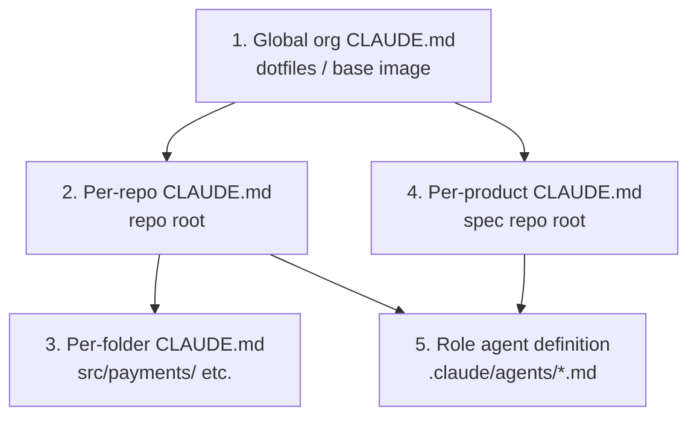

*Part of the [Reference Architecture v1](../README.md) — an opinionated,
informative implementation blueprint. The normative standard is the
[Product Protocol](../../README.md).*

# The CLAUDE.md System

Every worker in RA v1 is a Claude Code session, and CLAUDE.md is how a
session knows where it is and how to behave before it spends a single
retrieval call. RA v1 treats CLAUDE.md as a **designed, layered
artifact** — small, owned, generated where possible — not a wiki page
that accretes.

The governing principle: **CLAUDE.md carries invariants; retrieval
carries knowledge.** Anything that changes weekly, anything bulky,
anything already canonical in the spec repo belongs behind
[pp-brain / qmd-search](../runtime/mcp-context.md), not in a file that
is silently prepended to every session.

## Layering

A session composes up to five layers, most-general first. Later layers
override earlier ones only by being more specific — they never
contradict the global layer's prohibitions.



| Layer | Lives | Distributed by | Owned by |
| --- | --- | --- | --- |
| 1. Global | `~/.claude/CLAUDE.md` in the session base image | Dotfiles baked into the [worker pod image](../runtime/kubernetes.md#session-jobs) | Platform team (humans) |
| 2. Repo | `<repo>/CLAUDE.md` | The repo itself | Repo maintainers; Librarian proposes updates |
| 3. Folder | `<repo>/<dir>/CLAUDE.md` | The repo | Same |
| 4. Product | `<product>-product/CLAUDE.md` | Fetched at [context assembly](../runtime/claude-code-sessions.md#1-context-building) | Librarian proposes; humans review |
| 5. Role | `.claude/agents/<role>.md` | **Generated** from vault `70-agents/` | Vault (humans + Knowledge Curator) |

## What belongs at each layer

**Global (org):**

- Org-wide engineering conventions: languages, formatting, commit
  style, the `PP-Task:` trailer rule.
- A one-screen PP primer: what governed objects are, what a Task is,
  where `.product/` lives, what `pp.yaml` means.
- MCP usage rules: which server for which question, "retrieve before
  you guess", audit expectations.
- **Forbidden actions**, stated flatly: never edit `approved` objects
  or append-only records (cite
  [PP-0002 §6](../../pp/PP-0002-core-concepts.md#6-versioning-immutability-and-the-governed-lifecycle));
  never transition governed lifecycles; never approve or evaluate your
  own work (PP-0007 §5.2); never write to `main`; never touch
  production credentials; blocked means block, not guess
  (PP-0007 §5.4).

**Repo:**

- Build/test/run commands, exactly as CI runs them.
- A ten-line architecture map and a folder guide.
- Repo-specific gotchas and invariants ("SSE cache is source of truth
  during streaming"-class facts).
- Pointers: where golden suites live, which gates guard this repo.

**Folder:**

- Local invariants only: "everything in `src/payments/` is
  idempotent-by-key; see art-payments-idempotency", "no imports from
  `src/legacy/`". Three to fifteen lines. If a folder file exceeds a
  screen, its content is trying to be repo-layer or retrieval.

**Product (spec repo `CLAUDE.md`):**

- Constitution **article digest**: one line per article id + title —
  enough to know what to retrieve, never the full text (the session
  gets in-scope article text through the task context, PP-0007 §4).
- Capability map: the product's Capabilities and which engineering
  repo implements each.
- Glossary of domain terms ("shelf", "reading club", "guest cart") so
  agents and specs use one vocabulary.
- Where things are: prototypes, datasets, reports.

**Role (agent definition):**

- The role's mission, boundaries, claim capabilities, and operating
  procedure — Interviewer through Evaluation Manager
  ([roster](../agents/README.md)).
- Role-scoped tool policy matching the
  [MCP permission matrix](../runtime/mcp-context.md#role--server-permission-matrix).

## Knowledge-loading rules

What a session loads **always** (cheap, invariant):

1. Global + repo + product CLAUDE.md, its role definition, and folder
   files for paths it touches.
2. The task context assembled at claim time: Task, traced Story/Spec
   at exact approved versions, in-scope constitution articles
   (PP-0007 §4).

What it loads **on demand** (bulky, changing):

- Product knowledge → `pp-brain retrieve` (PP-0009 §3), optionally via
  the Librarian for composed briefings.
- Code understanding → `graphify-code`, `qmd-search`.
- Prior attempts, rejection reasons → already in claim context for
  re-attempted tasks; deeper history via `pp-spec get_object`.

Budget rule of thumb: the always-loaded layers should stay under ~2k
tokens combined (excluding the task context itself). The Librarian
audits layer sizes monthly and files vault proposals to demote content
to retrieval — see [anti-patterns](#anti-patterns).

## Operating manuals and generated copies

The human-editable home of every agent role is the vault:
`navigator/70-agents/<role>.md` — the operating manual, reviewed like
any other governed-adjacent document. A vault sync pipeline compiles
each manual into the machine-loaded `.claude/agents/<role>.md` files
distributed to engineering repos and the session base image
([knowledge layer](../knowledge/README.md)).

- Edit in the vault; never hand-edit the generated copies (they carry
  a `generated from navigator/70-agents/... — do not edit` header).
- The compile step strips human-facing discussion, keeps the
  operational core, and stamps the source commit for provenance.
- A drift check in CI fails if a generated copy diverges from its
  compiled source.

## Worked example: global CLAUDE.md skeleton

```markdown
# Org CLAUDE.md — all products, all repos

You are one agent in a Product Protocol fleet. The product's canonical
state is the `.product/` tree in its spec repo; find it via `pp.yaml`.

## Conventions
- TypeScript strict; Prettier defaults; conventional commit subjects.
- Every task-driven commit ends with trailer: `PP-Task: <task-id>`.
- Branch `task/<task-id>`; one PR per task; never push to main.

## Product Protocol primer
- Tasks are claimed, leased, and submitted via pp-spec — never edit
  `.product/tasks/*.yaml` directly.
- Governed objects (Goals, Specs, Stories, Constitution, GoldenTests)
  are approved by humans only. `approved` versions are immutable
  (PP-0002 §6). Want a change? Draft a new version, it enters the
  approval queue.
- Evidence or it didn't happen: deliverables become Artifacts;
  claims in your self-assessment cite evidence.

## MCP usage
- Product facts → pp-brain retrieve. Code questions → graphify-code /
  qmd-search. Object reads/writes → pp-spec. Do not answer from
  memory what these can answer from record.
- Every tool call is audited; act accordingly.

## Forbidden — no exceptions
- Editing approved objects or append-only records (PP-0002 §6).
- Transitioning any governed lifecycle, or your own task to
  done/rejected (PP-0007 §5.2).
- Evaluating or approving your own work.
- Guessing past a blocker: set blocked + blockedReason instead
  (PP-0007 §5.4). Questions route to the Interviewer.
- Secrets in code, artifacts, summaries, or blocked reasons.
```

## Worked example: engineering-repo CLAUDE.md skeleton

```markdown
# aurora-checkout-service

TypeScript order/checkout service for aurora-books
(`pp.yaml` → aurora-books-product). Fastify + Postgres; deploys via
deploy.yml (environment-protected — never deploy manually).

## Commands
- npm run build | test | lint — exactly what ci.yml runs
- npm run test:golden -- --grep <name> — local golden subset
  (full suite runs in evaluate.yml)

## Map
- src/api/        HTTP routes (one file per endpoint)
- src/domain/     order, cart, payment-intent logic — pure, no I/O
- src/adapters/   Postgres, payment provider, email
- tests/golden/   Playwright/pytest specs implementing
                  .product/evaluation/golden/* objects

## Invariants
- Payment provider calls only via src/adapters/payments.ts (rate
  limits — see know-payment-provider-limits in the Brain).
- All money in integer minor units; no floats, ever.
- API changes must keep gate-api-compat green (art-api-compatibility).

## Gotchas
- Integration tests need `docker compose up db` first.
- src/adapters/email is mocked in CI; golden-confirmation-email
  asserts on the mock transcript.
```

## Worked example: per-product CLAUDE.md skeleton

```markdown
# aurora-books — product context

Online bookstore: personalized recommendations, subscription reading
clubs. Spec repo = this repo; canonical objects under .product/.

## Constitution digest (retrieve full text per task context)
- art-security-pii        — PII handling and retention
- art-api-compatibility   — no breaking API changes without version
- art-a11y-baseline       — WCAG 2.2 AA on all storefront surfaces
- art-payments-idempotency— every payment mutation idempotent-by-key
- art-recs-transparency   — recommendations always explainable

## Capability map
- cap-catalog          → aurora-catalog-service
- cap-payments         → aurora-checkout-service
- cap-recommendations  → aurora-catalog-service (recs module)
- cap-storefront       → aurora-storefront

## Glossary
- shelf: a curated, personalized row of books on the storefront
- reading club: a paid subscription cohort with a shared book cadence
- guest cart: a cart bound to an anonymous session, mergeable at signup

## Where things are
- prototypes/  HTML sketches per Story (served via Pages)
- datasets/    frozen golden-test data (checkout-carts-v3 current)
- reports/     generated traceability / audit / velocity — read-only
```

## Anti-patterns

- **The dumping ground.** Every incident learns a paragraph; a year
  later the file is 4k tokens of stale caveats loaded into every
  session. Lessons belong in the Brain as `lesson` Knowledge
  (PP-0010 §8.2), retrieved when relevant.
- **Duplicating spec content.** Pasting Story acceptance criteria or
  constitution article text into CLAUDE.md creates a second copy that
  drifts from the approved version. Sessions already receive the exact
  approved versions in claim context (PP-0007 §4); CLAUDE.md carries
  digests and pointers only.
- **Policy in prose, unenforced.** "Never merge to main" in CLAUDE.md
  is a reminder; branch protection is the control. Every prohibition
  here must have a matching enforcement in the
  [permission matrix](../runtime/mcp-context.md) or
  [GitHub controls](../runtime/github-integration.md) — CLAUDE.md
  reduces attempts, the runtime rejects them.
- **Hand-editing generated copies.** Fixes vanish on the next vault
  sync; the drift check exists to catch this, not to bless it.
- **Per-folder essays.** A folder file past one screen is hiding
  repo-level or retrieval-level content.
