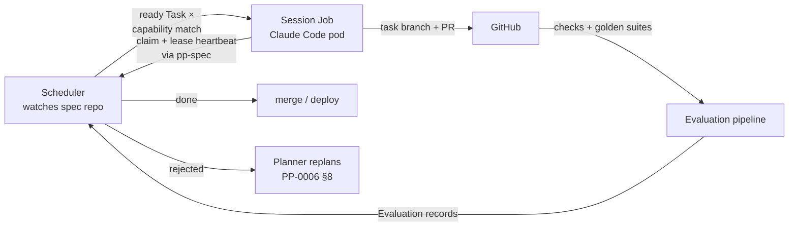

*Part of the [Reference Architecture v1](../README.md) — an opinionated,
informative implementation blueprint. The normative standard is the
[Product Protocol](../../README.md).*

# Runtime

The RA v1 runtime is the machinery that turns `ready` Tasks in a
[product spec repo](../repositories/specification-repo.md) into merged,
evaluated changes — Claude Code sessions on Kubernetes, coordinated
through the spec repo and gated by GitHub. It implements the
**PP/Runtime** contract of [PP-0010](../../pp/PP-0010-runtime.md):
single-owner claims, finite leases, evaluation independence, and gate
enforcement at every phase boundary.

## The control loop

One revolution: the scheduler reconciles the Task Graph, finds a
`ready` Task, matches its capabilities to a worker pool, and spawns a
session Job. The session claims the task atomically through `pp-spec`
(PP-0007 §3), heartbeats its lease, executes in an ephemeral workspace,
and submits — Artifacts recorded, PR opened. GitHub Actions runs the
evaluation suites; the Evaluation Manager records Evaluations; gates
decide `done` or `rejected` (PP-0008 §9). Rejection feeds the Planner
(PP-0006 §8.2). See the [lifecycle walkthrough](../lifecycle.md) for
the loop above this one.

## Components

| Component | Runs as | Does | Detail |
| --- | --- | --- | --- |
| Scheduler | Deployment in `pp-system` | Reconciles spec-repo state; spawns/cancels session Jobs; expires leases | [kubernetes.md](kubernetes.md#scheduler) |
| Session controller | Part of scheduler | Job templating, resource classes, retries, backoff | [kubernetes.md](kubernetes.md#session-jobs) |
| Claude Code sessions | Jobs in `pp-sessions` | Claim → execute → submit, one task each | [claude-code-sessions.md](claude-code-sessions.md) |
| MCP gateway | Deployment in `pp-system` | Role-scoped tool access + full audit log | [mcp-context.md](mcp-context.md) |
| Evidence store | Object storage | CI artifacts, transcripts, payloads — addressed by digest | [evaluation.md](../evaluation.md) |
| Telemetry ingest | Deployment in `pp-system` | Production signals → Observation records | [kubernetes.md](kubernetes.md#observability) |
| Sync workers | Deployments in `pp-system` | Linear mirror, vault views, index refresh | [linear-integration.md](linear-integration.md) |

## The four runtime documents

- [Claude Code sessions](claude-code-sessions.md) — the session
  lifecycle end to end, and how the fleet scales.
- [Kubernetes](kubernetes.md) — namespaces, scheduler, Jobs,
  autoscaling, identity, observability.
- [Linear integration](linear-integration.md) — the execution mirror.
- [GitHub integration](github-integration.md) — identities, branch
  protection as gate enforcement, Actions catalog, deployments.
- [MCP and context](mcp-context.md) — the tool layer every session
  speaks through.

## Conformance mapping

How the components add up to the PP conformance classes
([terminology](../../reference/terminology.md#4-conformance-classes)):

| Class | Implemented by |
| --- | --- |
| PP/Core | The spec repo tree + `pp-spec` validation |
| PP/Planner | Planner sessions + scheduler readiness derivation |
| PP/Worker | Session lifecycle (claim/lease/context/submit) |
| PP/Evaluator | Actions evaluation pipeline + Evaluation Manager |
| PP/Brain, PP/Spec, PP/Constitution | Spec repo + [knowledge layer](../knowledge/README.md) |
| PP/Runtime | The whole of this section: phase gating, approval queue, lease enforcement, Deployment/Observation records |

## Failure philosophy

**Sessions are cattle; the spec repo is the only state.**

- A session that crashes, stalls, or is preempted simply stops
  heartbeating; its lease expires and the runtime returns the task to
  `ready` with the attempt counted (PP-0007 §3.3). Nothing is
  recovered from the pod — workspaces are ephemeral by design.
- No component holds state worth backing up except the spec repo (and
  the digest-addressed evidence store). Scheduler restarts re-derive
  everything by reconciliation; Linear and the vault are projections
  that resync ([what breaks when Linear is down: nothing](linear-integration.md#when-linear-is-down)).
- Infra failure and work rejection are kept distinct: an OOM-killed
  pod requeues silently (within `maxAttempts`); an Evaluator's
  rejection goes back through the Planner's replanning path
  (PP-0006 §8.2). Conflating them is how retry loops launder bad work.
- Backpressure is the ready queue itself: when pools are saturated,
  tasks stay `ready` — visible, ordered, and safe — rather than queuing
  in any component's memory.
