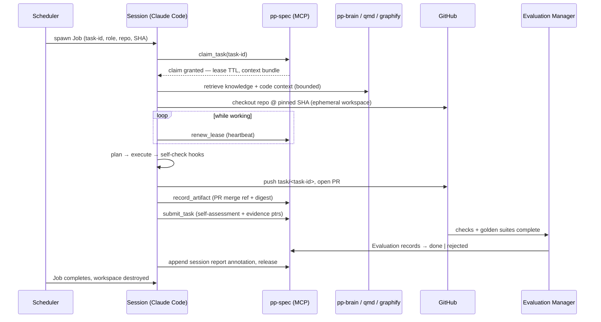

*Part of the [Reference Architecture v1](../README.md) — an opinionated,
informative implementation blueprint. The normative standard is the
[Product Protocol](../../README.md).*

# Claude Code Sessions

A **session** is one Claude Code process, running headless in a
Kubernetes Job, executing exactly one claimed Task under one lease. It
is the RA v1 realization of a PP Worker
([PP-0007](../../pp/PP-0007-worker-protocol.md)): each of the
executing roles in the [roster](../agents/README.md) — Backend,
Frontend, and QA Engineers, Reviewer, and the rest — is a Worker
declaration in `.product/workers/`, and every live instance of one is
a session.

The whole lifecycle is designed around the
[failure philosophy](README.md#failure-philosophy): a session owns
nothing durable. Everything it reads comes from the spec repo, the
engineering repo at a pinned SHA, or retrieval; everything it produces
leaves as commits, Artifact records, and annotations before the pod is
destroyed.

## The nine stages

### 1. Context building

The Job is parameterized with a task id and role by the
[scheduler](kubernetes.md#scheduler); the session's first act is
`pp-spec claim_task` — atomic, single-winner, lease attached
(PP-0007 §3.1). On grant, the runtime assembles the context bundle the
Worker's `contextContract` requires (PP-0007 §4):

- the **Task** itself, at its current version;
- the traced **Story/Feature and Specification** material — each at
  the *exact approved version* referenced, never "latest";
- in-scope **constitution articles**: those in
  `spec.context.constitutionArticles` plus universally applicable ones;
- **knowledge**: refs in `spec.context.knowledge`, plus a bounded
  `pp-brain retrieve` for the task's intent (PP-0009 §3), composed by
  the [Librarian](../agents/README.md) when the task is flagged
  context-heavy;
- **code context**: `graphify-code impact_of` on the paths the task
  names, plus targeted `qmd-search` queries;
- **prior attempts**, when `status.attempts > 0`: previous Artifacts,
  rejecting Evaluations, and blocked reasons.

Context budget policy: the bundle respects the Worker's
`maxContextItems`; every item carries its fully qualified identity
(`pp://aurora-books/Story/story-guest-checkout@1.0.0`) so provenance
survives into the session transcript. Target: the assembled bundle
fits in roughly a third of the model's context window, leaving room
for code and iteration. When assembly would exceed budget, the
Librarian trims by relevance — it never silently drops constitution
articles or completion criteria.

### 2. Repository checkout

An init step clones the engineering repo named by the task into an
ephemeral workspace, checked out at the SHA pinned in the context
bundle (recorded at claim time — the session and its eventual
evaluators agree on the base). Sparse checkout is used where the
task's declared paths allow, especially in monorepos
([engineering-repos.md](../repositories/engineering-repos.md#monorepo-vs-polyrepo)).
The spec repo itself is not cloned; sessions read and write PP objects
only through `pp-spec`.

### 3. Knowledge loading

The layered CLAUDE.md stack loads: global (baked into the image), repo
and folder files (from the checkout), the per-product file and the
role definition (from the bundle) —
[claude-md.md](../repositories/claude-md.md#knowledge-loading-rules).
Everything else is on-demand retrieval during execution; the session
is expected to query rather than assume, and every retrieval is
audited by the [MCP gateway](mcp-context.md#gateway-architecture).

### 4. Task execution

Plan-then-execute: the session first writes a short plan mapping each
`completion.criteria` entry to intended changes and checks, then
implements. Self-checks run continuously (typecheck, unit tests on
touched areas).

**Blocked protocol.** When progress stops on something the session
cannot resolve — ambiguous requirement, missing dependency, a question
only a human can answer — it does not guess (PP-0007 §5.4): it calls
`pp-spec block_task` with a precise `blockedReason`, which routes the
question to the [Interviewer](../agents/README.md) (and to humans via
the [Linear mirror](linear-integration.md)'s Blocked label). The
session then exits; a future session resumes the task when it returns
to `in_progress`, with the question and answer in its prior-attempt
context.

**Effort budget.** The session tracks its consumption against
`spec.constraints.effortBudget` and the attempt's token/cost budget
([scaling](#scaling-and-concurrency)); on exhaustion it submits
partial verifiable work with an honest self-assessment, releases, or
blocks — whichever preserves the most value (PP-0007 §5.5).

### 5. Commit strategy

- Small, coherent commits on `task/<task-id>`, each ending with the
  `PP-Task: <task-id>` trailer.
- No force pushes, no history rewrites — pushed history is evidence.
- Nothing unrelated: a session that discovers an out-of-scope defect
  opens an Issue via `pp-spec open_issue`; it does not fix it in this
  branch (PP-0007 §5.2 — no scope self-expansion).

### 6. Pre-submit evaluation

The Worker's `evaluationHooks` run before submission (PP-0007 §8):
lint and typecheck (blocking), the unit suite (blocking), and the
local golden subset relevant to the task — the same specs
`evaluate.yml` will run, executed narrowly (advisory or blocking per
the Worker declaration). A failing blocking hook means fix, block, or
release — never submit over it. Hook results become evidence pointers
in the submission, not Evaluation records (self-checks are not
judgments).

### 7. PR creation and submission

The session pushes the branch and opens the PR from the
[template](../repositories/engineering-repos.md#commits-and-prs):
task link, traced Story, completion checklist, self-assessment,
evidence. Then, via `pp-spec`:

1. `record_artifact` — a `changeset` Artifact identifying the change
   immutably (head commit digest + PR URL, PP-0007 §6), and a `report`
   Artifact carrying the self-assessment (PP-0007 §7);
2. `submit_task` — the task moves `in_progress → submitted`; the
   submission carries the artifact refs and evidence pointers.

Acceptance is not the session's business: checks run, the Reviewer
reviews, the Evaluation Manager records Evaluations, gates decide
([evaluation](../evaluation.md), PP-0008 §9). The session does not
wait for the verdict.

### 8. Context cleanup

Before exit the session appends a **session report** as a task
annotation (`metadata.annotations["ra.pp.dev/session-report"]` via
`pp-spec`): stages completed, hook outcomes, cost, notable decisions,
anything the next attempt should know. The full transcript streams to
the [evidence store](../evaluation.md) by digest. The workspace is
destroyed with the pod; no caches, tokens, or secrets persist —
credentials were short-lived and scoped to the session to begin with
([identity](kubernetes.md#secrets-and-identity)).

### 9. Termination

The session releases its lease (`pp-spec` release on the submitted
task ends its claim obligations, PP-0007 §7) and exits 0. Abnormal
endings need no cleanup path: a crash simply stops the heartbeat, the
lease expires, and the task returns to `ready` with the attempt
counted (PP-0007 §3.3).

## Scaling and concurrency

**Pools per capability class.** Sessions are grouped into pools keyed
by the capability tags they serve (`code.typescript` + `api.rest`,
`test.e2e`, `docs.api`, …) — one pool per Worker declaration, sized by
[KEDA-style autoscaling on ready-queue depth](kubernetes.md#autoscaling).
Capability matching (PP-0006 §7) is thus a pool-routing decision made
once by the scheduler, not per-session negotiation.

**Per-repo concurrency cap.** Independent of pool size, at most N
sessions (default 3; 1–2 for monorepos) may hold tasks targeting the
same engineering repo. This bounds merge contention — the dominant
cost of agent parallelism — while the Task Graph's `dependsOn` edges
bound logical conflicts.

**Rebase-and-retry on conflicts.** If `main` moved and the PR
conflicts, the session (or a follow-up session, if the conflict
surfaces after submit) rebases the task branch onto current `main`,
re-runs blocking hooks, and force-with-lease pushes only in this
rebase-before-review window; after review begins, conflicts mean a new
attempt. Two consecutive conflict-rebases on one task trigger the
scheduler to serialize that repo's queue temporarily.

**Token and cost budget per attempt.** Each attempt carries a budget
derived from `spec.constraints.effortBudget` (the same S/M/L mapping
as [pod resources](kubernetes.md#session-jobs)). The session degrades
gracefully at the boundary (stage 4); budget consumption is a metric
per pool and appears in `reports/velocity.md`.

**Backpressure.** Nothing queues in memory: unservable tasks stay
`ready` in the spec repo, ordered by `priority_fifo` (PP-0006 §6.2).
Saturation is therefore visible to everyone as queue depth and age —
and to the Planner, which can re-prioritize rather than let the fleet
thrash.

## Worked trace: one aurora-books task

Task: `task-guest-checkout-api` — implement `POST /checkout/guest` in
`aurora-checkout-service`, tracing to `story-guest-checkout@1.0.0`
(the task from the
[e-commerce example](../../examples/ecommerce/.product/tasks/task-guest-checkout-api.yaml)).
Stage-by-stage:

1. **Claim + context.** Scheduler sees the task `ready` (dependency
   `task-cart-model` is `done`), routes to the Backend Engineer pool.
   Session claims; lease PT30M. Bundle: the Task; `story-guest-checkout@1.0.0`
   + `spec-checkout@2.1.0`; articles `art-security-pii`,
   `art-api-compatibility`, `art-payments-idempotency` (universal);
   `know-payment-provider-limits`; prior attempts: none. Graphify
   returns the cart-validation middleware from `task-cart-model`'s
   merged changeset. 28 context items of the Worker's 40 allowed.
2. **Checkout.** `aurora-checkout-service` at pinned SHA `9fceb02`,
   sparse paths `src/api`, `src/domain/orders`, `tests/`.
3. **Knowledge.** CLAUDE.md layers load; one extra `pp-brain retrieve`
   for "payment intent retry semantics" surfaces a `lesson` from a
   June rejection about double-charging on retried intents.
4. **Execute.** Plan maps ac-1 (guest completes checkout) and ac-2
   (failed intent → retryable error, no order) to endpoint, domain
   logic, and tests. Implements; reuses the cart middleware per
   `spec.context.notes`; idempotency keys per the retrieved lesson.
5. **Commits.** Four commits, each trailed
   `PP-Task: task-guest-checkout-api`.
6. **Hooks.** Lint + typecheck pass; unit suite passes; local run of
   `golden-checkout-happy-path` subset passes (advisory).
7. **Submit.** PR #214 opened; Artifacts recorded: `changeset`
   (head digest + PR URL) and `report` (self-assessment mapping ac-1,
   ac-2 to evidence); `submit_task` → `submitted`. CI and
   `evaluate.yml` take over; Reviewer session reviews independently;
   Evaluation Manager records passing Evaluations against
   `golden-checkout-happy-path` and `gate-unit-coverage`; task → `done`
   on merge.
8. **Cleanup.** Session report annotation appended (cost: 41% of M
   budget; note: provider sandbox flaked once, retried); transcript to
   evidence store.
9. **Terminate.** Lease released; pod gone. Total wall time 24 min.
