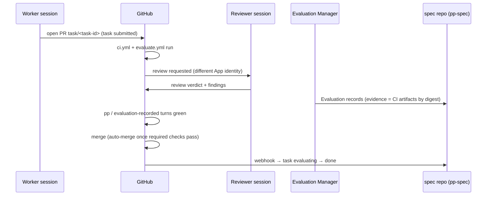

*Part of the [Reference Architecture v1](../README.md) — an opinionated,
informative implementation blueprint. The normative standard is the
[Product Protocol](../../README.md).*

# GitHub Integration

GitHub is where RA v1's soft rules become hard ones. The protocol's
boundaries — human-only approval (PP-0002 §6.2), evaluation
independence (PP-0008 §5.2), gated promotion (PP-0010 §6.1) — are each
bound to a GitHub enforcement mechanism, so that an agent that ignores
its instructions still cannot cross them.

## Identities

- One **GitHub App per agent role**: `pp-planner[bot]`,
  `pp-backend-engineer[bot]`, `pp-reviewer[bot]`,
  `pp-evaluation-manager[bot]`, … Installation permissions are the
  minimum the role needs (the Reviewer's App has no `contents: write`
  on engineering repos; the Planner's writes only spec-repo task
  paths). Tokens are minted per session, repo-scoped, lease-lifetime
  ([identity](kubernetes.md#secrets-and-identity)).
- **Humans** act as themselves, with signed commits required on the
  spec repo's governed paths. Only humans appear in CODEOWNERS.
- Producing and evaluating identities are different Apps, so PP-0008's
  independence rule is a permission fact, not a convention
  ([repositories README](../repositories/README.md#identities)).

## Branch protection as gate binding

`main` in every repo requires: PRs only, required checks green,
linear history, no force pushes, no bot merges past a failing check.
The **required checks are the enforcement projection of QualityGate
objects** (PP-0008 §9): each blocking gate with trigger
`task_acceptance` that applies to a repo maps to a named required
check.

| Required check (engineering repo) | QualityGate |
| --- | --- |
| `ci / lint-and-typecheck` | (hygiene — no gate; hook-level) |
| `ci / unit` | `gate-unit-coverage` |
| `evaluate / golden` | gates selecting GoldenTests, e.g. `golden-checkout-happy-path` |
| `evaluate / security` | `gate-secret-scan` |
| `pp / evaluation-recorded` | asserts the Evaluation Manager wrote current Evaluation records satisfying every applicable `task_acceptance` gate |

The last check is the seam: green means "the gate predicate is
satisfied by recorded, current Evaluations" (PP-0008 §9.2), not merely
"tests passed". Renaming or removing a required check therefore
requires the same review as changing the gate object itself — the
mapping lives in `.product/evaluation/gates/` annotations and is
verified by the spec repo's `validate.yml`.

## Task PR lifecycle

Notes:

- The Worker's `submit_task` and the PR opening are the same instant
  from the protocol's view: the `changeset` Artifact records the head
  digest, and evaluation begins (PP-0007 §7).
- The Reviewer reviews as input to evaluation; the **Evaluation
  Manager records** the Evaluation objects that gates consume — review
  comments alone decide nothing ([evaluation](../evaluation.md)).
- Merge uses squash with the `PP-Task:` trailer preserved; the merge
  commit digest supersedes the head digest in a follow-up Artifact
  annotation.
- A rejected evaluation closes the PR unmerged; the task goes
  `rejected` and back through the Planner (PP-0006 §8.2). Branches of
  rejected attempts are retained for the next attempt's context.

## Governed-object approval flow

In the spec repo ([PR conventions](../repositories/specification-repo.md#pr-conventions)):

1. An agent (Product Writer, QA Engineer, …) opens a **proposal PR**
   bumping the governed object to a new version, `lifecycle: proposed`.
2. CODEOWNERS on `.product/specification/`, `.product/constitution/`,
   and `.product/evaluation/golden/` names humans only; the branch
   protection rule requires a CODEOWNERS review. No bot can satisfy it.
3. A human reviews the rendered diff, prototype link, and provenance,
   approves, and merges. **That approval-and-merge is the human
   decision** (PP-0002 §6.2).
4. The merge triggers `approval.yml`, which runs with the merge event's
   approver identity in hand: it flips the object to `approved` and
   commits the `Decision` record to `.product/brain/decisions/` naming
   that human as the deciding actor, referencing the exact object
   version, with the workflow's signing attestation. Agents never run
   this path: the workflow guards on event provenance (merged by
   human, CODEOWNERS satisfied) and refuses otherwise.

## Actions workflows catalog

| Workflow | Repo class | Trigger | Purpose |
| --- | --- | --- | --- |
| `ci.yml` | engineering | PR, push | Lint, typecheck, unit, integration |
| `evaluate.yml` | engineering | PR, dispatch from spec repo | Golden suites (pytest, Playwright, LLM evals); uploads evidence artifacts by digest |
| `deploy.yml` | engineering | tag / promotion dispatch | Env-protected deploys; writes `Deployment` records back to the spec repo (PP-0010 §6) |
| `validate.yml` | spec | PR | Schema, ref integrity, acyclicity, lifecycle legality |
| `approval.yml` | spec | governed-object merge | Lifecycle flip + Decision record (above) |
| `constitution-audit.yml` | spec | schedule (nightly) | Runs `constitution_audit` evaluators; failures open Issues automatically (PP-0010 §6.4) |
| `traceability-report.yml` | spec | merge to `main` | Regenerates `reports/` |
| `sync-linear.yml` | spec | merge to `main` | [Mirror update](linear-integration.md) |
| `sync-vault.yml` | spec | merge to `main` | Regenerates vault views ([knowledge](../knowledge/README.md)) |

## Deployment promotion

GitHub **environments** `dev` → `staging` → `prod` model the Product's
declared environments (PP-0002 §9). Protection rules are the human
backstop the protocol requires:

- `dev`: unprotected; deploys on merge.
- `staging`: requires `evaluate / golden` green on the release ref.
- `prod`: required human reviewers + the `deployment_promotion` gates
  — `deploy.yml` checks `gate-production-promotion` (current
  performance/security Evaluations per PP-0008 §9.2, constitution
  articles with `evaluatedOn: deployment`) *before* the environment
  gate, and a human approves the environment run after it. Belt and
  suspenders, in that order.

`deploy.yml` writes the `Deployment` object at request time (spec
write-once), transitions its `status` through
`requested → validating → deploying → active`, records gate-check
Evaluations in `status.evaluations`, and supersedes the previously
active Deployment (PP-0010 §6.1–6.2). The Deployment Manager role
requests promotions and watches rollouts; only the workflow, under
environment protection, touches production.

## Webhook fan-in

A single webhook receiver in `pp-system` fans events to consumers:

- **spec repo pushes** → scheduler reconcile ([fast path](kubernetes.md#scheduler)),
  Linear/vault sync workers;
- **engineering repo events** (check runs, reviews, merges) →
  Evaluation Manager triggers and task-state transitions
  (`submitted → evaluating → done`);
- **deployment events** → Deployment status transitions and telemetry
  ingest arming.

Webhooks are latency; the poll is truth. Every webhook-driven action
is idempotent against a later reconcile, so lost deliveries cost
seconds, never correctness.
