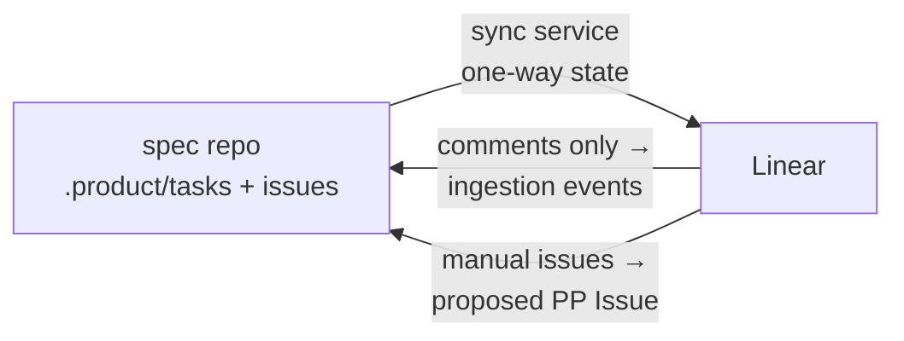

*Part of the [Reference Architecture v1](../README.md) — an opinionated,
informative implementation blueprint. The normative standard is the
[Product Protocol](../../README.md).*

# Linear Integration

Linear is a **projection** of the Task Graph, never a source of truth.
PP Task objects in the spec repo are canonical (PP-0006); Linear
exists so humans get what Git trees are bad at — glanceable boards,
mobile, notifications, @-mentions. The sync service maintains the
mirror; nothing in the runtime reads Linear to decide anything.



## Forward sync: spec repo → Linear

The `linear-sync` worker (in `pp-system`,
[components](README.md#components)) consumes spec-repo merge events
and reconciles one Linear issue per PP Task (and per PP Issue). It
creates, retitles, relabels, and transitions — always in that
direction.

### State mapping

| Task `status.state` (PP-0006 §5.3) | Linear state | Extras |
| --- | --- | --- |
| `pending` | Backlog | — |
| `ready` | Todo | — |
| `claimed`, `in_progress` | In Progress | Assignee = the role's bot user; comment links the session |
| `blocked` | In Progress + `Blocked` label | `blockedReason` posted as a comment; notification routes to the humans watching |
| `submitted`, `evaluating` | In Review | PR link attached |
| `done` | Done | Closing comment links the accepting Evaluations |
| `rejected` | Todo + `rework` label | Rejection summary comment; label cleared on next claim |
| `cancelled` | Cancelled | Provenance comment (superseding task, if any) |

Other mappings:

- **Dependencies:** `spec.dependsOn` edges become Linear "blocks /
  blocked by" relations.
- **Priority:** `critical/high/medium/low` → Linear Urgent/High/
  Medium/Low.
- **Traceability:** the description carries read-only, regenerated
  links to the traced Story/Feature/Issue and the task's completion
  criteria. An edit banner states: *"Mirror of
  `pp://aurora-books/Task/… ` — edits here are not read by the
  runtime; comment instead."*
- **PP Issues** mirror into a separate Linear project with their
  triage state (`open → triaged → planned → resolved → closed`,
  PP-0010 §6.4).

## Reverse flow: strictly limited

Exactly two things travel from Linear toward the spec repo, and
neither is a state change:

1. **Human comments become ingestion events.** A comment on a mirrored
   issue is captured as a clarification on the Task: appended as an
   annotation (`ra.pp.dev/human-note`) with author and timestamp, and
   routed to the [Interviewer](../agents/README.md) when the task is
   `blocked` (this is the normal way a human answers a
   `blockedReason` question). Substantive product statements are
   further distilled into Knowledge with provenance (PP-0009 §2) by
   the Knowledge Curator. Comments never move task state.

2. **Manually created issues become *proposed* PP Issue objects.**
   Humans do not create Tasks — planning is the Planner's, from
   approved sources only (PP-0006 §2.1). When someone files an issue
   directly in Linear, the sync worker converts it into a PP `Issue`
   object in `.product/issues/` with `status.state: open`,
   `spec.source.type: human`, and full text as description — i.e. it
   enters ordinary triage. The Linear issue is annotated *"captured as
   pp://aurora-books/Issue/… — triage happens there"* and thereafter
   mirrors that PP Issue. If triage yields work, the Planner emits
   Tasks tracing to the Issue (PP-0006 §8.3), and those appear on the
   board as new mirrored issues.

Everything else a human might do in Linear — dragging cards, closing,
reassigning, editing descriptions — is overwritten by the next
reconcile, by design. The mirror is idempotent, not negotiated.

## Workspace mapping

One Linear workspace per organization:

- **Team per product** — `Aurora Books (AUR)` mirrors
  `aurora-books-product`. The team's board is the Task Graph's
  execution frontier; a second project inside the team carries PP
  Issues in triage.
- **Bot users per role** are the assignees, so "who is on this" reads
  naturally on the board; the humans watching a team are whoever
  subscribes — the mirror imposes no assignment on people.
- **Labels** are reserved and sync-owned: `Blocked`, `rework`, plus
  `priority:*` shadows. Human-added labels are tolerated but carry no
  meaning to the runtime and may be reorganized by reconciliation.

## Idempotency

The join key lives on the Task, per RA canon:

```yaml
metadata:
  annotations:
    linear.app/issue: AUR-214
```

- On first sync the worker creates the Linear issue and writes the
  annotation back (a record-class fast-path commit,
  [PR conventions](../repositories/specification-repo.md#pr-conventions)).
- Every later sync resolves the pair by annotation, so renames, board
  moves, and re-runs never duplicate. A Linear issue deleted by a human
  is recreated on the next reconcile (with a note); a Task whose
  annotation points at a vanished issue gets a fresh issue and an
  updated annotation.
- Full reconciliation (not just event-driven patching) runs hourly, so
  drift self-heals.

## When Linear is down

Nothing breaks. The scheduler, sessions, evaluation, and deployment
never read Linear; the sync worker's queue simply backs up and the
mirror lags. Humans lose the dashboard temporarily — the spec repo,
the [vault views](../knowledge/README.md), and GitHub PRs remain fully
authoritative and fully usable. Recovery is the ordinary reconcile
loop; no replay ceremony, no state to repair.

The same property covers migration: dropping Linear (or swapping it
for another tracker) deletes a projection, not data.

## Why Linear at all

Because the humans in the loop deserve first-class ergonomics:

- **Visibility** — the live execution frontier as a board, filterable
  by product, role, priority; queue health at a glance.
- **Notifications** — `Blocked` labels and rejection comments reach
  phones; a `blockedReason` that waits a day is a stalled loop
  (PP-0010 §7's approval queue covers governed objects; this covers
  everything else).
- **Mobile-grade answering** — most human unblocking is a two-line
  comment, and that path (comment → ingestion event → Interviewer) is
  exactly the reverse flow the mirror permits.

The trade — running a whole tracker for read-mostly dashboards — is
worth it precisely because the integration is shallow: one worker, one
annotation, one direction of truth.
