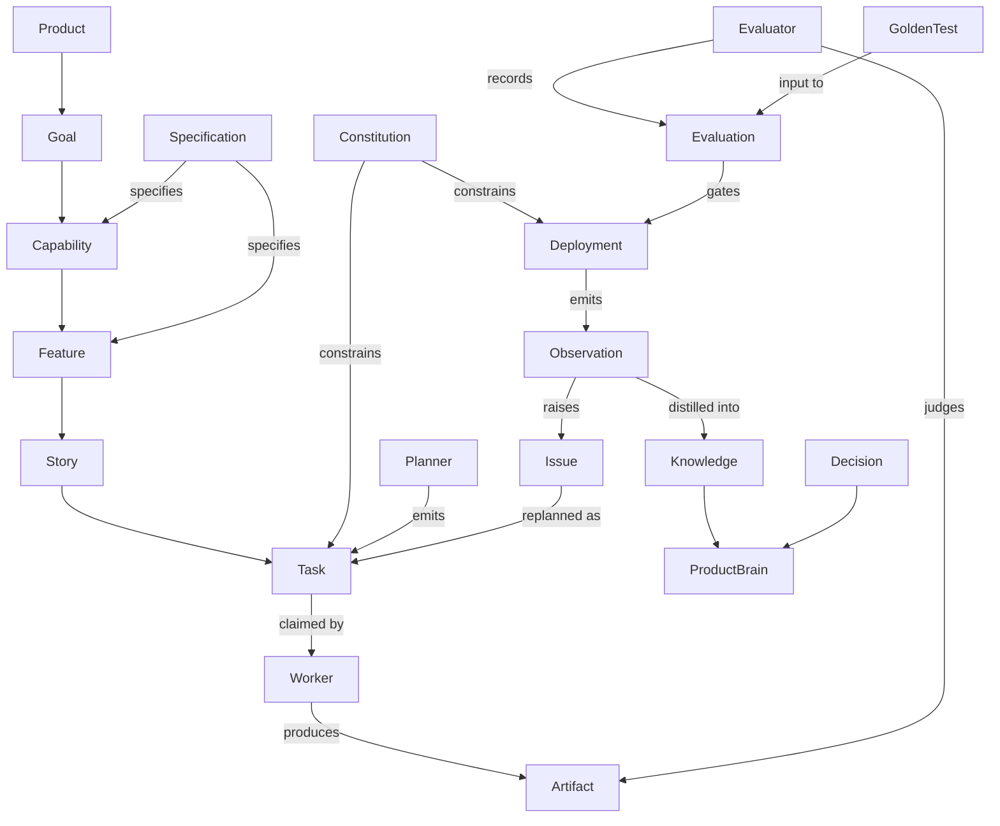
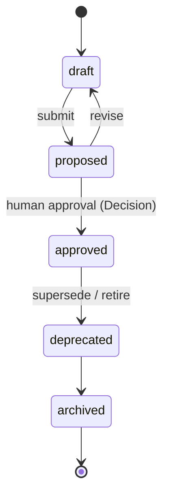
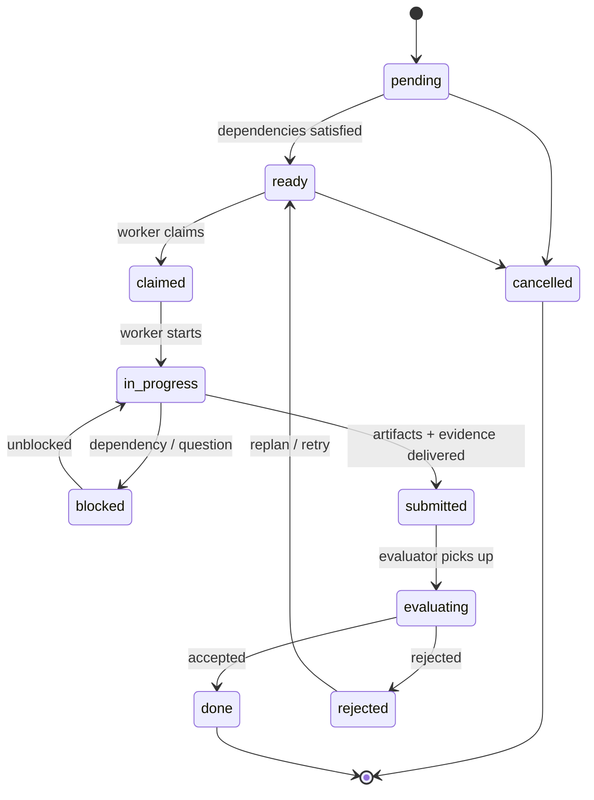

# Product Protocol Object Model

**Status:** Draft · **Version:** 0.1.0 · **Normative**

This document is the authoritative index of Product Protocol object kinds,
their relationships, and their lifecycles. The envelope, identity, and
versioning rules that apply to every object are defined in
[PP-0002](../pp/PP-0002-core-concepts.md). Kind-specific detail lives in
the specification listed per kind; on conflict, the kind's own
specification prevails.

Requirement keywords follow [terminology.md](./terminology.md).

## 1. The Object Envelope (summary)

Every PP object is a YAML document with this envelope (normative
definition: PP-0002 §3):

```yaml
pp: "0.1"               # protocol version              (REQUIRED)
kind: Task              # object kind, PascalCase       (REQUIRED)
metadata:
  id: task-4hz1         # unique within the Product     (REQUIRED)
  name: Human name      # display name                  (RECOMMENDED)
  version: 1.0.0        # SemVer of this object         (REQUIRED)
  labels: {}            # string map, for selection     (OPTIONAL)
  annotations: {}       # string map, for tooling       (OPTIONAL)
  createdAt: 2026-07-03T12:00:00Z   # RFC 3339          (RECOMMENDED)
  updatedAt: 2026-07-03T12:00:00Z   # RFC 3339          (RECOMMENDED)
  owners: []            # accountable actors            (OPTIONAL)
spec: {}                # kind-specific body            (REQUIRED)
status: {}              # implementation-managed state  (OPTIONAL)
```

References between objects use the `ref` form (PP-0002 §5):

```yaml
ref: { kind: Story, id: story-guest-checkout }        # same Product
ref: { kind: Goal, id: goal-conversion, version: ">=1.0.0" }
```

## 2. Kind Index

| Kind | Layer | One-line definition | Specification |
| --- | --- | --- | --- |
| `Product` | Identity | The root object; a software product under autonomous management | PP-0002 |
| `Goal` | Intent | A measurable business or user outcome the Product pursues | PP-0002, PP-0004 |
| `Capability` | Intent | A durable ability the Product offers in service of Goals | PP-0002, PP-0004 |
| `Specification` | Definition | Structured, versioned statement of what to build | PP-0004 |
| `Constitution` | Definition | Immutable, continuously evaluated product rules | PP-0005 |
| `Feature` | Definition | A coherent unit of user-facing functionality within a Capability | PP-0004 |
| `Story` | Definition | A narrow, testable slice of a Feature with acceptance criteria | PP-0004 |
| `Task` | Execution | The atomic unit of schedulable work | PP-0006 |
| `Worker` | Execution | An actor (agent or human) that executes Tasks under the worker contract | PP-0007 |
| `Planner` | Execution | The actor that decomposes intent into the Task Graph | PP-0006 |
| `Evaluator` | Quality | The actor that judges work against criteria and Constitutions | PP-0008 |
| `Evaluation` | Quality | The recorded outcome of an evaluation run, with Evidence | PP-0008 |
| `GoldenTest` | Quality | A canonical, versioned scenario the Product must always satisfy | PP-0008 |
| `QualityGate` | Quality | A named predicate over Evaluations that gates a transition | PP-0008 |
| `Deployment` | Operation | A release of Artifacts into an environment | PP-0010 |
| `Observation` | Operation | A telemetry-derived fact about the running Product | PP-0010 |
| `ProductBrain` | Knowledge | The structured knowledge store of a Product | PP-0003 |
| `Knowledge` | Knowledge | A single validated unit of product knowledge | PP-0003, PP-0009 |
| `Decision` | Knowledge | An immutable record of a choice, its context, and its authority | PP-0003 |
| `Artifact` | Execution | A content-addressed output produced by a Task | PP-0007 |
| `Issue` | Operation | A tracked defect, risk, or anomaly requiring resolution | PP-0006, PP-0010 |

Implementations MUST reject objects whose `kind` is not a registered kind
of the declared `pp` version, unless the kind uses the `x-` extension
prefix (PP-0002 §8).

## 3. Relationships



Cardinality (normative):

- A `Product` has exactly one `ProductBrain` and one active `Constitution`
  set. All other kinds belong to exactly one `Product`.
- A `Task` MUST reference exactly one parent (`Story`, `Feature`, or
  `Issue`) via `spec.tracesTo`.
- An `Artifact` MUST reference the `Task` that produced it.
- An `Evaluation` MUST reference its subject (`Artifact`, `Task`,
  `Deployment`, `Product`, or `Worker`) and the criteria evaluated.
- A `Decision` MUST reference the objects it affects.

## 4. Lifecycles

Two canonical state machines cover most kinds (kind specifications may
extend, but MUST NOT remove states or transitions):

**Governed objects** — `Goal`, `Capability`, `Specification`,
`Constitution`, `Feature`, `Story`, `GoldenTest`:



An **approved** governed object is immutable. Changing it means creating a
new `metadata.version` that re-enters the lifecycle at `draft` and is
linked to the approving `Decision` (PP-0002 §6).

**Work objects** — `Task` (normative definition: PP-0006 §5):



Other kinds: `Evaluation`, `Observation`, `Decision`, and `Artifact` are
**append-only records** — created once, never mutated, superseded only by
newer records. `Deployment` follows the runtime lifecycle in PP-0010 §6.
`Issue` follows the triage lifecycle in PP-0010 §6.4.

## 5. Per-Kind Reference

Each concept's full treatment — definition, responsibilities, lifecycle,
inputs, outputs, relationships, state diagram, and example YAML — lives in
its specification (column 4 of the Kind Index) and in
[`docs/concepts/`](../docs/concepts/). JSON Schemas for on-disk validation
live under [`schemas/`](../schemas/).

## 6. Actors vs. Records

Kinds divide into **actors** (`Worker`, `Planner`, `Evaluator`) — declared
capabilities and constraints of a participant — and **records** (all other
kinds) — statements about the Product. Actor objects describe *who may do
what*; they never store work state. Work state lives on the records
(`Task.status`, `Evaluation`, …), keeping actors stateless and
substitutable (see [design principle P1](./design-principles.md)).
